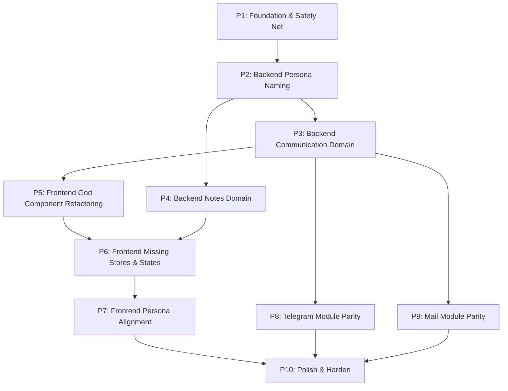

# Roadmap: Hermes Docs Alignment

**Task:** Устранить расхождения между документацией и реализацией в Hermes Hub: Persona naming, Communication domain, Notes backend, frontend states, Telegram/Mail parity и тестовая инфраструктура.

**Type:** brownfield, refactor, alignment

**Created:** 2026-06-14

**Total phases:** 10

## Context summary

- **Stack:** Rust backend (Axum), Vue 3 + Pinia + TanStack Query + Reka UI frontend, Tauri 2 desktop shell
- **Package manager:** pnpm (frontend), cargo (backend)
- **Build / test / lint commands:** `make backend-validate`, `cd frontend && pnpm build`, `cd frontend && pnpm lint`, `cd frontend && pnpm test:unit`
- **Риски:** breaking API changes при rename Persons→Personas, God component CommunicationsPage (891 строк), отсутствие тестов (1 placeholder), Telegram/Mail parity — огромный объём

## 12 выявленных Gaps

| # | Gap | Описание | Фаза |
|---|-----|----------|------|
| 1 | `domains/mail/` God directory | ~100+ файлов в mail, документация требует Communication as primary ingestion spine | P3 |
| 2 | Dual naming Persons↔Personas | Документация: Personas (ADR-0084). Код: `Person` struct + `PersonaType`, API `/persons` и `/personas` | P2, P7 |
| 3 | `SemanticSourceKind::Person` → `"contact"` | legacy naming в semantic search | P2 |
| 4 | Notes domain — нет backend | `docs/domains/notes.md` есть, frontend компоненты есть, backend отсутствует | P4 |
| 5 | `CommunicationsPage.vue` — God Component | 891 строка, порог >500 | P5 |
| 6 | Missing stores | WhatsApp store, Organizations store отсутствуют | P6 |
| 7 | Отсутствуют UI states | Loading/Empty/Error/Skeleton в большинстве компонентов | P6 |
| 8 | Только 1 placeholder тест | Нет реальных тестов | P1, P10 |
| 9 | Telegram модуль — partial | Требуется паритет с Telegram Desktop | P8 |
| 10 | Mail модуль — partial | Требуется паритет с Outlook/Apple Mail/Thunderbird | P9 |
| 11 | Cross-domain imports в review store | Review store импортирует из personas, tasks, knowledge напрямую | P5 |
| 12 | Raw fetch() + TanStack Query mix | CommunicationsPage использует оба подхода | P5 |

## Assumptions

Non-blocking decisions recorded here so we can proceed without round-trips. If any are wrong, stop the run:

- **Phase order:** Foundation → Naming → Domain restructure → Notes → Frontend refactoring → Stores & States → Frontend naming alignment → Telegram parity → Mail parity → Polish.
- **API compatibility:** `/api/v1/persons` routes сохраняются как redirect/compatibility при введении `/api/v1/personas`. Не ломать существующие клиенты.
- **SemanticSourceKind:** `"contact"` остаётся accepted value. `"person"` добавляется как canonical. Deprecate `"contact"` через документацию.
- **No schema migrations** без ADR. Persona rename — только API/frontend уровень; таблицы БД не переименовываются.
- **No new ADR** для текущих alignment работ, если не требуется breaking schema change.
- **Notes — lightweight:** Notes как document-like artifacts без полноценного domain lifecycle, согласно master-spec.md.
- **Telegram/Mail parity:** Разбить на must-have vs nice-to-have. Baseline (существующее) сохраняется.

## Risk top 3

1. **Breaking API changes при rename Persons→Personas** — likelihood: MEDIUM. Mitigation: `/api/v1/personas` как новый route, `/api/v1/persons` как redirect/compatibility.
2. **God component CommunicationsPage (891 строк) невозможно рефакторить без регрессий** — likelihood: HIGH. Mitigation: Декомпозиция пошагово, верификация каждого шага build pass.
3. **Telegram/Mail parity — огромный объём** — likelihood: HIGH. Mitigation: Разбить на подфазы must-have/nice-to-have. Baseline сохраняется.

## Dependency graph

## Phase map

| # | Phase | Action-first name | Depends on | Deliverable |
|---|-------|-------------------|------------|-------------|
| 1 | Foundation & Safety Net | Add test infrastructure and characterization tests | none | Testcontainers в crates/testkit, characterization tests для существующего поведения |
| 2 | Backend: Persona Naming | Rename Persons to Personas in backend | P1 | API `/api/v1/personas`, Persona struct, SemanticSourceKind fix |
| 3 | Backend: Communication Domain | Restructure mail into Communication domain | P2 | Communication domain facade, mail channel isolation |
| 4 | Backend: Notes Domain | Create Notes backend domain | P2 | `domains/notes/` с моделями, store, API |
| 5 | Frontend: God Component Refactoring | Break CommunicationsPage and fix cross-domain imports | P3 | CommunicationsPage <500 строк, composables, no raw fetch |
| 6 | Frontend: Missing Stores & States | Add WhatsApp/Organizations stores and UI states | P5 | WhatsApp store, Organizations store, Loading/Empty/Error/Skeleton |
| 7 | Frontend: Persona Alignment | Rename persons to personas in frontend | P2, P6 | Frontend routes, components, stores, i18n aligned |
| 8 | Telegram Module Parity | Full parity with Telegram Desktop | P3 | Accounts, Chats, Messages, Media, Search, Notifications |
| 9 | Mail Module Parity | Full parity with Outlook/Apple Mail | P3 | Rich compose, rules, templates, signatures, multi-account |
| 10 | Polish & Harden | Final audit, edge cases, security, performance, tests | все фазы | Full validation gate, IMPLEMENTATION_STATUS.md update |

---

## Phase 1 — Foundation & Safety Net

**Why:** Без тестовой инфраструктуры и characterization тестов все последующие изменения рискуют сломать существующее поведение.

**Deliverables:**
- `crates/testkit/` — Testcontainers infrastructure
- Characterization tests для изменяемых модулей:
  - Person API smoke tests
  - Communication API smoke tests
  - Search smoke tests
- `frontend/src/__tests__/` — базовые frontend smoke tests
- Инвентаризация всех naming conflicts, missing states, god components

**Acceptance criteria:**
- [ ] Testcontainers контейнер PostgreSQL поднимается и проходит health check
- [ ] Хотя бы 1 characterization test для Person API
- [ ] Хотя бы 1 characterization test для Communication API
- [ ] Frontend placeholder test расширен до реального smoke test
- [ ] `make backend-validate` проходит
- [ ] `cd frontend && pnpm test:unit` проходит
- [ ] Инвентаризация naming conflicts задокументирована
- [ ] Инвентаризация UI states по всем компонентам выполнена

**Mandatory commands:**
- `make backend-validate`
- `cd frontend && pnpm build && pnpm test:unit`

**Evidence required:**
- Testcontainers test output (last 10 lines)
- Frontend test output (last 10 lines)
- Инвентаризационный отчёт

**Dependencies:** none

---

## Phase 2 — Backend: Persona Naming

**Why:** Документация определяет Persona как каноническую модель (ADR-0084), но код использует `Person` и `persons/` API. Необходимо синхронизировать backend без breaking changes.

**Deliverables:**
- `/api/v1/personas/` routes — добавлены как алиасы к `/api/v1/persons/`
- `Person` struct → добавлен type alias `Persona = Person`
- `PersonaType` enum — синхронизирован с ADR-0084
- `SemanticSourceKind::Person` → canonical `"person"`, compatibility с `"contact"`
- Compatibility-алиасы для `/persons` API (redirect без breaking change)
- Обновлены handler facade и router

**Acceptance criteria:**
- [ ] `curl /api/v1/personas` возвращает данные (те же, что `/api/v1/persons`)
- [ ] `curl /api/v1/persons` продолжает работать (compatibility)
- [ ] `SemanticSourceKind::Person` сериализуется в `"person"` по умолчанию
- [ ] `SemanticSourceKind::Person` десериализует `"contact"` как compatibility
- [ ] `cargo build` passes
- [ ] `cargo test --all` passes
- [ ] `make backend-validate` passes
- [ ] Нет breaking изменений в API контрактах

**Mandatory commands:**
- `cargo build`
- `cargo test --all`
- `make backend-validate`

**Evidence required:**
- Build output (last 10 lines)
- Test output (last 10 lines)
- curl response from `/api/v1/personas` and `/api/v1/persons`

**Dependencies:** Phase 1

---

## Phase 3 — Backend: Communication Domain

**Why:** `domains/mail/` — God directory с ~100+ файлов. Документация требует Communication как primary ingestion spine. Mail должен стать channel-specific поддиректорией внутри Communication domain.

**Deliverables:**
- `domains/communications/` — новый core domain facade
- `domains/communications/core/` — channel-agnostic логика (projection, state machine)
- `domains/communications/mail/` — mail-specific модули (перемещены из `domains/mail/`)
- `domains/communications/telegram/` — Telegram channel адаптер (если есть)
- `domains/communications/whatsapp/` — WhatsApp channel адаптер (если есть)
- `domains/mail/` — оставлен как compatibility re-export facade
- Обновлены все импорты в handlers, workflows, engines

**Acceptance criteria:**
- [ ] `domains/communications/` существует с core, mail channel
- [ ] `domains/mail/` продолжает экспортировать те же public API через re-export
- [ ] Все существующие импорты из `domains::mail::*` продолжают работать
- [ ] `cargo build` passes
- [ ] `cargo test --all` passes
- [ ] `make backend-validate` passes
- [ ] Нет дублирования кода между mail и communications
- [ ] Communication domain не содержит provider-specific credential logic

**Mandatory commands:**
- `cargo build`
- `cargo test --all`
- `make backend-validate`

**Evidence required:**
- Tree listing of `backend/src/domains/communications/`
- Build output (last 10 lines)
- Test output (last 10 lines)

**Dependencies:** Phase 2

---

## Phase 4 — Backend: Notes Domain

**Why:** `docs/domains/notes.md` и frontend компоненты NotesList.vue существуют, но backend handler для `/api/v1/notes` отсутствует. Необходимо реализовать backend для Notes domain.

**Deliverables:**
- `domains/notes/` — новый domain модуль
- `domains/notes/models.rs` — Note model (lightweight, document-like)
- `domains/notes/store.rs` — Note store (event-backed или direct storage)
- `domains/notes/api.rs` — API handlers для CRUD
- `domains/notes/handlers/` — route handlers
- Route registration в `app/router.rs`
- Интеграция с frontend API типов

**Acceptance criteria:**
- [ ] `curl /api/v1/notes` возвращает `{ items: [] }` (пустой список)
- [ ] `curl -X POST /api/v1/notes` создаёт заметку
- [ ] `curl /api/v1/notes/:id` возвращает заметку по ID
- [ ] Notes — lightweight, без полноценного domain lifecycle
- [ ] `cargo build` passes
- [ ] `cargo test --all` passes
- [ ] `make backend-validate` passes
- [ ] Notes API не требует schema migration (если используется event store)

**Mandatory commands:**
- `cargo build`
- `cargo test --all`
- `make backend-validate`

**Evidence required:**
- curl запросы к `/api/v1/notes` endpoints
- Build output (last 10 lines)
- Tree listing of `backend/src/domains/notes/`

**Dependencies:** Phase 2

---

## Phase 5 — Frontend: God Component Refactoring

**Why:** `CommunicationsPage.vue` — 891 строка, смесь TanStack Query и raw `fetch()`, cross-domain imports в review store. Необходимо разбить на manageable компоненты и устранить архитектурные нарушения.

**Deliverables:**
- TanStack Query хуки вынесены из CommunicationsPage в `composables/useCommunicationsQueries.ts`
- Raw `fetch()` заменён на TanStack Query / ApiClient
- CommunicationsPage разбит на подкомпоненты: `MailPanel`, `TelegramPanel`, `WhatsAppPanel`
- CommunicationsPage < 500 строк
- Review store cross-domain imports устранены:
  - Создан `frontend/src/domains/review/types/shared.ts` с minimal интерфейсами
  - Review store импортирует только shared types
  - API вызовы через инверсию зависимостей (strategy pattern)

**Acceptance criteria:**
- [ ] CommunicationsPage < 500 строк (было 891)
- [ ] Нет raw `fetch()` в CommunicationsPage (все через TanStack Query)
- [ ] Query-логика вынесена в composables
- [ ] Review store не импортирует напрямую из `personas/`, `tasks/`, `knowledge/`
- [ ] Review store использует shared types из `review/types/shared.ts`
- [ ] `cd frontend && pnpm build` passes
- [ ] `cd frontend && pnpm lint` passes
- [ ] Все 4 компонента (MailPanel, TelegramPanel, WhatsAppPanel) работают изолированно
- [ ] CommunicationsPage корректно рендерит активную панель

**Mandatory commands:**
- `cd frontend && pnpm build`
- `cd frontend && pnpm lint`

**Evidence required:**
- Build output (last 10 lines)
- CommunicationsPage file — confirmed < 500 lines (wc -l)
- Review store imports verification (grep for import paths)
- List of new composables in `frontend/src/domains/communications/composables/`

**Dependencies:** Phase 3

---

## Phase 6 — Frontend: Missing Stores & States

**Why:** WhatsApp и Organizations domains не имеют Pinia stores, а большинство frontend компонентов не обрабатывают Loading/Empty/Error/Skeleton состояния. Необходимо добавить stores и унифицировать UI states.

**Deliverables:**
- `frontend/src/domains/organizations/stores/organizations.ts` — Pinia store
- `frontend/src/domains/whatsapp/stores/whatsapp.ts` — Pinia store
- `frontend/src/shared/composables/useComponentStates.ts` — унифицированный composable для UI states
- UI states добавлены во все компоненты:
  - TelegramChatList, WhatsAppSessionList — Loading/Empty/Error/Skeleton
  - DocumentsList, NotesList — Loading/Empty/Error/Skeleton
  - PersonsList, OrganizationsDetail, OrganizationsList — Loading/Empty/Error/Skeleton
  - Все компоненты Communications domain — Loading/Empty/Error/Skeleton
- Использовать существующий `shared/ui/Skeleton.vue`

**Acceptance criteria:**
- [ ] Organizations store экспортируется и используется OrganizationsPage
- [ ] WhatsApp store экспортируется и используется WhatsAppPage
- [ ] `useComponentStates` composable существует и используется в >=5 компонентах
- [ ] Каждый компонент с данными показывает Skeleton при загрузке
- [ ] Каждый компонент показывает Empty state при пустом списке
- [ ] Каждый компонент показывает Error state с retry button при ошибке
- [ ] `cd frontend && pnpm build` passes
- [ ] `cd frontend && pnpm lint` passes
- [ ] `cd frontend && pnpm test:unit` passes (если добавлены тесты)

**Mandatory commands:**
- `cd frontend && pnpm build`
- `cd frontend && pnpm lint`

**Evidence required:**
- Build output (last 10 lines)
- List of stores in `frontend/src/domains/organizations/stores/` and `frontend/src/domains/whatsapp/stores/`
- grep для `useComponentStates` — подтверждение использования в компонентах
- Visual confirmation of Loading/Empty/Error states (screenshots)

**Dependencies:** Phase 5

---

## Phase 7 — Frontend: Persona Alignment

**Why:** После rename Persons→Personas в backend (Phase 2), необходимо синхронизировать frontend: пути, компоненты, stores, i18n.

**Deliverables:**
- Route `/persons` → `/personas` с redirect (Vue Router)
- `frontend/src/domains/personas/` — переименованы internal references
- Store `persons.ts` → `personas.ts` (с compatibility alias)
- Components: `PersonsList.vue` → `PersonasList.vue`, etc. (с re-export)
- API calls: `/api/v1/persons` → `/api/v1/personas` (с fallback)
- i18n: обновлены ru.json, en.json keys (persons→personas)
- Обновлены все импорты в других domain модулях

**Acceptance criteria:**
- [ ] `/personas` route рендерит PersonasPage
- [ ] `/persons` route редиректит на `/personas`
- [ ] Personas store экспортируется и используется
- [ ] `PersonasList.vue` существует и рендерится
- [ ] API calls идут на `/api/v1/personas`
- [ ] `cd frontend && pnpm build` passes
- [ ] `cd frontend && pnpm lint` passes
- [ ] Нет references к `persons` в новом коде (кроме compatibility слоя)
- [ ] i18n keys обновлены

**Mandatory commands:**
- `cd frontend && pnpm build`
- `cd frontend && pnpm lint`

**Evidence required:**
- Build output (last 10 lines)
- Route config showing `/personas` and `/persons` redirect
- grep for remaining `persons` references in new code
- List of renamed components

**Dependencies:** Phase 2, Phase 6

---

## Phase 8 — Telegram Module Parity

**Why:** Telegram модуль имеет частичную реализацию. Требуется паритет с Telegram Desktop для ключевых сценариев: Accounts, Chats, Messages, Attachments, Voice/Video, Channels, Groups, Forums, Search, Drafts, Notifications, Media Gallery.

**Deliverables:**
- **Backend:**
  - Add missing API endpoints
  - Channel/group support improvements
  - Message search integration with Tantivy
  - Media gallery endpoint
  - Drafts persistence
  - Notification preferences
- **Frontend:**
  - Media gallery component
  - Voice message UI
  - Message search UI
  - Chat folders/tabs
  - Message threading (reply chains)
  - Online/typing indicators
  - Telegram store refactor (выделить business logic в composables)

**Acceptance criteria:**
- [ ] Media gallery отображает photos, videos, documents
- [ ] Voice messages воспроизводятся в UI
- [ ] Message search работает (backend + frontend)
- [ ] Chat folders/tabs работают
- [ ] Reply chains отображаются
- [ ] Online/typing indicators работают
- [ ] `cargo build` passes
- [ ] `cd frontend && pnpm build` passes
- [ ] `make backend-validate` passes
- [ ] Telegram store < 300 строк (было 462)

**Mandatory commands:**
- `cargo build && cargo test --all`
- `cd frontend && pnpm build`

**Evidence required:**
- Build output (last 10 lines)
- Telegram parity checklist
- Telegram store line count

**Dependencies:** Phase 3

---

## Phase 9 — Mail Module Parity

**Why:** Mail модуль требует паритет с Outlook/Apple Mail/Thunderbird: rich compose, rules, templates, signatures, multi-account, IMAP sync improvements.

**Deliverables:**
- **Backend:**
  - Rich HTML email composition (WYSIWYG editor API)
  - Thread visualization improvements
  - Rules/filters engine enhancements
  - Full-text search (Tantivy integration)
  - Attachments management (preview, download, inline images)
  - Signature management (enhancements)
  - Spam/phishing detection
  - Multi-account sync improvements
- **Frontend:**
  - Rich compose editor (TipTap integration)
  - Thread/conversation view
  - Rules/filters UI
  - Search UI with filters
  - Attachments panel
  - Signature editor

**Acceptance criteria:**
- [ ] Rich compose editor работает (formatting, attachments, inline images)
- [ ] Thread visualization показывает полную переписку
- [ ] Rules/filters создаются и применяются
- [ ] Full-text search возвращает результаты
- [ ] Attachments preview/download работают
- [ ] Signature editor работает
- [ ] Multi-account sync стабилен
- [ ] `cargo build` passes
- [ ] `cd frontend && pnpm build` passes
- [ ] `make backend-validate` passes

**Mandatory commands:**
- `cargo build && cargo test --all`
- `cd frontend && pnpm build`

**Evidence required:**
- Build output (last 10 lines)
- Mail parity checklist
- Screenshots of key mail features

**Dependencies:** Phase 3

---

## Phase 10 — Polish & Harden

**Why:** Финальная фаза — аудит, edge cases, security review, performance, документация.

**Sub-passes (each must produce evidence):**

- [ ] **Tests** — добавить Vitest unit tests для stores, composables, utils; Rust integration tests для изменённых API endpoints
- [ ] **Security review** — input validation, X-Hermes-Secret во всех API calls, no secrets in bundle
- [ ] **Performance** — virtual scrolling везде, lazy loading routes, code splitting, bundle size analysis
- [ ] **Edge cases** — пустые состояния, ошибки сети, concurrent updates, boundary conditions
- [ ] **Diff review** — stray debug logs, TODOs from this run, unused imports
- [ ] **Documentation** — обновить `IMPLEMENTATION_STATUS.md`, `docs/refactoring/implementation-alignment-plan.md`
- [ ] **Full validation gate** — `make validate` from repo root
- [ ] **Regression sweep** — полный build + test suite

**Mandatory commands:**
- `make validate`
- `cd frontend && pnpm build && pnpm test:unit`

**Evidence required:**
- Final build and test output
- Updated IMPLEMENTATION_STATUS.md
- Bundle size analysis
- Security review notes

**Dependencies:** все фазы (P1-P9)
