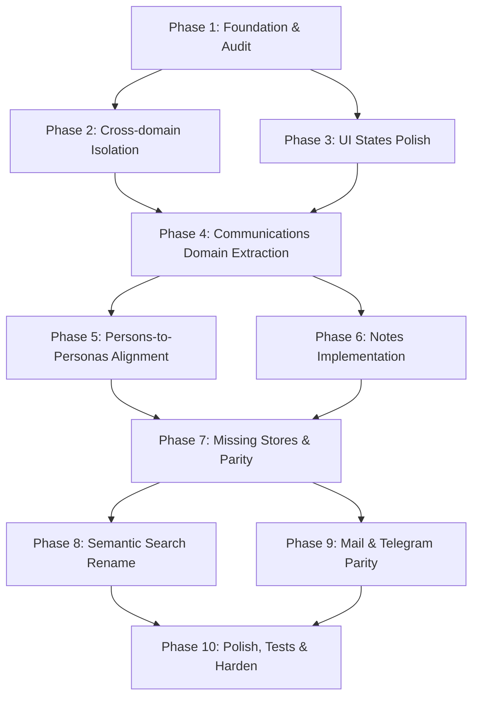

# THINKING — Hermes Docs Alignment

## Goals

1. **Устранить dual naming Persons ↔ Personas** — синхронизировать код, API, документацию и UI вокруг канонической модели Persona, сохранив обратную совместимость через compatibility-слой.

2. **Рефакторинг God Domain `domains/mail/`** — выделить Communication domain как primary ingestion spine, переместить mail-специфичные модули в channel-specific поддиректории без breaking changes.

3. **Унифицировать frontend состояния UI** — добавить Loading, Empty, Error, Skeleton во все компоненты, где они отсутствуют (Telegram, WhatsApp, Documents, Notes, Organizations, Persons).

4. **Устранить cross-domain imports в review store** — изолировать review domain от прямых импортов из `personas/`, `tasks/`, `knowledge/` через shared типы или domain events.

5. **Заполнить пробелы реализации** — Notes backend, Organizations store, WhatsApp store, Telegram parity с Telegram Desktop, Mail parity с Outlook/Apple Mail/Thunderbird.

---

## Constraints

### Архитектурные (из AGENTS.md и ADR)

- **Event sourcing is spine** (ADR-0001) — все изменения проходят через event log.
- **Knowledge graph first** (ADR-0008) — graph edges are primary cross-domain links.
- **Local-first** — ни одна операция не требует сервера.
- **AI output never source of truth** — AI-наблюдения всегда reviewable.
- **Persona model** (ADR-0084) — Personas, не Contacts/CRM; `PersonaType`: `human`, `ai_agent`, `organization_proxy`, `system`; один Owner Persona с `is_self = true`.
- **Communication spine** (ADR-0085) — Communication → Source Evidence → Extracted Knowledge → Memory → Context.
- **First-class Relationships** (ADR-0086) — Relationship records с evidence, trust score, strength score.
- **Domain/Engine separation** — Domains own durable entities; Engines produce derived views.
- **Desktop-first** (ADR-0026, ADR-0031) — mobile UI out of scope.
- **i18n RU/EN** (ADR-0077) — English keys, Russian translations.

### Продуктовые (из master-spec.md)

- Hermes — Personal Memory System, не email client, CRM, task tracker, calendar, notes app.
- Центральная ценность — context, не CRUD.
- Notes — lightweight document-like artifact, не полноценный domain без ADR.
- Communications — единый domain; email, Telegram, WhatsApp, calls, meetings — channels.

### Кодовые

- Backend: Rust + Axum, ~300+ файлов, 12 domains, 11 engines, 200+ API endpoints, 74 миграции.
- Frontend: Vue 3 + Pinia + TanStack Query + Reka UI, 16 страниц, 19 stores, ~115 файлов.
- Все route names, table names, API paths с `persons/` — compatibility labels; rename требует ADR.
- `SemanticSourceKind::Person` → `"contact"` — legacy naming в semantic search.
- `docker/data/` — persistent local state, не коммитится.

---

## Risks & Mitigations

| Risk | Mitigation |
|---|---|
| **1. Breaking API changes при rename Persons→Personas** | Ввести `/api/v1/personas/` как новый route, оставить `/api/v1/persons/` как redirect/compatibility. ADR перед rename. |
| **2. God component CommunicationsPage (891 строк) невозможно рефакторить без регрессий** | Декомпозиция пошагово: вынести query-логику в composables, затем выделить подкомпоненты (MailPanel, TelegramPanel, WhatsAppPanel), верифицировать каждый шаг build pass. |
| **3. Cross-domain review store ломает domain isolation** | Выделить shared `@hermes-types/review` с minimal интерфейсами. Review store импортирует только shared types, не конкретные domain modules. |
| **4. Notes backend отсутствует — frontend вызывает `/api/v1/notes` который не существует** | Добавить placeholder backend handler, возвращающий `{ items: [] }`. Либо explicit error с понятным сообщением. |
| **5. Только 1 placeholder тест — регрессии не отлавливаются** | Каждая фаза alignment должна включать добавление тестов (хотя бы smoke/integration для изменённых модулей). |
| **6. Telegram/Mail parity — огромный объём, нереалистичный для одной фазы** | Разбить на подфазы: baseline (существующее), must-have (критическое для использования), nice-to-have (отложить). |
| **7. Legacy naming в semantic search (`"contact"` вместо `"person"`)** | Сначала добавить `"person"` как допустимое значение в API-слое без удаления `"contact"`. Deprecate `"contact"` через документацию. |

---

## Dependencies



### Порядок выполнения

1. **Foundation & Audit** — ни от чего не зависит; baseline для всех последующих фаз.
2. **Cross-domain Isolation** — зависит от Foundation; необходим для безопасного рефакторинга review store.
3. **UI States Polish** — зависит от Foundation; может идти параллельно с P2.
4. **Communications Domain Extraction** — зависит от P1, P2; критический путь для P5-P9.
5. **Persons-to-Personas Alignment** — зависит от P4 (чтобы не конфликтовать с mail/communications рефакторингом).
6. **Notes Implementation** — может идти параллельно с P5; зависит только от P1.
7. **Missing Stores & Parity** — зависит от P5, P6; добавляет Organizations/WhatsApp stores.
8. **Semantic Search Rename** — зависит от P5 (чтобы naming был согласован).
9. **Mail & Telegram Parity** — независимый трек; может идти параллельно с P5-P8.
10. **Polish, Tests & Harden** — финальная фаза; зависит от всех предыдущих.

---

## Memory Hits Applied

- **Vue 3 SvelteKit Migration завершена** — `.supergoal/hermes-frontend-migration-vue-3-WzENWm/STATE.md` подтверждает 15 фаз, build pass на каждой. Фронтенд现在是 Vue 3 + Pinia + TanStack Query.
- **God component CommunicationsPage** — 891 строка, 17 imports, смесь TanStack Query и raw `fetch()`. Наследие от SvelteKit migration.
- **Review store** (`frontend/src/domains/review/stores/review.ts`) импортирует напрямую из `personas/api/personas`, `tasks/api/tasks`, `knowledge/api/knowledge` — прямое нарушение domain isolation.
- **Organizations domain** не имеет Pinia store (только types и components).
- **WhatsApp domain** не имеет Pinia store (только types и api).
- **Notes domain** — frontend компоненты есть, backend handler отсутствует, API `/api/v1/notes` не реализован.
- **Telegram store** — 462 строки, содержит business logic helpers, смешанные с UI state.
- **Mail domain** (`backend/src/domains/mail/`) — God directory с ~100+ файлов, содержит всё от accounts до signatures, включая workflow handlers и background sync.
- **SemanticSearch** использует `SemanticSourceKind::Person` → `"contact"` — legacy naming.
- **CommunicationsPage** использует raw `fetch()` (например, `fetchMailMessage`, `fetchMailSyncStatus`) + TanStack Query — дублирование слоёв данных.
- **Только 1 placeholder тест** (`frontend/src/__tests__/placeholder.test.ts`).

---

## Best Practices Applied

### Domain-Driven Design
- Каждый domain (communications, personas, tasks, etc.) изолирован в своей директории с чёткой структурой: `api/`, `components/`, `queries/`, `stores/`, `types/`, `views/`.
- Domain isolation требует, чтобы cross-domain imports были минимальны и только через shared contracts.
- God domain (`mail/`) должен быть декомпозирован на bounded contexts.

### Event-Driven Architecture
- ADR-0001 требует event sourcing как spine — все изменения проходят через event log.
- Communication ingestion → event projection → knowledge extraction → memory.
- Review actions должны порождать events, не мутировать состояние напрямую.

### Component-Based UI
- Каждый UI component покрывает одно состояние: Loading, Empty, Error, Success.
- Skeleton компонент уже существует (`shared/ui/Skeleton.vue`) — должен использоваться везде.
- Virtual scrolling (`@tanstack/vue-virtual`) — уже используется в PersonsList, NotesList, TaskList.
- Lazy loading через Vue Router (code splitting по route).

### Типобезопасные контракты
- TypeScript интерфейсы на границе API (`types/` директории).
- Rust типы на backend с serde десериализацией.
- Shared types для cross-domain данных — минимизировать duplication.

### Data Flow Patterns
- **TanStack Query** для server state (кэширование, stale-while-revalidate, optimistic updates).
- **Pinia stores** для UI-only state (filters, selections, UI preferences).
- **SSE** (`SseClient.ts`) для push-уведомлений.
- **No raw `fetch()`** в компонентах — все запросы через ApiClient + TanStack Query.

### UI States Coverage
Каждый компонент должен обрабатывать:
- **Loading** — Skeleton/spinner
- **Empty** — иконка + сообщение + action CTA
- **Error** — сообщение + retry button
- **Success** — данные
- **Skeleton** — placeholder до загрузки

### Offline-First
- Local-first архитектура: все данные доступны локально.
- Provider адаптеры синхронизируются в background.
- Кэширование TanStack Query с persist.

---

## Phase Strategy

### Phase 1: Foundation & Audit 🔍
**Цель**: Baseline для alignment-работы. Инвентаризация всех naming conflicts, missing states, god components.

**Чеклист**:
- [x] Проанализированы 3 аудита (documentation, backend, frontend)
- [x] Составлен список naming conflicts: Persons↔Personas, `"contact"` в semantic search
- [ ] Инвентаризация UI states по всем компонентам (сколько компонентов без Loading/Empty/Error)
- [ ] Измерение CommunicationsPage — точная разбивка строк по ответственности
- [ ] Инвентаризация всех cross-domain import зависимостей
- [ ] Определение Telegram parity gaps относительно Telegram Desktop
- [ ] Определение Mail parity gaps относительно Outlook/Apple Mail/Thunderbird
- [ ] Создание baseline тестов для изменяемых модулей (хотя бы smoke tests)

**Верификация**: `git status --short`, `find frontend/src -name '*.vue' | wc -l`, `grep -r "from '../../" frontend/src/domains/*/stores/ | grep -v node_modules | wc -l`

**Риски**: Audit может выявить больше проблем, чем ожидалось. Фиксировать scope после завершения аудита.

---

### Phase 2: Cross-Domain Isolation 🔌
**Цель**: Устранить нарушение domain isolation в review store.

**Детали**:
- Создать `frontend/src/domains/review/types/shared.ts` с минимальными интерфейсами `ReviewRelationship`, `ReviewDecision`, `ReviewObligation`, `ReviewContradiction`
- Review store импортирует только shared types
- ReviewPage использует generic render props или slots вместо прямых импортов из `personas/`, `tasks/`, `knowledge/`
- API вызовы остаются в domain-specific modules, но review store их вызывает через инверсию зависимостей (strategy pattern)

```typescript
// Пример shared/review-contracts.ts
export interface ReviewRelationship {
  source_entity_kind: string
  source_entity_id: string
  target_entity_kind: string
  target_entity_id: string
  review_state: string
  relationship_type: string
}
```

**Верификация**: `vue-tsc --noEmit` pass; review store не импортирует из `../../personas/`, `../../tasks/`, `../../knowledge/`

---

### Phase 3: UI States Polish 🎨
**Цель**: Добавить отсутствующие UI состояния (Loading, Empty, Error, Skeleton) во все компоненты.

**Детали**:
- Аудит компонентов без состояний (TelegramChatList, WhatsAppSessionList, DocumentsList, NotesList, PersonsList, OrganizationsDetail, OrganizationsList)
- Создать shared composable `useComponentStates` для унификации Loading/Empty/Error/Skeleton
- Каждый компонент оборачивает контент в `Suspense` или `v-if`-chain
- Использовать существующий `Skeleton.vue` компонент
- Перенести `CommunicationsEmptyPage.vue` подход на все компоненты

**Верификация**: Визуальная проверка каждого компонента в 4 состояниях; build pass

---

### Phase 4: Communications Domain Extraction 📧
**Цель**: Рефакторинг God component CommunicationsPage (891 строка) и God directory `domains/mail/`.

**Детали**:
#### Frontend:
- Вынести TanStack Query хуки из CommunicationsPage в отдельные composables
- Вынести mail-specific логику в `composables/useMail.ts`
- Коммуникации разделить на три панели: MailPanel, TelegramPanel, WhatsAppPanel
- CommunicationsPage становится роутером между панелями (или layout-контейнером)
- Устранить raw `fetch()` — все запросы через TanStack Query или ApiClient

#### Backend:
- Создать `backend/src/domains/communications/` как фасад над `mail/`, Telegram, WhatsApp
- Mail-specific модули остаются в `domains/mail/`, но экспортируются через communications facade
- Выделить channel-agnostic логику (projection, state machine) в communications core
- Не переименовывать таблицы или routes без ADR

**Верификация**: `cargo build` pass; `vue-tsc --noEmit` pass; CommunicationsPage < 300 строк

---

### Phase 5: Persons-to-Personas Alignment 👤
**Цель**: Синхронизировать naming на API, frontend, documentation уровне.

**Детали**:
- Frontend: `frontend/src/domains/personas/` уже использует Personas naming; проверить все internal references
- API: Добавить `/api/v1/personas/` routes как алиасы к `/api/v1/persons/`
- Route registration: `/persons` → `/personas` с redirect
- Store naming: `persons.ts` → `personas.ts` (с compatibility alias)
- Component naming: `PersonsList.vue` → `PersonasList.vue` (с re-export)
- Backend struct `Person` → пока не rename, добавить type alias `Persona = Person`
- SemanticSourceKind: `Person` → `Persona` (с compatibility для `"person"` значения)
- Documentation: обновить все docs с persons на personas

**Верификация**: `cargo build` pass; `vue-tsc --noEmit` pass; `curl /api/v1/personas` возвращает данные

---

### Phase 6: Notes Implementation 📝
**Цель**: Реализовать backend для Notes domain.

**Детали**:
- Backend handler для `/api/v1/notes` — возвращает notes из event store или document-like storage
- Notes — lightweight document artifacts без полноценного domain lifecycle (согласно master-spec.md)
- Notes могут быть source records, memory items или document extracts
- Frontend `NotesPage.vue`, `NotesList.vue`, `NotesInsights.vue` — уже существуют, подключить к реальному API
- Notes store (существует) — добавить TanStack Query интеграцию

**Верификация**: `cargo build` pass; `curl /api/v1/notes` возвращает данные; NotesPage отображает notes из backend

---

### Phase 7: Missing Stores & Parity 🏪
**Цель**: Создать отсутствующие Pinia stores для Organizations и WhatsApp domain.

**Детали**:
- **Organizations store**: `frontend/src/domains/organizations/stores/organizations.ts` — UI state (filters, selection, search), TanStack Query integration
- **WhatsApp store**: `frontend/src/domains/whatsapp/stores/whatsapp.ts` — UI state, session management, message filters
- **Telegram store refactor**: выделить business logic helpers в `utils/` или composables, оставить в store только UI state
- Обновить компоненты для использования новых stores

**Верификация**: `vue-tsc --noEmit` pass; OrganizationsPage использует organizations store; WhatsAppPage использует whatsapp store

---

### Phase 8: Semantic Search Rename 🔍
**Цель**: Заменить legacy `"contact"` на `"person"` в semantic search.

**Детали**:
- Backend: `SemanticSourceKind::Person` → значение `"person"` вместо `"contact"`
- Добавить compatibility: API принимает оба значения (`"contact"` и `"person"`)
- Frontend: обновить типы и API вызовы
- Index: переиндексация существующих данных (если требуется)
- Documentation: deprecate `"contact"`, canonical value — `"person"`

**Верификация**: `cargo test` pass; search запрос с `source_kind=person` работает; search запрос с `source_kind=contact` тоже работает (compatibility)

---

### Phase 9: Mail & Telegram Parity 📬
**Цель**: Достичь функционального паритета с Outlook/Apple Mail/Thunderbird и Telegram Desktop.

**Детали**:
#### Mail parity:
- Rich HTML email composition (WYSIWYG editor?)
- Thread visualization (conversation view как в Outlook)
- Rules/filters UI и backend
- Search (полнотекстовый через Tantivy)
- Attachments management (preview, download, inline images)
- Signature management (уже есть backend)
- Spam/phishing detection enhancement

#### Telegram parity:
- Media gallery (photos, videos, documents)
- Voice messages
- Stickers/emoji reactions
- Message search
- Chat folders/tabs
- Message threading (reply chains)
- Online/typing indicators

**Верификация**: `cargo build` pass; `vue-tsc --noEmit` pass; parity checklist по каждому пункту

---

### Phase 10: Polish, Tests & Harden 🛡️
**Цель**: Финальная верификация, тесты, документация.

**Детали**:
- **Tests**: 
  - Frontend: Vitest unit tests для stores, composables, utils
  - Backend: Rust integration tests для изменённых API endpoints
  - Smoke tests для критических путей (communications, personas, search)
- **Documentation**: 
  - Обновить `docs/refactoring/implementation-alignment-plan.md`
  - Обновить `IMPLEMENTATION_STATUS.md`
  - ADR для rename операций (если требуется)
- **Validation**:
  ```sh
  # Backend
  cargo fmt --check
  cargo clippy --all-targets --all-features -- -D warnings
  cargo test --all
  
  # Frontend
  pnpm lint
  pnpm check
  pnpm test
  
  # Integration
  make backend-validate
  ```
- **Edge cases**: Проверить ошибки сети, пустые состояния, concurrent updates, boundary conditions
- **Performance**: Virtual scroll везде, lazy loading routes, code splitting

**Верификация**: Все validation команды pass; нет regression в существующих тестах; документация актуальна

---

## Резюме

| Фаза | Название | Зависимости | Сложность |
|------|----------|-------------|-----------|
| P1 | Foundation & Audit | — | Low |
| P2 | Cross-Domain Isolation | P1 | Medium |
| P3 | UI States Polish | P1 | Low |
| P4 | Communications Domain Extraction | P1, P2 | High |
| P5 | Persons-to-Personas Alignment | P4 | High |
| P6 | Notes Implementation | P1 | Medium |
| P7 | Missing Stores & Parity | P5, P6 | Medium |
| P8 | Semantic Search Rename | P5 | Low |
| P9 | Mail & Telegram Parity | независимый | Very High |
| P10 | Polish, Tests & Harden | P1-P9 | Medium |

**Ключевой принцип**: Каждая фаза независимо верифицируема. Можно остановиться после любой фазы и получить работающую систему с измеримым улучшением.
