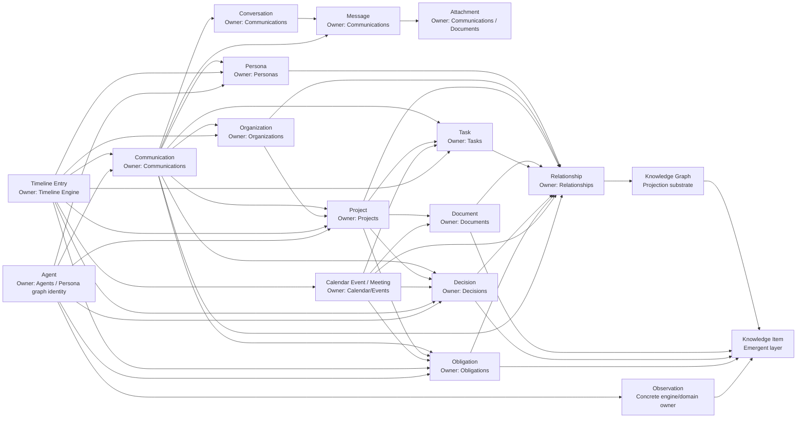

# Phase 2 Cross-Domain Relations Map (2026-06-18)

Scope: relationship map for bounded-context audit. This file documents current
semantic relations; it does not move docs, rename code, change ADRs, change
code or create domains.

## Visual Map

## Relation Matrix

| Source | Related To | Relation Type | Owner Of Relation Semantics | Notes | Evidence | Confidence | Status |
| --- | --- | --- | --- | --- | --- | --- | --- |
| Persona | Communications | participant / sender / recipient / mentioned entity | Communications owns observed participant records; Relationships owns accepted semantic links. | Communication evidence can propose Persona identity links. | docs/domains/communications.md:19-47; docs/workflows/communication-to-knowledge.md:21-38 | high | confirmed |
| Persona | Projects | participant / owner / contributor / stakeholder | Relationships for durable relation; Projects for project context links. | Project must not own Persona identity. | docs/domains/projects.md:1-73; docs/domains/relationships.md | high | confirmed |
| Persona | Decisions | decided_by / affected_entity / evidence subject | Decisions owns Decision; Relationships or impacted entities link to Persona. | Persona does not own decision truth. | docs/domains/decisions.md; ADR-0089 | high | confirmed |
| Persona | Obligations | obligated party / beneficiary / evidence subject | Obligations owns Obligation; Relationships links entities. | Task may fulfill but not own obligation. | docs/domains/obligations.md; ADR-0088 | high | confirmed |
| Organization | Projects | sponsor / participant / service provider | Relationships owns semantic link; Projects owns project state. | Organization is not embedded project field. | docs/domains/organizations.md:22-34; docs/domains/projects.md:22-31 | high | confirmed |
| Organization | Communications | participant organization / mentioned organization / provider account context | Communications owns source evidence; Organizations owns organization identity. | Extraction produces candidates, not organization truth. | docs/workflows/communication-to-knowledge.md:21-38 | high | confirmed |
| Organization | Personas | member_of / represents / works_for | Relationships. | Organization contact link adapters are compatibility sources. | docs/domains/relationships.md; ADR-0086 | high | confirmed |
| Project | Tasks | contains / context / linked task | Tasks owns task lifecycle; Projects owns project context. | Project state must not derive only from task status. | docs/domains/projects.md:33-45; docs/domains/tasks.md | high | confirmed |
| Project | Decisions | project decision / impacted project | Decisions owns durable choice; Projects consumes it. | Project link review may create Decision but not own decision truth. | docs/domains/decisions.md; ADR-0089 | high | confirmed |
| Project | Documents | related evidence / artifact | Documents owns versioned artifact; Projects owns link context. | Document evidence remains immutable by Document rules. | docs/domains/documents.md; docs/domains/projects.md | high | confirmed |
| Project | Obligations | project commitment / obligation context | Obligations owns commitment; Projects consumes status/context. | Project health/risk must cite obligation evidence. | docs/domains/obligations.md; docs/domains/projects.md | high | confirmed |
| Communication | Decisions | decision candidate / evidence | Decisions owns durable Decision after review. | Communication remains source evidence. | docs/workflows/communication-to-knowledge.md; ADR-0089 | high | confirmed |
| Communication | Obligations | commitment candidate / evidence | Obligations owns durable Obligation after review. | Obligation Engine output is candidate-first. | docs/workflows/communication-to-obligation.md; ADR-0088 | high | confirmed |
| Communication | Tasks | task candidate / evidence | Tasks owns Task lifecycle. | Generic task candidates remain task-only unless obligation-derived. | docs/domains/tasks.md; docs/domains/obligations.md | high | confirmed |
| Calendar Event / Meeting | Decisions | meeting outcome decision | Decisions owns durable Decision; Calendar/Events owns event/meeting evidence. | Meeting outcome keeps linked Decision id in compatibility flow. | backend/migrations/0045_calendar_core_tables.sql; ADR-0089 | high | confirmed |
| Calendar Event / Meeting | Obligations | promise/follow-up/task outcome | Obligations owns durable Obligation; Calendar/Events owns meeting evidence. | Meeting outcome may create suggested Obligation without Task creation. | backend/migrations/0045_calendar_core_tables.sql; ADR-0088 | high | confirmed |
| Document | Knowledge Item | extracted/reviewed fact | Knowledge is emergent; storage owner remains open. | Do not create Knowledge domain before storage policy. | docs/foundation/domain-map.md:52-54 | medium | open |
| Observation | Knowledge Item | reviewed observation becomes accepted knowledge/memory | Concrete observation owner first; Knowledge layer after review. | Generic Observation ownership remains unresolved. | ADR-0087; docs/foundation/glossary.md | medium | open |
| Relationship | Knowledge Graph | projected edge / traversal | Relationship owns semantics; Graph owns projection. | Graph edges are rebuildable projection state. | ADR-0086; docs/domains/knowledge-graph.md | high | confirmed |
| Timeline Entry | Any dated entity | chronological view | Timeline Engine owns view; source entity owner remains source of truth. | Timeline must cite event/domain record. | docs/engines/timeline.md | high | confirmed |
| Agent | Domain entities | proposed action / proposed observation | Agents owns run/proposal; target domain owns accepted mutation. | Agent cannot own private data truth. | docs/domains/agents.md | high | confirmed |

## Map Conclusions

| Question | Answer From Map | Confidence | Status |
| --- | --- | --- | --- |
| Which domains exist? | Communications, Personas, Organizations, Relationships, Projects, Documents, Tasks, Calendar/Events, Decisions, Obligations, Knowledge Graph and Agents. | high | confirmed |
| Which domains are not currently justified? | Knowledge as standalone domain, Notes, Radar, generic Observations and Timeline. | medium | evaluated |
| Which domains may be missing? | None proven yet. Radar may become a domain only if durable Signal entities with lifecycle/invariants are required; otherwise it is workflow/inbox. | medium | open |
| Where is the main boundary risk? | Decision, Obligation, Relationship, Observation, Radar, Knowledge Item and Memory ownership. | high | confirmed |
