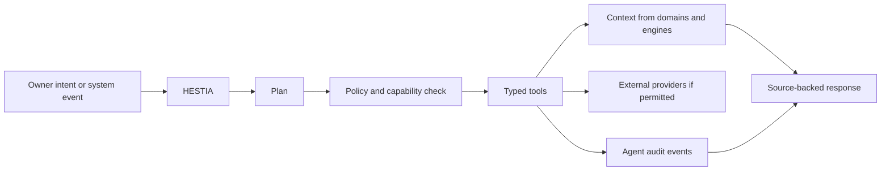

# Agent Architecture

## Agent System Goal

Agents are specialized application actors that help classify, connect,
summarize, search and act on the owner's memory. They are not the source of
truth. They operate through typed tools, explicit permissions and source-backed
context.

When represented in the world model, agents are Personas with
`persona_type = ai_agent`.

## Initial Agents

| Agent | Role |
|---|---|
| HESTIA | coordinator, intent routing, policy mediation |
| HERMES | communications triage, threads, drafting, channel context |
| MNEMOSYNE | memory, graph linking, recall, provenance |
| ATHENA | analysis, trend detection, decision support |
| HEPHAESTUS | development, maintenance and tool automation |

## Agent Runtime

## Tool Contract

Agent tools must define:

- input schema;
- output schema;
- permissions;
- data access scope;
- side-effect class;
- timeout;
- audit behavior;
- error model.

## Context Use

Agents retrieve context from:

- graph queries;
- Search Engine results;
- Timeline Engine views;
- Memory Engine outputs;
- document extracts;
- Task, Project, Persona and Organization projections.

Agents must distinguish source facts, inferred links and generated summaries.

## Side Effects

Safe read-only actions may execute automatically inside an approved workflow.
External writes, message sending, deletion, provider changes and sensitive
exports require explicit confirmation and audit events.
