# Architecture Overview

Статус: clean-room target, реализация не начата
Дата: 2026-07-16

## Architectural Thesis

Hermes Hub — local-first Personal Memory System с двумя связанными продуктовыми
слоями:

1. полноценные provider-specific operational experiences;
2. provider-neutral evidence, memory и context.

Каждый domain, workflow и integration является изолированным module runtime со
своим contract и storage identity. Kernel управляет lifecycle и infrastructure,
но не содержит business logic.

Active architecture policy:

- [ADR-0200: module runtimes и failure isolation](../adr/ADR-0200-clean-room-module-model-and-runtime-isolation.md);
- [ADR-0201: internal IPC и NATS](../adr/ADR-0201-core-module-communication-and-nats.md);
- [ADR-0202: PostgreSQL ownership и PgBouncer](../adr/ADR-0202-postgresql-ownership-pgbouncer-and-extensions.md);
- [ADR-0203: managed infrastructure supervision](../adr/ADR-0203-managed-infrastructure-supervision-and-recovery.md);
- [ADR-0204: bundled integration plugins](../adr/ADR-0204-bundled-integration-plugins-and-provider-neutral-context-boundary.md);
- [ADR-0205: desktop/Android client transport](../adr/ADR-0205-core-gateway-and-client-transport.md).
- [ADR-0206: Kernel constitution и boot/recovery state machine](../adr/ADR-0206-kernel-constitution-boot-and-recovery-state-machine.md).
- [ADR-0207: canonical business domain registry](../adr/ADR-0207-canonical-business-domain-registry.md).
- [ADR-0208: domain development allowlist and projection freeze](../adr/ADR-0208-domain-development-allowlist-and-projection-freeze.md).
- [ADR-0209: Kernel Event Hub and subscription control plane](../adr/ADR-0209-kernel-event-hub-and-subscription-control-plane.md).
- [ADR-0210: Telemetry Hub and local diagnostics](../adr/ADR-0210-telemetry-hub-and-local-diagnostics.md).
- [ADR-0211: backend workspace and source layout](../adr/ADR-0211-backend-workspace-and-source-layout.md).
- [ADR-0212: Cargo package topology and compile isolation](../adr/ADR-0212-crate-topology-and-compile-isolation.md).
- [ADR-0213: code ownership and module autonomy](../adr/ADR-0213-code-ownership-and-module-autonomy.md).
- [ADR-0214: durable Job Platform and Scheduler](../adr/ADR-0214-durable-job-platform-scheduler-and-runtime-reconfiguration.md).
- [ADR-0215: open module registration and capability grants](../adr/ADR-0215-open-module-registration-and-capability-grants.md).
- [ADR-0216: private SQLite Kernel Control Store](../adr/ADR-0216-private-kernel-control-store-with-sqlite.md).
- [ADR-0217: zero external dependency Kernel bootstrap](../adr/ADR-0217-zero-external-dependency-kernel-bootstrap.md).
- [ADR-0218: owner/device identity and offline recovery](../adr/ADR-0218-owner-device-identity-enrollment-and-offline-recovery.md).
- [ADR-0219: managed module distribution integrity and explicit updates](../adr/ADR-0219-managed-module-distribution-integrity-and-explicit-updates.md).
- [ADR-0220: canonical durable envelope and contract evolution](../adr/ADR-0220-canonical-durable-envelope-and-contract-evolution.md).
- [ADR-0221: ModuleDescriptorV1 and capability lifecycle](../adr/ADR-0221-module-descriptor-and-capability-lifecycle-contract.md).
- [ADR-0222: Kernel Settings Registry and supervised reconfiguration](../adr/ADR-0222-kernel-settings-registry-and-supervised-reconfiguration.md).
- [ADR-0223: encrypted SQLite Vault and scoped credential leases](../adr/ADR-0223-encrypted-sqlite-vault-and-scoped-credential-leases.md).
- [ADR-0224: Storage Control Plane and owner-scoped PostgreSQL](../adr/ADR-0224-storage-control-plane-owner-scoped-postgresql-and-migration-lifecycle.md).
- [ADR-0225: first production recovery-only Kernel slice and phase gates](../adr/ADR-0225-first-production-recovery-only-kernel-slice-and-phase-gates.md).
- [ADR-0226: AI context through use-case workflows](../adr/ADR-0226-ai-context-acquisition-through-use-case-workflows.md).
- [ADR-0227: deployment profiles and server bootstrap pairing](../adr/ADR-0227-deployment-profiles-and-server-bootstrap-pairing.md).
- [Executable architecture policy](../../backend/architecture/README.md).

Архивные ADR описывают предыдущую implementation и не являются policy новой
системы.

`backend/architecture/policy.json` является machine-readable companion этих
ADR. `make -C backend architecture-check` проверяет package ownership,
dependency direction, запрещённые domains/projections, Kernel-exclusive
components и storage boundaries без сборки backend.

ADR-0211 принимает `backend/` как единственную физическую границу backend:
production packages находятся под `backend/src`, backend tooling и policy —
под `backend/`, а test code — под `backend/tests`. Root-level compatibility
policy, scripts, Cargo workspace и backend test suites запрещены executable
layout guard.

ADR-0212 отделяет compile isolation от process isolation. Kernel и Gateway не
линкуют owner-specific packages; каждый domain/integration runtime собирает
только packages своего владельца. Integration видит из business domains только
точный `hermes-communications-ingress`, поэтому изменение implementation Mail,
Telegram, Zulip или будущей integration не пересобирает Communications, Kernel
или другие providers. WhatsApp implementation остаётся в hidden host WebView и
не получает backend runtime package.

ADR-0213 задаёт code-level constitution: одна единица имеет одного owner, одну
ответственность и одну причину изменения. Module обязан независимо собираться,
тестироваться и проходить lifecycle/failure evidence; infrastructure доступна
только через явные platform capabilities. Line count остаётся review signal, а
не заменой анализа responsibility.

ADR-0214 вводит единый technical Job Platform для integrations, domains, AI,
workflows и platform maintenance. Scheduler владеет временем и revisioned
schedules; Job Executor, checkpoint и business/operational result принадлежат
module-владельцу. Kernel только supervises Scheduler, а Event Hub остаётся
control plane NATS topology.

ADR-0215 отделяет discovery от trust. Любой локальный process может создать
bounded `pending` registration, но до approval не получает data-plane rights.
Effective GrantSet является пересечением requested capabilities, owner-approved grants
и hard Kernel policy. Kernel гарантирует restart только для `managed` runtime;
`external` runtime он авторизует, наблюдает и fences, но не запускает.

ADR-0216 разрывает circular boot dependency: registrations, grant epochs,
settings desired/effective revisions и desired infrastructure state принадлежат
private SQLite Control Store Kernel.
Kernel и minimal local recovery surface запускаются без PostgreSQL, PgBouncer,
NATS, Vault и modules. Store не содержит business data/secrets и изолирован за
отдельным core-owned port и persistence adapter.

ADR-0217 делает boot source детерминированным: обязательного configuration file
нет, default data directory выбирается через OS-standard location, а
`--data-dir` является единственным explicit override. Исправная SQLite не
входит в unconditional boot root; без неё доступен только restricted local
recovery, а managed infrastructure и data plane заблокированы.

ADR-0218 отделяет owner authority от OS UID и module identity. Каждое
first-party device имеет отдельную non-exportable ES256 keypair; private key
остаётся в platform signer, public/revocation state — в Control Store. При
недоверенном store online доступны только status/validate/export, а
restore/reset выполняются offline под exclusive lock.

ADR-0219 отделяет открытую registration от managed-launch integrity. Unsigned
local process может стать `pending` и после approval работать как `external`,
но любой `managed` launch требует exact-byte `ManagedLaunchBinding`: signed
distribution entry для bundled component либо fresh owner-approved digest pin.
Kernel проверяет binding перед каждым spawn/restart, никогда не скачивает и не
устанавливает code и не выполняет automatic rollback.

ADR-0220 фиксирует один `DurableEnvelopeV1` в
`hermes-events-protocol`: five-kind `oneof`, catalog-bound opaque Protobuf
payload, independent envelope/owner versions и byte-for-byte outbox-to-NATS
delivery. Result является только terminal, durable Ack отделён от JetStream
ACK, dead letter — отдельная sanitized technical record, а client SSE использует
другой gateway protocol.

ADR-0221 фиксирует `ModuleDescriptorV1` в `hermes-runtime-protocol` и разделяет
distribution inventory, runtime declaration, effective GrantSet и observed
state. Capability является единицей approval/readiness/revoke, а dependencies
ссылаются на contracts/capabilities, но не на implementation identity.

ADR-0222 вводит exclusive Kernel Settings Registry. Modules объявляют typed
schema и semantic validation, Kernel хранит desired/effective revisions,
проверяет optimistic concurrency и выполняет hot apply либо supervised restart.
Secrets, business/runtime state, cursors и Scheduler records исключены.

ADR-0223 выделяет `platform/vault` в отдельный verified managed process. Kernel
supervises lifecycle, вычисляет grants и маршрутизирует только HPKE ciphertext;
root keys и credential plaintext в Kernel не попадают. Vault использует
SQLCipher плюс record-level AEAD и выдаёт process-bound leases, fenced runtime
generation и grant epoch. Большие/high-churn provider session stores остаются у
integration owner.

ADR-0224 выделяет `platform/storage` в отдельный managed control plane. Kernel
Supervisor управляет PostgreSQL, PgBouncer и Storage Control lifecycle, но не
реализует SQL. Module runtimes выполняют business SQL напрямую через PgBouncer;
Storage Control владеет bootstrap, roles/grants/budgets, migration admission и
readiness, но не находится на business data path. Runtime database credentials
принадлежат Vault.

ADR-0225 разделяет полный target и текущую реализацию. Six-package recovery
baseline теперь дополнен private module control plane, managed-launch trust и
five-package `vault_v1` и two-package `clock_v1`. Control Store работает через один bounded
SQLite actor и внешний crash-safe recovery fence. NATS, Blob,
Scheduler, public client gateway, whole-instance backup и первый
owner остаются закрытыми phase gates; Kernel не может достичь `ready`.

ADR-0226 не даёт AI стать superdomain. Cross-owner AI use case принадлежит
explicit workflow: он читает public owner contracts, формирует bounded
distinct generated request с common `AiContextReceiptV1` и concrete use-case
context и передаёт его AI. AI не получает cross-owner SQL или query access, а
global fragment union и generic/durable Context projection запрещены.

## Top-Level Shape

Диаграмма ниже показывает целевую систему после открытия всех фазовых ворот.
Она не является текущим runtime graph. Сейчас разрешены private Kernel control
IPC и Vault service gate; все стрелки к data
plane и owner runtimes остаются design target.

```mermaid
flowchart TB
    Desktop["Vue/Tauri desktop client"] --> Gateway["Core Gateway"]
    Android["Planned Android client"] --> Gateway
    Gateway --> Router["Module Registry and capability router"]
    Gateway --> Settings["Kernel Settings Registry"]
    ControlStore["Private Kernel SQLite control store"] --> Router
    ControlStore --> Settings
    ControlStore --> Supervisor["Kernel runtime and infrastructure supervisor"]
    Settings --> Domains
    Settings --> Workflows
    Settings --> Integrations
    Settings --> Vault["Managed Vault runtime"]
    Supervisor --> Domains
    Supervisor --> Workflows
    Supervisor --> Integrations
    Supervisor --> Scheduler
    Supervisor --> PgBouncer
    Supervisor --> PostgreSQL
    Supervisor --> StorageControl["Managed Storage Control"]
    Supervisor --> NATS
    Supervisor --> Collector
    Supervisor --> Vault
    Router <-->|"authorized HPKE ciphertext"| Vault
    Vault --> VaultStore["SQLCipher store and platform key adapter"]
    EventHub["Kernel Event Hub"] -. "catalog / subscriptions / health" .-> NATS
    TelemetryControl["Kernel Telemetry control"] --> Collector["Telemetry Collector"]
    Scheduler["Scheduler runtime"] --> NATS
    Scheduler --> PgBouncer
    Router --> Domains["Isolated domain runtimes"]
    Router --> Workflows["Isolated workflow runtimes"]
    Router --> Integrations["Bundled integration plugins"]
    Router -. "blocked by ADR-0208" .-> Projections["Future product projection runtimes"]
    Integrations --> Operational["Provider operational projections"]
    Integrations --> Evidence["Neutral evidence observations"]
    Evidence --> NATS["NATS JetStream"]
    Domains --> NATS
    Workflows --> NATS
    Domains --> PgBouncer["PgBouncer"]
    Workflows --> PgBouncer
    Integrations --> PgBouncer
    PgBouncer --> PostgreSQL["PostgreSQL"]
    StorageControl -. "bootstrap / roles / migrations / readiness" .-> PostgreSQL
    StorageControl -. "aliases / budgets / drain" .-> PgBouncer
    Domains -. "logs / metrics / traces" .-> Collector
    Workflows -. "logs / metrics / traces" .-> Collector
    Integrations -. "logs / metrics / traces" .-> Collector
    Scheduler -. "logs / metrics / traces" .-> Collector
```



Подробная process/container topology находится в
[Container Diagram](container-diagram.md).

## Client Layer

- Desktop: Vue 3 + Vite внутри Tauri shell.
- Android: planned first-party client; UI stack ещё не выбран.
- Оба клиента используют один Core Gateway и owner-specific generated
  Protobuf clients.
- ConnectRPC обслуживает queries, requests и commands.
- Один replayable SSE stream на active client process обслуживает realtime.
- HTTP вне ConnectRPC используется только для blobs, OAuth, health и SSE.
- Tauri/Android host bridges дают только OS capabilities, bootstrap и typed
  `DeviceSigner`; private device keys не доступны UI или Kernel.
- Paired Android использует защищённый HTTP/2 baseline и preferred HTTP/3 over
  QUIC после conformance проверки; 0-RTT запрещён.

Clients не видят module addresses, NATS, PostgreSQL, PgBouncer или internal
Unix sockets.

## Kernel Layer

Kernel содержит только technical composition:

- boot/recovery state machine;
- Core Gateway;
- client/session identity;
- module registry и validation self-declared runtime descriptors;
- Settings Registry, schema catalog, desired/effective revisions и supervised
  configuration application;
- managed-launch verifier для signed distribution entries и owner-pinned exact
  executable bytes;
- startup dependency graph;
- capability router;
- runtime/infrastructure supervisor;
- Vault authorization context, generation fencing и ciphertext routing без
  credential plaintext;
- Event Hub catalog, subscription reconciliation и delivery health;
- Telemetry Hub identity, redaction, quotas и diagnostics control surface;
- public error translation и sanitized health;
- client-safe realtime projection;
- deterministic pre-store bootstrap boundary.

Module settings доступны только после trustworthy Control Store и не становятся
скрытыми pre-store bootstrap inputs. Module владеет schema/meaning, но не читает
Control Store и не мержит settings другого owner. Kernel не интерпретирует
business semantics values.

Kernel не принимает business decisions, не читает module-owned tables и не
преобразует provider payload в domain semantics. Он достигает
`recovery_only` без PostgreSQL, PgBouncer, NATS, vault и modules. Отказ
необязательного runtime переводит Kernel в `degraded`, а не останавливает
здоровые capabilities.

Kernel не является package manager: download/install/update выполняет Tauri
host updater или OS package manager. External runtime остаётся вне process
control Kernel. Integrity failure managed component даёт `blocked_integrity`
без выбора другого executable, lifecycle fallback или automatic rollback.

## Contract Layer

Contract package содержит только public wire types, commands, queries, events
и typed errors одного owner. Он не содержит SQL, provider SDK, runtime bootstrap
или transport implementation.

Dependency direction:

```text
client / transport adapters
        ↓
public application or operational contracts
        ↓
module application/domain logic
        ↑
storage, provider and platform adapters
```

Domain contract не зависит от integration contract. Provider identity может
присутствовать в provenance, но не определяет domain behavior.

## Runtime Roles

- `domain` — один bounded context и его durable business truth;
- `integration` — provider protocol, auth/session, cursor, operational state и
  neutral evidence mapper;
- `workflow` — explicit coordination публичных contracts;
- `engine` — pure/derived mechanism без ownership business truth;
- `platform` — storage, events, vault, blobs, clock и scheduler capabilities;
- `core_runtime` — единственный composition root и supervisor.

Каждый independently restartable runtime является отдельным OS-process. Crash
одного domain/integration/workflow не завершает Kernel или соседние modules.
Product projection runtime является зарезервированной будущей ролью и не входит
в текущий implementation allowlist по ADR-0208. Pure engine mechanism не может
сохранять projection state или обходить freeze.

## Business Domain Inventory

Канонические business domains первой clean-room реализации:

- Communications;
- Contacts;
- Organizations;
- Relationships;
- Projects;
- Tasks;
- Obligations;
- Decisions;
- Calendar;
- Documents;
- Knowledge;
- Review;
- AI.

Organizations является отдельным domain и не входит в Contacts. Mail,
Telegram, WhatsApp и Zulip являются integrations. Graph, Timeline, Search и
Context являются derived projections или engine capabilities. Полные ownership
правила зафиксированы в ADR-0207.

### Development Allowlist and Current Production Inventory

Product development allowlist разрешает проектирование Communications,
Contacts, Organizations, Tasks, Calendar, Documents и AI. Relationships,
Projects, Obligations, Decisions, Knowledge и Review остаются
зарегистрированными, но заблокированными.

Этот allowlist не является фактическим package inventory. В текущем
`kernel_recovery_only_v1` owner inventory для domains, integrations, workflows
и engines пуст. Разрешены только `hermes-events-protocol`,
`hermes-runtime-protocol`, `hermes-gateway-protocol`, Control Store port/SQLite
adapter и `hermes-kernel`. Первый owner требует отдельного `first_owner_v1`
gate.

Все product projections, включая Graph, Timeline, Search и Context,
заблокированы. Допустимы только canonical state владельца, обычные database
indexes, несохраняемая request-time composition и provider operational state.
Разблокировка требует отдельного ADR по ADR-0208.

## Communication

Синхронные module queries/requests идут через capability router и versioned
local IPC. Durable commands, events, observations, terminal results и durable
Ack messages идут через PostgreSQL outbox/inbox и NATS JetStream. Producer
сохраняет один canonical `DurableEnvelopeV1` byte buffer, relay публикует exact
bytes, consumer сверяет `message_id` + hash до mutation.

Inbound provider flow:

```text
External provider
        ↓
Integration runtime
        ├─→ operational projection → provider client experience
        └─→ neutral evidence outbox → NATS → context/domain workflows
```

Cross-domain mutation:

```text
Source domain event → workflow → target domain command → target domain event
```

Direct domain-to-domain import, cross-module SQL и module-to-module socket
запрещены.

Cross-owner AI context следует отдельному application flow:

```text
owner event / user command
        ↓
use-case workflow → explicit owner queries
        ↓
distinct typed request + AiContextReceiptV1 → AI candidate/result
        ↓
workflow policy → target-domain command или review
```

AI runtime не вызывает owners напрямую и не читает их storage. Concrete request
является request/run-scoped, common receipt фиксирует source revisions,
completeness, privacy и egress policy, и ни один из них не является новой
Context projection.

### Event Hub

Kernel Event Hub строит catalog publishers/subscribers из authorized runtime
descriptors и hard policy, согласует NATS streams, consumers и permissions и
отслеживает readiness, lag, retry и DLQ. Event Hub не устанавливает executable
trust: managed runtime попадает в actual catalog только после ADR-0219 launch
verification. Он не читает payload и отсутствует на normal
publisher-to-consumer data path. При отказе NATS declared topology остаётся
доступна для diagnostics, а observed state помечается unavailable.
Catalog связывает owner/name/major/revision с exact descriptor SHA-256,
publishers/subscribers, kind и limits; incompatible required consumer блокирует
producer cutover.

## Telemetry

Telemetry Hub принимает structured logs, metrics, traces и lifecycle/crash
reports через private local channel, не зависящий от PostgreSQL или NATS.
Kernel владеет identity, redaction, quotas и diagnostics policy; ingestion и
bounded local retention выполняет отдельный managed Telemetry Collector.

Collector failure переводит telemetry capability в `degraded`, но не
останавливает Kernel или modules. Private content, provider payload и secrets
запрещены во всех telemetry signals. Remote export по умолчанию отсутствует.

## Storage

Kernel Supervisor управляет тремя отдельными managed capabilities:
PostgreSQL, PgBouncer и Storage Control. Storage Control bootstrap-ит и
reconciles cluster, roles/grants/budgets, immutable owner migration bundles и
readiness. Он не проксирует и не декодирует business SQL. Module runtime
получает `StorageBindingV1` и scoped Vault credential lease, после чего работает
напрямую по пути `module → PgBouncer → PostgreSQL`.

PostgreSQL является canonical relational store для module-owned business и
operational state. Один cluster и одна database используют fixed schemas
`hermes_data`, `hermes_platform` и `hermes_extensions`; owner objects имеют
собственные prefixes, roles/grants и fully-qualified SQL. Cross-owner business
SQL, tables и foreign keys запрещены. NATS является delivery/replay transport,
а не заменой canonical owner storage.

PgBouncer работает как bounded pool/queue boundary, но не является единственной
security или budget boundary. PostgreSQL role limits, grants, timeouts и
revocation sessions обязательны независимо от pooler. До появления OS-level
socket/network sandbox и process conformance tests target `PgBouncer-only` нельзя
считать доказательством того, что same-UID process физически не попробует direct
PostgreSQL endpoint.

Kernel Control Store, Vault credentials, blobs и telemetry имеют отдельные
owners и не делают PostgreSQL универсальным хранилищем. Private bodies,
documents и media проходят только через разрешённые owner/blob boundaries, а
secret material — только через Vault. NATS и client realtime envelopes содержат
bounded metadata и opaque references.

Полный package, binding, migration и failure contract описан в
[Storage Control Plane](storage-control-plane.md). Решение принято, но
реализован только foundation package/Protobuf/AST-admission контур; managed
binaries и PostgreSQL/PgBouncer integration suite ещё не реализованы.

## Vault и credential leases

Vault является отдельным managed OS process и не входит в Kernel, integration
или domain failure/compromise boundary. Он запускается только после trustworthy
Control Store и не является условием достижения `recovery_only`. Failure Vault
блокирует только capabilities, которым нужны credentials.

```text
module Vault purpose request
∩ owner-approved GrantSet
∩ hard Kernel/Vault policy
∩ current runtime session/generation
        ↓
process-bound CredentialLeaseV1
```

Kernel authorizes и routes sealed HPKE frames, но не decrypt-ит их. Vault
повторно проверяет purpose, audience, runtime generation и grant epoch до чтения
credential payload. Lock, restart, restore, revoke или stale epoch инвалидируют
leases; persistent encrypted credential records при process restart не
удаляются.

Vault хранит bounded passwords, API/client secrets, OAuth refresh credentials,
небольшие session credential blobs и wrapping keys. Он не хранит settings,
business state, outbox/inbox/jobs, large/high-churn provider session databases
или hidden WhatsApp WebView cookies/storage. Полный contract, limits, key
hierarchy и recovery policy описаны в
[Vault and credential leases](vault-and-credential-leases.md).

Решение принято, но production Vault runtime, SQLCipher store, file-key
adapter и conformance tests ещё не реализованы.

## Durable и Derived State

В текущем `kernel_recovery_only_v1` durable business owner state отсутствует:
domains, integrations, workflows и engines имеют пустой production inventory.
После открытия `first_owner_v1` development allowlist ограничивает первые
domain owners семью именами ADR-0208; остальные domains и все derived
projections остаются заблокированы.

Следующие категории derived rebuildable state архитектурно распознаны, но
полностью заблокированы ADR-0208:

- search indexes и embeddings;
- timelines, dossiers и context packs;
- сохранённые cross-domain AI summaries, candidates и classifications;
- risk/trust/priority scores;
- product projections и materialized cross-domain views.

AI run, provenance и typed result внутри owned state AI разрешены, если они не
становятся projection или business truth другого домена. Client-local
ephemeral cache не является server-side product projection или canonical
truth.

## Replaceability

Stable contracts должны позволять заменить:

- client presentation technology;
- local/paired Android topology;
- HTTP/2 transport на HTTP/3 без изменения application contracts;
- database implementation за storage capability boundary;
- provider SDK/runtime;
- LLM, embedding, vector и search implementations;
- blob implementation;
- Vault implementation только через отдельное изменение ADR-0223.
- Storage implementation/topology только через отдельное изменение ADR-0224.

Replaceability не означает одновременную поддержку нескольких implementations
или silent runtime fallback. В V1 разрешён только bundled managed Vault.
