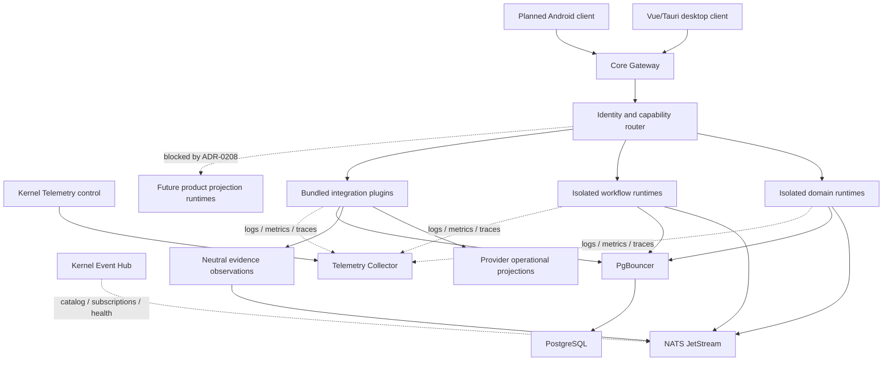

# Architecture Overview

Статус: clean-room target, реализация не начата
Дата: 2026-07-15

## Architectural Thesis

Hermes Hub — local-first Personal Memory System с двумя связанными продуктовыми
слоями:

1. полноценные provider-specific operational experiences;
2. provider-neutral evidence, memory и context.

Каждый domain, workflow и integration является изолированным module runtime со
своим contract и storage identity. Kernel управляет lifecycle и infrastructure,
но не содержит business logic.

Active architecture policy:

- [ADR-0200: module runtimes и failure isolation](../adr/ADR-0200-clean-room-module-model-and-runtime-isolation.md);
- [ADR-0201: internal IPC и NATS](../adr/ADR-0201-core-module-communication-and-nats.md);
- [ADR-0202: PostgreSQL ownership и PgBouncer](../adr/ADR-0202-postgresql-ownership-pgbouncer-and-extensions.md);
- [ADR-0203: managed infrastructure supervision](../adr/ADR-0203-managed-infrastructure-supervision-and-recovery.md);
- [ADR-0204: bundled integration plugins](../adr/ADR-0204-bundled-integration-plugins-and-provider-neutral-context-boundary.md);
- [ADR-0205: desktop/Android client transport](../adr/ADR-0205-core-gateway-and-client-transport.md).
- [ADR-0206: Kernel constitution и boot/recovery state machine](../adr/ADR-0206-kernel-constitution-boot-and-recovery-state-machine.md).
- [ADR-0207: canonical business domain registry](../adr/ADR-0207-canonical-business-domain-registry.md).
- [ADR-0208: domain development allowlist and projection freeze](../adr/ADR-0208-domain-development-allowlist-and-projection-freeze.md).
- [ADR-0209: Kernel Event Hub and subscription control plane](../adr/ADR-0209-kernel-event-hub-and-subscription-control-plane.md).
- [ADR-0210: Telemetry Hub and local diagnostics](../adr/ADR-0210-telemetry-hub-and-local-diagnostics.md).
- [ADR-0211: backend workspace and source layout](../adr/ADR-0211-backend-workspace-and-source-layout.md).
- [Executable architecture policy](../../backend/architecture/README.md).

Архивные ADR описывают предыдущую implementation и не являются policy новой
системы.

`backend/architecture/policy.json` является machine-readable companion этих
ADR. `make -C backend architecture-check` проверяет package ownership,
dependency direction, запрещённые domains/projections, Kernel-exclusive
components и storage boundaries без сборки backend.

ADR-0211 принимает `backend/` как единственную физическую границу backend:
production packages находятся под `backend/src`, backend tooling и policy —
под `backend/`, а test code — под `backend/tests`. Root-level compatibility
policy, scripts, Cargo workspace и backend test suites запрещены executable
layout guard.

## Top-Level Shape



Подробная process/container topology находится в
[Container Diagram](container-diagram.md).

## Client Layer

- Desktop: Vue 3 + Vite внутри Tauri shell.
- Android: planned first-party client; UI stack ещё не выбран.
- Оба клиента используют один Core Gateway и owner-specific generated
  Protobuf clients.
- ConnectRPC обслуживает queries, requests и commands.
- Один replayable SSE stream на active client process обслуживает realtime.
- HTTP вне ConnectRPC используется только для blobs, OAuth, health и SSE.
- Tauri/Android host bridges дают только OS capabilities и bootstrap.
- Paired Android использует защищённый HTTP/2 baseline и preferred HTTP/3 over
  QUIC после conformance проверки; 0-RTT запрещён.

Clients не видят module addresses, NATS, PostgreSQL, PgBouncer или internal
Unix sockets.

## Kernel Layer

Kernel содержит только technical composition:

- boot/recovery state machine;
- Core Gateway;
- client/session identity;
- module registry и manifest validation;
- startup dependency graph;
- capability router;
- runtime/infrastructure supervisor;
- Event Hub catalog, subscription reconciliation и delivery health;
- Telemetry Hub identity, redaction, quotas и diagnostics control surface;
- public error translation и sanitized health;
- client-safe realtime projection;
- technical bootstrap, listener и resource-budget configuration.

Kernel не принимает business decisions, не читает module-owned tables и не
преобразует provider payload в domain semantics. Он достигает
`recovery_only` без PostgreSQL, PgBouncer, NATS, vault и modules. Отказ
необязательного runtime переводит Kernel в `degraded`, а не останавливает
здоровые capabilities.

## Contract Layer

Contract package содержит только public wire types, commands, queries, events
и typed errors одного owner. Он не содержит SQL, provider SDK, runtime bootstrap
или transport implementation.

Dependency direction:

```text
client / transport adapters
        ↓
public application or operational contracts
        ↓
module application/domain logic
        ↑
storage, provider and platform adapters
```

Domain contract не зависит от integration contract. Provider identity может
присутствовать в provenance, но не определяет domain behavior.

## Runtime Roles

- `domain` — один bounded context и его durable business truth;
- `integration` — provider protocol, auth/session, cursor, operational state и
  neutral evidence mapper;
- `workflow` — explicit coordination публичных contracts;
- `engine` — pure/derived mechanism без ownership business truth;
- `platform` — storage, events, vault, blobs, clock и scheduler capabilities;
- `core_runtime` — единственный composition root и supervisor.

Каждый independently restartable runtime является отдельным OS-process. Crash
одного domain/integration/workflow не завершает Kernel или соседние modules.
Product projection runtime является зарезервированной будущей ролью и не входит
в текущий implementation allowlist по ADR-0208. Pure engine mechanism не может
сохранять projection state или обходить freeze.

## Business Domain Inventory

Канонические business domains первой clean-room реализации:

- Communications;
- Contacts;
- Organizations;
- Relationships;
- Projects;
- Tasks;
- Obligations;
- Decisions;
- Calendar;
- Documents;
- Knowledge;
- Review;
- AI.

Organizations является отдельным domain и не входит в Contacts. Mail,
Telegram, WhatsApp и Zulip являются integrations. Graph, Timeline, Search и
Context являются derived projections или engine capabilities. Полные ownership
правила зафиксированы в ADR-0207.

### Current Implementation Allowlist

Реализация разрешена только для Communications, Contacts, Organizations,
Tasks, Calendar, Documents и AI. Relationships, Projects, Obligations,
Decisions, Knowledge и Review остаются зарегистрированными, но
заблокированными.

Все product projections, включая Graph, Timeline, Search и Context,
заблокированы. Допустимы только canonical state владельца, обычные database
indexes, несохраняемая request-time composition и provider operational state.
Разблокировка требует отдельного ADR по ADR-0208.

## Communication

Синхронные module queries/requests идут через capability router и versioned
local IPC. Durable commands, events, observations и results идут через
PostgreSQL outbox/inbox и NATS JetStream.

Inbound provider flow:

```text
External provider
        ↓
Integration runtime
        ├─→ operational projection → provider client experience
        └─→ neutral evidence outbox → NATS → context/domain workflows
```

Cross-domain mutation:

```text
Source domain event → workflow → target domain command → target domain event
```

Direct domain-to-domain import, cross-module SQL и module-to-module socket
запрещены.

### Event Hub

Kernel Event Hub строит catalog publishers/subscribers из проверенных
manifests, согласует NATS streams, consumers и permissions и отслеживает
readiness, lag, retry и DLQ. Он не читает payload и отсутствует на normal
publisher-to-consumer data path. При отказе NATS declared topology остаётся
доступна для diagnostics, а observed state помечается unavailable.

## Telemetry

Telemetry Hub принимает structured logs, metrics, traces и lifecycle/crash
reports через private local channel, не зависящий от PostgreSQL или NATS.
Kernel владеет identity, redaction, quotas и diagnostics policy; ingestion и
bounded local retention выполняет отдельный managed Telemetry Collector.

Collector failure переводит telemetry capability в `degraded`, но не
останавливает Kernel или modules. Private content, provider payload и secrets
запрещены во всех telemetry signals. Remote export по умолчанию отсутствует.

## Storage

PostgreSQL является canonical durable store. Каждый module использует отдельную
role/grants и собственное namespace через PgBouncer. Cross-module tables и
foreign keys запрещены. NATS является delivery/replay transport, а не заменой
canonical storage.

Private bodies, documents, media и secrets передаются только через разрешённые
storage/blob/vault boundaries. NATS и client realtime envelopes содержат
bounded metadata и opaque references.

## Durable и Derived State

В текущей реализации durable owner state ограничен семью разрешёнными доменами,
их module outbox/inbox и provider operational state integration owners.
Relationships, Projects, Obligations, Decisions, Knowledge и Review не имеют
production state до разблокировки.

Следующие категории derived rebuildable state архитектурно распознаны, но
полностью заблокированы ADR-0208:

- search indexes и embeddings;
- timelines, dossiers и context packs;
- сохранённые cross-domain AI summaries, candidates и classifications;
- risk/trust/priority scores;
- product projections и materialized cross-domain views.

AI run, provenance и typed result внутри owned state AI разрешены, если они не
становятся projection или business truth другого домена. Client-local
ephemeral cache не является server-side product projection или canonical
truth.

## Replaceability

Stable contracts должны позволять заменить:

- client presentation technology;
- local/paired Android topology;
- HTTP/2 transport на HTTP/3 без изменения application contracts;
- database implementation за storage capability boundary;
- provider SDK/runtime;
- LLM, embedding, vector и search implementations;
- blob/vault implementations.

Replaceability не означает одновременную поддержку нескольких implementations
или silent runtime fallback.
