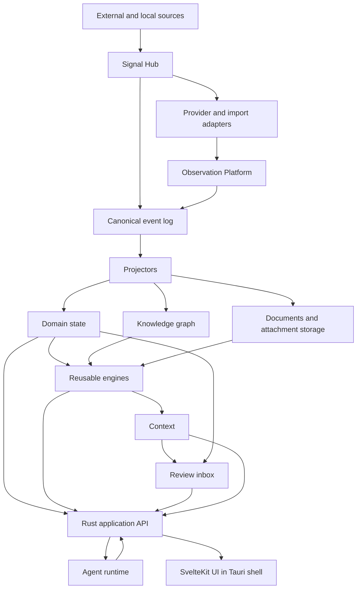

# Architecture Overview

## Architectural Thesis

Hermes Hub is a local-first Personal Memory System. Its durable system of record
combines append-only observations, canonical events, domain entities,
relationships, document artifacts and rebuildable indexes. AI uses these stores
as context and never becomes the durable memory layer itself.

Target flow from ADR-0096 plus ADR-0181 is:

`External Systems -> Signal Hub -> Event Backbone -> Owning Domains -> Knowledge -> Review -> Actions`

The append-only event log remains the system spine from ADR-0001. It does not
replace the Observation Platform boundary; it carries canonical domain and
workflow events alongside evidence ingestion.

Canonical architecture language lives in:

- [Foundation Vision](../foundation/vision.md)
- [World Model](../foundation/world-model.md)
- [Engines](../foundation/engines.md)
- [Architecture Principles](../foundation/architecture-principles.md)

## Top-Level Shape

## Layers

### Interface Layer

- SvelteKit frontend.
- Tauri desktop shell.
- Command palette.
- Keyboard-first navigation.
- Contextual AI affordances.

### Application Layer

- Command handling.
- Query handling.
- Orchestration workflows.
- Permissions and capability checks.
- Agent/tool execution boundary.

### Domain Layer

Domains own source-of-truth entities and invariants:

- Signal Hub.
- Personas.
- Organizations.
- Communications.
- Projects.
- Documents.
- Tasks.
- Calendar/Events.
- Decisions.
- Obligations.
- Review.
- Knowledge Graph relationships.

### Engine Layer

Engines are reusable mechanisms used by domains:

- Memory Engine.
- Timeline Engine.
- Trust Engine.
- Search Engine.
- Enrichment Engine.
- Context Packs Engine.
- Identity Resolution Engine.
- Relationship Candidate Engine.
- Obligation Engine.
- Risk Engine.
- Consistency / Contradiction Engine.

Engines produce projections, observations, candidates, scores or context. They do
not own domain entities.

### Infrastructure Layer

- PostgreSQL.
- NATS JetStream event delivery.
- ConnectRPC / Protobuf API contracts.
- Tantivy.
- Vector index provider.
- Document object storage.
- Provider adapters.
- Ollama runtime.
- Telemetry pipeline.

## Dependency Direction

UI calls application APIs. Application services coordinate domain workflows and
engines. Domain logic must not depend on provider APIs, UI state or storage
details. Infrastructure implements ports required by application, domains and
engines.

The backend evolves through compiler-enforced Cargo boundaries. Provider crates
depend on stable provider/event/vault/blob contracts and external SDKs only;
domain and application crates do not depend on provider implementations. A
desktop composition runtime is the only layer that wires both sides. Provider
runtimes are `in_process` by default and may become supervised shared or
per-account connectors when their isolation policy requires it.

## Durable State Categories

- canonical observations;
- canonical event log;
- normalized domain records;
- relationship records and graph evidence;
- document versions and extracted artifacts;
- reviewed memory, decisions, obligations and knowledge;
- agent execution traces.

## Derived State Categories

- search indexes;
- embeddings;
- timeline views;
- dossiers;
- context packs;
- AI summaries and observations;
- risk/trust/priority scores.

Derived state must be rebuildable or explicitly cacheable from durable state.

## Replaceability

The following components must be replaceable behind stable boundaries:

- LLM provider;
- embedding model;
- vector index implementation;
- messaging provider adapters;
- calendar provider adapters;
- task provider adapters;
- OCR engine;
- full text index backend;
- UI shell.
