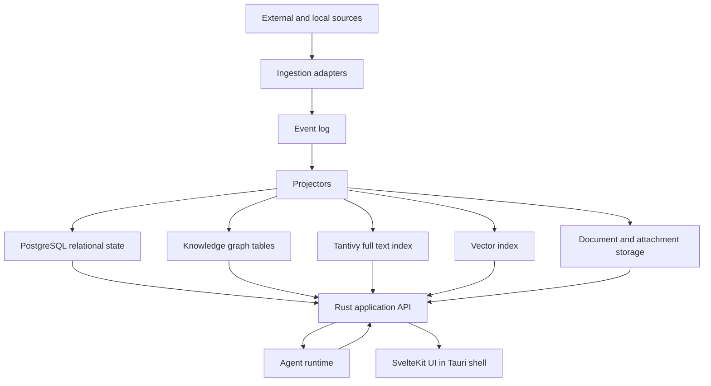

# Architecture Overview

## Architectural Thesis

Hermes Hub is a local-first event-driven knowledge system. The durable system of record is a combination of append-only events, normalized relational state, graph relationships, document artifacts and search indexes. AI uses these stores as context and never becomes the durable memory layer itself.

## Top-Level Shape

## Layers

### Interface Layer

- SvelteKit frontend
- Tauri desktop shell
- command palette
- keyboard-first navigation
- contextual AI affordances

### Application Layer

- command handling
- query handling
- orchestration workflows
- permissions and capability checks
- agent/tool execution boundary

### Domain Layer

- communications
- contacts
- documents
- tasks
- calendar
- projects
- knowledge graph
- search and memory

### Infrastructure Layer

- PostgreSQL
- Tantivy
- vector index provider
- document object storage
- provider adapters
- Ollama runtime
- telemetry pipeline

## Dependency Direction

UI calls application APIs. Application services coordinate domain workflows. Domain logic must not depend on provider APIs, UI state or storage details. Infrastructure implements ports required by application and domain layers.

## Durable State Categories

- raw imported source records
- canonical event log
- normalized relational projections
- graph relationships
- document versions and extracted artifacts
- search indexes
- embeddings and semantic index metadata
- agent execution traces

## Replaceability

The following components must be replaceable behind stable boundaries:

- LLM provider
- embedding model
- vector index implementation
- messaging provider adapters
- OCR engine
- full text index backend, if Tantivy is later replaced
- UI shell, if Tauri is later augmented by web/mobile clients
