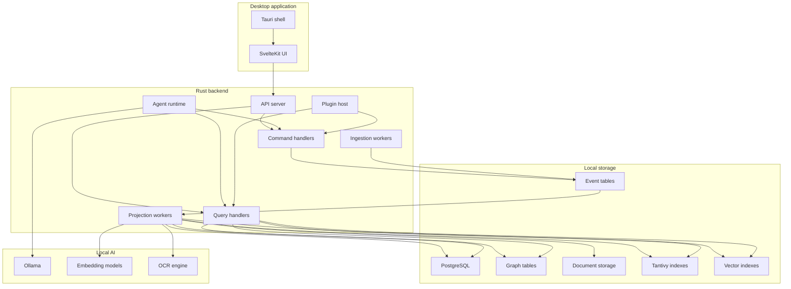

# Container Diagram

## Containers

## Responsibilities

| Container | Responsibility |
| --- | --- |
| Tauri shell | desktop packaging, OS integration, secure local bridge |
| SvelteKit UI | user workflows, command palette, graph/search/timeline UX |
| API server | application boundary, auth/session, commands and queries |
| Ingestion workers | provider sync, normalization, source preservation |
| Projection workers | build relational, graph, search and semantic views |
| Agent runtime | plan and execute AI workflows with tool permissions |
| Plugin host | load bounded extensions with explicit capabilities |
| PostgreSQL | primary relational and event persistence |
| Tantivy | full text search index |
| Vector index | semantic retrieval |
| Object store | documents, attachments, extracted artifacts |
| Ollama | local LLM execution |
