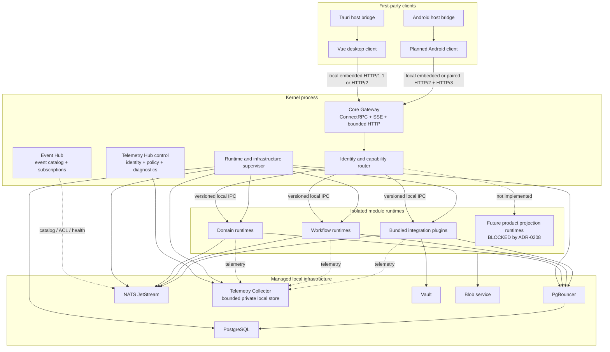

# Container Diagram

Статус: clean-room target, реализация не начата
Дата: 2026-07-15

## Responsibilities

| Container | Responsibility |
|---|---|
| Vue desktop client | Desktop product experience and owner-specific generated clients |
| Tauri host bridge | Desktop bootstrap, windows, file picker, notifications and hidden WebView |
| Android client | Mobile product experience, foreground realtime and device-local cache |
| Android host bridge | Android lifecycle, secure storage, app links, file/media picker and notifications |
| Core Gateway | Single authenticated client boundary, ConnectRPC routing, SSE and blob/OAuth HTTP |
| Capability router | Identity, contract version, authorization and module lifecycle routing |
| Supervisor | Start, stop, restart, drain and health of modules and managed infrastructure |
| Event Hub | Event catalog, publishers/subscribers, NATS topology reconciliation and delivery health without payload processing |
| Telemetry Hub control | Telemetry identity, schema, redaction, quotas and authorized diagnostics |
| Telemetry Collector | Isolated ingestion, bounded local retention and query adapter for logs, metrics, traces and lifecycle reports |
| Domain runtime | One bounded context and its durable business truth |
| Workflow runtime | Cross-domain process through public contracts only |
| Integration plugin | Provider protocol, operational projection and neutral evidence mapper |
| Future product projection runtime | Reserved architecture role; implementation blocked by ADR-0208 |
| PgBouncer | Bounded pooled access from module roles to PostgreSQL |
| PostgreSQL | Canonical module-owned state, outbox and inbox |
| NATS JetStream | Durable internal delivery, replay and fan-out |
| Vault | Credentials and provider session secrets |
| Blob service | Opaque capability-based private content storage |

Clients never connect directly to module runtimes or infrastructure. HTTP/3 is
a paired-client transport adapter for the same Core Gateway contracts; it does
not replace NATS, module IPC or SSE semantics.
