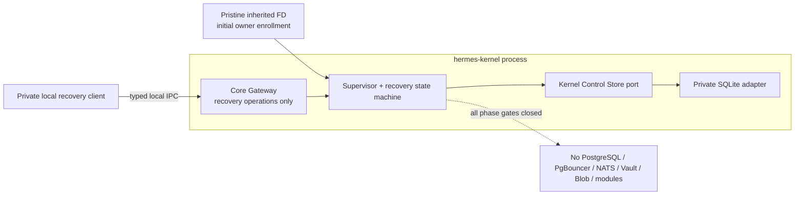

# Container Diagram

Статус: clean-room target, реализация не начата
Дата: 2026-07-16

## Текущий разрешённый slice

ADR-0225 разрешает только recovery-only Kernel; packages ещё не реализованы.
Будущий первый runtime graph не содержит managed services или owner modules:

`hermes-events-protocol`, `hermes-runtime-protocol` и
`hermes-gateway-protocol` являются compile-time contracts, а не отдельными
processes. Максимальное состояние Kernel — `recovery_only`.

## Целевая topology после открытия фазовых ворот

Следующая диаграмма является конституционным target, а не текущим
implementation graph.

```mermaid
flowchart TB
    subgraph Clients["First-party clients"]
        Desktop["Vue desktop client"]
        Tauri["Tauri host bridge"]
        Android["Planned Android client"]
        AndroidHost["Android host bridge"]
    end

    subgraph Installation["Host-managed installation boundary"]
        Updater["Tauri / OS updater\nsigned artifact download + install"]
        Distribution["Signed distribution manifest\nexact executable + descriptor inventory"]
    end

    subgraph Kernel["Kernel process"]
        Gateway["Core Gateway\nConnectRPC + SSE + bounded HTTP"]
        Router["Identity and capability router"]
        Settings["Settings Registry\nschema + desired/effective revisions"]
        Supervisor["Runtime and infrastructure supervisor"]
        ControlStore["Private SQLite Control Store\nboot-critical desired state"]
        EventHub["Event Hub\ncontract/schema catalog + subscriptions"]
        TelemetryControl["Telemetry Hub control\nidentity + policy + diagnostics"]
    end

    subgraph Modules["Managed isolated module runtimes"]
        Domains["Domain runtimes"]
        Workflows["Workflow runtimes"]
        Integrations["Approved integration runtimes"]
        Projections["Future product projection runtimes\nBLOCKED by ADR-0208"]
    end

    ExternalModules["Approved external lifecycle runtimes\nstarted outside Kernel"]

    subgraph Infrastructure["Managed local infrastructure"]
        PgBouncer["PgBouncer"]
        PostgreSQL["PostgreSQL"]
        StorageControl["Storage Control\nbootstrap + grants + migrations + readiness"]
        NATS["NATS JetStream"]
        TelemetryCollector["Telemetry Collector\nbounded private local store"]
        Vault["Vault runtime\nsealed/unlocked + scoped leases"]
        VaultStore["SQLCipher Vault store\nencrypted metadata + credentials"]
        VaultKey["macOS Keychain adapter\ndevice-only wrapping key"]
        Blob["Blob service"]
    end

    Tauri --> Desktop
    AndroidHost --> Android
    Updater --> Distribution
    Distribution -->|"verify exact bytes before every managed launch"| Supervisor
    Desktop -->|"local embedded HTTP/1.1 or HTTP/2"| Gateway
    Android -->|"local embedded or paired HTTP/2 + HTTP/3"| Gateway
    Gateway --> Router
    Gateway --> Settings
    ControlStore --> Router
    ControlStore --> Settings
    ControlStore --> Supervisor
    EventHub -.->|"catalog / ACL / health"| NATS
    TelemetryControl --> TelemetryCollector
    Router -->|"versioned local IPC"| Domains
    Router -->|"versioned local IPC"| Workflows
    Router -->|"versioned local IPC"| Integrations
    Settings -->|"validated settings snapshot"| Domains
    Settings -->|"validated settings snapshot"| Workflows
    Settings -->|"validated settings snapshot"| Integrations
    Settings -.->|"cooperative apply / reconnect"| ExternalModules
    ExternalModules -->|"registration proof"| Router
    Router -->|"authorized versioned local IPC"| ExternalModules
    Router -.->|"not implemented"| Projections
    Supervisor --> Domains
    Supervisor --> Workflows
    Supervisor --> Integrations
    Supervisor --> PgBouncer
    Supervisor --> PostgreSQL
    Supervisor --> StorageControl
    Supervisor --> NATS
    Supervisor --> TelemetryCollector
    Supervisor --> Vault
    Supervisor --> Blob
    Domains --> PgBouncer
    Workflows --> PgBouncer
    Integrations --> PgBouncer
    ExternalModules --> PgBouncer
    PgBouncer --> PostgreSQL
    StorageControl -.->|"control only; no business SQL"| PostgreSQL
    StorageControl -.->|"aliases / budgets / drain"| PgBouncer
    Domains -->|"DurableEnvelopeV1 exact bytes"| NATS
    Workflows -->|"DurableEnvelopeV1 exact bytes"| NATS
    Integrations -->|"DurableEnvelopeV1 exact bytes"| NATS
    ExternalModules -->|"DurableEnvelopeV1 exact bytes"| NATS
    Domains -.->|"telemetry"| TelemetryCollector
    Workflows -.->|"telemetry"| TelemetryCollector
    Integrations -.->|"telemetry"| TelemetryCollector
    ExternalModules -.->|"telemetry"| TelemetryCollector
    Router -->|"authorization context + HPKE ciphertext"| Vault
    Vault -->|"sealed leases and results"| Router
    Vault --> VaultStore
    Vault --> VaultKey
    Modules --> Blob
    ExternalModules --> Blob
```

## Responsibilities

| Container | Responsibility |
|---|---|
| Vue desktop client | Desktop product experience and owner-specific generated clients |
| Tauri host bridge | Desktop bootstrap, platform DeviceSigner, windows, file picker, notifications and hidden WebView |
| Android client | Mobile product experience, foreground realtime and device-local cache |
| Android host bridge | Android lifecycle, Keystore DeviceSigner, app links, file/media picker and notifications |
| Tauri / OS updater | Download, verify and atomically install signed releases outside Kernel |
| Signed distribution manifest | Immutable bundled component identity, compatibility and exact executable/descriptor/settings-schema digests |
| Core Gateway | Single authenticated client boundary, ConnectRPC routing, SSE and blob/OAuth HTTP |
| Capability router | Identity, contract version, authorization and module lifecycle routing |
| Settings Registry | Verified module schemas, desired/effective revisions, validation and supervised apply without business interpretation |
| Supervisor | Verify exact bytes, then start, stop, restart, drain and observe managed modules/infrastructure |
| Kernel Control Store | Private SQLite owner/device public identities, registrations, settings revisions, epochs and desired topology; unavailable store leaves read-only recovery |
| Event Hub | Event catalog, publishers/subscribers, NATS topology reconciliation and delivery health without payload processing |
| Telemetry Hub control | Telemetry identity, schema, redaction, quotas and authorized diagnostics |
| Telemetry Collector | Isolated ingestion, bounded local retention and query adapter for logs, metrics, traces and lifecycle reports |
| Domain runtime | One bounded context and its durable business truth |
| Workflow runtime | Cross-domain process through public contracts only; AI context assembly is explicit per use case |
| Integration plugin | Provider protocol, operational projection and neutral evidence mapper |
| External lifecycle runtime | Approved local runtime observed and fenced by Kernel without process control or restart guarantee |
| Future product projection runtime | Reserved architecture role; implementation blocked by ADR-0208 |
| PgBouncer | Bounded pooled access from module roles to PostgreSQL |
| PostgreSQL | Canonical module-owned state, outbox and inbox |
| Storage Control | Separate managed control plane for bootstrap, roles/grants/budgets, migration admission and readiness; never a business SQL proxy |
| NATS JetStream | Byte-preserving `DurableEnvelopeV1` delivery, replay and fan-out; not schema or business truth |
| Vault runtime | Separate verified managed process; authorization re-check, key lifecycle and process-bound credential leases without provider semantics |
| SQLCipher Vault store | Encrypted bounded credential material and private metadata; not settings, business state or a generic session/blob store |
| macOS Keychain adapter | Device-only platform wrapping key; Owner/device signing keys remain outside Vault |
| Blob service | Opaque capability-based private content storage |

Clients never connect directly to module runtimes or infrastructure. HTTP/3 is
a paired-client transport adapter for the same Core Gateway contracts; it does
not replace NATS, module IPC or SSE semantics.

Kernel process and minimal local recovery surface form the unconditional boot
root. A trustworthy Control Store is the next gate required before managed
infrastructure or the data plane may start. PostgreSQL, PgBouncer, Storage
Control, NATS, Vault, Blob, Telemetry Collector and managed module runtimes are
supervised capabilities started only after that gate. External lifecycle
runtimes start outside Kernel and connect through registration/capability
routing.

Module data path остаётся прямым: runtime получает `StorageBindingV1` и scoped
Vault credential lease, затем подключается к PgBouncer, а pooler — к
PostgreSQL. Storage Control находится только на management path и не видит
business queries. PgBouncer не является единственной security/budget boundary:
до OS-level socket/network sandbox и process conformance нельзя считать
same-UID bypass физически невозможным. Полный contract описан в
[Storage Control Plane](storage-control-plane.md).

Modules do not connect directly to Vault. Kernel computes effective grants and
routes only HPKE ciphertext between the authorized runtime and Vault; it cannot
decrypt credential material. Vault restart preserves encrypted records but
creates a new generation and invalidates every active lease. Large/high-churn
provider session stores remain integration-owned, while hidden WhatsApp WebView
state remains in its OS-managed per-account profile.

Kernel never downloads or installs executable code. Host updater/OS owns signed
release installation; Kernel verifies the signed distribution entry and exact
bytes before every managed launch. Integrity failure blocks that component, and
automatic rollback, downgrade or executable fallback is forbidden.

`hermes-events-protocol` является shared compile-time wire boundary, а не
отдельным process/container. Event Hub reconciles its catalog and NATS topology,
но exact envelope bytes идут напрямую между owner outbox relay и consumer.
Client SSE использует отдельный gateway frame и не получает internal envelope.

`hermes-runtime-protocol` также не является process/container. Он определяет
`ModuleDescriptorV1`, lifecycle/control и settings schema/snapshot wire types.
Descriptor только заявляет capabilities; GrantSet и managed launch binding
остаются отдельными authority.

AI runtime не подключается к чужим owner storage/query APIs. В целевой
topology explicit workflow читает необходимые public owner contracts и передаёт
AI distinct generated request с common `AiContextReceiptV1` и concrete use-case
context; global fragment union, Context projection и generic read-all service
остаются заблокированными ADR-0208/ADR-0226.
