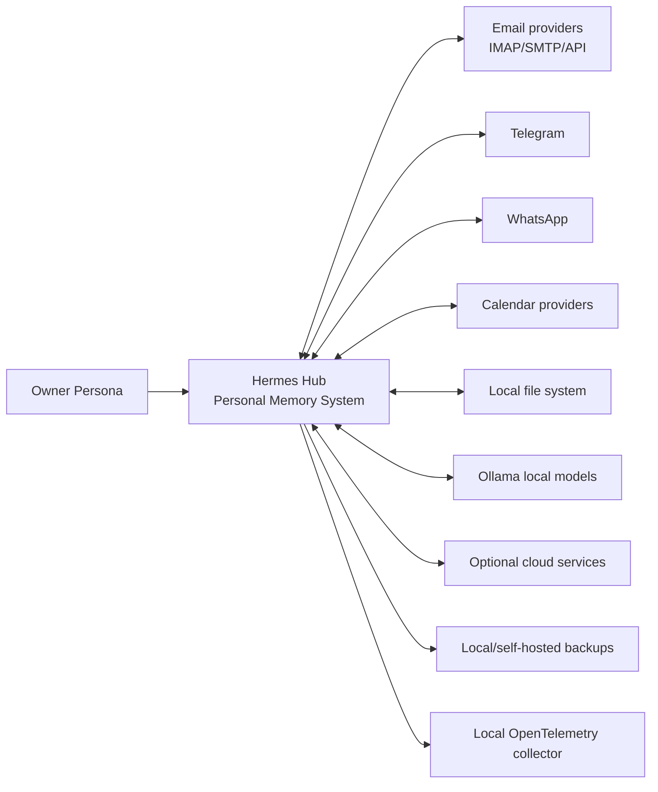

# Context Diagram

## System Context

## External Actors

| Actor | Relationship |
| --- | --- |
| Owner Persona | Owns data, reviews actions, controls permissions |
| Email providers | Communication channel for email source evidence and outbound messages |
| Telegram | Communication channel for Telegram source evidence and outbound messages |
| WhatsApp | Communication channel for WhatsApp source evidence and outbound messages |
| Calendar providers | Event source for meetings, reminders and scheduled context |
| Local file system | Source for documents and export destination |
| Ollama | Local inference provider |
| Optional cloud services | Non-required integrations |
| Backup target | Local or self-hosted durability layer |

## Context Rules

- Hermes Hub must continue to operate without optional cloud services.
- External providers are never the canonical memory layer.
- Provider records are preserved as source evidence for Communications, Events,
  Documents and downstream Memory.
- Any outbound action must pass through a capability and confirmation model appropriate to its risk.
