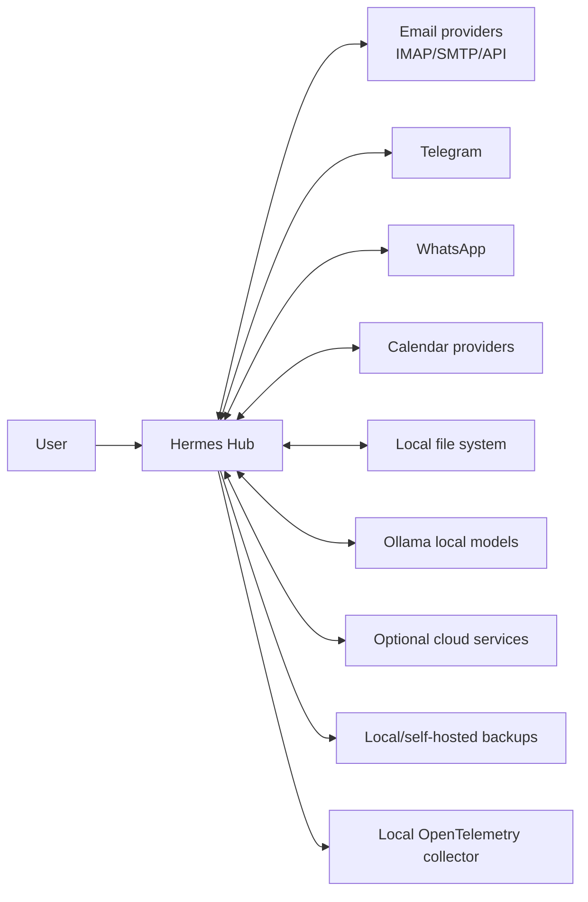

# Context Diagram

## System Context

## External Actors

| Actor | Relationship |
| --- | --- |
| User | Owns data, reviews actions, controls permissions |
| Email providers | Source and target for email messages |
| Telegram | Source and target for Telegram conversations |
| WhatsApp | Source and target for WhatsApp conversations |
| Calendar providers | Source and target for meetings and reminders |
| Local file system | Source for documents and export destination |
| Ollama | Local inference provider |
| Optional cloud services | Non-required integrations |
| Backup target | Local or self-hosted durability layer |

## Context Rules

- Hermes Hub must continue to operate without optional cloud services.
- External providers are never the canonical memory layer.
- Provider records are preserved as source evidence.
- Any outbound action must pass through a capability and confirmation model appropriate to its risk.
