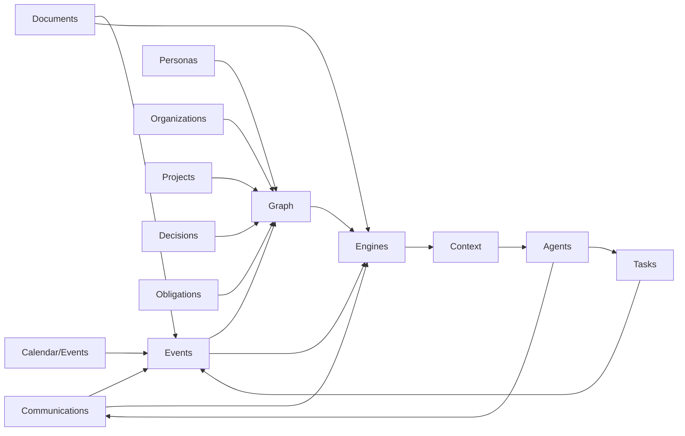

# Domain Map

This document summarizes active domain ownership. The canonical version is
[Foundation Domain Map](../foundation/domain-map.md).

## Bounded Contexts And Engines

## Domain Ownership

| Domain | Owns | Does not own |
|---|---|---|
| Communications | messages, conversations, participants, channels, delivery metadata | Persona identity truth, task lifecycle |
| Personas | Personas, identity traces, Persona relationships, Persona memory anchors | raw provider messages, organization lifecycle |
| Organizations | organizations, identities, domains, portals, procedures, organization relationships | Persona identity, project ownership |
| Projects | bounded work contexts, linked work, project decisions, project state | organization identity, task lifecycle |
| Documents | document versions, extracted text, metadata, evidence artifacts | task status, general knowledge truth |
| Tasks | actionable work items, status lifecycle, task evidence | obligations as commitments, provider delivery |
| Calendar/Events | scheduled events, meetings, attendees, calendar source identity | global Timeline Engine ownership |
| Decisions | durable choices and rationale with evidence | generic notes or AI summaries |
| Obligations | commitments and duties with evidence | every task or every follow-up |
| Knowledge Graph | relationship records, graph evidence, traversal model | raw binary storage, provider sync |
| Agents | tool-mediated workflows, plans, audit trails | source-of-truth domain state |

## Engine Ownership

| Engine | Role |
|---|---|
| Memory Engine | Builds source-backed memory views and memory gaps. |
| Timeline Engine | Builds chronological views from events and dated domain records. |
| Trust Engine | Computes relationship and source reliability signals. |
| Search Engine | Plans retrieval over text, vectors, graph and time. |
| Enrichment Engine | Produces reviewable candidates and observations. |
| Obligation Engine | Detects commitments and follow-ups from evidence. |
| Risk Engine | Detects evidence-backed risk observations. |
| Consistency / Contradiction Engine | Detects conflicts between new evidence and accepted memory. |

## Cross-Domain Rules

- Domains communicate through events and application services.
- Provider-specific fields stay at the integration boundary unless promoted into
  canonical fields.
- Search and AI can suggest links; domain workflows confirm or mark confidence.
- Graph relationships must preserve provenance and confidence.
- Domain state changes must be traceable to commands or imported source events.
- Engines do not become owners of domain source-of-truth records.
