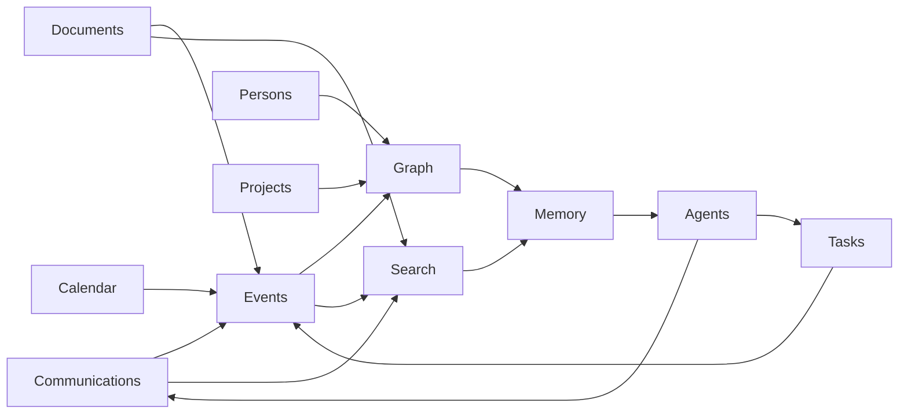

# Domain Map

## Bounded Contexts

## Domain Ownership

| Domain | Owns | Does not own |
| --- | --- | --- |
| Communications | messages, threads, channels, delivery metadata | person identity truth |
| Persons | people, companies, channels, relationship graph | raw provider messages |
| Documents | document versions, OCR, extraction artifacts | task status |
| Tasks | commitments, reminders, assignees, lifecycle | message delivery |
| Calendar | meetings, attendance, schedule context | general project state |
| Projects | project timelines, linked work, decisions | provider-specific records |
| Knowledge graph | entities, relationships, provenance | raw binary document storage |
| Search | indexes, ranking signals, result composition | durable business truth |
| Agents | AI workflows, plans, tool calls, explanations | source of record state |

## Cross-Domain Rules

- Domains communicate through events and application services.
- Provider-specific fields stay at the integration boundary unless promoted into canonical fields.
- Search and AI can suggest links; domain workflows confirm or mark confidence.
- Graph relationships must preserve provenance and confidence.
- Domain state changes must be traceable to commands or imported source events.
