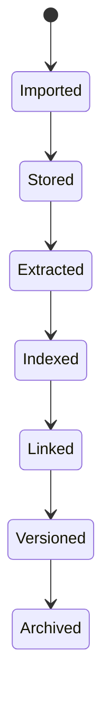

# Documents Domain

## Responsibilities

The documents domain owns imported files, versions, extracted text, OCR artifacts, document summaries, entity mentions and links to other graph objects.

## Supported Types

- PDF
- Office documents
- images
- Markdown

## Document Lifecycle

## Extraction Outputs

- plain text
- OCR text
- metadata
- page structure
- tables where feasible
- entity mentions
- summary
- document type classification
- candidate graph links

## Versioning

Documents require immutable version records. A later upload or edit must not silently overwrite past evidence used by tasks, decisions or AI summaries.

## Linking

Documents can link to:

- people
- organizations
- projects
- tasks
- meetings
- messages
- decisions

Links may be user-confirmed or AI-suggested with confidence and provenance.
