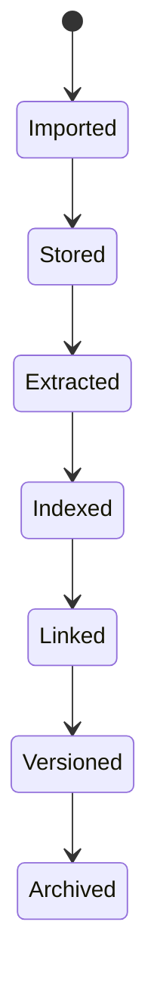

# Documents Domain

Status: documentation package aligned to the current repository structure.

## Responsibilities

The documents domain owns imported or created artifacts, immutable versions,
extracted text, OCR artifacts, metadata, entity mentions and document evidence.

Documents are evidence. Knowledge is the reviewed understanding built from
documents and other sources.

## Supported Types

- PDF.
- Office documents.
- Images.
- Markdown.
- Lightweight Notes as document-like artifacts.

## Notes Boundary

Notes are not a separate domain in the current model. A Note is a lightweight
document-like capture artifact or memory input. If Notes become a first-class
domain later, that requires an ADR.

## Document Lifecycle

## Extraction Outputs

- plain text;
- OCR text;
- metadata;
- page structure;
- tables where feasible;
- entity mentions;
- candidate summaries;
- document type classification;
- candidate graph links.

Extraction outputs are derived until reviewed or stored as evidence-backed
knowledge.

## Versioning

Documents require immutable version records. A later upload or edit must not
silently overwrite past evidence used by Tasks, Decisions, Obligations or AI
summaries.

## Linking

Documents can link to:

- Personas;
- Organizations;
- Projects;
- Tasks;
- Events;
- Communications;
- Decisions;
- Obligations.

Links may be owner-confirmed or AI-suggested with confidence and provenance.
