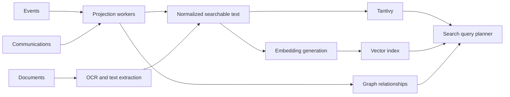

# Search Engine Architecture

## Search Goals

- fast full text search;
- semantic recall;
- graph-aware memory queries;
- explainable ranking;
- source-backed AI answers.

Search is an engine, not a domain. It retrieves context from domain records,
source evidence, graph relationships and derived indexes.

## Search Modes

### Full Text Search

Tantivy indexes normalized text from communications, documents, tasks, Personas,
Organizations, Projects, Decisions and other indexed evidence. It supports exact
terms, phrases, fields, dates and facets.

### Semantic Search

Vector search supports conceptual recall across communications, documents,
tasks, decisions, obligations and summaries. Embeddings are derived and
rebuildable.

### Memory Queries

Memory queries combine full text, semantic retrieval, graph expansion and event
time constraints.

Examples:

- where VAT was discussed;
- what the accountant asked for;
- when a project started;
- which obligations relate to a client.

## Ranking Inputs

- text relevance;
- semantic distance;
- graph proximity;
- recency;
- source reliability;
- Project or Persona relevance;
- owner-pinned importance;
- Task or Obligation state.

## Result Requirements

Each result should expose:

- source object;
- snippet or summary;
- matched fields;
- related entities;
- event time;
- confidence for inferred matches;
- ranking explanation where possible.

## Indexing Pipeline

Indexes are derived. Search corruption must be recoverable from source records,
events, domain state and document artifacts.
