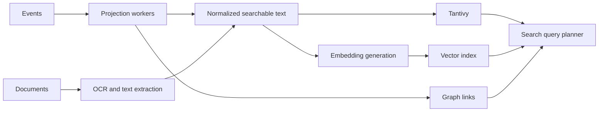

# Search Architecture

## Search Goals

- fast full text search
- semantic recall
- graph-aware memory queries
- explainable ranking
- source-backed AI answers

## Search Modes

### Full Text Search

Tantivy indexes normalized text from messages, documents, notes, tasks, persons and projects. It supports exact terms, phrases, fields, dates and facets.

### Semantic Search

Vector search supports conceptual recall across messages, documents, tasks and summaries. Embeddings are derived and rebuildable.

### Memory Queries

Memory queries combine full text, semantic retrieval, graph expansion and event timelines.

Examples:

- где обсуждался VAT
- что хотел бухгалтер
- когда появился проект Hermes
- какие обещания связаны с клиентом X

## Ranking Inputs

- text relevance
- semantic distance
- graph proximity
- recency
- source reliability
- project/person relevance
- user-pinned importance
- task status

## Result Requirements

Each result should expose:

- source object
- snippet or summary
- matched fields
- related entities
- event time
- confidence for inferred matches
- why it ranked where possible

## Indexing Pipeline

