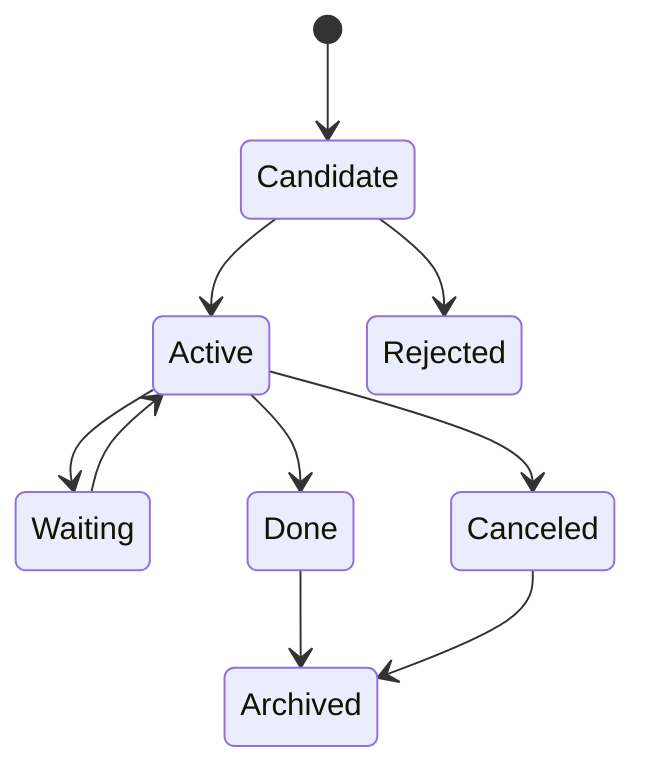

# Tasks Domain

## Responsibilities

The tasks domain owns actionable commitments, reminders, deadlines, assignees, status lifecycle and links to evidence.

## Task Sources

- manual creation
- message extraction
- document extraction
- meeting summary
- agent suggestion
- imported task provider in future versions

## Lifecycle

## Required Fields

- title
- source or manual provenance
- status
- owner
- created_at
- updated_at
- optional deadline
- optional reminder policy
- linked entities

## Extraction Rules

AI extraction creates task candidates, not automatically active commitments, unless a user policy explicitly allows auto-activation for a low-risk source.

## Audit

Status changes, deadline changes, assignment changes and deletions must emit events.
