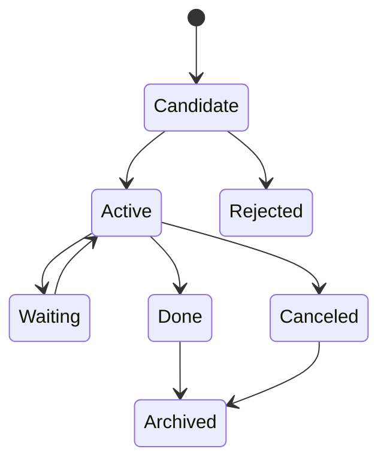

# Tasks Domain

## Responsibilities

The Tasks domain owns concrete actionable units with lifecycle, owner, status,
evidence and links to context.

A Task is not the same as an Obligation or Follow-Up:

- an Obligation is a commitment or duty with evidence;
- a Follow-Up is a prompt to revisit something;
- a Task is an actionable unit with status lifecycle.

## Task Sources

- manual creation;
- Communication extraction;
- Document extraction;
- meeting summary;
- Obligation Engine output;
- agent suggestion;
- imported task provider in future versions.

## Lifecycle

## Required Fields

- title;
- source or manual provenance;
- status;
- owner;
- created_at;
- updated_at;
- optional deadline;
- optional reminder policy;
- linked entities.

## Extraction Rules

AI extraction and engine output create task candidates, not automatically active
commitments, unless a user policy explicitly allows auto-activation for a
low-risk source.

Manual owner-created Tasks may exist without a `task_candidate_id`. Task
candidates are review surfaces, not the universal source of truth for every
Task.

Task candidate refresh must be idempotent by source evidence and candidate
title. Repeated extraction should update the same review surface instead of
creating duplicate candidates or overwriting an explicit owner review.

## Audit

Status changes, deadline changes, assignment changes and deletions must emit
events.
