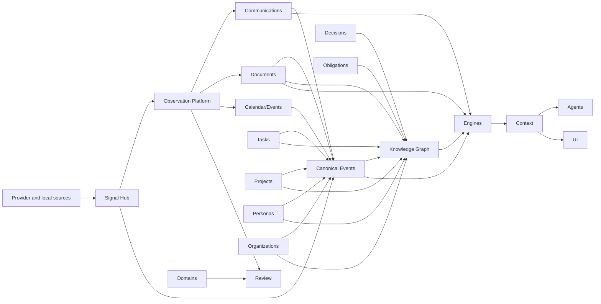

# Hermes Domain Map

This document is the canonical active domain map. Historical ADR and plans may
use older names.

## Domains

| Domain | Owns | Does not own |
|---|---|---|
| Signal Hub | signal sources, connections, capabilities, runtime state, health, profiles, mute/pause/replay policies and fixture recovery | provider protocol code, messages, tasks, personas, documents, graph truth |
| Personas | Personas, identity traces, Persona relationships, Persona memory anchors | provider messages, organization lifecycle, project lifecycle |
| Organizations | Organizations, organization identities, organization relationships, portals, procedures | Persona identity, project ownership |
| Communications | canonical messages, conversations, participants, channel metadata, delivery state | Persona truth, task lifecycle, document versions |
| Projects | bounded work contexts, project state, project decisions and linked context | organization identity, task lifecycle |
| Documents | document artifacts, versions, extracted text, metadata, document evidence | general knowledge truth, task status |
| Tasks | actionable work items, status lifecycle, task evidence, task provider overlay | obligations as commitments, provider message delivery |
| Calendar/Events | scheduled events, meetings, attendees, calendar source identity | global Timeline Engine ownership |
| Decisions | durable choices and rationale with evidence | generic notes or AI summaries |
| Obligations | commitments and duties with evidence | every task or every follow-up |
| Review | inbox items, approval, dismissal and promotion state | domain truth, provider state, Radar vocabulary |
| Knowledge Graph | relationship records, graph evidence, traversal model | raw binary storage, provider sync |
| Agents | tool-mediated workflows and audit trails | source-of-truth domain state |

## Engines

Engines are separate from domains:

- Memory Engine;
- Timeline Engine;
- Trust Engine;
- Search Engine;
- Enrichment Engine;
- Context Packs Engine;
- Identity Resolution Engine;
- Relationship Candidate Engine;
- Obligation Engine;
- Risk Engine;
- Consistency / Contradiction Engine.

Domains call engines. Engines do not own domain entities.

## Cross-Domain Rules

- Provider-specific source data first passes through Signal Hub control policy,
  then enters Communications, Calendar, Documents or other owning domains as
  canonical observations/events when used as evidence.
- Canonical events and observations preserve what happened.
- Domains create or update their own source-of-truth entities.
- Review owns inbox, approval, dismissal and promotion state for candidates.
- Relationships connect entities across domains with provenance.
- Engines build derived views, suggestions, scores and context.
- Agents use domain APIs and engines through permissions and audit.

## Notes And Knowledge

Notes are lightweight document-like artifacts in the current model. They are not
a separate domain until an ADR says otherwise.

Knowledge is evidence-backed understanding across domains. It is represented by
facts, relationships, decisions, observations and reviewed summaries, not by a
separate generic wiki silo.

## Mermaid Overview

