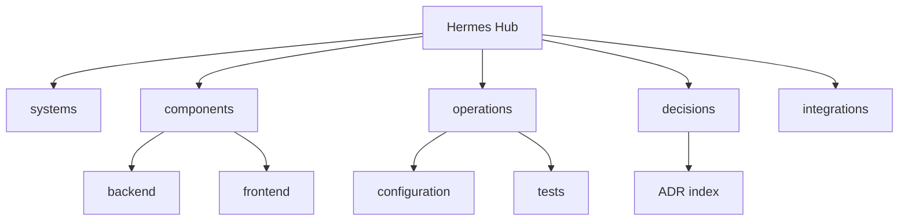

# Hermes Hub Code Wiki

Эта wiki собрана из реального кода, документации и ADR репозитория через `code-wiki-ru` и DeepSeek/OpenCode bounded drafts.

## Основные разделы

- [[systems/overview|Обзор системы]]
- [[components/index|Компоненты]]
- [[operations/index|Операции и конфигурация]]
- [[decisions/index|ADR и решения]]
- [[integrations/index|Интеграции]]
- [[data/index|Данные]]
- [[api/index|API]]
- [[flows/wiki-generation|Поток генерации wiki]]
- [[glossary/index|Глоссарий]]

## Покрытие по ролям

| Role | Chunks |
|---|---:|
| `adr` | 5 |
| `config` | 15 |
| `doc` | 23 |
| `other` | 25 |
| `source` | 77 |
| `test` | 18 |

## Покрытие по группам

| Group | Chunks |
|---|---:|
| `.cargo` | 1 |
| `.config` | 1 |
| `.github` | 2 |
| `.gitignore` | 1 |
| `.kilocodemodes` | 1 |
| `.pre-commit-config` | 1 |
| `.supergoal` | 3 |
| `AGENTS` | 1 |
| `CODE_OF_CONDUCT` | 1 |
| `CONTRIBUTING` | 1 |
| `Cargo` | 1 |
| `LICENSE` | 1 |
| `Makefile` | 1 |
| `README` | 1 |
| `SECURITY` | 1 |
| `backend` | 82 |
| `bacon` | 1 |
| `canonical-evidence-final-report` | 1 |
| `contracts` | 1 |
| `crates` | 3 |
| `deny` | 1 |
| `docker` | 2 |
| `docs` | 16 |
| `frontend` | 32 |
| `plans` | 1 |
| `reports` | 2 |
| `scripts` | 3 |

## Target pages

- `components/LICENSE` — `1` chunks
- [[components/backend|components/backend]] — `64` chunks
- [[components/contracts|components/contracts]] — `1` chunks
- [[components/crates|components/crates]] — `1` chunks
- [[components/docker|components/docker]] — `1` chunks
- [[components/docs|components/docs]] — `1` chunks
- [[components/frontend|components/frontend]] — `30` chunks
- [[components/kilocodemodes|components/kilocodemodes]] — `1` chunks
- [[components/scripts|components/scripts]] — `1` chunks
- [[components/supergoal|components/supergoal]] — `1` chunks
- [[decisions/adr-index|decisions/adr-index]] — `5` chunks
- [[operations/backend-tests|operations/backend-tests]] — `16` chunks
- [[operations/configuration|operations/configuration]] — `15` chunks
- [[operations/crates-tests|operations/crates-tests]] — `1` chunks
- [[operations/documentation-map|operations/documentation-map]] — `23` chunks
- [[operations/scripts-tests|operations/scripts-tests]] — `1` chunks
