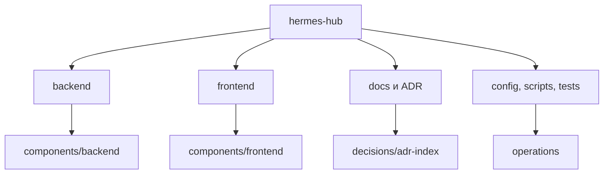

# Обзор системы

Wiki построена из `163` bounded chunks, покрывающих `2949` non-redacted исходных файлов текущего рабочего дерева.

```mermaid
graph TD
  repo["hermes-hub"] --> backend["backend"]
  repo --> frontend["frontend"]
  repo --> docs["docs и ADR"]
  repo --> ops["config, scripts, tests"]
  backend --> components["components/backend"]
  frontend --> ui["components/frontend"]
  docs --> decisions["decisions/adr-index"]
  ops --> operations["operations"]
```

Главная навигация: [[../index|Code Wiki]].
