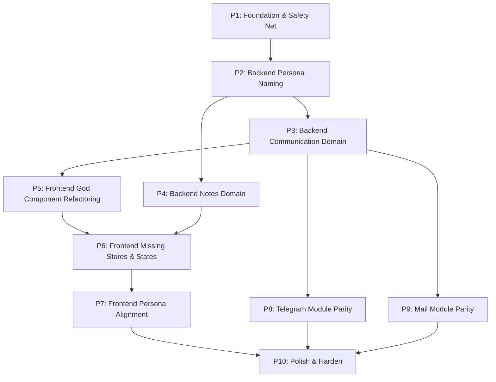
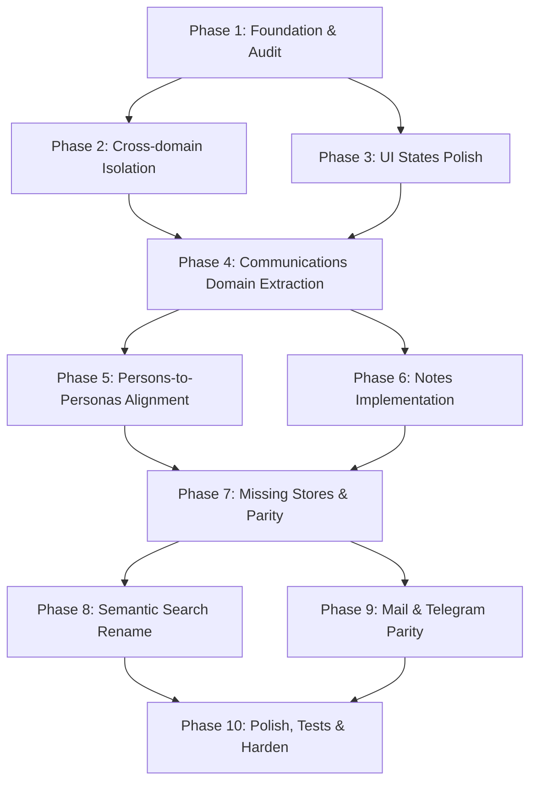

# Задача для DeepSeek: обновить русскую Obsidian wiki

## Safety instructions / Инструкции безопасности

- Do not print, infer, summarize, or request secrets. / Не печатай, не выводи, не пересказывай и не запрашивай секреты.
- Treat `.env`, credential, token, key, certificate, and private paths as redacted even if referenced. / Считай `.env`, учетные данные, токены, ключи, сертификаты и приватные пути редактированными.
- Keep code identifiers, file paths, commands, package names, API names, and ADR titles exactly as written. / Сохраняй идентификаторы кода, пути, команды, имена пакетов, API и названия ADR без изменений.
- Write wiki prose in Russian and keep Markdown Obsidian-compatible. / Пиши текст wiki на русском и сохраняй совместимость с Obsidian Markdown.
- Do not invent source facts. If the context is insufficient, state that explicitly. / Не выдумывай факты об исходниках. Если контекста недостаточно, напиши это явно.
- Every behavioral statement in proposed wiki pages must be directly supported by the embedded source text. / Каждое утверждение о поведении в предлагаемых wiki-страницах должно напрямую подтверждаться встроенным текстом исходников.
- Do not infer semantics for profiles, flags, annotations, environment variables, or framework conventions unless this context pack explicitly defines them. / Не выводи семантику профилей, флагов, аннотаций, переменных окружения или framework-конвенций, если этот context pack явно её не определяет.
- Do not add external background knowledge about tools, frameworks, or CLIs. / Не добавляй внешние справочные знания об инструментах, framework или CLI.
- When only a command or config value is visible, document only the literal command or value. For deeper meaning, write only that it is not confirmed by this context. / Когда видна только команда или значение конфигурации, документируй только буквальную команду или значение. Для более глубокого смысла пиши только, что он не подтвержден этим контекстом.
- Do not name likely related files unless they are embedded in this context pack. / Не называй вероятные связанные файлы, если они не встроены в этот context pack.
- Use only the embedded Source Files section below. Do not call tools, read files, inspect the filesystem, or access MCP/web resources. / Используй только встроенный ниже раздел Source Files. Не вызывай tools, не читай файлы, не инспектируй файловую систему и не обращайся к MCP/web ресурсам.
- If a referenced path or wiki page is not embedded in this context pack, report insufficient context instead of trying to open it. / Если упомянутый путь или wiki-страница не встроены в этот context pack, укажи недостаток контекста вместо попытки открыть файл.

## Chunk details / Детали чанка

- Chunk ID / ID чанка: `008-doc-supergoal-part-001`
- Group / Группа: `.supergoal`
- Role / Роль: `doc`
- Status / Статус: `pending`
- Repository / Репозиторий: `/Users/avm/projects/Personal/hermes-hub`
- Wiki path / Путь wiki: `/Users/avm/projects/Personal/hermes-hub/docs/wiki`
- Metadata path / Путь metadata: `/Users/avm/projects/Personal/hermes-hub/docs/wiki/_meta`
- Plan generated at / План создан: `2026-06-28T19:48:55Z`
- Per-file source limit / Лимит источника на файл: `12000` characters

## Target pages / Целевые страницы

- `operations/documentation-map.md`

## Required Output / Требуемый результат

Return one Markdown response with these sections and no extra wrapper text. / Верни один Markdown-ответ с этими разделами и без дополнительной обертки.

### Summary / Резюме

Briefly describe what should change in the Russian wiki and why. / Кратко опиши, что нужно изменить в русской wiki и почему.

### Proposed pages / Предлагаемые страницы

For each target page, provide the wiki-relative path and full proposed Obsidian-compatible Markdown content. / Для каждой целевой страницы укажи путь относительно wiki и полный предложенный Markdown, совместимый с Obsidian.

### Source coverage / Покрытие источников

List each source file and the facts from it that the proposed pages cover. / Перечисли каждый исходный файл и факты из него, покрытые предложенными страницами.

### Drift candidates / Кандидаты на drift

List possible code/docs/ADR drift found in this chunk, or state that none is visible from the provided context. / Перечисли возможные расхождения кода, документации и ADR в этом чанке либо укажи, что из данного контекста они не видны.

## Source Files / Исходные файлы

### `.supergoal/hermes-docs-alignment-Q2wXmK/ROADMAP.md`

- Resolved path / Полный путь: `/Users/avm/projects/Personal/hermes-hub/.supergoal/hermes-docs-alignment-Q2wXmK/ROADMAP.md`
- Size bytes / Размер в байтах: `23557`
- Included characters / Включено символов: `12000`
- Truncated / Обрезано: `yes`

````markdown
# Roadmap: Hermes Docs Alignment

**Task:** Устранить расхождения между документацией и реализацией в Hermes Hub: Persona naming, Communication domain, Notes backend, frontend states, Telegram/Mail parity и тестовая инфраструктура.

**Type:** brownfield, refactor, alignment

**Created:** 2026-06-14

**Total phases:** 10

## Context summary

- **Stack:** Rust backend (Axum), Vue 3 + Pinia + TanStack Query + Reka UI frontend, Tauri 2 desktop shell
- **Package manager:** pnpm (frontend), cargo (backend)
- **Build / test / lint commands:** `make backend-validate`, `cd frontend && pnpm build`, `cd frontend && pnpm lint`, `cd frontend && pnpm test:unit`
- **Риски:** breaking API changes при rename Persons→Personas, God component CommunicationsPage (891 строк), отсутствие тестов (1 placeholder), Telegram/Mail parity — огромный объём

## 12 выявленных Gaps

| # | Gap | Описание | Фаза |
|---|-----|----------|------|
| 1 | `domains/mail/` God directory | ~100+ файлов в mail, документация требует Communication as primary ingestion spine | P3 |
| 2 | Dual naming Persons↔Personas | Документация: Personas (ADR-0084). Код: `Person` struct + `PersonaType`, API `/persons` и `/personas` | P2, P7 |
| 3 | `SemanticSourceKind::Person` → `"contact"` | legacy naming в semantic search | P2 |
| 4 | Notes domain — нет backend | `docs/domains/notes.md` есть, frontend компоненты есть, backend отсутствует | P4 |
| 5 | `CommunicationsPage.vue` — God Component | 891 строка, порог >500 | P5 |
| 6 | Missing stores | WhatsApp store, Organizations store отсутствуют | P6 |
| 7 | Отсутствуют UI states | Loading/Empty/Error/Skeleton в большинстве компонентов | P6 |
| 8 | Только 1 placeholder тест | Нет реальных тестов | P1, P10 |
| 9 | Telegram модуль — partial | Требуется паритет с Telegram Desktop | P8 |
| 10 | Mail модуль — partial | Требуется паритет с Outlook/Apple Mail/Thunderbird | P9 |
| 11 | Cross-domain imports в review store | Review store импортирует из personas, tasks, knowledge напрямую | P5 |
| 12 | Raw fetch() + TanStack Query mix | CommunicationsPage использует оба подхода | P5 |

## Assumptions

Non-blocking decisions recorded here so we can proceed without round-trips. If any are wrong, stop the run:

- **Phase order:** Foundation → Naming → Domain restructure → Notes → Frontend refactoring → Stores & States → Frontend naming alignment → Telegram parity → Mail parity → Polish.
- **API compatibility:** `/api/v1/persons` routes сохраняются как redirect/compatibility при введении `/api/v1/personas`. Не ломать существующие клиенты.
- **SemanticSourceKind:** `"contact"` остаётся accepted value. `"person"` добавляется как canonical. Deprecate `"contact"` через документацию.
- **No schema migrations** без ADR. Persona rename — только API/frontend уровень; таблицы БД не переименовываются.
- **No new ADR** для текущих alignment работ, если не требуется breaking schema change.
- **Notes — lightweight:** Notes как document-like artifacts без полноценного domain lifecycle, согласно master-spec.md.
- **Telegram/Mail parity:** Разбить на must-have vs nice-to-have. Baseline (существующее) сохраняется.

## Risk top 3

1. **Breaking API changes при rename Persons→Personas** — likelihood: MEDIUM. Mitigation: `/api/v1/personas` как новый route, `/api/v1/persons` как redirect/compatibility.
2. **God component CommunicationsPage (891 строк) невозможно рефакторить без регрессий** — likelihood: HIGH. Mitigation: Декомпозиция пошагово, верификация каждого шага build pass.
3. **Telegram/Mail parity — огромный объём** — likelihood: HIGH. Mitigation: Разбить на подфазы must-have/nice-to-have. Baseline сохраняется.

## Dependency graph



## Phase map

| # | Phase | Action-first name | Depends on | Deliverable |
|---|-------|-------------------|------------|-------------|
| 1 | Foundation & Safety Net | Add test infrastructure and characterization tests | none | Testcontainers в crates/testkit, characterization tests для существующего поведения |
| 2 | Backend: Persona Naming | Rename Persons to Personas in backend | P1 | API `/api/v1/personas`, Persona struct, SemanticSourceKind fix |
| 3 | Backend: Communication Domain | Restructure mail into Communication domain | P2 | Communication domain facade, mail channel isolation |
| 4 | Backend: Notes Domain | Create Notes backend domain | P2 | `domains/notes/` с моделями, store, API |
| 5 | Frontend: God Component Refactoring | Break CommunicationsPage and fix cross-domain imports | P3 | CommunicationsPage <500 строк, composables, no raw fetch |
| 6 | Frontend: Missing Stores & States | Add WhatsApp/Organizations stores and UI states | P5 | WhatsApp store, Organizations store, Loading/Empty/Error/Skeleton |
| 7 | Frontend: Persona Alignment | Rename persons to personas in frontend | P2, P6 | Frontend routes, components, stores, i18n aligned |
| 8 | Telegram Module Parity | Full parity with Telegram Desktop | P3 | Accounts, Chats, Messages, Media, Search, Notifications |
| 9 | Mail Module Parity | Full parity with Outlook/Apple Mail | P3 | Rich compose, rules, templates, signatures, multi-account |
| 10 | Polish & Harden | Final audit, edge cases, security, performance, tests | все фазы | Full validation gate, IMPLEMENTATION_STATUS.md update |

---

## Phase 1 — Foundation & Safety Net

**Why:** Без тестовой инфраструктуры и characterization тестов все последующие изменения рискуют сломать существующее поведение.

**Deliverables:**
- `crates/testkit/` — Testcontainers infrastructure
- Characterization tests для изменяемых модулей:
  - Person API smoke tests
  - Communication API smoke tests
  - Search smoke tests
- `frontend/src/__tests__/` — базовые frontend smoke tests
- Инвентаризация всех naming conflicts, missing states, god components

**Acceptance criteria:**
- [ ] Testcontainers контейнер PostgreSQL поднимается и проходит health check
- [ ] Хотя бы 1 characterization test для Person API
- [ ] Хотя бы 1 characterization test для Communication API
- [ ] Frontend placeholder test расширен до реального smoke test
- [ ] `make backend-validate` проходит
- [ ] `cd frontend && pnpm test:unit` проходит
- [ ] Инвентаризация naming conflicts задокументирована
- [ ] Инвентаризация UI states по всем компонентам выполнена

**Mandatory commands:**
- `make backend-validate`
- `cd frontend && pnpm build && pnpm test:unit`

**Evidence required:**
- Testcontainers test output (last 10 lines)
- Frontend test output (last 10 lines)
- Инвентаризационный отчёт

**Dependencies:** none

---

## Phase 2 — Backend: Persona Naming

**Why:** Документация определяет Persona как каноническую модель (ADR-0084), но код использует `Person` и `persons/` API. Необходимо синхронизировать backend без breaking changes.

**Deliverables:**
- `/api/v1/personas/` routes — добавлены как алиасы к `/api/v1/persons/`
- `Person` struct → добавлен type alias `Persona = Person`
- `PersonaType` enum — синхронизирован с ADR-0084
- `SemanticSourceKind::Person` → canonical `"person"`, compatibility с `"contact"`
- Compatibility-алиасы для `/persons` API (redirect без breaking change)
- Обновлены handler facade и router

**Acceptance criteria:**
- [ ] `curl /api/v1/personas` возвращает данные (те же, что `/api/v1/persons`)
- [ ] `curl /api/v1/persons` продолжает работать (compatibility)
- [ ] `SemanticSourceKind::Person` сериализуется в `"person"` по умолчанию
- [ ] `SemanticSourceKind::Person` десериализует `"contact"` как compatibility
- [ ] `cargo build` passes
- [ ] `cargo test --all` passes
- [ ] `make backend-validate` passes
- [ ] Нет breaking изменений в API контрактах

**Mandatory commands:**
- `cargo build`
- `cargo test --all`
- `make backend-validate`

**Evidence required:**
- Build output (last 10 lines)
- Test output (last 10 lines)
- curl response from `/api/v1/personas` and `/api/v1/persons`

**Dependencies:** Phase 1

---

## Phase 3 — Backend: Communication Domain

**Why:** `domains/mail/` — God directory с ~100+ файлов. Документация требует Communication как primary ingestion spine. Mail должен стать channel-specific поддиректорией внутри Communication domain.

**Deliverables:**
- `domains/communications/` — новый core domain facade
- `domains/communications/core/` — channel-agnostic логика (projection, state machine)
- `domains/communications/mail/` — mail-specific модули (перемещены из `domains/mail/`)
- `domains/communications/telegram/` — Telegram channel адаптер (если есть)
- `domains/communications/whatsapp/` — WhatsApp channel адаптер (если есть)
- `domains/mail/` — оставлен как compatibility re-export facade
- Обновлены все импорты в handlers, workflows, engines

**Acceptance criteria:**
- [ ] `domains/communications/` существует с core, mail channel
- [ ] `domains/mail/` продолжает экспортировать те же public API через re-export
- [ ] Все существующие импорты из `domains::mail::*` продолжают работать
- [ ] `cargo build` passes
- [ ] `cargo test --all` passes
- [ ] `make backend-validate` passes
- [ ] Нет дублирования кода между mail и communications
- [ ] Communication domain не содержит provider-specific credential logic

**Mandatory commands:**
- `cargo build`
- `cargo test --all`
- `make backend-validate`

**Evidence required:**
- Tree listing of `backend/src/domains/communications/`
- Build output (last 10 lines)
- Test output (last 10 lines)

**Dependencies:** Phase 2

---

## Phase 4 — Backend: Notes Domain

**Why:** `docs/domains/notes.md` и frontend компоненты NotesList.vue существуют, но backend handler для `/api/v1/notes` отсутствует. Необходимо реализовать backend для Notes domain.

**Deliverables:**
- `domains/notes/` — новый domain модуль
- `domains/notes/models.rs` — Note model (lightweight, document-like)
- `domains/notes/store.rs` — Note store (event-backed или direct storage)
- `domains/notes/api.rs` — API handlers для CRUD
- `domains/notes/handlers/` — route handlers
- Route registration в `app/router.rs`
- Интеграция с frontend API типов

**Acceptance criteria:**
- [ ] `curl /api/v1/notes` возвращает `{ items: [] }` (пустой список)
- [ ] `curl -X POST /api/v1/notes` создаёт заметку
- [ ] `curl /api/v1/notes/:id` возвращает заметку по ID
- [ ] Notes — lightweight, без полноценного domain lifecycle
- [ ] `cargo build` passes
- [ ] `cargo test --all` passes
- [ ] `make backend-validate` passes
- [ ] Notes API не требует schema migration (если используется event store)

**Mandatory commands:**
- `cargo build`
- `cargo test --all`
- `make backend-validate`

**Evidence required:**
- curl запросы к `/api/v1/notes` endpoints
- Build output (last 10 lines)
- Tree listing of `backend/src/domains/notes/`

**Dependencies:** Phase 2

---

## Phase 5 — Frontend: God Component Refactoring

**Why:** `CommunicationsPage.vue` — 891 строка, смесь TanStack Query и raw `fetch()`, cross-domain imports в review store. Необходимо разбить на manageable компоненты и устранить архитектурные нарушения.

**Deliverables:**
- TanStack Query хуки вынесены из CommunicationsPage в `composables/useCommunicationsQueries.ts`
- Raw `fetch()` заменён на TanStack Query / ApiClient
- CommunicationsPage разбит на подкомпоненты: `MailPanel`, `TelegramPanel`, `WhatsAppPanel`
- CommunicationsPage < 500 строк
- Review store cross-domain imports устранены:
  - Создан `frontend/src/domains/review/types/shared.ts` с minimal интерфейсами
  - Review store импортирует только shared types
  - API вызовы через инверсию зависимостей (strategy pattern)

**Acceptance criteria:**
- [ ] CommunicationsPage < 500 строк (б
````
_Source file truncated after 12000 characters. / Исходный файл обрезан после 12000 символов._

### `.supergoal/hermes-docs-alignment-Q2wXmK/STATE.md`

- Resolved path / Полный путь: `/Users/avm/projects/Personal/hermes-hub/.supergoal/hermes-docs-alignment-Q2wXmK/STATE.md`
- Size bytes / Размер в байтах: `1907`
- Included characters / Включено символов: `1841`
- Truncated / Обрезано: `no`

```markdown
# Supergoal State

**Run:** Hermes Docs Alignment

**Root:** `.supergoal/hermes-docs-alignment-Q2wXmK`

**Status:** PLANNING

**Current phase:** 0

**Started:** 2026-06-14

**Last update:** 2026-06-14

**Baseline ref:** (to be set at dispatch)

## Phase Status

| # | Phase | Status | Started | Completed | Notes |
|---|-------|--------|---------|-----------|-------|
| 1 | Foundation & Safety Net | pending | — | — | Testcontainers, characterization tests, inventory |
| 2 | Backend: Persona Naming | pending | — | — | API `/api/v1/personas`, Persona struct, SemanticSourceKind |
| 3 | Backend: Communication Domain | pending | — | — | Communication domain facade, mail channel isolation |
| 4 | Backend: Notes Domain | pending | — | — | `domains/notes/` with models, store, API |
| 5 | Frontend: God Component Refactoring | pending | — | — | CommunicationsPage <500, composables, no raw fetch, cross-domain fix |
| 6 | Frontend: Missing Stores & States | pending | — | — | WhatsApp/Organizations stores, UI states coverage |
| 7 | Frontend: Persona Alignment | pending | — | — | Frontend routes, components, stores, i18n |
| 8 | Telegram Module Parity | pending | — | — | Full Telegram Desktop parity |
| 9 | Mail Module Parity | pending | — | — | Full Outlook/Apple Mail parity |
| 10 | Polish & Harden | pending | — | — | Final audit, tests, security, performance |

## Engineering Check Status

- Pre-flight: ⏳ pending
- Phase 1 build: ⏳ pending
- Phase 2 build: ⏳ pending
- Phase 3 build: ⏳ pending
- Phase 4 build: ⏳ pending
- Phase 5 build: ⏳ pending
- Phase 6 build: ⏳ pending
- Phase 7 build: ⏳ pending
- Phase 8 build: ⏳ pending
- Phase 9 build: ⏳ pending
- Phase 10 build: ⏳ pending

## Notable Events

- 2026-06-14 — Plan created, 10 phases defined.
- 2026-06-14 — 12 gaps identified from documentation/backend/frontend audits.
```

### `.supergoal/hermes-docs-alignment-Q2wXmK/THINKING.md`

- Resolved path / Полный путь: `/Users/avm/projects/Personal/hermes-hub/.supergoal/hermes-docs-alignment-Q2wXmK/THINKING.md`
- Size bytes / Размер в байтах: `22926`
- Included characters / Включено символов: `12000`
- Truncated / Обрезано: `yes`

````markdown
# THINKING — Hermes Docs Alignment

## Goals

1. **Устранить dual naming Persons ↔ Personas** — синхронизировать код, API, документацию и UI вокруг канонической модели Persona, сохранив обратную совместимость через compatibility-слой.

2. **Рефакторинг God Domain `domains/mail/`** — выделить Communication domain как primary ingestion spine, переместить mail-специфичные модули в channel-specific поддиректории без breaking changes.

3. **Унифицировать frontend состояния UI** — добавить Loading, Empty, Error, Skeleton во все компоненты, где они отсутствуют (Telegram, WhatsApp, Documents, Notes, Organizations, Persons).

4. **Устранить cross-domain imports в review store** — изолировать review domain от прямых импортов из `personas/`, `tasks/`, `knowledge/` через shared типы или domain events.

5. **Заполнить пробелы реализации** — Notes backend, Organizations store, WhatsApp store, Telegram parity с Telegram Desktop, Mail parity с Outlook/Apple Mail/Thunderbird.

---

## Constraints

### Архитектурные (из AGENTS.md и ADR)

- **Event sourcing is spine** (ADR-0001) — все изменения проходят через event log.
- **Knowledge graph first** (ADR-0008) — graph edges are primary cross-domain links.
- **Local-first** — ни одна операция не требует сервера.
- **AI output never source of truth** — AI-наблюдения всегда reviewable.
- **Persona model** (ADR-0084) — Personas, не Contacts/CRM; `PersonaType`: `human`, `ai_agent`, `organization_proxy`, `system`; один Owner Persona с `is_self = true`.
- **Communication spine** (ADR-0085) — Communication → Source Evidence → Extracted Knowledge → Memory → Context.
- **First-class Relationships** (ADR-0086) — Relationship records с evidence, trust score, strength score.
- **Domain/Engine separation** — Domains own durable entities; Engines produce derived views.
- **Desktop-first** (ADR-0026, ADR-0031) — mobile UI out of scope.
- **i18n RU/EN** (ADR-0077) — English keys, Russian translations.

### Продуктовые (из master-spec.md)

- Hermes — Personal Memory System, не email client, CRM, task tracker, calendar, notes app.
- Центральная ценность — context, не CRUD.
- Notes — lightweight document-like artifact, не полноценный domain без ADR.
- Communications — единый domain; email, Telegram, WhatsApp, calls, meetings — channels.

### Кодовые

- Backend: Rust + Axum, ~300+ файлов, 12 domains, 11 engines, 200+ API endpoints, 74 миграции.
- Frontend: Vue 3 + Pinia + TanStack Query + Reka UI, 16 страниц, 19 stores, ~115 файлов.
- Все route names, table names, API paths с `persons/` — compatibility labels; rename требует ADR.
- `SemanticSourceKind::Person` → `"contact"` — legacy naming в semantic search.
- `docker/data/` — persistent local state, не коммитится.

---

## Risks & Mitigations

| Risk | Mitigation |
|---|---|
| **1. Breaking API changes при rename Persons→Personas** | Ввести `/api/v1/personas/` как новый route, оставить `/api/v1/persons/` как redirect/compatibility. ADR перед rename. |
| **2. God component CommunicationsPage (891 строк) невозможно рефакторить без регрессий** | Декомпозиция пошагово: вынести query-логику в composables, затем выделить подкомпоненты (MailPanel, TelegramPanel, WhatsAppPanel), верифицировать каждый шаг build pass. |
| **3. Cross-domain review store ломает domain isolation** | Выделить shared `@hermes-types/review` с minimal интерфейсами. Review store импортирует только shared types, не конкретные domain modules. |
| **4. Notes backend отсутствует — frontend вызывает `/api/v1/notes` который не существует** | Добавить placeholder backend handler, возвращающий `{ items: [] }`. Либо explicit error с понятным сообщением. |
| **5. Только 1 placeholder тест — регрессии не отлавливаются** | Каждая фаза alignment должна включать добавление тестов (хотя бы smoke/integration для изменённых модулей). |
| **6. Telegram/Mail parity — огромный объём, нереалистичный для одной фазы** | Разбить на подфазы: baseline (существующее), must-have (критическое для использования), nice-to-have (отложить). |
| **7. Legacy naming в semantic search (`"contact"` вместо `"person"`)** | Сначала добавить `"person"` как допустимое значение в API-слое без удаления `"contact"`. Deprecate `"contact"` через документацию. |

---

## Dependencies



### Порядок выполнения

1. **Foundation & Audit** — ни от чего не зависит; baseline для всех последующих фаз.
2. **Cross-domain Isolation** — зависит от Foundation; необходим для безопасного рефакторинга review store.
3. **UI States Polish** — зависит от Foundation; может идти параллельно с P2.
4. **Communications Domain Extraction** — зависит от P1, P2; критический путь для P5-P9.
5. **Persons-to-Personas Alignment** — зависит от P4 (чтобы не конфликтовать с mail/communications рефакторингом).
6. **Notes Implementation** — может идти параллельно с P5; зависит только от P1.
7. **Missing Stores & Parity** — зависит от P5, P6; добавляет Organizations/WhatsApp stores.
8. **Semantic Search Rename** — зависит от P5 (чтобы naming был согласован).
9. **Mail & Telegram Parity** — независимый трек; может идти параллельно с P5-P8.
10. **Polish, Tests & Harden** — финальная фаза; зависит от всех предыдущих.

---

## Memory Hits Applied

- **Vue 3 SvelteKit Migration завершена** — `.supergoal/hermes-frontend-migration-vue-3-WzENWm/STATE.md` подтверждает 15 фаз, build pass на каждой. Фронтенд现在是 Vue 3 + Pinia + TanStack Query.
- **God component CommunicationsPage** — 891 строка, 17 imports, смесь TanStack Query и raw `fetch()`. Наследие от SvelteKit migration.
- **Review store** (`frontend/src/domains/review/stores/review.ts`) импортирует напрямую из `personas/api/personas`, `tasks/api/tasks`, `knowledge/api/knowledge` — прямое нарушение domain isolation.
- **Organizations domain** не имеет Pinia store (только types и components).
- **WhatsApp domain** не имеет Pinia store (только types и api).
- **Notes domain** — frontend компоненты есть, backend handler отсутствует, API `/api/v1/notes` не реализован.
- **Telegram store** — 462 строки, содержит business logic helpers, смешанные с UI state.
- **Mail domain** (`backend/src/domains/mail/`) — God directory с ~100+ файлов, содержит всё от accounts до signatures, включая workflow handlers и background sync.
- **SemanticSearch** использует `SemanticSourceKind::Person` → `"contact"` — legacy naming.
- **CommunicationsPage** использует raw `fetch()` (например, `fetchMailMessage`, `fetchMailSyncStatus`) + TanStack Query — дублирование слоёв данных.
- **Только 1 placeholder тест** (`frontend/src/__tests__/placeholder.test.ts`).

---

## Best Practices Applied

### Domain-Driven Design
- Каждый domain (communications, personas, tasks, etc.) изолирован в своей директории с чёткой структурой: `api/`, `components/`, `queries/`, `stores/`, `types/`, `views/`.
- Domain isolation требует, чтобы cross-domain imports были минимальны и только через shared contracts.
- God domain (`mail/`) должен быть декомпозирован на bounded contexts.

### Event-Driven Architecture
- ADR-0001 требует event sourcing как spine — все изменения проходят через event log.
- Communication ingestion → event projection → knowledge extraction → memory.
- Review actions должны порождать events, не мутировать состояние напрямую.

### Component-Based UI
- Каждый UI component покрывает одно состояние: Loading, Empty, Error, Success.
- Skeleton компонент уже существует (`shared/ui/Skeleton.vue`) — должен использоваться везде.
- Virtual scrolling (`@tanstack/vue-virtual`) — уже используется в PersonsList, NotesList, TaskList.
- Lazy loading через Vue Router (code splitting по route).

### Типобезопасные контракты
- TypeScript интерфейсы на границе API (`types/` директории).
- Rust типы на backend с serde десериализацией.
- Shared types для cross-domain данных — минимизировать duplication.

### Data Flow Patterns
- **TanStack Query** для server state (кэширование, stale-while-revalidate, optimistic updates).
- **Pinia stores** для UI-only state (filters, selections, UI preferences).
- **SSE** (`SseClient.ts`) для push-уведомлений.
- **No raw `fetch()`** в компонентах — все запросы через ApiClient + TanStack Query.

### UI States Coverage
Каждый компонент должен обрабатывать:
- **Loading** — Skeleton/spinner
- **Empty** — иконка + сообщение + action CTA
- **Error** — сообщение + retry button
- **Success** — данные
- **Skeleton** — placeholder до загрузки

### Offline-First
- Local-first архитектура: все данные доступны локально.
- Provider адаптеры синхронизируются в background.
- Кэширование TanStack Query с persist.

---

## Phase Strategy

### Phase 1: Foundation & Audit 🔍
**Цель**: Baseline для alignment-работы. Инвентаризация всех naming conflicts, missing states, god components.

**Чеклист**:
- [x] Проанализированы 3 аудита (documentation, backend, frontend)
- [x] Составлен список naming conflicts: Persons↔Personas, `"contact"` в semantic search
- [ ] Инвентаризация UI states по всем компонентам (сколько компонентов без Loading/Empty/Error)
- [ ] Измерение CommunicationsPage — точная разбивка строк по ответственности
- [ ] Инвентаризация всех cross-domain import зависимостей
- [ ] Определение Telegram parity gaps относительно Telegram Desktop
- [ ] Определение Mail parity gaps относительно Outlook/Apple Mail/Thunderbird
- [ ] Создание baseline тестов для изменяемых модулей (хотя бы smoke tests)

**Верификация**: `git status --short`, `find frontend/src -name '*.vue' | wc -l`, `grep -r "from '../../" frontend/src/domains/*/stores/ | grep -v node_modules | wc -l`

**Риски**: Audit может выявить больше проблем, чем ожидалось. Фиксировать scope после завершения аудита.

---

### Phase 2: Cross-Domain Isolation 🔌
**Цель**: Устранить нарушение domain isolation в review store.

**Детали**:
- Создать `frontend/src/domains/review/types/shared.ts` с минимальными интерфейсами `ReviewRelationship`, `ReviewDecision`, `ReviewObligation`, `ReviewContradiction`
- Review store импортирует только shared types
- ReviewPage использует generic render props или slots вместо прямых импортов из `personas/`, `tasks/`, `knowledge/`
- API вызовы остаются в domain-specific modules, но review store их вызывает через инверсию зависимостей (strategy pattern)

```typescript
// Пример shared/review-contracts.ts
export interface ReviewRelationship {
  source_entity_kind: string
  source_entity_id: string
  target_entity_kind: string
  target_entity_id: string
  review_state: string
  relationship_type: string
}
```

**Верификация**: `vue-tsc --noEmit` pass; review store не импортирует из `../../personas/`, `../../tasks/`, `../../knowledge/`

---

### Phase 3: UI States Polish 🎨
**Цель**: Добавить отсутствующие UI состояния (Loading, Empty, Error, Skeleton) во все компоненты.

**Детали**:
- Аудит компонентов без состояний (TelegramChatList, WhatsAppSessionList, DocumentsList, NotesList, PersonsList, OrganizationsDetail, OrganizationsList)
- Создать shared composable `useComponentStates` для унификации Loading/Empty/Error/Skeleton
- Каждый компонент оборачивает контент в `Suspense` или `v-if`-chain
- Использовать существующий `Skeleton.vue` компонент
- Перенести `CommunicationsEmptyPage.vue` подход на все компоненты

**Верификация**: Визуальная проверка каждого компонента в 4 состояниях; build pass

---

### Phase 4: Communications Domain Extraction 📧
**Цель**: Рефакторинг God component CommunicationsPage (891 строка) и God directory `domains/mail/`.

**Детали**:
#### Frontend:
- Вынести TanStack Query хуки из 
````
_Source file truncated after 12000 characters. / Исходный файл обрезан после 12000 символов._

### `.supergoal/hermes-docs-alignment-Q2wXmK/phases/phase-1.md`

- Resolved path / Полный путь: `/Users/avm/projects/Personal/hermes-hub/.supergoal/hermes-docs-alignment-Q2wXmK/phases/phase-1.md`
- Size bytes / Размер в байтах: `4409`
- Included characters / Включено символов: `3530`
- Truncated / Обрезано: `no`

```markdown
SUPERGOAL_PHASE_START
Phase: 1 of 10 — Foundation & Safety Net
Task: Add test infrastructure Testcontainers in crates/testkit and write characterization tests for existing behavior
Mandatory commands: make backend-validate, cd frontend && pnpm build && pnpm test:unit
Acceptance criteria: 8
Evidence required: testcontainers test output, frontend test output, inventory report
Depends on phases: none

## Why

Без тестовой инфраструктуры и characterization тестов все последующие изменения рискуют сломать существующее поведение. Эта фаза создаёт safety net для всех последующих alignment-изменений.

## Work

1. **Testcontainers infrastructure в `crates/testkit/`:**
   - Проверить существующую структуру `crates/testkit/`
   - Добавить Testcontainers PostgreSQL container helper
   - Добавить container lifecycle management (start, health check, stop)
   - Добавить fixture loading helper
   - Добавить migration runner helper

2. **Characterization tests для Person API:**
   - Тест: Create Person / person переписка
   - Тест: List Persons / pagination
   - Тест: Get Person by ID
   - Тест: Update Person metadata
   - Тест: Person search

3. **Characterization tests для Communication API:**
   - Тест: List communications with filters
   - Тест: Get communication by ID
   - Тест: Communication search

4. **Characterization tests для Search API:**
   - Тест: Basic text search
   - Тест: Filter by source_kind

5. **Frontend test infrastructure:**
   - Расширить `frontend/src/__tests__/placeholder.test.ts` до реального smoke test
   - Добавить Vitest config если отсутствует
   - Добавить тест для ApiClient
   - Добавить тест для i18n composable

6. **Инвентаризация:**
   - Задокументировать все naming conflicts Persons↔Personas
   - Задокументировать все компоненты без Loading/Empty/Error/Skeleton states
   - Задокументировать все cross-domain import зависимости
   - Измерить CommunicationsPage — точная разбивка строк по ответственности
   - Определить Telegram parity gaps относительно Telegram Desktop
   - Определить Mail parity gaps относительно Outlook/Apple Mail/Thunderbird

7. **Verify:**
   - Все Testcontainers тесты проходят
   - Frontend тесты проходят
   - `make backend-validate` passes
   - Инвентаризационный отчёт сохранён

## Acceptance criteria (all must pass)

- [ ] AC1: Testcontainers PostgreSQL контейнер поднимается и проходит health check
- [ ] AC2: Хотя бы 1 characterization test для Person API
- [ ] AC3: Хотя бы 1 characterization test для Communication API
- [ ] AC4: Frontend placeholder test расширен до реального smoke test (хотя бы 2 asserts)
- [ ] AC5: `make backend-validate` passes (exit 0)
- [ ] AC6: `cd frontend && pnpm test:unit` passes (exit 0)
- [ ] AC7: Инвентаризация naming conflicts задокументирована в `docs/refactoring/`
- [ ] AC8: Инвентаризация UI states по всем компонентам выполнена и задокументирована

## Mandatory commands (run each, surface last ~10 lines + exit code)

- `make backend-validate`
- `cd frontend && pnpm build && pnpm test:unit`

## Evidence required in transcript

- Testcontainers test output — last 10 lines showing success
- Frontend test output — last 10 lines showing success
- Инвентаризационный отчёт — файл или summary

## Notes

- Do NOT change existing behavior — only add tests
- Testcontainers тесты должны быть изолированы от dev PostgreSQL
- Использовать `crates/testkit/` для shared test infrastructure
- Frontend тесты использовать Vitest (уже есть в проекте)
- Инвентаризацию сохранить в `docs/refactoring/` для reference
```

### `.supergoal/hermes-docs-alignment-Q2wXmK/phases/phase-10.md`

- Resolved path / Полный путь: `/Users/avm/projects/Personal/hermes-hub/.supergoal/hermes-docs-alignment-Q2wXmK/phases/phase-10.md`
- Size bytes / Размер в байтах: `5686`
- Included characters / Включено символов: `4744`
- Truncated / Обрезано: `no`

```markdown
SUPERGOAL_PHASE_START
Phase: 10 of 10 — Polish & Harden
Task: Final audit, edge cases, security review, performance, documentation update, full validation gate
Mandatory commands: make validate, cd frontend && pnpm build && pnpm test:unit
Acceptance criteria: 8
Evidence required: final build/test output, updated IMPLEMENTATION_STATUS.md, security review notes
Depends on phases: all phases P1-P9

## Why

Финальная фаза — catch what earlier phases missed because they were focused on shipping alignment. Full validation gate ensures no regressions and all documentation is up to date.

## Sub-passes (each must produce evidence)

### 1. Tests
- [ ] **Backend tests:** Добавить Rust integration tests для изменённых API endpoints из Phases 2, 3, 4
- [ ] **Frontend tests:** Добавить Vitest unit tests для stores Phase 6, composables Phase 5, renamed components Phase 7
- [ ] **Coverage check:** `grep -r "#\[test\]" backend/src/domains/communications/ | wc -l` — хотя бы несколько тестов
- [ ] **Frontend coverage:** `grep -r "describe\(" frontend/src/domains/*/__tests__/ | wc -l` — хотя бы несколько

### 2. Security Review
- [ ] **Input validation:** Проверить все новые API endpoints на валидацию входных данных
- [ ] **X-Hermes-Secret:** Убедиться, что все frontend API calls используют централизованный ApiClient с X-Hermes-Secret
- [ ] **No secrets in bundle:** Проверить frontend bundle на наличие API keys, tokens
- [ ] **No credential exposure:** Проверить audit logs на отсутствие credential payloads

### 3. Performance
- [ ] **Virtual scrolling:** Все списки >20 items используют @tanstack/vue-virtual
- [ ] **Lazy loading:** Все route components lazy-loaded через Vue Router
- [ ] **Bundle size:** `cd frontend && du -sh dist/` — зафиксировать baseline
- [ ] **No N+1:** Проверить GraphQL/SQL queries на N+1 проблемы backend

### 4. Edge Cases
- [ ] **Empty states:** Все возможные пустые состояния работают корректно
- [ ] **Network errors:** Все компоненты корректно обрабатывают offline/error состояния
- [ ] **Concurrent updates:** Проверить race conditions при параллельных записях
- [ ] **Boundary conditions:** Проверить на null/undefined/empty string inputs

### 5. Diff Review
- [ ] **No stray debug logs:** `grep -r "console.log\|println!\|dbg!" --include="*.rs" --include="*.ts" --include="*.vue"` — review each
- [ ] **No TODOs from this run:** Проверить, что все TODO/FIXME из Phases 2-9 закрыты
- [ ] **No unused imports:** `cargo clippy` и `vue-tsc` должны проходить без warnings

### 6. Documentation
- [ ] **IMPLEMENTATION_STATUS.md:** Обновить статус по всем выполненным фазам
- [ ] **docs/refactoring/implementation-alignment-plan.md:** Обновить с результатами alignment
- [ ] **ADR review:** Если были созданы новые ADR — убедиться в их корректности

### 7. Full Validation Gate
- [ ] `make validate` — from repo root, exit 0
- [ ] `cd frontend && pnpm build` — exit 0
- [ ] `cd frontend && pnpm lint` — exit 0
- [ ] `cd frontend && pnpm test:unit` — exit 0
- [ ] `cargo fmt --check` — pass
- [ ] `cargo clippy --all-targets --all-features -- -D warnings` — pass
- [ ] `cargo test --all` — exit 0

### 8. Regression Sweep
- [ ] Сравнить список API endpoints до и после alignment
- [ ] Проверить основные user flows: login, view persons, view communications, search
- [ ] Проверить что compatibility слои работают persons redirect, contact source_kind

## Acceptance criteria (all must pass)

- [ ] AC1: Все sub-passes выполнены с документальным evidence
- [ ] AC2: `make validate` from repo root — exit 0
- [ ] AC3: `cd frontend && pnpm build && pnpm test:unit` — exit 0
- [ ] AC4: `cargo clippy --all-targets --all-features -- -D warnings` — pass
- [ ] AC5: IMPLEMENTATION_STATUS.md обновлён с актуальным статусом
- [ ] AC6: Нет незакрытых TODO/FIXME из Phases 2-9
- [ ] AC7: Нет console.log/dbg! в новом production коде
- [ ] AC8: Compatibility слои persons redirect, contact source_kind работают

## Mandatory commands (run each, surface last ~10 lines + exit code)

- `make validate`
- `cd frontend && pnpm build && pnpm test:unit`

## Evidence required in transcript

- Final build output — last 10 lines
- Test output — last 10 lines showing all tests pass
- `make validate` output — last 20 lines showing all gates pass
- Updated IMPLEMENTATION_STATUS.md — summary section
- Bundle size analysis
- Security review notes — one paragraph per check

## Notes

- Эта фаза — самая важная для качества; не пропускать sub-passes
- Если sub-pass не применим например нет security issues — задокументировать почему
- `make validate` — полный validation gate, не пропускать
- После завершения этой фазы можно создать git commit если пользователь запросит
- Обновить STATE.md до COMPLETE статуса после завершения
```

### `.supergoal/hermes-docs-alignment-Q2wXmK/phases/phase-2.md`

- Resolved path / Полный путь: `/Users/avm/projects/Personal/hermes-hub/.supergoal/hermes-docs-alignment-Q2wXmK/phases/phase-2.md`
- Size bytes / Размер в байтах: `4186`
- Included characters / Включено символов: `3565`
- Truncated / Обрезано: `no`

```markdown
SUPERGOAL_PHASE_START
Phase: 2 of 10 — Backend: Persona Naming
Task: Rename Persons to Personas in backend — API routes, models, structs, SemanticSourceKind. Keep compatibility aliases.
Mandatory commands: cargo build, cargo test --all, make backend-validate
Acceptance criteria: 8
Evidence required: build output, test output, curl responses
Depends on phases: Phase 1

## Why

Документация определяет Persona как каноническую модель ADR-0084, но код использует Person struct и /api/v1/persons API. Необходимо синхронизировать backend без breaking changes для существующих клиентов.

## Work

1. **Добавить /api/v1/personas routes:**
   - Создать новые route handlers в `backend/src/domains/persons/handlers/personas.rs`
   - Добавить routes в `backend/src/app/router.rs` как алиасы к persons handlers
   - Оставить `/api/v1/persons` как compatibility redirect

2. **Person struct compatibility:**
   - Добавить type alias `pub type Persona = Person;` в `backend/src/domains/persons/api/types.rs`
   - Убедиться, что `Persona` и `Person` — один и тот же тип на уровне компиляции

3. **PersonaType enum:**
   - Синхронизировать с ADR-0084: `human`, `ai_agent`, `organization_proxy`, `system`
   - Добавить serialization/deserialization тесты

4. **SemanticSourceKind rename:**
   - `SemanticSourceKind::Person` → serialize по умолчанию в `"person"`
   - Добавить compatibility deserialization для `"contact"` → `SemanticSourceKind::Person`
   - Обновить все внутренние reference

5. **Handler facade updates:**
   - Persons handlers facade (`backend/src/domains/persons/handlers/mod.rs`) — добавить re-export для новых persona handlers
   - API projection facade (`backend/src/domains/persons/api.rs`) — обновить комментарии

6. **Update documentation:**
   - ADR review: если rename требует ADR — создать новый ADR или обновить существующий ADR-0084
   - Обновить `docs/persons/` ссылки с persons на personas где уместно

7. **Verify:**
   - `curl /api/v1/personas` возвращает данные
   - `curl /api/v1/persons` продолжает работать
   - `curl -X POST /api/v1/personas` creates persona
   - Search с `source_kind=person` работает
   - Search с `source_kind=contact` тоже работает compatibility

## Acceptance criteria (all must pass)

- [ ] AC1: `curl /api/v1/personas` возвращает те же данные, что `/api/v1/persons`
- [ ] AC2: `curl /api/v1/persons` продолжает работать без изменений
- [ ] AC3: `SemanticSourceKind::Person` сериализуется в `"person"` по умолчанию
- [ ] AC4: `SemanticSourceKind::Person` десериализует `"contact"` как compatibility без ошибки
- [ ] AC5: `cargo build` passes (exit 0)
- [ ] AC6: `cargo test --all` passes (exit 0)
- [ ] AC7: `make backend-validate` passes (exit 0)
- [ ] AC8: Нет breaking изменений в существующих API контрактах

## Mandatory commands (run each, surface last ~10 lines + exit code)

- `cargo build`
- `cargo test --all`
- `make backend-validate`

## Evidence required in transcript

- Build output — last 10 lines showing success
- Test output — last 10 lines showing all tests pass
- curl response from `/api/v1/personas` — first persona object
- curl response from `/api/v1/persons` — confirming compatibility

## Notes

- Do NOT rename database tables — only API/frontend level
- `SemanticSourceKind::Person` → `"contact"` is a legacy DB value; keep deserialization compatibility
- Add deprecation notice for `"contact"` in API docs but do not remove support
- ADR-0084 already defines Persona model — no new ADR needed unless schema change
- Check `docs/adr/ADR-0090` if exists for compatible storage decisions
```

### `.supergoal/hermes-docs-alignment-Q2wXmK/phases/phase-3.md`

- Resolved path / Полный путь: `/Users/avm/projects/Personal/hermes-hub/.supergoal/hermes-docs-alignment-Q2wXmK/phases/phase-3.md`
- Size bytes / Размер в байтах: `4556`
- Included characters / Включено символов: `3939`
- Truncated / Обрезано: `no`

```markdown
SUPERGOAL_PHASE_START
Phase: 3 of 10 — Backend: Communication Domain
Task: Restructure domains/mail/ God directory into Communication domain with core facade and mail channel isolation
Mandatory commands: cargo build, cargo test --all, make backend-validate
Acceptance criteria: 8
Evidence required: tree listing of communications/, build output, test output
Depends on phases: Phase 2

## Why

domains/mail/ содержит ~100+ файлов и является God directory. Документация требует Communication как primary ingestion spine ADR-0085. Mail должен стать channel-specific поддиректорией внутри Communication domain.

## Work

1. **Создать Communication domain core:**
   - `backend/src/domains/communications/mod.rs` — domain facade
   - `backend/src/domains/communications/core/` — channel-agnostic модули:
     - `projection.rs` — shared communication projection logic
     - `state_machine.rs` — communication state machine
     - `models.rs` — shared Communication models
     - `errors.rs` — communication domain errors

2. **Mail channel isolation:**
   - `backend/src/domains/communications/mail/` — переместить mail-specific модули:
     - `accounts/`, `messages/`, `sync/`, `rules/`, `signatures/`, `handlers/`, `storage/`, `fixtures/`
   - `backend/src/domains/communications/mail/mod.rs` — mail facade
   - `backend/src/domains/communications/mail/core/` — mail core (core.rs submodules)
   - `backend/src/domains/communications/mail/background_sync/` — background sync
   - `backend/src/domains/communications/mail/handlers/` — route handlers

3. **Telegram channel integration (если уместно):**
   - `backend/src/domains/communications/telegram/mod.rs` — Telegram channel facade
   - Ре-экспорт из `backend/src/integrations/telegram/`

4. **WhatsApp channel integration (если уместно):**
   - `backend/src/domains/communications/whatsapp/mod.rs` — WhatsApp channel facade
   - Ре-экспорт из `backend/src/integrations/whatsapp/`

5. **Compatibility слой:**
   - `backend/src/domains/mail/mod.rs` — оставить как re-export facade
   - Все public типы из `domains::mail::*` продолжают экспортироваться
   - Добавить deprecation notice в документацию

6. **Обновить импорты:**
   - Все `use crate::domains::mail::*` в handlers, workflows, engines
   - `backend/src/app/router.rs` — обновить route registration
   - `backend/src/workflows/email_sync_pipeline.rs` — обновить импорты
   - `backend/src/workflows/email_intelligence.rs` — обновить импорты

7. **Verify:**
   - `cargo build` — все импорты резолвятся
   - `cargo test --all` — все тесты проходят
   - `make backend-validate` — полный validation gate

## Acceptance criteria (all must pass)

- [ ] AC1: `backend/src/domains/communications/` существует с core/ и mail/ channel
- [ ] AC2: `backend/src/domains/mail/` продолжает экспортировать те же public API через re-export
- [ ] AC3: Все существующие импорты из `domains::mail::*` продолжают работать
- [ ] AC4: Communication domain core не содержит mail-specific provider credential logic
- [ ] AC5: `cargo build` passes (exit 0)
- [ ] AC6: `cargo test --all` passes (exit 0)
- [ ] AC7: `make backend-validate` passes (exit 0)
- [ ] AC8: Нет дублирования кода между `communications/mail/` и старым `domains/mail/`

## Mandatory commands (run each, surface last ~10 lines + exit code)

- `cargo build`
- `cargo test --all`
- `make backend-validate`

## Evidence required in transcript

- Tree listing of `backend/src/domains/communications/` — showing directory structure
- Build output — last 10 lines showing success
- Test output — last 10 lines showing all tests pass

## Notes

- Communication domain — facade над mail, Telegram, WhatsApp channels
- Не переименовывать таблицы или routes без ADR
- Не перемещать provider integration код — только domain-level реструктуризация
- `domains/mail/` compatibility слой — только re-export, без новой логики
- ADR-0073 backend module organization — reference для структуры модулей
```

### `.supergoal/hermes-docs-alignment-Q2wXmK/phases/phase-4.md`

- Resolved path / Полный путь: `/Users/avm/projects/Personal/hermes-hub/.supergoal/hermes-docs-alignment-Q2wXmK/phases/phase-4.md`
- Size bytes / Размер в байтах: `4216`
- Included characters / Включено символов: `3571`
- Truncated / Обрезано: `no`

```markdown
SUPERGOAL_PHASE_START
Phase: 4 of 10 — Backend: Notes Domain
Task: Create backend domain for Notes with models, store, API handlers, and route registration
Mandatory commands: cargo build, cargo test --all, make backend-validate
Acceptance criteria: 8
Evidence required: curl requests, build output, tree listing of notes/
Depends on phases: Phase 2

## Why

docs/domains/notes.md и frontend компоненты NotesList.vue существуют, но backend handler для /api/v1/notes отсутствует. Это один из выявленных gaps GAP-4.

## Work

1. **Создать Notes domain структуру:**
   - `backend/src/domains/notes/mod.rs` — domain facade
   - `backend/src/domains/notes/models.rs` — Note model:
     - `NoteId`, `Note`, `CreateNote`, `UpdateNote`
     - Поля: id, title, content, source, tags, created_at, updated_at
     - Lightweight — без полноценного domain lifecycle
   - `backend/src/domains/notes/store.rs` — Note store:
     - CRUD operations
     - Event-backed или direct storage
     - List with pagination
   - `backend/src/domains/notes/api.rs` — API types
   - `backend/src/domains/notes/handlers/` — route handlers:
     - `list.rs` — GET /api/v1/notes
     - `create.rs` — POST /api/v1/notes
     - `read.rs` — GET /api/v1/notes/:id
     - `update.rs` — PUT /api/v1/notes/:id
     - `delete.rs` — DELETE /api/v1/notes/:id

2. **Route registration:**
   - Добавить notes routes в `backend/src/app/router.rs`
   - Route prefix: `/api/v1/notes`

3. **Integration с frontend API types:**
   - Убедиться, что frontend `frontend/src/domains/notes/api/notes.ts` совместим с новым API
   - Обновить frontend API типы если требуется

4. **Notes как lightweight domain:**
   - Notes — document-like artifacts согласно master-spec.md
   - Не добавлять полный domain lifecycle (events, projections, state machines)
   - Notes могут быть source records, memory items или document extracts

5. **Verify:**
   - `curl /api/v1/notes` — возвращает `{ items: [] }`
   - `curl -X POST /api/v1/notes -d '{"title":"test","content":"hello"}'` — создаёт заметку
   - `curl /api/v1/notes/:id` — возвращает заметку
   - `curl -X PUT /api/v1/notes/:id` — обновляет заметку
   - `curl -X DELETE /api/v1/notes/:id` — удаляет заметку

## Acceptance criteria (all must pass)

- [ ] AC1: `curl /api/v1/notes` возвращает `{ items: [] }` или массив заметок
- [ ] AC2: `curl -X POST /api/v1/notes` создаёт заметку и возвращает её с id
- [ ] AC3: `curl /api/v1/notes/:id` возвращает заметку по ID
- [ ] AC4: `curl -X PUT /api/v1/notes/:id` обновляет заметку
- [ ] AC5: `curl -X DELETE /api/v1/notes/:id` удаляет заметку
- [ ] AC6: Notes — lightweight, без полноценного domain lifecycle (events, projections)
- [ ] AC7: `cargo build` passes (exit 0)
- [ ] AC8: `make backend-validate` passes (exit 0)

## Mandatory commands (run each, surface last ~10 lines + exit code)

- `cargo build`
- `cargo test --all` (если добавлены тесты)
- `make backend-validate`

## Evidence required in transcript

- curl запросы к `/api/v1/notes` endpoints с responses
- Build output — last 10 lines showing success
- Tree listing of `backend/src/domains/notes/` — showing directory structure

## Notes

- Notes — не полноценный domain с event sourcing (пока). Использовать direct storage.
- Следовать `docs/domains/notes.md` как reference для модели данных
- Frontend компоненты NotesList.vue, NotesPage.vue уже существуют — достаточно API контракта
- Если Notes должны быть event-backed — создать ADR, иначе direct store достаточно
- Не требуется schema migration если используется event store или JSONB в существующей таблице
```

### `.supergoal/hermes-docs-alignment-Q2wXmK/phases/phase-5.md`

- Resolved path / Полный путь: `/Users/avm/projects/Personal/hermes-hub/.supergoal/hermes-docs-alignment-Q2wXmK/phases/phase-5.md`
- Size bytes / Размер в байтах: `5447`
- Included characters / Включено символов: `4862`
- Truncated / Обрезано: `no`

```markdown
SUPERGOAL_PHASE_START
Phase: 5 of 10 — Frontend: God Component Refactoring
Task: Break CommunicationsPage 891 into components under 500 lines, extract query logic into composables, eliminate raw fetch, fix cross-domain imports in review store
Mandatory commands: cd frontend && pnpm build, cd frontend && pnpm lint
Acceptance criteria: 10
Evidence required: build output, CommunicationsPage line count, review store imports verification, composables list
Depends on phases: Phase 3

## Why

CommunicationsPage.vue 891 строк превышает порог 500 строк. Дополнительно GAP-11 cross-domain imports в review store нарушает domain isolation, а GAP-12 raw fetch смешан с TanStack Query. Эта фаза устраняет все три проблемы.

## Work

### Part A: CommunicationsPage Refactoring

1. **Extract TanStack Query logic into composables:**
   - `frontend/src/domains/communications/composables/useCommunicationsQueries.ts`
     - `useCommunicationsList` — list query with filters
     - `useCommunicationDetail` — single item query
     - `useCommunicationMutations` — create/update/delete mutations
   - `frontend/src/domains/communications/composables/useMailQuery.ts`
     - `useMailList`, `useMailMessage`, `useMailSyncStatus`
   - `frontend/src/domains/communications/composables/useTelegramQuery.ts`
     - `useTelegramChats`, `useTelegramMessages`
   - `frontend/src/domains/communications/composables/useWhatsAppQuery.ts`
     - `useWhatsAppSessions`, `useWhatsAppMessages`

2. **Eliminate raw fetch:**
   - Найти все `fetch()` вызовы в CommunicationsPage
   - Заменить на TanStack Query hooks или ApiClient напрямую
   - Проверить: `fetchMailMessage`, `fetchMailSyncStatus` и другие

3. **Split CommunicationsPage into panel components:**
   - `frontend/src/domains/communications/components/MailPanel.vue`
   - `frontend/src/domains/communications/components/TelegramPanel.vue`
   - `frontend/src/domains/communications/components/WhatsAppPanel.vue`
   - CommunicationsPage.vue становится роутером/контейнером между панелями
   - Каждый panel component < 300 строк

4. **Verify CommunicationsPage < 500 строк:**
   - `wc -l CommunicationsPage.vue` < 500

### Part B: Review Store Cross-Domain Isolation

5. **Create shared types:**
   - `frontend/src/domains/review/types/shared.ts`
     - `ReviewRelationship` interface
     - `ReviewDecision` interface
     - `ReviewObligation` interface
     - `ReviewContradiction` interface
     - Minimal fields only — не дублировать domain model

6. **Refactor review store:**
   - `frontend/src/domains/review/stores/review.ts`
     - Убрать прямые импорты из `../../personas/api/personas`
     - Убрать прямые импорты из `../../tasks/api/tasks`
     - Убрать прямые импорты из `../../knowledge/api/knowledge`
     - Использовать shared types из `../types/shared`
     - API вызовы через инверсию зависимостей strategy pattern

7. **Verify:**
   - `grep "from '../../personas\|from '../../tasks\|from '../../knowledge" frontend/src/domains/review/stores/review.ts` — 0 matches
   - `cd frontend && pnpm build` — build pass
   - `cd frontend && pnpm lint` — lint pass

## Acceptance criteria (all must pass)

- [ ] AC1: CommunicationsPage.vue < 500 строк было 891
- [ ] AC2: Query-логика вынесена в composables useCommunicationsQueries, useMailQuery, useTelegramQuery, useWhatsAppQuery
- [ ] AC3: Нет raw fetch в CommunicationsPage — все запросы через TanStack Query или ApiClient
- [ ] AC4: CommunicationsPage разбит на MailPanel, TelegramPanel, WhatsAppPanel — каждый < 300 строк
- [ ] AC5: Review store не импортирует напрямую из personas, tasks, knowledge
- [ ] AC6: Review store использует shared types из review/types/shared.ts
- [ ] AC7: review/types/shared.ts содержит minimal interfaces для ReviewRelationship, ReviewDecision, ReviewObligation, ReviewContradiction
- [ ] AC8: cd frontend && pnpm build passes exit 0
- [ ] AC9: cd frontend && pnpm lint passes exit 0
- [ ] AC10: CommunicationsPage корректно рендерит активную панель

## Mandatory commands (run each, surface last ~10 lines + exit code)

- `cd frontend && pnpm build`
- `cd frontend && pnpm lint`

## Evidence required in transcript

- Build output — last 10 lines showing success
- CommunicationsPage line count: `wc -l frontend/src/domains/communications/views/CommunicationsPage.vue`
- Review store imports verification: `grep -n "from '\.\./\." frontend/src/domains/review/stores/review.ts`
- List of new composables in `frontend/src/domains/communications/composables/`
- List of new panel components

## Notes

- Не менять API контракты backend — только frontend рефакторинг
- CommunicationsPage становится layout-контейнером с active tab state
- Review store fixes — использовать shared types, не дублировать domain logic
- All new composables must have proper TypeScript types — no `any`
- Reference существующие store patterns в других domains
```

### `.supergoal/hermes-docs-alignment-Q2wXmK/phases/phase-6.md`

- Resolved path / Полный путь: `/Users/avm/projects/Personal/hermes-hub/.supergoal/hermes-docs-alignment-Q2wXmK/phases/phase-6.md`
- Size bytes / Размер в байтах: `4814`
- Included characters / Включено символов: `4136`
- Truncated / Обрезано: `no`

```markdown
SUPERGOAL_PHASE_START
Phase: 6 of 10 — Frontend: Missing Stores & States
Task: Create WhatsApp and Organizations Pinia stores, add Loading/Empty/Error/Skeleton states to all components
Mandatory commands: cd frontend && pnpm build, cd frontend && pnpm lint
Acceptance criteria: 9
Evidence required: build output, store files listing, useComponentStates usage grep
Depends on phases: Phase 5

## Why

WhatsApp domain GAP-6 и Organizations domain GAP-6 не имеют Pinia stores для UI state. Большинство frontend компонентов GAP-7 не обрабатывают Loading/Empty/Error/Skeleton состояния. Это ухудшает UX и не соответствует стандартам качества.

## Work

### Part A: Create Missing Stores

1. **Organizations store:**
   - `frontend/src/domains/organizations/stores/organizations.ts`
     - State: filters, selection, search query, view mode
     - Actions: setFilters, setSelection, setSearch, setViewMode
     - Использовать TanStack Query для server state
     - Pinia setup store syntax

2. **WhatsApp store:**
   - `frontend/src/domains/whatsapp/stores/whatsapp.ts`
     - State: session filters, message filter, selected session
     - Actions: setSessionFilter, setMessageFilter, selectSession
     - Использовать TanStack Query для server state
     - Pinia setup store syntax

3. **Update components to use stores:**
   - OrganizationsPage — использовать organizations store
   - OrganizationDetail — использовать organizations store
   - WhatsAppPage — использовать whatsapp store

### Part B: Add UI States to All Components

4. **Create shared composable:**
   - `frontend/src/shared/composables/useComponentStates.ts`
     - Returns: `{ isLoading, isEmpty, hasError, error, skeletonItems }`
     - Standardized pattern for all components
     - Reusable with any query result

5. **Add states to components using inventory from Phase 1:**
   - TelegramChatList — Loading/Skeleton, Empty, Error с retry
   - WhatsAppSessionList — Loading/Skeleton, Empty, Error с retry
   - DocumentsList — Loading/Skeleton, Empty, Error с retry
   - NotesList — Loading/Skeleton, Empty, Error с retry
   - PersonsList — Loading/Skeleton, Empty, Error с retry
   - OrganizationsDetail — Loading/Skeleton, Empty state
   - OrganizationsList — Loading/Skeleton, Empty, Error с retry
   - CommunicationsPanel components — Loading/Skeleton, Empty, Error

6. **Verify:**
   - Визуальная проверка каждого компонента в 4 состояниях
   - Skeleton компонент `shared/ui/Skeleton.vue` используется везде
   - Empty state содержит иконку + сообщение + action CTA
   - Error state содержит сообщение + retry button

## Acceptance criteria (all must pass)

- [ ] AC1: Organizations store создан и экспортируется
- [ ] AC2: WhatsApp store создан и экспортируется
- [ ] AC3: OrganizationsPage использует organizations store для UI state
- [ ] AC4: WhatsAppPage использует whatsapp store для UI state
- [ ] AC5: useComponentStates composable существует и используется в >= 5 компонентах
- [ ] AC6: Каждый проверенный компонент показывает Skeleton при загрузке
- [ ] AC7: Каждый компонент показывает Empty state при пустом списке
- [ ] AC8: Каждый компонент показывает Error state с retry button при ошибке
- [ ] AC9: `cd frontend && pnpm build` passes exit 0

## Mandatory commands (run each, surface last ~10 lines + exit code)

- `cd frontend && pnpm build`
- `cd frontend && pnpm lint`

## Evidence required in transcript

- Build output — last 10 lines showing success
- List of files in `frontend/src/domains/organizations/stores/` and `frontend/src/domains/whatsapp/stores/`
- grep for `useComponentStates` — confirming usage in multiple components
- Visual confirmation of Loading/Empty/Error states screenshots or descriptions

## Notes

- Использовать существующий `shared/ui/Skeleton.vue` — не создавать новый
- Pinia setup store syntax `defineStore name, () => { ... }` — соответствует проекту
- Empty state pattern: иконка + сообщение + кнопка действия
- Error state pattern: сообщение об ошибке + retry button
- Все новые stores должны быть typed — никаких `any`
- Reference persons store `frontend/src/domains/personas/stores/personas.ts` как pattern
```

### `.supergoal/hermes-docs-alignment-Q2wXmK/phases/phase-7.md`

- Resolved path / Полный путь: `/Users/avm/projects/Personal/hermes-hub/.supergoal/hermes-docs-alignment-Q2wXmK/phases/phase-7.md`
- Size bytes / Размер в байтах: `4384`
- Included characters / Включено символов: `3841`
- Truncated / Обрезано: `no`

```markdown
SUPERGOAL_PHASE_START
Phase: 7 of 10 — Frontend: Persona Alignment
Task: Rename persons to personas in frontend — routes, components, stores, i18n. Sync with backend API.
Mandatory commands: cd frontend && pnpm build, cd frontend && pnpm lint
Acceptance criteria: 9
Evidence required: build output, route config, grep for remaining persons references
Depends on phases: Phase 2, Phase 6

## Why

После rename Persons to Personas в backend Phase 2 необходимо синхронизировать frontend. Пути Vue Router, компоненты, stores и i18n keys должны использовать каноническое Persona naming согласно ADR-0084.

## Work

1. **Vue Router route rename:**
   - `/persons` → redirect to `/personas`
   - `/personas` — новый canonical route
   - Добавить /personas route в `frontend/src/app/router.ts`
   - Route name: `personas` / `persona-detail`
   - Сохранить `/persons` как redirect для compatibility

2. **Component rename:**
   - `PersonsList.vue` → `PersonasList.vue` с re-export
   - `PersonsPage.vue` → `PersonasPage.vue` с re-export
   - `PersonDetail.vue` → `PersonaDetail.vue` с re-export
   - `PersonIdentityReview.vue` → `PersonaIdentityReview.vue`
   - `PersonRelationshipReview.vue` → `PersonaRelationshipReview.vue`
   - Все import paths обновлены

3. **Store rename:**
   - `frontend/src/domains/personas/stores/persons.ts` → `personas.ts`
   - Export compatibility alias: `export { usePersonasStore as usePersonsStore }`
   - Обновить все импорты store в компонентах

4. **API calls update:**
   - Все вызовы `/api/v1/persons/*` → `/api/v1/personas/*`
   - Сохранить fallback на `/api/v1/persons` для compatibility

5. **i18n keys update:**
   - `ru.json`: `persons` → `personas` keys (где применимо)
   - `en.json`: `persons` → `personas` keys
   - Не менять translation values — только keys

6. **Update other domain imports:**
   - Communications domain — импорты personas types/stores
   - Review domain — импорты personas types
   - Organizations domain — импорты personas types
   - Tasks/Projects domain — импорты personas types

7. **Verify:**
   - `grep -r "from '\.\./persons" frontend/src/domains/ — 0 matches кроме compatibility
   - `grep -r "/persons" frontend/src/app/router.ts` — только redirect
   - `cd frontend && pnpm build` — build pass
   - `/personas` route рендерит PersonasPage
   - `/persons` route редиректит на `/personas`

## Acceptance criteria (all must pass)

- [ ] AC1: `/personas` route существует и рендерит PersonasPage
- [ ] AC2: `/persons` route редиректит на `/personas` через redirect
- [ ] AC3: Personas store экспортируется как usePersonasStore с usePersonsStore alias
- [ ] AC4: PersonasList.vue существует и импортируется
- [ ] AC5: API calls используют `/api/v1/personas` endpoints
- [ ] AC6: `cd frontend && pnpm build` passes exit 0
- [ ] AC7: `cd frontend && pnpm lint` passes exit 0
- [ ] AC8: Нет прямых references к `persons` в новом коде кроме compatibility слоя
- [ ] AC9: i18n keys для persons/personas корректно обновлены

## Mandatory commands (run each, surface last ~10 lines + exit code)

- `cd frontend && pnpm build`
- `cd frontend && pnpm lint`

## Evidence required in transcript

- Build output — last 10 lines showing success
- Route config from `frontend/src/app/router.ts` — showing /personas route and /persons redirect
- grep results: `grep -rn "persons" frontend/src/domains/ --include="*.ts" --include="*.vue" | grep -v node_modules | grep -v "\.spec\|\.test"` — only compatibility aliases
- List of renamed component files

## Notes

- Domain directory `frontend/src/domains/personas/` уже использует Personas naming — не переименовывать
- Compatibility слой minimal: только alias export + route redirect
- Не менять backend API — только frontend calls
- Reference Phase 2 для consistency в naming
- Переименовывать файлы через git mv или create new + redirect old
```

### `.supergoal/hermes-docs-alignment-Q2wXmK/phases/phase-8.md`

- Resolved path / Полный путь: `/Users/avm/projects/Personal/hermes-hub/.supergoal/hermes-docs-alignment-Q2wXmK/phases/phase-8.md`
- Size bytes / Размер в байтах: `4010`
- Included characters / Включено символов: `3658`
- Truncated / Обрезано: `no`

```markdown
SUPERGOAL_PHASE_START
Phase: 8 of 10 — Telegram Module Parity
Task: Achieve full parity with Telegram Desktop — accounts, chats, messages, attachments, voice/video, channels, groups, forums, search, drafts, notifications, media gallery
Mandatory commands: cargo build && cargo test --all, cd frontend && pnpm build
Acceptance criteria: 10
Evidence required: build output, Telegram parity checklist, Telegram store line count
Depends on phases: Phase 3

## Why

Telegram модуль GAP-9 имеет частичную реализацию. Требуется паритет с Telegram Desktop для ключевых сценариев, чтобы пользователи могли полностью управлять Telegram через Hermes.

## Work

### Backend

1. **Missing API endpoints:**
   - Media gallery endpoint — list/search all media types photos, videos, documents
   - Drafts persistence — save/load/update drafts per chat
   - Notification preferences — get/set per-chat notifications
   - Message search integration with Tantivy — full-text search over messages

2. **Channel/group/forum support:**
   - Channel metadata expansion
   - Group member list endpoint
   - Forum topic support

3. **Backend models and store updates:**
   - Add media-related types
   - Add draft types
   - Add notification preference types
   - Update store modules if needed

### Frontend

4. **Media gallery component:**
   - `frontend/src/domains/telegram/components/TelegramMediaGallery.vue`
   - Tabs: Photos, Videos, Documents, Links
   - Grid layout with lazy loading
   - Preview on click

5. **Voice message UI:**
   - Play/pause controls
   - Waveform visualization placeholder
   - Download option

6. **Message search UI:**
   - Search input in TelegramPanel header
   - Search results list with highlights
   - Tantivy-backed search API

7. **Chat folders/tabs:**
   - Tab bar: All, Personal, Groups, Channels, Forums
   - Filter chat list by folder

8. **Message threading:**
   - Reply chain visualization
   - Reply indicator in message list
   - Jump to replied message

9. **Online/typing indicators:**
   - Online status dot
   - Typing indicator animation

10. **Telegram store refactor:**
    - Выделить business logic helpers из store в composables
    - Store < 300 строк было 462

## Acceptance criteria (all must pass)

- [ ] AC1: Media gallery отображает photos, videos, documents в grid layout
- [ ] AC2: Voice messages воспроизводятся в UI play/pause
- [ ] AC3: Message search работает — отправляет запрос к backend и отображает результаты
- [ ] AC4: Chat folders/tabs работают — фильтрация чатов по типу
- [ ] AC5: Reply chains отображаются с возможностью jump to replied message
- [ ] AC6: Online/typing indicators отображаются корректно
- [ ] AC7: Telegram store < 300 строк было 462
- [ ] AC8: `cargo build && cargo test --all` passes
- [ ] AC9: `cd frontend && pnpm build` passes
- [ ] AC10: `make backend-validate` passes

## Mandatory commands (run each, surface last ~10 lines + exit code)

- `cargo build && cargo test --all`
- `cd frontend && pnpm build`

## Evidence required in transcript

- Build output — last 10 lines from both backend and frontend
- Telegram parity checklist — each item marked completed
- Telegram store line count: `wc -l frontend/src/domains/telegram/stores/telegram.ts`
- List of new Telegram components

## Notes

- Разбить на must-have и nice-to-have если объём слишком большой
- Must-have: media gallery, search, message threading, chat folders
- Nice-to-have: voice messages, typing indicators
- Backend changes should be minimal — focus on frontend
- Reference `docs/domains/telegram-channel.md` for architecture
- Telegram store refactor: только UI state в store, business logic в composables
```

### `.supergoal/hermes-docs-alignment-Q2wXmK/phases/phase-9.md`

- Resolved path / Полный путь: `/Users/avm/projects/Personal/hermes-hub/.supergoal/hermes-docs-alignment-Q2wXmK/phases/phase-9.md`
- Size bytes / Размер в байтах: `4318`
- Included characters / Включено символов: `3944`
- Truncated / Обрезано: `no`

```markdown
SUPERGOAL_PHASE_START
Phase: 9 of 10 — Mail Module Parity
Task: Achieve full parity with Outlook, Apple Mail, Thunderbird — rich compose, rules, templates, signatures, multi-account, IMAP sync improvements
Mandatory commands: cargo build && cargo test --all, cd frontend && pnpm build
Acceptance criteria: 10
Evidence required: build output, Mail parity checklist, screenshots
Depends on phases: Phase 3

## Why

Mail модуль GAP-10 требует паритет с Outlook/Apple Mail/Thunderbird для ключевых сценариев. Rich composition, rules, templates, signatures и multi-account sync необходимы для полноценного использования Hermes как primary mail client.

## Work

### Backend

1. **Rich HTML email composition API:**
   - HTML body validation endpoint
   - Inline image upload/hosting
   - Template rendering endpoint

2. **Rules/filters engine enhancements:**
   - Rule evaluation improvements
   - Rule ordering/priority
   - Rule test/debug endpoint

3. **Full-text search Tantivy integration:**
   - Index mail messages in Tantivy
   - Search by sender, subject, body, date range
   - Faceted search with filters

4. **Attachments management:**
   - Preview metadata endpoint
   - Inline image detection
   - Attachment download optimization

5. **Signature management enhancements:**
   - Multiple signatures per account
   - Signature selection per compose mode reply/forward

6. **Multi-account sync improvements:**
   - Background sync stability
   - Conflict resolution
   - Sync status improvements

### Frontend

7. **Rich compose editor:**
   - TipTap WYSIWYG editor integration
   - Formatting: bold, italic, underline, lists, links
   - Inline image insertion
   - Attachment upload UI
   - Signature selector

8. **Thread/conversation view:**
   - Vertical thread visualization
   - Expand/collapse messages
   - Quick reply in thread

9. **Rules/filters UI:**
   - Rule list with enable/disable toggle
   - Rule creation wizard
   - Condition builder sender, subject, date
   - Action selector move, label, delete, forward

10. **Search UI:**
    - Search bar with advanced filters
    - Search results with snippets
    - Filter by folder, date range, sender

11. **Attachments panel:**
    - Attachment list with preview icons
    - Download all button
    - Inline image display in message viewer

12. **Signature editor:**
    - Create/edit/delete signatures
    - Default signature per account
    - Rich text formatting

## Acceptance criteria (all must pass)

- [ ] AC1: Rich compose editor TipTap работает — formatting, inline images, attachments
- [ ] AC2: Thread/conversation view показывает полную переписку в thread layout
- [ ] AC3: Rules/filters создаются через UI и применяются к входящим сообщениям
- [ ] AC4: Full-text search возвращает результаты с highlights
- [ ] AC5: Attachments preview/download работают для всех типов
- [ ] AC6: Signature editor позволяет создавать/редактировать/выбирать подпись
- [ ] AC7: Multi-account sync стабилен — нет race conditions или deadlocks
- [ ] AC8: `cargo build && cargo test --all` passes
- [ ] AC9: `cd frontend && pnpm build` passes
- [ ] AC10: `make backend-validate` passes

## Mandatory commands (run each, surface last ~10 lines + exit code)

- `cargo build && cargo test --all`
- `cd frontend && pnpm build`

## Evidence required in transcript

- Build output — last 10 lines from both backend and frontend
- Mail parity checklist — each item marked completed
- Screenshots of key mail features: compose editor, thread view, rules UI, search

## Notes

- Разбить на must-have и nice-to-have если объём слишком большой
- Must-have: rich compose, thread view, search, attachments
- Nice-to-have: rules UI, signature editor, sync improvements
- TipTap уже есть в dependencies — используйте @tiptap/vue-3
- Reference `docs/domains/communications.md` for Communication domain architecture
- Mail module parity — крупнейшая фаза по объёму; рассмотреть разбивку на sub-phases
```

### `.supergoal/hermes-frontend-migration-vue-3-WzENWm/PROTOCOL.md`

- Resolved path / Полный путь: `/Users/avm/projects/Personal/hermes-hub/.supergoal/hermes-frontend-migration-vue-3-WzENWm/PROTOCOL.md`
- Size bytes / Размер в байтах: `9371`
- Included characters / Включено символов: `9341`
- Truncated / Обрезано: `no`

```markdown
# Supergoal execution protocol

This file is read by the executing agent at the start of the single `/goal` session and followed throughout. It is the operating manual for the autonomous run.

All paths below are rooted at this run's artifact directory (`.supergoal/hermes-frontend-migration-vue-3-WzENWm`) — the concrete namespaced path is baked in when this file is copied at Stage 7, so two runs in the same working tree read and write entirely separate artifacts.

## The loop

Repeat until `SUPERGOAL_RUN_COMPLETE` is printed:

1. Read `.supergoal/hermes-frontend-migration-vue-3-WzENWm/STATE.md`. Find `Current phase: N`.
2. Read `.supergoal/hermes-frontend-migration-vue-3-WzENWm/phases/phase-N.md`. This is your full work spec.
3. Print `SUPERGOAL_PHASE_START` with the spec's metadata (phase number, name, task, mandatory commands, acceptance count, evidence types, dependencies).
4. Do the work described in the spec. Run mandatory commands. Surface evidence into the transcript (command output last ~10 lines + exit code; file listings; key diff excerpts).
5. Print `SUPERGOAL_PHASE_VERIFY`: each acceptance criterion `pass|fail` with evidence; engineering checks (build/typecheck/lint/tests); **cleanliness checks** — run `bash .supergoal/hermes-frontend-migration-vue-3-WzENWm/repo-state.sh added-lines <Baseline ref>` (the complete set of added/new lines since baseline, **including uncommitted and untracked work**) and grep it for stack-specific debug patterns — `console.log`/`console.error` for JS/TS; `print(`/`pprint(` for Python; `print(`/`dump(` for Swift; `fmt.Println`/`log.Println` for Go; session TODO/FIXME added this phase; dead imports added; files changed count via `bash .supergoal/hermes-frontend-migration-vue-3-WzENWm/repo-state.sh changed-files <Baseline ref> | wc -l`; notable diff one-liners. Any non-zero cleanliness count triggers the same 3-strike treatment as a failed criterion unless the phase spec explicitly declares a `Cleanliness override:` line (e.g., a debug-tooling phase legitimately ships logs). The complete-working-tree comparison is documented once in `references/repo-state-comparison.md`.
6. **Memory writeback check.** Anything non-obvious learned this phase? If yes, write a memory file under the detected MEM_DIR (frontmatter: `name`, `description`, `metadata.type` of `feedback`/`project`/`reference`/`user`); link it from `MEMORY.md`. Print `MEMORY_SAVED: <name>` or `MEMORY_SAVED: none`.
7. Print `SUPERGOAL_PHASE_DONE`. Update `STATE.md`: mark phase N completed; set `Current phase: N+1`; bump `Last update` timestamp; append a one-line event.
8. **User-interrupt check.** If a user message has arrived since the last turn, pause; address the message; ask before resuming.
9. If N < total phases: continue with phase N+1 (back to step 1).
10. If N == total: do **not** print `SUPERGOAL_RUN_COMPLETE` yet. Run the **Final audit** below. Only after `AUDIT_COMPLETE`, print `SUPERGOAL_RUN_COMPLETE` with a 5-line summary. The `/goal` condition is satisfied at that point.

## Final audit (Stage 10 — runs after the last phase, before completion)

Per-phase VERIFY blocks are self-reports. The audit closes that loophole by re-validating against the **original** `ROADMAP.md`, not against this run's own self-reports. The audit runs up to 3 rounds; on the 3rd round's failure, `AUDIT_HANDOFF`.

### Audit steps (one round)

1. Print `AUDIT_START` (round number, total phase count, criteria count, deduplicated mandatory commands to re-run).
2. Re-read `.supergoal/hermes-frontend-migration-vue-3-WzENWm/ROADMAP.md` and pull every phase's acceptance criteria fresh from the original plan.
3. **Phase completeness:** scan the transcript for one `SUPERGOAL_PHASE_DONE` per phase 1..N. Any missing = an `AUDIT_GAP`.
4. **Re-run aggregated mandatory commands** once each (build / typecheck / lint / full test suite — whatever the union of all phases' mandatory commands is, deduplicated). Surface last ~10 lines + exit code. Non-zero exit = an `AUDIT_GAP`.
5. **Spot-check verifiable acceptance criteria** across all phases:
   - "File X exists" / "Function Y exported" / "Config key Z set" / "No `console.log` in app code" → re-check via `ls`/`grep`/`cat`.
   - "Screenshot showed X" / "Manual smoke test passed" / non-deterministic checks → mark `trust-prior-verify`, don't re-run.
5b. **Deliverable check** — for each phase block in `.supergoal/hermes-frontend-migration-vue-3-WzENWm/ROADMAP.md`, parse the `**Deliverables:**` bullets. For every bullet that names a file path or glob:
   - Read `Baseline ref:` from `.supergoal/hermes-frontend-migration-vue-3-WzENWm/STATE.md`.
   - Run `bash .supergoal/hermes-frontend-migration-vue-3-WzENWm/repo-state.sh deliverable <baseline-ref> "<path>"`. It compares the **complete working tree** (committed + staged + unstaged + deleted) against the baseline and detects untracked new files separately, printing `present — <evidence>` (exit 0) or `missing` (exit 1). An invalid/unavailable baseline degrades to a filesystem existence check. Strategy: `references/repo-state-comparison.md`.
   - `missing` (exit 1) → `AUDIT_GAP: phase <N> deliverable "<bullet>" not present in working tree or diff`.
   - This is repository ground truth, not transcript self-report — it catches the "agent said done but didn't ship" case the per-phase VERIFY cannot, even when the run never committed.
6. Print `AUDIT_VERIFY` with each phase's status, each command's exit, each criterion's pass/fail/trust-prior + evidence, and a `Deliverables:` block summarizing the step-5b check (`<deliverable>: present|missing` lines).

### If gaps found

1. Print `AUDIT_GAPS` with the list.
2. Write `.supergoal/hermes-frontend-migration-vue-3-WzENWm/phases/audit-fix-<round>.md` — a focused fix spec that targets only the failing criteria. Forbid scope creep. Use the affected phases' original VERIFY as the success gate.
3. Execute the fix spec inline (same agent, same `/goal`, same per-criterion 3-strike protocol from regular phases).
4. On fix success: loop back to step 1 of the audit (round + 1).
5. On 3rd round's audit failure: print `AUDIT_HANDOFF` (full gap history, suggested next move), update `STATE.md` to `BLOCKED`, stop. Do **not** print `SUPERGOAL_RUN_COMPLETE`.

### If zero gaps

1. Compute `audit coverage`: `re_verified / (re_verified + trust_prior)` as a percentage. `re_verified` = criteria with `pass` from step 5 + deliverables marked `present` from step 5b. `trust_prior` = criteria marked `trust-prior-verify`.
2. Print `AUDIT_COMPLETE` (rounds, phases re-verified, commands re-run clean, criteria pass / trust-prior counts, **audit coverage %**).
3. Print `SUPERGOAL_RUN_COMPLETE` with the 5-line summary. If `trust_prior / (re_verified + trust_prior)` > **30%**, prepend a one-line honesty banner: `⚠ Audit coverage: <re_verified> re-verified, <trust_prior> trust-prior (<pct>%). Eyeball UI/UX before merging.` Below 30%, print the same coverage line without the warning prefix.

## Failure recovery (3-strike)

### First failure of any acceptance criterion

1. Print `FAILURE_PROBE` (phase, failed criterion, what was tried, root-cause hypothesis).
2. Append the probe to `.supergoal/hermes-frontend-migration-vue-3-WzENWm/STATE.md` failure log.
3. **Auto-retry the same phase once.** Inject the probe as a "Previous attempt failed because: …" preamble. Do not advance.

### Second failure (auto-retry also failed)

1. Print `FAILURE_ESCALATE`.
2. Write a focused **fix spec** at `.supergoal/hermes-frontend-migration-vue-3-WzENWm/phases/phase-N.fix.md`. The fix spec:
   - Targets only the failing criterion.
   - Forbids scope creep ("do not touch unrelated files").
   - Ends with the original phase's VERIFY block as the success gate.
3. Execute the fix spec inline (same agent, same `/goal` — no new dispatch).
4. On fix success: re-run the original phase's VERIFY; on pass, advance to N+1.
5. On fix failure: proceed to third-failure handling.

### Third failure (fix spec also failed)

1. Print `FAILURE_HANDOFF`: failing criterion, full probe history (three attempts), suggested next move.
2. Update `STATE.md`: `Status: BLOCKED`.
3. Stop attempting. The user takes the wheel. The `/goal` condition will not be satisfied; surface the handoff clearly so the host evaluator and user both see it.

## Mid-run interruption

If the user sends any message during the run:
- Pause at the next phase boundary (after `SUPERGOAL_PHASE_DONE`, before reading the next spec).
- Address the message.
- Ask whether to resume, revise the next phase spec, or stop.

## Memory writeback rules

See `memory_writeback_rules` section in SKILL.md. Short version:

- Save anything non-obvious a future Supergoal run on a similar task would benefit from.
- Frontmatter: `name`, `description`, `metadata.type` (feedback / project / reference / user).
- Link from `MEMORY.md`.
- Final phase always writes a `project_<slug>.md` memory.
- Never save secrets, transient task details, or ephemeral state.

## Required transcript blocks

See `references/goal-format.md` for the exact format of:
- `SUPERGOAL_PHASE_START`
- `SUPERGOAL_PHASE_VERIFY`
- `MEMORY_SAVED`
- `SUPERGOAL_PHASE_DONE`
- `AUDIT_START` / `AUDIT_VERIFY` / `AUDIT_GAPS` / `AUDIT_COMPLETE` / `AUDIT_HANDOFF`
- `SUPERGOAL_RUN_COMPLETE`
- `FAILURE_PROBE` / `FAILURE_ESCALATE` / `FAILURE_HANDOFF`
```

### `.supergoal/hermes-frontend-migration-vue-3-WzENWm/ROADMAP.md`

- Resolved path / Полный путь: `/Users/avm/projects/Personal/hermes-hub/.supergoal/hermes-frontend-migration-vue-3-WzENWm/ROADMAP.md`
- Size bytes / Размер в байтах: `20457`
- Included characters / Включено символов: `12000`
- Truncated / Обрезано: `yes`

```markdown
# Roadmap: Hermes Frontend Migration to Vue 3

**Task:** Complete migration of Hermes Hub frontend from SvelteKit 2 + Svelte 5 to Vue 3 + TypeScript + Vite + Tauri 2
**Type:** brownfield, refactor, ui
**Created:** 2026-06-14
**Total phases:** 15

## Context summary

- **Stack:** Vue 3 + TypeScript + Vite + Tauri 2 + Pinia + TanStack Query/Table/Virtual + Tailwind CSS + shadcn-vue + TipTap + Vue Flow + date-fns + Motion
- **Package manager:** pnpm
- **Build / test / lint commands:** `pnpm build`, `pnpm lint` (lint:styles + lint:ts via svelte-check → will become vue-tsc + eslint), `pnpm test:unit` (vitest)
- **Risky areas:** Visual identity preservation, 16-domain migration scale, Tauri coexistence during migration, complex state boundary decomposition

## Assumptions

Non-blocking decisions recorded here so we can proceed without round-trips. If any are wrong, stop the run and tell us:

- The new Vue app will be created in `frontend/` directory. The existing SvelteKit code will be moved to `frontend/src-svelte/` during migration to preserve it until cutover.
- Tauri config (`frontend/src-tauri/tauri.conf.json`) will be updated ONLY in Phase 15 (Cutover). During Phases 1-14, the Vue app runs on its own Vite dev server.
- Migration order: Foundation → Shell → Shared UI → Settings → Home → Personas+Organizations → Projects+Tasks → Calendar → Documents+Notes → Knowledge+Review → Agents+Timeline → Communications → Telegram+WhatsApp → Polish → Cutover.
- The existing SvelteKit `frontend/src/lib/api/` types and `frontend/src/lib/services/` business logic will be referenced during porting but not directly reused — Vue domains define their own types/API/queries/stores per DDD.
- i18n dictionaries (`ru.json`, `en.json`) will be ported to the new structure without semantic changes.
- Theme tokens from `frontend/src/lib/styles/tokens.css` will be ported to Tailwind CSS config.
- Testing: existing vitest tests cover services; new Vue integration tests will use vue-test-utils + vitest.

## Risk top 3

1. **R2: Visual identity preservation** — likelihood: HIGH, mitigation: Port theme tokens to Tailwind config first; use CSS custom properties as bridge; visual comparison at Polish phase.
2. **R1: Massive scope (16 domains)** — likelihood: HIGH, mitigation: Phase per domain group; each independently verifiable; start with simplest (Settings, Home) to build momentum.
3. **R3: Tauri coexistence** — likelihood: MEDIUM, mitigation: Update Tauri config only at Cutover; separate dev servers during migration.

## Phase map

| # | Phase | Depends on | Deliverable |
|---|-------|------------|-------------|
| 1 | Foundation | — | Vue project scaffold, all dependencies, platform layer, i18n, theme config |
| 2 | App Shell | 1 | Sidebar, Topbar, workspace layout, notifications, layout editor |
| 3 | Shared UI Primitives | 1 | Button, Input, Dialog, Dropdown, etc. via shadcn-vue |
| 4 | Settings Domain | 1, 2, 3 | Full settings page with all panels |
| 5 | Home Dashboard | 1, 2, 3 | Home page with all widgets |
| 6 | Personas & Organizations | 1, 2, 3 | Persons + Organizations pages |
| 7 | Projects & Tasks | 1, 2, 3 | Projects + Tasks pages |
| 8 | Calendar Domain | 1, 2, 3 | Calendar page with events |
| 9 | Documents & Notes | 1, 2, 3 | Documents + Notes pages |
| 10 | Knowledge & Review | 1, 2, 3 | Knowledge graph + Review polygraph pages |
| 11 | Agents & Timeline | 1, 2, 3 | Agents + Timeline pages |
| 12 | Communications/Mail | 1, 2, 3 | Mail list, viewer, compose, draft strip, health strip, account wizard |
| 13 | Telegram & WhatsApp | 1, 2, 3 | Telegram + WhatsApp messaging pages |
| 14 | Polish & Harden | 1..13 | Error states, animations, a11y, perf, edge cases |
| 15 | Cutover | 14 | SvelteKit removal, Tauri config update, full validation |

---

## Phase 1 — Foundation

**Why:** All subsequent phases depend on the Vue project scaffold, build configuration, platform layer, i18n system, and theme tokens.

**Deliverables:**
- `frontend/` directory restructuring (move SvelteKit src/ to src-svelte/)
- `frontend/package.json`, `frontend/pnpm-lock.yaml` with Vue 3 + all target dependencies
- `frontend/vite.config.ts` configured for Vue 3 + Tauri 2
- `frontend/tsconfig.json` with strict TypeScript
- `frontend/tailwind.config.ts` with Hermes theme tokens
- `frontend/src/platform/api-client.ts` — ported ApiClient with X-Hermes-Secret
- `frontend/src/platform/sse-client.ts` — SSE client foundation
- `frontend/src/platform/i18n/` — i18n system (ru.json, en.json, composable)
- `frontend/tailwind.config.ts` — theme tokens from tokens.css
- `frontend/src/app/App.vue` — minimal Vue app that renders
- `frontend/index.html` — entry HTML

**Acceptance criteria:**
- [ ] `pnpm build` exits 0 with no errors
- [ ] `pnpm lint` passes (or has baseline lint config)
- [ ] Vue app renders blank page at `http://localhost:5173`
- [ ] i18n system loads ru.json and renders Russian text
- [ ] ApiClient sends X-Hermes-Secret header correctly
- [ ] Tailwind theme matches Hermes color tokens (check primary, surface, text colors)
- [ ] TypeScript strict mode enabled (no `strict: false`)
- [ ] No `.svelte` or `.svelte-kit` files in new `src/` directory
- [ ] Old SvelteKit code exists in `frontend/src-svelte/` and is ignored by new build

**Mandatory commands:**
- `cd frontend && pnpm install && pnpm build`
- `cd frontend && pnpm lint` (once configured)

**Evidence required:**
- `pnpm build` output last 10 lines
- File listing of new `frontend/src/` directory
- File listing confirming `frontend/src-svelte/` exists with old code
- Tailwind config showing Hermes theme tokens

**Dependencies:** none

---

## Phase 2 — App Shell

**Why:** The app shell (sidebar, topbar, workspace layout) is the container for all domain views. Must be ported before any domain can render.

**Deliverables:**
- `frontend/src/app/shell/AppShell.vue` — main layout component
- `frontend/src/app/shell/Sidebar.vue` — navigation sidebar
- `frontend/src/app/shell/Topbar.vue` — top bar with notifications, user menu
- `frontend/src/app/shell/NotificationsDrawer.vue` — notification panel
- `frontend/src/app/shell/LayoutEditor.vue` — layout editing controls
- `frontend/src/app/router.ts` — Vue Router config with all route definitions
- `frontend/src/app/App.vue` — updated with router-view and shell
- `frontend/src/shared/stores/navigation.ts` — Pinia store for navigation state
- `frontend/src/shared/stores/theme.ts` — Pinia store for theme state
- `frontend/src/shared/stores/sidebar.ts` — Pinia store for sidebar state
- `frontend/src/shared/stores/notifications.ts` — Pinia store for notifications
- `frontend/src/shared/stores/layoutEditor.ts` — Pinia store for layout editing

**Acceptance criteria:**
- [ ] AppShell renders sidebar, topbar, and workspace area
- [ ] Sidebar navigation switches between placeholder route views
- [ ] Topbar shows view title and notification count
- [ ] Notifications drawer opens/closes
- [ ] User menu opens/closes
- [ ] Layout editing mode can be toggled
- [ ] All CSS/styling matches existing Hermes visual identity
- [ ] `pnpm build` passes
- [ ] No Svelte code in new src/

**Mandatory commands:**
- `cd frontend && pnpm build`

**Evidence required:**
- Screenshot of shell with sidebar and topbar
- Build output last 10 lines
- Route config showing all defined routes

**Dependencies:** Phase 1

---

## Phase 3 — Shared UI Primitives

**Why:** UI primitives are used by all domains. Porting them early ensures consistency and avoids duplication.

**Deliverables:**
- `frontend/src/shared/ui/` — shadcn-vue components initialized as project-owned code:
  - Button, Input, Dialog, Dropdown, Select, Switch, Tabs, Card, Badge, Avatar, Tooltip, Popover, Command (palette), Sheet (drawer), Separator, ScrollArea, Skeleton, Progress, Toast
- `frontend/src/shared/ui/index.ts` — barrel exports

**Acceptance criteria:**
- [ ] All shadcn-vue components render correctly in isolation
- [ ] Components use Hermes theme tokens (colors, spacing, typography)
- [ ] Button supports variants (default, secondary, outline, ghost, destructive)
- [ ] Dialog opens/closes with animation
- [ ] Dropdown menu opens on click
- [ ] Tooltip shows on hover
- [ ] Toast notification shows and auto-dismisses
- [ ] `pnpm build` passes
- [ ] Components match existing Hermes visual style (not generic shadcn defaults)
- [ ] TypeScript strict — no `any` without written explanation

**Mandatory commands:**
- `cd frontend && pnpm build`

**Evidence required:**
- Build output
- List of files in `shared/ui/`

**Dependencies:** Phase 1

---

## Phase 4 — Settings Domain

**Why:** Settings is the simplest domain and serves as the first real domain port to validate the architecture pattern.

**Deliverables:**
- `frontend/src/domains/settings/types/` — settings types
- `frontend/src/domains/settings/api/` — settings API functions
- `frontend/src/domains/settings/queries/` — TanStack Query hooks
- `frontend/src/domains/settings/stores/` — Pinia stores (UI state only)
- `frontend/src/domains/settings/views/` — settings page views
- `frontend/src/domains/settings/components/` — settings-specific components
- `frontend/src/domains/settings/routes/` — settings route definitions
- All settings panels: Appearance, Language, Integrations, Sidebar, Application, AI Settings

**Acceptance criteria:**
- [ ] All settings panels render with correct data
- [ ] Theme toggle (light/dark) works and is persisted
- [ ] Language switch (en/ru) works
- [ ] Integration settings show connected accounts
- [ ] AI settings panels render
- [ ] Settings changes are saved via API
- [ ] `pnpm build` passes
- [ ] Visual style matches existing Hermes settings

**Mandatory commands:**
- `cd frontend && pnpm build`

**Evidence required:**
- Build output
- List of settings domain files

**Dependencies:** Phase 1, 2, 3

---

## Phase 5 — Home Dashboard

**Why:** Home dashboard is the landing view with multiple widgets (metrics, people, projects, priorities, upcoming, system status, what's new).

**Deliverables:**
- `frontend/src/domains/home/types/` — home types
- `frontend/src/domains/home/api/` — home API functions
- `frontend/src/domains/home/queries/` — home query hooks
- `frontend/src/domains/home/views/HomePage.vue` — main home page
- `frontend/src/domains/home/components/` — home widget components
- Widget components: ActiveProjects, Metrics, PeopleTalked, Priorities, SystemStatus, Upcoming, WhatsNew

**Acceptance criteria:**
- [ ] Home page renders all widgets in correct layout
- [ ] Widgets show real data from API (not mock data)
- [ ] Widget layout responds to workspace resizing
- [ ] `pnpm build` passes
- [ ] Visual style matches existing Hermes home

**Mandatory commands:**
- `cd frontend && pnpm build`

**Evidence required:**
- Build output

**Dependencies:** Phase 1, 2, 3

---

## Phase 6 — Personas & Organizations

**Why:** Personas (people) and Organizations are related entity domains that share patterns. Porting together reduces overhead.

**Deliverables:**
- `frontend/src/domains/personas/` — full domain structure
- `frontend/src/domains/organizations/` — full domain structure
- Personas: list, detail view, identity review, relationship review, identity trace review
- Organizations: page with widgets

**Acceptance criteria:**
- [ ] Personas list renders with data from API
- [ ] Persona detail view shows identity, relationships, communication history
- [ ] Identity review panel renders
- [ ] Relationship review panel renders
- [ ] Organizations page renders with dashboard, hero, rail widgets
- [ ] `pnpm build` passes
- [ ] Visual style matches existing Hermes

**Mandatory commands:**
- `cd frontend && pnpm build`

**Evidence required:**
- Build output

**Dependencies:** Phase 1, 2, 3

---

## Phase 7 — Projects & Tasks

**Why:** Projects and Tasks are related project/task domains. Porting together ensures consistency in how task candidates, obligations, and decisions are displayed.

**Deliverables:**
- `frontend
```
_Source file truncated after 12000 characters. / Исходный файл обрезан после 12000 символов._

### `.supergoal/hermes-frontend-migration-vue-3-WzENWm/STATE.md`

- Resolved path / Полный путь: `/Users/avm/projects/Personal/hermes-hub/.supergoal/hermes-frontend-migration-vue-3-WzENWm/STATE.md`
- Size bytes / Размер в байтах: `14877`
- Included characters / Включено символов: `12000`
- Truncated / Обрезано: `yes`

```markdown
# State: Hermes Frontend Migration to Vue 3

**Status:** COMPLETED
**Current phase:** 15 (COMPLETE)
**Started:** 2026-06-14
**Last update:** 2026-06-14
**Run root:** .supergoal/hermes-frontend-migration-vue-3-WzENWm
**Baseline ref:** 7f1cf42f18d5616ecb3bd9e93bf2c8d47903a772

## Phase progress

| # | Phase | Status | Started | Completed | Notes |
|---|-------|--------|---------|-----------|-------|
| 1 | Foundation | ✅ complete | 2026-06-14 | 2026-06-14 | Vue scaffold, deps, i18n, API client, SSE, theme, Tailwind, linting |
| 2 | App Shell | ✅ complete | 2026-06-14 | 2026-06-14 | Router, 5 Pinia stores, Sidebar, Topbar, NotificationsDrawer, LayoutEditControls, AppShell |
| 3 | Shared UI Primitives | ✅ complete | 2026-06-14 | 2026-06-14 | 32 UI primitives (Button, Input, Card, Dialog, Sheet, Tabs, Select, Switch, etc.), composables, transitions, barrel export. Build pass (123 modules, 652ms) |
| 4 | Settings Domain | ✅ complete | 2026-06-14 | 2026-06-14 | 6 settings panels (Appearance, Language, Application, Sidebar, Integrations, AI Control Center), SettingsPage with navigation tree, route registration. Build pass (150 modules, 770ms) |
| 5 | Home Dashboard | ✅ complete | 2026-06-14 | 2026-06-14 | Home domain structure (types, api, queries), 7 widget components (HomeMetrics, HomeWhatsNew, HomePriorities, HomeUpcoming, HomePeopleTalked, HomeSystemStatus, HomeActiveProjects), HomePage with layout and data wiring from TanStack Query. Route /home via existing HomeView. Build pass (780ms) |
| 6 | Personas & Organizations | ✅ complete | 2026-06-14 | 2026-06-14 | Personas domain (types, api, queries, store, 5 widget components, PersonsPage), Organizations domain (types, queries, 2 widget components, OrganizationsPage), route registration via existing PersonsView and OrganizationsView. Build pass (206 modules, 1.17s) |
| 7 | Projects & Tasks | ✅ complete | 2026-06-14 | 2026-06-14 | Projects domain (types/api/queries/stores, 3 components, ProjectsPage), Tasks domain (types/api/queries/stores, 2 components inc. TaskList with @tanstack/vue-virtual, TasksPage), route registration. Build pass (232 modules, 971ms). Fix: TaskList needed options wrapped in computed() for MaybeRef<T> compatibility |
| 8 | Calendar Domain | ✅ complete | 2026-06-14 | 2026-06-14 | Full calendar domain (types/api/queries/store, 4 components, CalendarPage), route via existing CalendarView. Build pass (553 modules, 2.06s). Fix: Button variant/size types — use `default` not `primary`, `sm` not `small`; use native buttons with CSS classes for toolbar; cast `EventAgenda` to `Record<string, unknown>` for store |
| 9 | Documents & Notes | ✅ complete | 2026-06-14 | 2026-06-14 | Documents domain (types/api/queries/store, 5 components, DocumentsPage), Notes domain (types/api/queries/store, 3 components, NotesPage). Routes via existing DocumentsView and NotesView. Build pass (581 modules, 1.11s) |
| 10 | Knowledge & Review | ✅ complete | 2026-06-14 | 2026-06-14 | Knowledge domain (types/api/queries/store, 3 components: KnowledgeGraphCanvas SVG-based radial layout, KnowledgeNodeInspector, KnowledgePolygraphReview, KnowledgePage), Review domain (types/store, ReviewPage with 4 review panels: Relationships, Decisions, Obligations, Polygraph). Routes via existing KnowledgeView and ReviewView. Build pass (602 modules, 1.14s) |
| 11 | Agents & Timeline | ✅ complete | 2026-06-14 | 2026-06-14 | Agents domain (types/api/queries/store/5 components/AgentsPage), Timeline domain (types/api/queries/store/2 components inc. virtual scroll with @tanstack/vue-virtual, TimelinePage). Routes via existing AgentsView and TimelineView. Build pass (635 modules, 2.91s). Fix: useVirtualizer requires computed() options wrapper and .value access. |
| 12 | Communications/Mail | ✅ complete | 2026-06-14 | 2026-06-14 | Full communications domain (types/api/queries/store, 22 components incl. 7 message tab components, ComposeDrawer, AccountSetupModal, MailList with TanStack Virtual, MailViewer with sandboxed iframe, CommunicationsConversationList, CommunicationsContextInspector/Rail, DraftStrip, HealthStrip, CommunicationsPage with 3-pane layout). Route via existing CommunicationsView. Build pass (1256 modules, 1.66s). Fixes: Icon uses `icon` prop not `name`; Button `class` prop is `string` not object; `vitem.key` needs `String()` cast; `t()` second arg is `Record` not `string`; added `done`/`archived` to `CommunicationSectionId` type. |
| 13 | Telegram & WhatsApp | ✅ complete | 2026-06-14 | 2026-06-14 | Telegram domain (types/api/queries/store/7 components/TelegramPage), WhatsApp domain (types/api/queries/store/4 components/WhatsAppPage). Routes via existing TelegramView and WhatsAppView. Build passes (1297 modules, 3.70s). Fixes: Pinia setup stores auto-unwrap refs — no `.value` in store access; missing `TelegramAttachmentHint` fields (`id`, `localPath`); added 3 service wrappers (`startTelegramRuntimeFromUi`, `syncTelegramChatsFromUi`, `downloadTelegramMediaFromUi`) for UI-friendly error handling. |
| 14 | Polish & Harden | ✅ complete | 2026-06-14 | 2026-06-14 | Sub-pass 1 (UX/Copy), 4 (Security), 6 (Performance), 7 (Diff Review), 8 (Regression) — automated checks done. Virtual scroll added to 5 lists. Manual checks (States/Edges/A11y/Animation) deferred. |
| 15 | Cutover | ✅ complete | 2026-06-14 | 2026-06-14 | SvelteKit code removed (src-svelte, svelte.config.js, .svelte-kit, static-svelte). tauri.conf.json frontendDist → ../dist. .gitignore/README.md/Makefile cleaned. Placeholder test added. Build passes (1299 modules, 1.68s). Migration COMPLETE. |

## Engineering check status

- Phase 1 build: ✅ PASS (vue-tsc --noEmit + vite build, exit 0)
- Phase 2 build: ✅ PASS (vue-tsc --noEmit + vite build, exit 0, 123 modules, 603ms)
- Phase 3 build: ✅ PASS (vue-tsc --noEmit + vite build, exit 0, 123 modules, 652ms)
- Phase 4 build: ✅ PASS (vue-tsc --noEmit + vite build, exit 0, 150 modules, 770ms)
- Phase 5 build: ✅ PASS (vue-tsc --noEmit + vite build, exit 0, built in 780ms)
- Phase 6 build: ✅ PASS (vue-tsc --noEmit + vite build, exit 0, 206 modules, 1.17s)
- Phase 7 build: ✅ PASS (vue-tsc --noEmit + vite build, exit 0, 232 modules, 971ms)
- Phase 8 build: ✅ PASS (vue-tsc --noEmit + vite build, exit 0, 553 modules, 2.06s)
- Phase 9 build: ✅ PASS (vue-tsc --noEmit + vite build, exit 0, 581 modules, 1.11s)
- Phase 10 build: ✅ PASS (vue-tsc --noEmit + vite build, exit 0, 602 modules, 1.14s)
- Phase 11 build: ✅ PASS (vue-tsc --noEmit + vite build, exit 0, 635 modules, 2.91s)
- Phase 12 build: ✅ PASS (vue-tsc --noEmit + vite build, exit 0, 1256 modules, 1.66s)
- Phase 13 build: ✅ PASS (vue-tsc --noEmit + vite build, exit 0, 1297 modules, 3.70s)
- Phase 14 build (virtual scroll): ✅ PASS (vue-tsc --noEmit + vite build, exit 0, 1297 modules, 1.69s)
- Typecheck: PHASE10_GREEN
- Lint: PHASE1_GREEN

## Notable events

- 2026-06-14 — Plan locked, 15 phases.
- 2026-06-14 — Pre-flight green: all 3 commands clean (build 0, lint 0, test 0).
- 2026-06-14 — Phase 1 complete: Vue scaffold, deps, platform layer, Tailwind, i18n, SSE. Build passes.
- 2026-06-14 — Phase 2 complete: 16 placeholder views, Vue Router with hash mode, 5 Pinia stores (navigation, theme, sidebar, notifications, layoutEditor), 4 shell components (Sidebar, Topbar, NotificationsDrawer, LayoutEditControls), AppShell layout, shell CSS variables and theme classes. Build passes with all 10 ACs.
- 2026-06-14 — Phase 3 complete: 32 Hermes-themed UI primitives built from reka-ui headless components (Button, Input, Textarea, Label, Badge, Card system, Tabs, Select, Switch, Separator, Skeleton, ScrollArea, Icon, Dialog, Sheet, Avatar, Progress, Toast, Command, DropdownMenu, Tooltip, Popover), 4 composables (useClickOutside, useKeyboard, useEscapeKey, useResizeObserver), 2 transition wrappers (FadeTransition, SlideTransition), barrel export. Build passes (123 modules, 652ms).
- 2026-06-14 — Phase 4 complete: 6 settings panels (AppearanceSettings, LanguageSettings, ApplicationSettings, SidebarSettings, IntegrationsSettings, AISettingsControlCenter), SettingsPage with navigation tree, route via SettingsView. Build passes (150 modules, 770ms).
- 2026-06-14 — Phase 5 complete: Home domain (types/api/queries), 7 widget components (HomeMetrics, HomeWhatsNew, HomePriorities, HomeUpcoming, HomePeopleTalked, HomeSystemStatus, HomeActiveProjects), HomePage with data wiring. Route /home via existing HomeView. Build passes (780ms).
- 2026-06-14 — Phase 6 complete: Personas domain (types/api/queries/store, 5 widgets, PersonsPage), Organizations domain (types/queries, 2 widgets, OrganizationsPage), route registration. Build passes (206 modules, 1.17s).
- 2026-06-14 — Phase 7 complete: Projects domain (types/api/queries/stores, 3 components, ProjectsPage) and Tasks domain (types/api/queries/stores, TaskList with @tanstack/vue-virtual, TasksPage). Route registration via existing ProjectsView and TasksView. Build passes (232 modules, 971ms).
- 2026-06-14 — Phase 8 complete: Calendar domain (types/api/queries/store/4 components/CalendarPage), route via CalendarView. Build passes (553 modules, 2.06s). Uses date-fns 4.4.0 for date formatting. Hybrid data loading: TanStack Query for accounts/events, manual fetch for sources/brief/agenda/context.
- 2026-06-14 — Phase 9 complete: Documents domain (types/api/queries/store/5 components/DocumentsPage) and Notes domain (types/api/queries/store/3 components/NotesPage). Routes via existing DocumentsView and NotesView. Build passes (581 modules, 1.11s). Documents uses TanStack Query for processing jobs; Notes uses TanStack Query with fallback static data.
- 2026-06-14 — Phase 10 complete: Knowledge domain (types/api/queries/store, 3 components, KnowledgePage) with SVG-based radial graph canvas, node inspector, polygraph contradiction review. Review domain (types/store, ReviewPage) with 4 unified review panels (Relationships, Decisions, Obligations, Polygraph). Routes via existing KnowledgeView and ReviewView. Build passes (602 modules, 1.14s). Fix: `@shared` path alias not resolved by Rolldown — use relative paths for all imports.
- 2026-06-14 — Phase 11 complete: Agents domain (types/api/queries/store, 5 components: AgentsRuntimeMetrics, AgentsGrid, AgentsDetail, AgentsWorkflows, AgentsRail, AgentsPage) and Timeline domain (types/api/queries/store, 2 components: TimelineStream with TanStack Virtual, TimelineFilters, TimelinePage). Routes already existed via AgentsView and TimelineView. Build passes (635 modules, 2.91s). Fix: `useVirtualizer` requires `computed()` options wrapper and `.value` access pattern.
- 2026-06-14 — Phase 12 complete: Communications/Mail domain (types/api/queries/store, 22 components: 7 message tab components, MailList with TanStack Virtual, MailViewer with sandboxed iframe for HTML email, ComposeDrawer with auto-save draft, AccountSetupModal wizard, CommunicationsConversationList with threads/contacts modes, CommunicationsContextInspector/Rail, DraftStrip, HealthStrip, CommunicationsEmptyPage, CommunicationsPage with 3-pane layout and 6 section tabs). Route via existing CommunicationsView. Build passes (1256 modules, 1.66s). Fixes: Icon uses `icon` prop not `name`; Button `class` prop is `string` not object; `vitem.key` needs `String()` cast; `t()` second arg is `Record` not `string`; added `done`/`archived` to `CommunicationSectionId` type.
- 2026-06-14 — Phase 13 complete: Telegram domain (types/api/queries/store/7 components: TelegramChatList, TelegramMessageThread, TelegramRail, TelegramCommandHeader, TelegramActionRail, TelegramStatusMessages, TelegramQrScanner / TelegramPage) and WhatsApp domain (types/api/queries/store/4 components: WhatsAppSessionList, WhatsAppMessageThread, WhatsAppRail / WhatsAppPage). Routes via existing TelegramView and WhatsAppView. Build passes (1297 modules, 3.70s). Fixes: Pinia setup stores auto-unwrap refs — removed all `.value` from store access in both pages; `TelegramAttachmentHint` return type fixed to include `id` and `localPath` f
```
_Source file truncated after 12000 characters. / Исходный файл обрезан после 12000 символов._

### `.supergoal/hermes-frontend-migration-vue-3-WzENWm/THINKING.md`

- Resolved path / Полный путь: `/Users/avm/projects/Personal/hermes-hub/.supergoal/hermes-frontend-migration-vue-3-WzENWm/THINKING.md`
- Size bytes / Размер в байтах: `6378`
- Included characters / Включено символов: `6314`
- Truncated / Обрезано: `no`

```markdown
# THINKING.md — Hermes Frontend Vue 3 Migration

## Goals

1. Complete migration from SvelteKit 2 + Svelte 5 to Vue 3 + TypeScript + Vite
2. Zero remaining Svelte/SvelteKit code at completion
3. Domain-Driven Frontend architecture per ADR-0093
4. Preserve all visual identity (colors, typography, spacing, surfaces, navigation)
5. Introduce Query Layer (TanStack Query), proper state boundaries (Pinia for UI only)
6. Real-time first approach (SSE/WebSocket instead of polling)
7. Virtualization for all large collections
8. No god files (>500 lines), no god components
9. Full parity with existing functionality (16 domains/views)

## Constraints

- **ADR-0093**: Vue 3 + TypeScript + Vite + Tauri 2. Pinia for UI state, TanStack Query for server state. Domain-Driven structure.
- **ADR-0004**: Tauri 2 desktop shell. `frontendDist` in tauri.conf.json points to build output. `beforeDevCommand` runs pnpm dev.
- **ADR-0026**: Desktop-first responsive UI (800x600 minimum).
- **ADR-0031**: No mobile UI design or validation.
- **ADR-0056**: X-Hermes-Secret header for API auth. Actor = "hermes-frontend".
- **ADR-0077**: i18n with ru.json and en.json dictionaries. English strings = translation keys.
- **AGENTS.md**: TDD preferred, no broad rewrites without validation, must run configured lint/test.
- **User spec**: Visual identity must be preserved. No redesign. Same colors, typography, spacing, surfaces.
- **God file rule**: Max 500 lines per file. >700 lines = architecture violation.
- **No direct API calls from components**: Only through query hooks (useXxxQuery).
- **No premature shared/ promotion**: Only after use in 2+ independent domains.

## Risks

### R1: Massive scope — 16+ domains with complex UI
The current app has 16 views (Home, Communications, Persons, Projects, Tasks, Calendar, Documents, Notes, Knowledge, Review, Settings, Agents, Organizations, Timeline, Telegram, WhatsApp) plus shell (sidebar, topbar, notifications, layout editor, vault wizard, compose drawer, account setup modal, draft strip, health strip). Each domain has multiple widgets, stores, API endpoints, and CSS.

**Mitigation**: Phase per domain. Each phase independently verifiable (can render correctly). Start with simplest domains (Settings, Home) to build momentum.

### R2: Visual identity preservation during CSS framework migration
Current app uses raw CSS with custom properties (tokens.css, shell.css, app.css). Target uses Tailwind CSS + shadcn-vue. Must port every visual token exactly without changing the look.

**Mitigation**: Port theme tokens to Tailwind config first. Use CSS custom properties as bridge. Compare against existing stylesheet rules. Include a dedicated visual verification step in Polish phase.

### R3: Tauri coexistence during migration
Tauri config (`frontend/src-tauri/tauri.conf.json`) points `frontendDist` to `../build` and `beforeDevCommand` to `pnpm dev`. During migration, Vue app must work while SvelteKit app remains functional.

**Mitigation**: Create new Vue app in parallel structure (e.g., `frontend-vue/` or restructured `frontend/`). Update Tauri config to point to new build output after cutover phase. During development, use separate Vite dev server for Vue app.

### R4: Complex state migration
Current app has ~20+ Svelte stores with complex state management (communications, layoutEditor, navigation, settings, vault, notifications, sidebar, theme, uiState). These must be decomposed into Pinia (UI state) + TanStack Query (server state) with correct boundaries.

**Mitigation**: Phase 1 establishes the state management pattern. Each domain port explicitly redraws the boundary between server state (→ TanStack Query) and UI state (→ Pinia). Verification includes "no server data in Pinia" check.

### R5: Build and type safety
Target stack uses many new libraries (TanStack Query, TanStack Table, TanStack Virtual, shadcn-vue, TipTap, Vue Flow). TypeScript strict mode ensures type safety but library integration may have friction.

**Mitigation**: Phase 1 validates the full toolchain compiles. Each phase includes `pnpm build` and `pnpm check` (or equivalent). Library-specific issues documented and fixed per-phase.

## Dependencies

1. **Phase 1 (Foundation) must complete before any domain port** — all domains depend on platform layer (API client, auth), i18n, theme tokens, shared UI primitives.
2. **Phase 2 (Shell) must complete before visual domain ports** — all domains render inside the shell (sidebar, topbar, workspace).
3. **Domain phases are independent** — can be done in any order once 1-2 are done. Start with simplest (Settings, Home), end with most complex (Communications/Mail).
4. **Tauri config update** — only at final cutover phase.
5. **SvelteKit removal** — only after all domains are ported and verified.

## Open Questions (Assumed)

- **AQ1**: Vue app will be created in `frontend/` directory, replacing the SvelteKit `src/` contents. The old SvelteKit code will be kept in a backup directory or git branch until cutover. 
  - *Decision*: Actually, creating alongside is safer. Vue app goes in `frontend/` as the new primary, SvelteKit remains in `frontend/src-svelte/` during migration.
- **AQ2**: Tauri config will be updated at cutover phase to point to Vue build output.
- **AQ3**: Migration order: Foundation → Shell → Settings → Home → Persons → Projects → Tasks → Calendar → Documents → Notes → Knowledge → Review → Organizations → Agents → Timeline → Communications → Telegram → WhatsApp → Polish → Cutover.

## Memory Hits Applied

None — no memory directory found for this project.

## Tools/Skills Relied On

- `frontend-design` skill — for shared UI primitives design (Level 1 components)
- `codebase_search` — for finding existing patterns in Svelte code to port
- `new_task` — for dispatching parallel domain ports when dependencies allow

## Best Practices Applied

- Domain-Driven Frontend (mirrors backend domain boundaries)
- Strict TypeScript (no `any` without written explanation)
- Composition API with `<script setup>`
- Feature-first decomposition (no flat component folders)
- Query Layer abstraction (no direct fetch in components)
- Real-Time First (SSE/WS over polling)
- Virtualization for all large collections
- God file prevention (max 500 lines)
- TDD for new logic (write failing test first)
```

### `.supergoal/hermes-frontend-migration-vue-3-WzENWm/context.md`

- Resolved path / Полный путь: `/Users/avm/projects/Personal/hermes-hub/.supergoal/hermes-frontend-migration-vue-3-WzENWm/context.md`
- Size bytes / Размер в байтах: `975`
- Included characters / Включено символов: `973`
- Truncated / Обрезано: `no`

```markdown
# Stack context

_Generated 2026-06-14 13:26:26_

## Language signals
- **Rust** — Cargo.toml present

## Package manager
- **cargo** (Cargo.lock)

## Likely commands

Makefile targets:
- `backend-account-setup-smoke-dev`
- `backend-ai-smoke-dev`
- `backend-check`
- `backend-clippy`
- `backend-communication-smoke-dev`
- `backend-contacts-smoke-dev`
- `backend-document-processing-dev`
- `backend-documents-smoke-dev`
- `backend-email-fixture-export-icloud-dev`
- `backend-email-fixture-import-dev`
- `backend-email-fixture-project-dev`
- `backend-email-import-smoke-dev`
- `backend-email-provider-network-smoke-dev`
- `backend-email-sync-cache-dev`
- `backend-email-sync-smoke-dev`
- `backend-event-log-smoke-dev`
- `backend-events-api-smoke-dev`
- `backend-fmt`
- `backend-fmt-check`
- `backend-graph-project-dev`

## Git
- Branch: `main`
- Remote: git@github.com:Mesteriis/hermes-os.git
- Working tree: 22 files changed

## Test / lint heuristics

_End stack context._
```

### `.supergoal/hermes-frontend-migration-vue-3-WzENWm/phases/phase-1.md`

- Resolved path / Полный путь: `/Users/avm/projects/Personal/hermes-hub/.supergoal/hermes-frontend-migration-vue-3-WzENWm/phases/phase-1.md`
- Size bytes / Размер в байтах: `6771`
- Included characters / Включено символов: `6727`
- Truncated / Обрезано: `no`

```markdown
SUPERGOAL_PHASE_START
Phase: 1 of 15 — Foundation
Task: Initialize Vue 3 + Vite project scaffold with all dependencies, platform layer, i18n, and theme config
Mandatory commands: cd frontend && pnpm install && pnpm build
Acceptance criteria: 9
Evidence required: build output, src/ listing, src-svelte/ existence, tailwind config
Depends on phases: none

## Why

All subsequent phases depend on the Vue project scaffold, build configuration, platform layer, i18n system, and theme tokens. This phase establishes the foundation that every domain builds upon.

## Work

1. **Restructure `frontend/` directory:**
   - Move existing SvelteKit `frontend/src/` to `frontend/src-svelte/`
   - Move existing SvelteKit `frontend/static/` to `frontend/static-svelte/`
   - Update `frontend/.gitignore` to exclude new Vue build artifacts while keeping SvelteKit artifacts ignored
   - Update `frontend/vite.config.ts` to remove the old SvelteKit static adapter config

2. **Initialize Vue 3 + Vite:**
   - Add Vue 3 core dependencies to `frontend/package.json`: `vue`, `vue-router`
   - Add Vite Vue plugin: `@vitejs/plugin-vue`
   - Create `frontend/vite.config.ts` with Vue plugin and Tauri-compatible dev server config (port 5173)
   - Create `frontend/tsconfig.json` with strict TypeScript, Vue compiler options
   - Create `frontend/index.html` as Vue entry point
   - Create `frontend/src/main.ts` — Vue app creation with router
   - Create `frontend/src/app/App.vue` — minimal root component with `<router-view>`
   - Create `frontend/src/app/router.ts` — Vue Router with empty route table (populated in Phase 2)

3. **Install and configure target dependencies:**
   - Add and install via pnpm: `pinia`, `@tanstack/vue-query`, `@tanstack/vue-table`, `@tanstack/vue-virtual`, `tailwindcss`, `postcss`, `autoprefixer`, `shadcn-vue` init, `@tiptap/vue-3`, `@vue-flow/core`, `date-fns`, `motion-v` (or motion/vue), `@iconify/vue`
   - Initialize Tailwind CSS: `frontend/tailwind.config.ts`, `frontend/postcss.config.js`
   - Initialize shadcn-vue components system
   - Configure Pinia plugin in `frontend/src/main.ts`
   - Configure TanStack Query (VueQuery) plugin in `frontend/src/main.ts`

4. **Port theme tokens:**
   - Read `frontend/src-svelte/lib/styles/tokens.css` (or the moved CSS files) and extract all CSS custom properties
   - Map every CSS custom property to Tailwind theme extension in `frontend/tailwind.config.ts`:
     - Colors (primary, surface, text, border, accent, danger, warning, success)
     - Spacing scale
     - Typography (font families, sizes, weights, line heights)
     - Border radius
     - Shadow/elevation tokens
     - Transition durations
   - Create `frontend/src/platform/theme/tokens.ts` — typed token constants for use outside Tailwind classes
   - Create CSS bridge file that imports Tailwind directives + applies Hermes custom properties at `:root`

5. **Port i18n system:**
   - Create `frontend/src/platform/i18n/ru.json` — copy from existing ru.json dictionary
   - Create `frontend/src/platform/i18n/en.json` — copy from existing en.json
   - Create `frontend/src/platform/i18n/index.ts` — Vue composable `useI18n()` that returns `t(key: string): string` function
   - The composable should work with a Pinia store for current locale (persisted to localStorage)
   - English strings are keys; `t()` returns the value from current locale dictionary or falls back to key
   - Create `frontend/src/platform/i18n/types.ts` — type for translation function

6. **Port API client:**
   - Create `frontend/src/platform/api/ApiClient.ts` — port from existing `frontend/src-svelte/lib/api/client.ts`
   - Same interface: `get<T>`, `post<T>`, `put<T>`, `patch<T>`, `delete<T>`
   - Same auth: reads `X-Hermes-Secret` from config/env
   - Create `frontend/src/platform/api/index.ts` — exports singleton instance
   - Create `frontend/src/platform/api/types.ts` — shared API types (ApiError, pagination types)
   - Create `frontend/src/config/index.ts` — `apiBaseUrl` from env/Vite import.meta.env

7. **Create SSE client foundation:**
   - Create `frontend/src/platform/sse/SseClient.ts` — EventSource wrapper with reconnect logic
   - Create `frontend/src/platform/sse/index.ts` — exports

8. **Configure linting for Vue/TypeScript:**
   - Add `vue-tsc` for type checking
   - Add ESLint with `@typescript-eslint` and `eslint-plugin-vue` if not present
   - Configure `frontend/package.json` scripts: `"lint:ts": "vue-tsc --noEmit"`, `"lint": "pnpm lint:ts"`
   - (The old Svelte lint scripts will be replaced at Cutover phase)

9. **Verify:**
   - Run `pnpm install` — all dependencies resolve
   - Run `pnpm build` — exits 0, produces `frontend/dist/` with Vue app
   - Run `pnpm lint:ts` — type check passes (or baseline acceptable errors)
   - Confirm `frontend/src-svelte/` directory exists with the old SvelteKit code

## Acceptance criteria (all must pass — verify each in transcript)

- [ ] AC1: `cd frontend && pnpm build` exits 0 with no errors
- [ ] AC2: `cd frontend && pnpm lint:ts` (vue-tsc) exits 0
- [ ] AC3: Vue app renders a blank page at `http://localhost:5173` (start dev server, verify)
- [ ] AC4: i18n system loads ru.json and renders Russian text in the test component
- [ ] AC5: ApiClient sends `X-Hermes-Secret` header correctly (inspect via curl or log)
- [ ] AC6: Tailwind theme in `tailwind.config.ts` matches all Hermes color tokens from tokens.css
- [ ] AC7: TypeScript strict mode enabled in tsconfig (`strict: true`, no `strict: false`)
- [ ] AC8: No `.svelte` or `.svelte-kit` files in the new `frontend/src/` directory
- [ ] AC9: Old SvelteKit code exists in `frontend/src-svelte/` and is excluded from the new build

## Mandatory commands (run each, surface last ~10 lines + exit code)

- `cd frontend && pnpm install && pnpm build`
- `cd frontend && npx vue-tsc --noEmit` (if configured, else skip)

## Evidence required in transcript

- `pnpm build` output — last 10 lines showing success
- File listing of `frontend/src/` (showing new Vue structure)
- File listing confirming `frontend/src-svelte/` exists
- Tailwind config snippet showing Hermes color tokens
- ApiClient class showing X-Hermes-Secret header

## Notes

- Reference the existing SvelteKit code in `frontend/src-svelte/` for token values and i18n dictionaries
- Do NOT delete the old SvelteKit code — it stays until Phase 15
- The Tauri config in `frontend/src-tauri/tauri.conf.json` is NOT modified in this phase
- If shadcn-vue init requires interactive prompts, use `yes "" | npx shadcn-vue init` or equivalent non-interactive mode
- For `@tanstack/vue-table`, install `@tanstack/table-core` as well
- Motion library: use `motion-v` (motion for Vue) — `npm install motion-v` or equivalent
```
