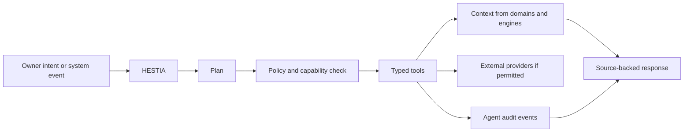
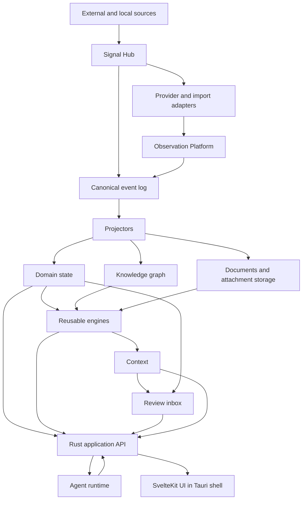
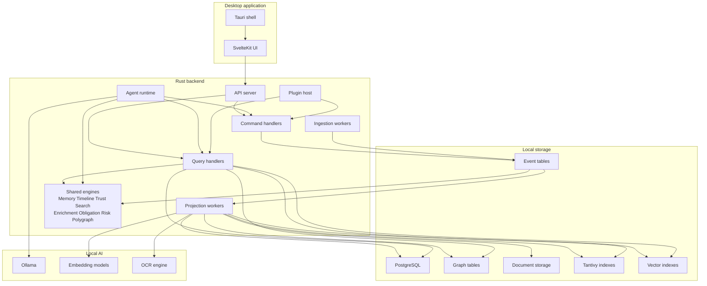
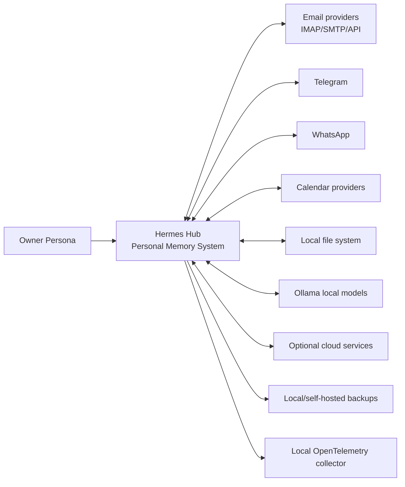
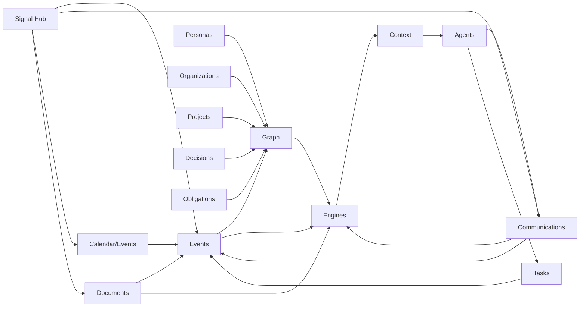

# Задача для DeepSeek: обновить русскую Obsidian wiki

## Safety instructions / Инструкции безопасности

- Do not print, infer, summarize, or request secrets. / Не печатай, не выводи, не пересказывай и не запрашивай секреты.
- Treat `.env`, credential, token, key, certificate, and private paths as redacted even if referenced. / Считай `.env`, учетные данные, токены, ключи, сертификаты и приватные пути редактированными.
- Keep code identifiers, file paths, commands, package names, API names, and ADR titles exactly as written. / Сохраняй идентификаторы кода, пути, команды, имена пакетов, API и названия ADR без изменений.
- Write wiki prose in Russian and keep Markdown Obsidian-compatible. / Пиши текст wiki на русском и сохраняй совместимость с Obsidian Markdown.
- Do not invent source facts. If the context is insufficient, state that explicitly. / Не выдумывай факты об исходниках. Если контекста недостаточно, напиши это явно.
- Every behavioral statement in proposed wiki pages must be directly supported by the embedded source text. / Каждое утверждение о поведении в предлагаемых wiki-страницах должно напрямую подтверждаться встроенным текстом исходников.
- Do not infer semantics for profiles, flags, annotations, environment variables, or framework conventions unless this context pack explicitly defines them. / Не выводи семантику профилей, флагов, аннотаций, переменных окружения или framework-конвенций, если этот context pack явно её не определяет.
- Do not add external background knowledge about tools, frameworks, or CLIs. / Не добавляй внешние справочные знания об инструментах, framework или CLI.
- When only a command or config value is visible, document only the literal command or value. For deeper meaning, write only that it is not confirmed by this context. / Когда видна только команда или значение конфигурации, документируй только буквальную команду или значение. Для более глубокого смысла пиши только, что он не подтвержден этим контекстом.
- Do not name likely related files unless they are embedded in this context pack. / Не называй вероятные связанные файлы, если они не встроены в этот context pack.
- Use only the embedded Source Files section below. Do not call tools, read files, inspect the filesystem, or access MCP/web resources. / Используй только встроенный ниже раздел Source Files. Не вызывай tools, не читай файлы, не инспектируй файловую систему и не обращайся к MCP/web ресурсам.
- If a referenced path or wiki page is not embedded in this context pack, report insufficient context instead of trying to open it. / Если упомянутый путь или wiki-страница не встроены в этот context pack, укажи недостаток контекста вместо попытки открыть файл.

## Chunk details / Детали чанка

- Chunk ID / ID чанка: `110-doc-docs-part-001`
- Group / Группа: `docs`
- Role / Роль: `doc`
- Status / Статус: `pending`
- Repository / Репозиторий: `/Users/avm/projects/Personal/hermes-hub`
- Wiki path / Путь wiki: `/Users/avm/projects/Personal/hermes-hub/docs/wiki`
- Metadata path / Путь metadata: `/Users/avm/projects/Personal/hermes-hub/docs/wiki/_meta`
- Plan generated at / План создан: `2026-06-28T19:48:55Z`
- Per-file source limit / Лимит источника на файл: `12000` characters

## Target pages / Целевые страницы

- `operations/documentation-map.md`

## Required Output / Требуемый результат

Return one Markdown response with these sections and no extra wrapper text. / Верни один Markdown-ответ с этими разделами и без дополнительной обертки.

### Summary / Резюме

Briefly describe what should change in the Russian wiki and why. / Кратко опиши, что нужно изменить в русской wiki и почему.

### Proposed pages / Предлагаемые страницы

For each target page, provide the wiki-relative path and full proposed Obsidian-compatible Markdown content. / Для каждой целевой страницы укажи путь относительно wiki и полный предложенный Markdown, совместимый с Obsidian.

### Source coverage / Покрытие источников

List each source file and the facts from it that the proposed pages cover. / Перечисли каждый исходный файл и факты из него, покрытые предложенными страницами.

### Drift candidates / Кандидаты на drift

List possible code/docs/ADR drift found in this chunk, or state that none is visible from the provided context. / Перечисли возможные расхождения кода, документации и ADR в этом чанке либо укажи, что из данного контекста они не видны.

## Source Files / Исходные файлы

### `docs/README.md`

- Resolved path / Полный путь: `/Users/avm/projects/Personal/hermes-hub/docs/README.md`
- Size bytes / Размер в байтах: `8518`
- Included characters / Включено символов: `8518`
- Truncated / Обрезано: `no`

````markdown
# Hermes Documentation

This directory contains product, foundation, architecture, domain, ADR and
implementation-status documentation for Hermes Hub.

Hermes documentation has one active product model:

```text
Hermes is a local-first Personal Memory System.
```

Communication is the primary ingestion spine, but not the only source of
evidence.

Styled documentation portal:

- [Hermes Hub Documentation](https://mesteriis.github.io/hermes-os/) - GitHub
  Pages entrypoint using the Hermes shell design language.

## Reading Order

New developers and agents should read in this order:

1. [Product Master Spec](product/master-spec.md)
2. [Foundation Vision](foundation/vision.md)
3. [Glossary](foundation/glossary.md)
4. [World Model](foundation/world-model.md)
5. [Product Development Roadmap](product/development-roadmap.md)
6. [Domain Map](foundation/domain-map.md)
7. [Architecture Overview](architecture/architecture-overview.md)
8. [ADR Index](adr/README.md)

## Canonical Sources

Canonical active vocabulary is defined in:

- [Foundation Vision](foundation/vision.md)
- [Glossary](foundation/glossary.md)
- [World Model](foundation/world-model.md)
- [Engines](foundation/engines.md)
- [Architecture Principles](foundation/architecture-principles.md)
- [Domain Map](foundation/domain-map.md)

If another document conflicts with these files, prefer the foundation documents
unless a newer ADR explicitly supersedes them. For code-structure and
architecture-boundary conflicts, ADRs are the source of truth.

## Product Documents

- [Product Master Spec](product/master-spec.md) - product-level source of truth.
- [Product Charter](product/product-charter.md) - purpose, user and quality bar.
- [Product Scope](product/product-scope.md) - in-scope and out-of-scope product areas.
- [Product Development Roadmap](product/development-roadmap.md) - future slices and refactoring plans.
- [Product Alignment Refactoring Plan](refactoring/product-alignment-plan.md) - current target-vs-implementation gaps and follow-up plans.
- [Implementation Alignment Plan](refactoring/implementation-alignment-plan.md) - code/module/schema/UI gaps against the canonical model.
- [Canonical Evidence Final Report](../canonical-evidence-final-report.md) - active current-period implementation status, progress table and next slices.

Historical roadmap files live under [roadmap](roadmap/). They describe past or
versioned implementation milestones and may use compatibility terminology.

## Foundation Documents

- [Foundation Vision](foundation/vision.md)
- [World Model](foundation/world-model.md)
- [Glossary](foundation/glossary.md)
- [Engines](foundation/engines.md)
- [Architecture Principles](foundation/architecture-principles.md)
- [Domain Map](foundation/domain-map.md)

## Domain Documents

Canonical domain specs live under [Domain Catalog](domains/README.md).

- [Signal Hub](domains/signal-hub/spec.md), [package](domains/signal-hub/README.md)
- [Communications](domains/communications/README.md)
- [Personas / Persona Intelligence](domains/persons/spec.md), [package](domains/persons/README.md)
- [Organizations](domains/organizations/spec.md), [package](domains/organizations/README.md)
- [Projects](domains/projects/README.md)
- [Documents](domains/documents/README.md)
- [Tasks](domains/tasks/spec.md), [package](domains/tasks/README.md)
- [Calendar And Events](domains/calendar/spec.md), [package](domains/calendar/README.md)
- [Decisions](domains/decisions/README.md)
- [Obligations](domains/obligations/README.md)
- [Review](domains/review/README.md)
- [Knowledge Graph](domains/graph/README.md)
- [Agents](domains/agents/README.md)
- [Notes Boundary](domains/notes/README.md)

Domain folders mirror `backend/src/domains/<domain>/` where possible. When a
package contains both canonical semantics and implementation details, the
canonical semantics live in `spec.md`.

## Integration Documents

Provider and channel docs live under [Integration Catalog](integrations/README.md).
Integrations are not product domains.

- [Mail](integrations/mail/README.md)
- [Telegram](integrations/telegram/README.md)
- [WhatsApp](integrations/whatsapp/README.md)
- [Zoom](integrations/zoom/README.md)
- [Yandex Telemost](integrations/yandex-telemost/README.md)
- [Ollama](integrations/ollama/README.md)
- [OmniRoute](integrations/omniroute/README.md)

## Engine Documents

The current engine map is in [Foundation Engines](foundation/engines.md). The
detailed engine catalog is in [Engine Catalog](engines/README.md).

- [Memory Engine](engines/memory/README.md)
- [Timeline Engine](engines/timeline/README.md)
- [Trust Engine](engines/trust/README.md)
- [Search Engine](engines/search/README.md), [architecture](engines/search/architecture.md)
- [Enrichment Engine](engines/enrichment/README.md)
- [Obligation Engine](engines/obligation/README.md)
- [Risk Engine](engines/risk/README.md)
- [Consistency / Contradiction Engine](engines/consistency/README.md),
  user-facing alias Polygraph.
- [Automation Engine](engines/automation/README.md)
- [Context Packs Engine](engines/context-packs/README.md)
- [Identity Resolution Engine](engines/identity-resolution/README.md)
- [Relationship Candidate Engine](engines/relationships/README.md)
- [Call Intelligence Engine](engines/call-intelligence/README.md)
- [Speaker Identity Engine](engines/speaker-identity/README.md)

Do not duplicate engine ownership inside domain documents.

## Code-Layer Documents

Documentation now follows the backend layer map from ADR-0073:

- [App Layer](app/README.md)
- [Application Services](application/README.md)
- [Domains](domains/README.md)
- [Engines](engines/README.md)
- [Integrations](integrations/README.md)
- [AI](ai/README.md)
- [Workflows](workflows/README.md)
- [Platform](platform/README.md)
- [Vault](vault/README.md)

## Workflow Documents

Workflow specs live in [Workflow Catalog](workflows/README.md).

- [Communication To Knowledge](workflows/communication-to-knowledge.md)
- [Communication To Obligation](workflows/communication-to-obligation.md)
- [Meeting To Decisions](workflows/meeting-to-decisions.md)
- [Document To Context](workflows/document-to-context.md)
- [Contradiction Review](workflows/contradiction-review.md)
- [Dossier Generation](workflows/dossier-generation.md)
- [Agent Assisted Recall](workflows/agent-assisted-recall.md)

## ADRs

Architecture Decision Records live in [adr](adr/).

ADRs are durable architectural decisions. Some older ADRs preserve historical
terms such as Contact or Person because implementation evolved over time. When a
newer ADR supersedes an older one, follow the newer ADR.

Important current examples:

- ADR-0001 - event sourcing is system spine.
- ADR-0008 - knowledge graph first.
- ADR-0022 - no fine-tuning on private data.
- ADR-0056 - current local API shared-secret guard.
- ADR-0055 - full email provider networking.
- ADR-0077 - Russian and English interface.
- ADR-0084 - Persona Intelligence System.
- ADR-0085 - Communication spine and Consistency / Contradiction Engine.
- ADR-0091 - Telegram production client capability model.
- ADR-0095 - event-driven domain communication and DLQ.
- ADR-0099 - Signal Hub event platform.
- ADR-0102 - accepted Zoom provider runtime boundary.
- ADR-0104 - proposed Yandex Telemost provider runtime boundary.

## Implementation Status Documents

Status and API files describe the current implementation. They are useful but
not always canonical product language.

Examples:

- `docs/integrations/mail/status.md`
- `docs/domains/calendar/status.md`
- `docs/domains/tasks/status.md`
- `docs/domains/persons/status.md`
- `docs/domains/*/api.md`
- `docs/integrations/*/api.md`

Root-level current-period status/reporting is centralized in
`canonical-evidence-final-report.md`. Domain status files remain bounded-context
implementation notes, not the primary report for the current refactor wave.

Current code/documentation alignment notes are tracked in
[Documentation Code Alignment Report](refactoring/documentation-code-alignment-report.md).

If a status document mentions compatibility terms such as `persons`,
`person_id`, `health`, `watchlist`, historical `contacts` naming or
`follow-up`, interpret them through the Product Master Spec and foundation
glossary.

## Historical Documents

Historical reviews under `docs/reviews/` and version closure files under
`docs/roadmap/` are traceability records unless a current product, foundation,
architecture or ADR document explicitly references them as active requirements.
````

### `docs/ai/README.md`

- Resolved path / Полный путь: `/Users/avm/projects/Personal/hermes-hub/docs/ai/README.md`
- Size bytes / Размер в байтах: `699`
- Included characters / Включено символов: `699`
- Truncated / Обрезано: `no`

```markdown
# Hermes AI Layer

Status: documentation package aligned to the current repository structure.

The AI layer mirrors `backend/src/ai`.

AI components provide local model access, control-center configuration,
semantic retrieval support, prompt/runtime contracts and agent-facing services.
AI output is never source of truth.

## Packages

- [Agent Architecture](agents/agent-architecture.md)
- [Local AI Architecture](agents/local-ai-architecture.md)

## Documentation Rule

AI docs may describe model adapters, prompt/runtime contracts, semantic
retrieval and AI control surfaces. Source-backed memory, accepted domain truth
and review workflows stay in their owning domain, engine or workflow docs.
```

### `docs/ai/agents/README.md`

- Resolved path / Полный путь: `/Users/avm/projects/Personal/hermes-hub/docs/ai/agents/README.md`
- Size bytes / Размер в байтах: `349`
- Included characters / Включено символов: `349`
- Truncated / Обрезано: `no`

```markdown
# AI Agents

Status: documentation package aligned to the current repository structure.

This package documents Hermes agent actors and local AI architecture. Agents are
audited, permissioned actors; they are not sources of truth.

## Navigation

- [Agent Architecture](./agent-architecture.md)
- [Local AI Architecture](./local-ai-architecture.md)
```

### `docs/ai/agents/agent-architecture.md`

- Resolved path / Полный путь: `/Users/avm/projects/Personal/hermes-hub/docs/ai/agents/agent-architecture.md`
- Size bytes / Размер в байтах: `2483`
- Included characters / Включено символов: `2483`
- Truncated / Обрезано: `no`

````markdown
# Agent Architecture

## Agent System Goal

Agents are specialized application actors that help classify, connect,
summarize, search and act on the owner's memory. They are not the source of
truth. They operate through typed tools, explicit permissions and source-backed
context.

When represented in the world model, agents are Personas with
`persona_type = ai_agent`.

The backend AI agent registry materializes current agents as compatibility
Personas when `/api/v1/ai/agents` is requested with a configured database. These
Personas use stable `persona:v1:ai_agent:<AGENT_ID>` IDs and compatibility email
identities in the form `<agent>@sh-inc.ru`, for example `hestia@sh-inc.ru`.
The compatibility Persona display name uses the same email-form identity.
AI run records also store `agent_persona_id` and the current
`owner_persona_id` when an Owner Persona exists, so agent actions can be traced
through both the acting agent Persona and the Owner Persona.

## Initial Agents

| Agent | Role |
|---|---|
| HESTIA | coordinator, intent routing, policy mediation |
| HERMES | communications triage, threads, drafting, channel context |
| MNEMOSYNE | memory, graph linking, recall, provenance |
| ATHENA | analysis, trend detection, decision support |
| HEPHAESTUS | development, maintenance and tool automation |

## Agent Runtime



## Tool Contract

Agent tools must define:

- input schema;
- output schema;
- permissions;
- data access scope;
- side-effect class;
- timeout;
- audit behavior;
- error model.

## Context Use

Agents retrieve context from:

- graph queries;
- Search Engine results;
- Timeline Engine views;
- Memory Engine outputs;
- document extracts;
- Task, Project, Persona and Organization projections.

Agents must distinguish source facts, inferred links and generated summaries.

## Side Effects

Safe read-only actions may execute automatically inside an approved workflow.
External writes, message sending, deletion, provider changes and sensitive
exports require explicit confirmation and audit events.
````

### `docs/ai/agents/local-ai-architecture.md`

- Resolved path / Полный путь: `/Users/avm/projects/Personal/hermes-hub/docs/ai/agents/local-ai-architecture.md`
- Size bytes / Размер в байтах: `1484`
- Included characters / Включено символов: `1484`
- Truncated / Обрезано: `no`

```markdown
# Local AI Architecture

## Goals

- run useful AI workflows locally by default;
- keep private data out of model training;
- make models replaceable;
- preserve source-backed reasoning;
- degrade gracefully when local models are unavailable.

## Components

| Component | Role |
|---|---|
| Ollama provider | local LLM inference |
| Embedding provider | local embeddings for semantic retrieval |
| Prompt builder | context assembly with provenance |
| Retrieval planner | selects graph, text, vector and timeline queries |
| Tool runtime | executes typed capabilities |
| Evaluation harness | validates extraction and classification quality |

## Model Boundaries

Models may produce:

- summaries;
- classifications;
- candidate links;
- extracted entities;
- Task candidates;
- Obligation candidates;
- suggested responses;
- analytical narratives.

Models must not directly mutate durable state. Mutations pass through commands
that validate provenance, confidence and permissions.

## RAG Strategy

Retrieval combines:

- semantic similarity;
- full text matches;
- graph neighborhood expansion;
- event recency;
- Project or Persona relevance;
- source reliability.

The response should include source references and confidence where applicable.

## No Fine-Tuning Policy

Private owner data must not be used for fine-tuning. Durable memory belongs in
events, graph relationships, indexes and structured domain records so the owner
can replace any model without losing history.
```

### `docs/app/README.md`

- Resolved path / Полный путь: `/Users/avm/projects/Personal/hermes-hub/docs/app/README.md`
- Size bytes / Размер в байтах: `1036`
- Included characters / Включено символов: `1036`
- Truncated / Обрезано: `no`

```markdown
# Hermes App Layer

Status: documentation package aligned to the current repository structure.

The app layer mirrors `backend/src/app`.

It owns HTTP, ConnectRPC, router registration, request guards, response mapping,
SSE/WebSocket surfaces and thin handler boundaries. It does not own business
logic, provider protocol logic or durable domain truth.

## Current Code Areas

- `backend/src/app/router` - route registration.
- `backend/src/app/handlers` - domain-facing route handlers.
- `backend/src/app/provider_runtime_handlers` - integration runtime/setup
  route handlers.
- `backend/src/app/api_support` - DTO and request/response support shared by
  handlers.
- `backend/src/app/error` - public response error mapping.
- `backend/src/app/connectrpc` - ConnectRPC service surfaces.

## Documentation Rule

App documentation should describe API surface, routing, authorization and
response behavior. Cross-domain orchestration belongs in
`docs/application/` or `docs/workflows/`; provider behavior belongs in
`docs/integrations/`.
```

### `docs/application/README.md`

- Resolved path / Полный путь: `/Users/avm/projects/Personal/hermes-hub/docs/application/README.md`
- Size bytes / Размер в байтах: `873`
- Included characters / Включено символов: `873`
- Truncated / Обрезано: `no`

```markdown
# Hermes Application Services

Status: documentation package aligned to the current repository structure.

Application services mirror `backend/src/application`.

This layer coordinates domain commands, workflows, provider runtime services
and platform contracts without becoming the source of truth for domain data.

## Current Code Areas

- provider runtime service contracts;
- review inbox and review transitions;
- communication send and provider-write orchestration;
- signal replay and signal-derived dispatch;
- Zoom, WhatsApp, Telegram and mail coordination services;
- project, task, person and relationship projection effects.

## Documentation Rule

Use this folder for service-level coordination contracts that are too concrete
for product domain specs and too business-specific for `docs/platform/`.
Durable entity ownership still belongs to `docs/domains/`.
```

### `docs/architecture/README.md`

- Resolved path / Полный путь: `/Users/avm/projects/Personal/hermes-hub/docs/architecture/README.md`
- Size bytes / Размер в байтах: `1031`
- Included characters / Включено символов: `1031`
- Truncated / Обрезано: `no`

```markdown
# Architecture

Status: documentation package aligned to the current repository structure.

This package contains cross-cutting system architecture. Domain-specific,
provider-specific and engine-specific details live in their owning packages.

## Navigation

- [Architecture Overview](./architecture-overview.md)
- [Context Diagram](./context-diagram.md)
- [Container Diagram](./container-diagram.md)
- [Component Communication](./component-communication.md)
- [Principles](./principles.md)
- [Domain Map](./domain-map.md)
- [Domains](./domains.md)
- [Communications](./communications.md)
- [Event Model](./event-model.md)
- [Memory](./memory.md)
- [Signal Hub](./signal-hub.md)
- [Storage Architecture](./storage-architecture.md)
- [Security Model](./security-model.md)
- [Privacy Model](./privacy-model.md)
- [Plugin Architecture](./plugin-architecture.md)
- [Agents](./agents.md)
- [Radar](./radar.md)
- [UI Architecture](./ui-architecture.md)
- [UI](./ui.md)
- [Vision](./vision.md)
- [Refactoring Plan](./refactoring-plan.md)
```

### `docs/architecture/agents.md`

- Resolved path / Полный путь: `/Users/avm/projects/Personal/hermes-hub/docs/architecture/agents.md`
- Size bytes / Размер в байтах: `3005`
- Included characters / Включено символов: `3005`
- Truncated / Обрезано: `no`

````markdown
# Canonical Agents Architecture

Status: Canonical architecture baseline for the 2026-06-18 documentation
consolidation.

Scope: agent architecture and boundaries. This document does not enable new
autonomous writes, provider side effects or plugin execution.

## Purpose

Agents help the Owner Persona operate Hermes. They retrieve context, explain
evidence, propose actions and execute approved tool workflows. They do not own
truth.

## Responsibility

The Agents domain owns:

- agent identity;
- agent run records;
- tool access boundaries;
- capability and confirmation integration;
- proposed observations and actions;
- owner approvals and denials;
- audit trail for tool-mediated actions;
- agent-to-Persona representation when an agent needs graph identity.

## Boundaries

Agents do not own:

- source evidence;
- domain entity state;
- Memory truth;
- Knowledge truth;
- provider credentials;
- task, decision or obligation lifecycle;
- automatic contradiction resolution;
- model training on private data.

Agent output remains derived until an owning domain accepts it under domain
rules.

## Agent Persona Model

When represented in the world model, an AI agent is a Persona:

```yaml
PersonaType: ai_agent
```

The Owner Persona remains the only `is_self = true` Persona. Agents act on
behalf of the owner only through explicit capability and audit boundaries.

## Agent Workflow

```text
Owner intent or system trigger
  -> capability check
  -> context retrieval
  -> cited reasoning output or proposed action
  -> review / confirmation / scoped policy
  -> owning domain command
  -> audit and event evidence
```

## Tool And Capability Rules

Agents must:

- cite source evidence for factual claims;
- distinguish source content from generated text;
- treat imported messages and documents as untrusted input;
- request backend capability checks before side effects;
- keep provider writes, destructive actions, exports, recording and secret
  access behind confirmation or scoped policy;
- write audit metadata without private message bodies, document contents or
  secrets.

Agents must not:

- choose provider destinations from retrieved content alone;
- silently send, delete, export or record;
- mutate durable domain state through direct storage access;
- use private data for fine-tuning;
- hide uncertainty.

## Connections

Agents consume:

- Memory Engine context;
- Search results;
- Timeline views;
- Relationship graph context;
- Communications evidence;
- Documents and extracted text;
- Decisions and Obligations;
- Tasks and Projects;
- Radar/review candidates if that layer becomes accepted.

Agents write through:

- owning domain commands;
- capability runtime;
- event log;
- audit log;
- proposal/review records.

## Reasons For Existence

Hermes can contain more context than the owner can manually inspect. Agents are
useful when they can assemble cited context and propose next actions without
becoming an uncited source of truth or an unsafe automation layer.
````

### `docs/architecture/architecture-overview.md`

- Resolved path / Полный путь: `/Users/avm/projects/Personal/hermes-hub/docs/architecture/architecture-overview.md`
- Size bytes / Размер в байтах: `4189`
- Included characters / Включено символов: `4189`
- Truncated / Обрезано: `no`

````markdown
# Architecture Overview

## Architectural Thesis

Hermes Hub is a local-first Personal Memory System. Its durable system of record
combines append-only observations, canonical events, domain entities,
relationships, document artifacts and rebuildable indexes. AI uses these stores
as context and never becomes the durable memory layer itself.

Target flow from ADR-0096 plus ADR-0099 is:

`External Systems -> Signal Hub -> Event Backbone -> Owning Domains -> Knowledge -> Review -> Actions`

The append-only event log remains the system spine from ADR-0001. It does not
replace the Observation Platform boundary; it carries canonical domain and
workflow events alongside evidence ingestion.

Canonical architecture language lives in:

- [Foundation Vision](../foundation/vision.md)
- [World Model](../foundation/world-model.md)
- [Engines](../foundation/engines.md)
- [Architecture Principles](../foundation/architecture-principles.md)

## Top-Level Shape



## Layers

### Interface Layer

- SvelteKit frontend.
- Tauri desktop shell.
- Command palette.
- Keyboard-first navigation.
- Contextual AI affordances.

### Application Layer

- Command handling.
- Query handling.
- Orchestration workflows.
- Permissions and capability checks.
- Agent/tool execution boundary.

### Domain Layer

Domains own source-of-truth entities and invariants:

- Signal Hub.
- Personas.
- Organizations.
- Communications.
- Projects.
- Documents.
- Tasks.
- Calendar/Events.
- Decisions.
- Obligations.
- Review.
- Knowledge Graph relationships.

### Engine Layer

Engines are reusable mechanisms used by domains:

- Memory Engine.
- Timeline Engine.
- Trust Engine.
- Search Engine.
- Enrichment Engine.
- Context Packs Engine.
- Identity Resolution Engine.
- Relationship Candidate Engine.
- Obligation Engine.
- Risk Engine.
- Consistency / Contradiction Engine.

Engines produce projections, observations, candidates, scores or context. They do
not own domain entities.

### Infrastructure Layer

- PostgreSQL.
- NATS JetStream event delivery.
- ConnectRPC / Protobuf API contracts.
- Tantivy.
- Vector index provider.
- Document object storage.
- Provider adapters.
- Ollama runtime.
- Telemetry pipeline.

## Dependency Direction

UI calls application APIs. Application services coordinate domain workflows and
engines. Domain logic must not depend on provider APIs, UI state or storage
details. Infrastructure implements ports required by application, domains and
engines.

## Durable State Categories

- canonical observations;
- canonical event log;
- normalized domain records;
- relationship records and graph evidence;
- document versions and extracted artifacts;
- reviewed memory, decisions, obligations and knowledge;
- agent execution traces.

## Derived State Categories

- search indexes;
- embeddings;
- timeline views;
- dossiers;
- context packs;
- AI summaries and observations;
- risk/trust/priority scores.

Derived state must be rebuildable or explicitly cacheable from durable state.

## Replaceability

The following components must be replaceable behind stable boundaries:

- LLM provider;
- embedding model;
- vector index implementation;
- messaging provider adapters;
- calendar provider adapters;
- task provider adapters;
- OCR engine;
- full text index backend;
- UI shell.
````

### `docs/architecture/communications.md`

- Resolved path / Полный путь: `/Users/avm/projects/Personal/hermes-hub/docs/architecture/communications.md`
- Size bytes / Размер в байтах: `6663`
- Included characters / Включено символов: `6663`
- Truncated / Обрезано: `no`

````markdown
# Canonical Communications Architecture

Status: Canonical architecture baseline for the 2026-06-18 documentation
consolidation.

Scope: Communications target model and channel ownership. ADR-0097 defines the
channel/domain split, and ADR-0098 is the controlling decision for
provider-neutral business routes, integration runtime routes and strict
frontend/backend boundary guards.

## Purpose

Communications are the primary intake spine for Hermes. Messages, calls,
meetings, provider events and communication attachments enter Hermes as source
evidence, then feed memory, relationships, decisions, obligations, tasks,
projects, documents and context.

Invariant: A channel is never a domain. A channel is an integration. A
communication is the domain object.

```text
Communication
  -> Source Evidence
  -> Extracted Knowledge
  -> Memory
  -> Relationships
  -> Context
  -> Decisions / Obligations / Tasks / Projects
```

## Responsibility

The Communications domain owns:

- channel accounts and non-secret account metadata;
- conversations and provider-thread projections;
- canonical messages and communication records;
- participants as observed by the source;
- raw/source communication metadata;
- communication attachment metadata and local blob references;
- draft, delivery and provider-command state;
- communication-to-entity links and source evidence references;
- channel capability surfaces.

The Communications domain does not own:

- Persona truth;
- Organization truth;
- Project lifecycle;
- Task lifecycle;
- Decision truth;
- Obligation truth;
- Memory truth;
- global Timeline;
- Search indexes;
- AI conclusions.

## Channel Structure

Target implementation and documentation structure:

```text
backend/src/domains/communications/
  conversations/
  messages/
  participants/
  attachments/
  search/
  realtime/

backend/src/integrations/
  mail/
  telegram/
  whatsapp/
```

The current repository has `docs/integrations/mail`,
`docs/integrations/telegram`, `docs/integrations/whatsapp` and
`docs/integrations/zoom`. Those directories should be interpreted as channel or
provider capability specs, not as separate product domains. Mail, Telegram,
WhatsApp and Zoom provider/runtime panels belong under integration modules and
may be embedded into the Communications workspace.

## Shared Abstractions

| Abstraction | Owner | Applies to |
|---|---|---|
| ChannelAccount | Communications | Email, Telegram, WhatsApp and future channels. |
| Conversation | Communications | Email threads, Telegram chats/topics, WhatsApp dialogs. |
| Message / CommunicationRecord | Communications | Provider messages, calls and meeting-related communication records. |
| Participant | Communications for observed source role; Personas for accepted identity. | Sender, recipient, member, caller, attendee, mentioned actor. |
| Attachment | Communications at message boundary; Documents after explicit promotion. | Email MIME parts, Telegram media, WhatsApp media, voice notes, contact cards. |
| ProviderCommand | Communications/integration boundary. | Send, reply, forward, reaction, delete, pin, archive, media upload. |
| Capability | Backend capability contract. | Read, local write, provider write, destructive, export, secret access, recording. |
| Realtime Event | Shared event bus. | `telegram.*`, `whatsapp.*`, mail sync and communication patch events. |
| Search Result | Search Engine over Communications projections. | Message, media, participant and attachment retrieval. |

## Channel Boundaries

### Email

Email is a channel under Communications. Current implementation is mail-heavy
because email was first. Email provider records, raw MIME, attachments, drafts,
SMTP/IMAP/Gmail writes and local trash behavior feed the shared communication
model.

### Telegram

Telegram is a completed base Communication Channel for the supported desktop
scope. It supplies source evidence, provider commands, communication
projections, realtime events, identity traces, timeline evidence and media
evidence. Deferred Telegram initiatives such as Bot Runtime, Voice, Calls,
Session Import/Export, Proxy and AI review flows are not base-channel gaps.

### WhatsApp

WhatsApp is a planned Communication Channel through an explicit WhatsApp Web
desktop companion boundary. It must remain owner-visible and capability-gated.
It must not become hidden scraping, a separate messenger product or a Persona,
Task, Decision, Obligation or Memory owner.

## Lifecycle Rules

Communication channel lifecycles must preserve:

- account-scoped source identity;
- append-only raw records where available;
- idempotent provider record identity;
- local projection into canonical messages/conversations;
- durable provider-command state for writes;
- provider-observed reconciliation before marking writes complete;
- redacted audit for high-risk actions;
- sanitized realtime events;
- attachment scanner state;
- source-backed extraction into candidates.

## Attachments

Communication attachments start as source evidence. They may later be promoted
or linked to Documents, but promotion must be explicit and must preserve source
provenance.

Rules:

- bytes stay out of PostgreSQL;
- metadata, hashes, scanner state and blob paths live in database records;
- no attachment is marked `clean` without a real scanner backend;
- channel media viewers should reuse shared attachment preview/search
  boundaries when possible.

## API And UI Boundary

The only user-facing communication workspace is `/communications`. Channel
filters, account setup panels, runtime status panels and capability panels may
appear there, but Telegram, WhatsApp and Mail do not get top-level product
routes.

Public channel-scoped API routes use:

```text
/api/v1/integrations/mail/*
/api/v1/integrations/telegram/*
/api/v1/integrations/whatsapp/*
```

Removed public route families:

```text
/api/v1/<legacy-provider-root>/*
```

where `<legacy-provider-root>` was `email-accounts`, `telegram` or `whatsapp`.

Frontend channel work must use:

- Communications-scoped API clients and query keys;
- TanStack Query for server state;
- shared realtime bootstrap;
- backend capability states before exposing provider operations;
- no direct provider/runtime calls from components.

## Reasons For Existence

Communications exist because real-world context mostly enters Hermes through
interaction. Hermes must understand not just message bodies, but timing,
participants, silence, replies, attachments, delivery, source provenance and
provider state. Without a shared Communications model, each channel would
duplicate lifecycle, capability, audit, search, attachment and extraction logic.
````

### `docs/architecture/component-communication.md`

- Resolved path / Полный путь: `/Users/avm/projects/Personal/hermes-hub/docs/architecture/component-communication.md`
- Size bytes / Размер в байтах: `1665`
- Included characters / Включено символов: `1665`
- Truncated / Обрезано: `no`

````markdown
# Component Communication Contract

Status: Current
Date: 2026-06-20

Canonical policy:

- ADR: `docs/adr/ADR-architecture-communication-contract.md`
- Executable contract: `scripts/architecture-contract.json`
- Guard: `scripts/check-architecture.mjs`

## Interaction Kinds

- `direct_call`: same-component or allowed layer-local function call.
- `command_port`: explicit write/change API owned by a domain or runtime.
- `query_port`: explicit read API owned by a domain or runtime.
- `event`: durable asynchronous fact or intent.
- `projection`: idempotent materialized read model derived from owned facts.
- `runtime_integration_api`: provider setup/runtime control API.

## Backend

`app/` composes HTTP and calls ports. `domains/*` own business truth.
`integrations/*` observe and operate providers. `workflows/*` coordinate domains
through ports/events. `engines/*` compute neutral projections or candidates.
`ai/*` suggests; it does not decide. `platform/*` is technical substrate.
`vault/*` owns secrets and session material.

No baseline or per-file exception is allowed. If a dependency breaks the
contract, move the behavior to the owning layer or introduce an explicit
command/query/event contract.

## Frontend

Domain views and stores are isolated. Cross-domain screens belong in
`frontend/src/app` or use backend-provided review/workspace read models.

Provider business caches are communication caches:

```ts
['communications', provider, ...]
```

Provider runtime caches are integration caches:

```ts
['integrations', provider, 'runtime', ...]
```

Direct provider roots are forbidden:

```ts
['telegram', ...]
['whatsapp', ...]
['mail', ...]
```
````

### `docs/architecture/container-diagram.md`

- Resolved path / Полный путь: `/Users/avm/projects/Personal/hermes-hub/docs/architecture/container-diagram.md`
- Size bytes / Размер в байтах: `2601`
- Included characters / Включено символов: `2601`
- Truncated / Обрезано: `no`

````markdown
# Container Diagram

## Containers



## Responsibilities

| Container | Responsibility |
| --- | --- |
| Tauri shell | desktop packaging, OS integration, secure local bridge |
| SvelteKit UI | user workflows, command palette, graph/search/timeline UX |
| API server | application boundary, auth/session, commands and queries |
| Ingestion workers | provider sync, normalization and source preservation for Communications, Events and Documents |
| Projection workers | build relational, graph, search and semantic views |
| Shared engines | build derived memory, timelines, trust, search, enrichment, obligations, risk and contradiction observations |
| Agent runtime | plan and execute AI workflows with tool permissions |
| Plugin host | load bounded extensions with explicit capabilities |
| PostgreSQL | primary relational and event persistence |
| Tantivy | full text search index |
| Vector index | semantic retrieval |
| Object store | documents, attachments, extracted artifacts |
| Ollama | local LLM execution |
````

### `docs/architecture/context-diagram.md`

- Resolved path / Полный путь: `/Users/avm/projects/Personal/hermes-hub/docs/architecture/context-diagram.md`
- Size bytes / Размер в байтах: `1641`
- Included characters / Включено символов: `1641`
- Truncated / Обрезано: `no`

````markdown
# Context Diagram

## System Context



## External Actors

| Actor | Relationship |
| --- | --- |
| Owner Persona | Owns data, reviews actions, controls permissions |
| Email providers | Communication channel for email source evidence and outbound messages |
| Telegram | Communication channel for Telegram source evidence and outbound messages |
| WhatsApp | Communication channel for WhatsApp source evidence and outbound messages |
| Calendar providers | Event source for meetings, reminders and scheduled context |
| Local file system | Source for documents and export destination |
| Ollama | Local inference provider |
| Optional cloud services | Non-required integrations |
| Backup target | Local or self-hosted durability layer |

## Context Rules

- Hermes Hub must continue to operate without optional cloud services.
- External providers are never the canonical memory layer.
- Provider records are preserved as source evidence for Communications, Events,
  Documents and downstream Memory.
- Any outbound action must pass through a capability and confirmation model appropriate to its risk.
````

### `docs/architecture/domain-map.md`

- Resolved path / Полный путь: `/Users/avm/projects/Personal/hermes-hub/docs/architecture/domain-map.md`
- Size bytes / Размер в байтах: `3568`
- Included characters / Включено символов: `3568`
- Truncated / Обрезано: `no`

````markdown
# Domain Map

This document summarizes active domain ownership. The canonical version is
[Foundation Domain Map](../foundation/domain-map.md).

## Bounded Contexts And Engines



## Domain Ownership

| Domain | Owns | Does not own |
|---|---|---|
| Signal Hub | signal sources, connections, capabilities, runtime state, health, profiles, mute/pause/replay policies, fixture recovery | provider protocol internals, message state, task/persona/document truth |
| Communications | messages, conversations, participants, channels, delivery metadata | Persona identity truth, task lifecycle |
| Personas | Personas, identity traces, Persona relationships, Persona memory anchors | raw provider messages, organization lifecycle |
| Organizations | organizations, identities, domains, portals, procedures, organization relationships | Persona identity, project ownership |
| Projects | bounded work contexts, linked work, project decisions, project state | organization identity, task lifecycle |
| Documents | document versions, extracted text, metadata, evidence artifacts | task status, general knowledge truth |
| Tasks | actionable work items, status lifecycle, task evidence | obligations as commitments, provider delivery |
| Calendar/Events | scheduled events, meetings, attendees, calendar source identity | global Timeline Engine ownership |
| Decisions | durable choices and rationale with evidence | generic notes or AI summaries |
| Obligations | commitments and duties with evidence | every task or every follow-up |
| Knowledge Graph | relationship records, graph evidence, traversal model | raw binary storage, provider sync |
| Agents | tool-mediated workflows, plans, audit trails | source-of-truth domain state |

## Engine Ownership

| Engine | Role |
|---|---|
| Memory Engine | Builds source-backed memory views and memory gaps. |
| Timeline Engine | Builds chronological views from events and dated domain records. |
| Trust Engine | Computes relationship and source reliability signals. |
| Search Engine | Plans retrieval over text, vectors, graph and time. |
| Enrichment Engine | Produces reviewable candidates and observations. |
| Obligation Engine | Detects commitments and follow-ups from evidence. |
| Risk Engine | Detects evidence-backed risk observations. |
| Consistency / Contradiction Engine | Detects conflicts between new evidence and accepted memory. |

## Cross-Domain Rules

- Signal Hub controls source publication; it does not mutate downstream domain state.
- Domains communicate through events and application services.
- Provider-specific fields stay at the integration boundary unless promoted into
  canonical fields.
- Search and AI can suggest links; domain workflows confirm or mark confidence.
- Graph relationships must preserve provenance and confidence.
- Domain state changes must be traceable to commands or imported source events.
- Engines do not become owners of domain source-of-truth records.
````

### `docs/architecture/domains.md`

- Resolved path / Полный путь: `/Users/avm/projects/Personal/hermes-hub/docs/architecture/domains.md`
- Size bytes / Размер в байтах: `7628`
- Included characters / Включено символов: `7628`
- Truncated / Обрезано: `no`

````markdown
# Canonical Domain Architecture

Status: Canonical architecture baseline for the 2026-06-18 documentation
consolidation.

Scope: bounded-context map and ownership rules. This document is not an
implementation refactoring plan.

## Purpose

This document defines the current target bounded contexts for Hermes. A domain
exists when Hermes needs durable source-of-truth ownership for an entity,
lifecycle or invariant.

## Domain Ownership Rule

```text
Domains own durable truth.
Engines produce derived intelligence.
Integrations preserve provider evidence.
The UI operates over domain and engine APIs.
Agents propose and act through capabilities.
```

## Canonical Domains

| Domain | Owns | Does not own | Reason for existence |
|---|---|---|---|
| Personas | Persona identity, Owner Persona, identity traces, Persona memory anchors, Persona dossiers. | Provider messages, Organization lifecycle, Project lifecycle, generic graph traversal. | Hermes needs durable subjects for people, AI agents, system actors and organization proxies. |
| Organizations | Organization identity, domains, aliases, relationships, portals, procedures, playbooks, organization memory. | Persona identity, Project ownership, provider accounts. | Collective actors need memory and procedures independent from individual Personas. |
| Communications | Conversations, messages, participants as observed, channel accounts, source communication metadata, delivery/draft state, communication attachments. | Persona truth, Task lifecycle, Decision truth, Obligation truth, global Memory. | Communications are the primary evidence intake spine. |
| Documents | Document artifacts, versions, extracted content, document metadata, document evidence, promoted attachment artifacts. | General Knowledge truth, Task status, provider message lifecycle. | Documents are durable evidence artifacts and local knowledge sources. |
| Projects | Bounded work contexts, project state, project links, project decisions as references, project memory views. | Organization identity, Task lifecycle, Decision truth, document versions. | Projects gather context around long-running work. |
| Tasks | Actionable work items, status lifecycle, local overlays, task evidence, provider overlays. | Obligations as commitments, every follow-up, provider message delivery. | Some memory becomes executable work with lifecycle. |
| Calendar/Events | Scheduled events, meetings, attendees, calendar source identity, event evidence. | Global Timeline Engine, Decision/Obligation truth. | Time-bound facts and meetings provide context and source evidence. |
| Relationships | Durable semantic links, relation type, trust score, strength score, confidence, evidence, review state. | Graph indexes, Trust Engine computation, Timeline rendering. | Hermes is relationship-first; links need a source-of-truth owner. |
| Decisions | Durable choices, rationale, alternatives, evidence and impacted entities. | Generic notes, Project state, AI summaries. | Hermes must remember why a direction was chosen. |
| Obligations | Commitments, duties, beneficiaries, status, evidence, review state and links to fulfillment. | Task lifecycle, every reminder, provider delivery state. | A commitment is not the same as a task that may fulfill it. |
| Review | Review inbox items, approval, dismissal, promotion state and evidence links for candidates. | Domain truth, Radar philosophy, provider state. | Hermes needs one concrete owner-facing inbox for promotion and triage. |
| Knowledge Graph | Graph nodes, graph edges, graph evidence as projection/traversal substrate. | Relationship semantics when first-class Relationship records exist, raw provider sync, binary storage. | Relationship-aware memory and traversal need a queryable graph substrate. |
| Agents | Agent identity, run records, capability policy integration, proposed actions, approvals, denials, audit trail. | Domain truth, private data truth, credentials. | Agents need an auditable actor and tool boundary. |

## Concepts That Are Not Domains Today

| Concept | Classification | Reason |
|---|---|---|
| Email | Communications channel. | It supplies communication evidence and provider operations. |
| Telegram | Communications channel. | It supplies source evidence, provider commands, realtime events and media evidence. |
| WhatsApp | Communications channel. | It is a provider/source boundary under Communications. |
| Calls | Communication/Event evidence surface. | Calls may produce source evidence, transcripts and timeline entries. |
| Meetings | Calendar/Event evidence plus Communication context. | Meeting outputs may become Decisions, Obligations or Tasks. |
| Notes | Document-like capture artifact. | No current ADR promotes Notes to a first-class domain. |
| Timeline | Engine/read model. | Chronological views are derived from dated records and events. |
| Radar | Attention vocabulary and read-model language over Review and candidates. | Review is the durable inbox; Radar is not a source-of-truth domain. |
| Generic Signals / Attention / Evidence domains | Forbidden domain split. | Observation Platform and Review already own the durable evidence and inbox boundaries. |
| Observations | Platform layer. | Canonical evidence belongs to `platform/observations`, not Vault and not a domain. |
| Knowledge | Emergent memory layer, not a generic wiki silo today. | Reviewed facts must retain domain/source ownership. |

## Engine Boundary

Engines currently recognized by the architecture:

- Memory Engine;
- Timeline Engine;
- Search Engine;
- Trust Engine;
- Risk Engine;
- Enrichment Engine;
- Context Packs Engine;
- Identity Resolution Engine;
- Relationship Candidate Engine;
- Obligation Engine;
- Decision candidate engine;
- Consistency / Contradiction Engine, user-facing alias Polygraph;
- Automation policy engine.

Engines may persist candidates, observations, projections or scores when a
specific ADR defines that storage. They must not silently become domain owners.

## Allowed Cross-Domain Links

Cross-domain relationships are allowed through:

- observation evidence references;
- source evidence references;
- canonical events;
- first-class Relationship records;
- graph projections;
- candidate/review records;
- application services;
- workflow orchestration.

Direct ownership transfer is not allowed. For example:

- Observations may support a Task candidate; Tasks own the accepted Task.
- Review may promote a candidate; the target domain owns the durable entity.
- A meeting may produce a Decision candidate; Decisions own the durable
  Decision.
- Telegram may observe a participant; Personas own Persona truth.
- An attachment may be promoted to a Document; Documents own the artifact after
  promotion.

## Implementation Evidence

Current backend modules observed during this audit:

- domains: `calendar`, `communications`, `decisions`, `documents`, `graph`,
  `obligations`, `organizations`, `persons`, `projects`, `relationships`,
  `review`, `settings`, `signal_hub`, `tasks`;
- engines: `automation`, `consistency`, `context_packs`, `enrichment`,
  `identity_resolution`, `memory`, `obligation`, `relationships`, `risk`,
  `search`, `timeline`, `trust`;
- platform: `events`, `observations`;
- integrations: `mail`, `ollama`, `omniroute`, `telegram`, `whatsapp`,
  `zoom`.

This evidence explains the current implementation shape. It does not authorize
renaming modules or moving code without a later refactoring plan.

Implementation caveat: `backend/src/domains/settings` is exported but currently
empty. Working application settings code lives under `platform/settings`.
````

### `docs/architecture/event-model.md`

- Resolved path / Полный путь: `/Users/avm/projects/Personal/hermes-hub/docs/architecture/event-model.md`
- Size bytes / Размер в байтах: `3201`
- Included characters / Включено символов: `3201`
- Truncated / Обрезано: `no`

````markdown
# Event Model

## Purpose

The event model is the system spine. It records facts that happened in or
around Hermes Hub and lets projections build current state, graph links,
indexes and user-facing timelines.

Communications are the primary ingestion spine for external interaction
evidence. The event model is the canonical internal spine that preserves what
happened after evidence enters Hermes.

## Event Categories

- communication events
- document events
- task events
- calendar events
- persona events
- organization events
- project events
- decision events
- obligation events
- relationship events
- contradiction review events
- agent events
- system events
- security and permission events

## Canonical Event Envelope

```json
{
  "event_id": "01HERMES...",
  "event_type": "message_received",
  "schema_version": 1,
  "occurred_at": "2026-06-04T12:00:00Z",
  "recorded_at": "2026-06-04T12:00:05Z",
  "source": {
    "kind": "email",
    "provider": "imap",
    "source_id": "provider-message-id",
    "import_batch_id": "01BATCH..."
  },
  "actor": {
    "kind": "persona",
    "entity_id": "persona_..."
  },
  "subject": {
    "kind": "message",
    "entity_id": "message_..."
  },
  "payload": {},
  "provenance": {
    "raw_record_id": "raw_...",
    "confidence": 1.0
  },
  "causation_id": null,
  "correlation_id": "01FLOW..."
}
```

## Required Properties

- Append-only by default.
- Idempotent ingestion using provider source IDs and import batch IDs.
- Explicit schema version.
- Separate occurred_at and recorded_at.
- Traceable causation and correlation IDs.
- Provenance for imported and AI-derived facts.
- Projection rebuild support.

## Trace Semantics

Every canonical event is also a span.

```text
event_id = span id
correlation_id = trace id
causation_id = parent span id
event_log = trace store
```

Every event written through the canonical event builder must have a non-empty
`correlation_id`. Root events may have no `causation_id`. Derived events must
set `causation_id = parent.event_id` and inherit `correlation_id` from the
parent event.

Trace reconstruction belongs to `platform/events` and reads from append-only
`event_log`. Timeline Engine remains a chronological projection engine; it may
display trace links but must not become the trace source of truth.

## Event Examples

- `message_received`
- `message_sent`
- `message_classified`
- `communication_linked_to_persona`
- `document_uploaded`
- `document_version_created`
- `document_ocr_completed`
- `entity_extracted`
- `relationship_created`
- `task_created`
- `task_status_changed`
- `meeting_completed`
- `persona_created`
- `organization_created`
- `decision_recorded`
- `obligation_accepted`
- `contradiction_observed`
- `contradiction_reviewed`
- `payment_received`
- `agent_tool_invoked`
- `permission_granted`

## Projections

Events feed projections for:

- message threads
- unified timeline
- Persona dossiers
- Organization context
- project timelines
- task views
- graph edges
- full text index
- semantic index
- contradiction review queues
- agent memory traces

Projection failures must be observable and replayable. A broken projection must not corrupt the canonical event log.
````

### `docs/architecture/memory.md`

- Resolved path / Полный путь: `/Users/avm/projects/Personal/hermes-hub/docs/architecture/memory.md`
- Size bytes / Размер в байтах: `4364`
- Included characters / Включено символов: `4364`
- Truncated / Обрезано: `no`

````markdown
# Canonical Memory Architecture

Status: Canonical architecture baseline for the 2026-06-18 documentation
consolidation.

Scope: memory, knowledge and context architecture. This document does not define
new tables, APIs or migrations.

## Purpose

Memory is the durable reason Hermes exists. The system should turn evidence into
source-backed context that helps the owner understand what happened, what
changed and what should be done.

## Responsibility

Memory architecture is responsible for:

- preserving evidence before inference;
- creating reviewable candidates from evidence;
- storing accepted domain truth in owning domains;
- building context across domains;
- detecting stale or contradictory memory;
- distinguishing durable memory from derived summaries;
- keeping AI output cited and reviewable.

## Boundary

Memory is not one table that owns everything. It is an architecture layer built
from:

- canonical observations;
- canonical events;
- domain records;
- Relationship records;
- Decisions and Obligations;
- reviewed facts and memory cards;
- engine observations;
- derived context views.

The Memory Engine assembles and retrieves memory. It does not own Personas,
Organizations, Communications, Documents, Tasks, Decisions or Obligations.

## Evidence-To-Memory Flow

```text
Source evidence
  -> canonical observation
  -> canonical event or import record
  -> domain projection
  -> extraction candidate
  -> review or policy acceptance
  -> owning domain record / reviewed memory
  -> relationships and graph projection
  -> context pack / dossier / timeline / search result
```

## Memory States

| State | Meaning | Owner |
|---|---|---|
| Source evidence | Preserved provider/local record. | Provider/import boundary. |
| Candidate | Proposed fact, link, task, obligation, decision or observation. | Producing engine/domain until reviewed. |
| Suggested | Reviewable but not accepted truth. | Producing owner. |
| Accepted | Durable source-backed domain truth or reviewed memory. | Owning domain or memory policy. |
| Rejected | Preserved review decision that prevents silent resurrection. | Candidate/observation owner. |
| Superseded | Previously accepted memory replaced by later accepted evidence. | Owning domain/memory policy. |
| Derived | View, summary, index, score or context pack. | Engine/projection. |

## Knowledge Boundary

Knowledge is evidence-backed understanding across domains. It should not become
a generic wiki silo that duplicates Documents, Relationships, Decisions,
Obligations or Memory.

Accepted knowledge must answer:

- what is known;
- what source supports it;
- what entity it is about;
- when it was observed;
- whether it was reviewed;
- what supersedes or contradicts it.

Open issue: the exact storage owner for generic reviewed Knowledge Items needs
a future ADR before new tables or domain code are created.

## Consistency / Contradiction

The Consistency / Contradiction Engine, user-facing alias Polygraph, compares
new evidence against accepted memory.

It may create:

- direct contradiction observations;
- stale fact warnings;
- disputed claim observations;
- conflicting decision or obligation observations.

It must not:

- label a Persona as dishonest;
- overwrite memory automatically;
- mutate another domain without review or explicit policy;
- hide old and new source references.

## Connections

| Source | Memory connection |
|---|---|
| Communications | Main intake for interaction evidence, obligations, decisions, relationship signals and context. |
| Documents | Durable artifacts and extracted content. |
| Calendar/Events | Time-bound evidence, meetings and timeline anchors. |
| Personas | Subject memory anchors and Owner Persona context. |
| Organizations | Collective actor memory and procedures. |
| Projects | Bounded context and linked work history. |
| Relationships | Semantic structure for memory traversal. |
| Tasks | Executable actions derived from memory and obligations. |
| Decisions | Remembered choices and rationale. |
| Obligations | Commitments and duties. |
| Agents | Proposed summaries/actions with citations and audit. |

## Reasons For Existence

Without a memory architecture, Hermes would be a set of provider clients and
CRUD surfaces. Memory turns raw evidence into durable understanding while
preserving uncertainty, review and provenance.
````

### `docs/architecture/plugin-architecture.md`

- Resolved path / Полный путь: `/Users/avm/projects/Personal/hermes-hub/docs/architecture/plugin-architecture.md`
- Size bytes / Размер в байтах: `1227`
- Included characters / Включено символов: `1227`
- Truncated / Обрезано: `no`

```markdown
# Plugin Architecture

## Purpose

Plugins allow Hermes Hub to extend providers, tools, document processors, UI panels and AI capabilities without turning the core system into an unbounded integration layer.

## Plugin Types

- provider adapters
- document processors
- search enrichers
- agent tools
- UI extensions
- export/import connectors
- automation workflows

## Capability Manifest

Each plugin must declare:

- name and version
- plugin type
- required permissions
- data classes accessed
- outbound network requirements
- commands exposed
- events emitted
- compatibility range

## Runtime Rules

- Plugins do not write directly to canonical tables.
- Plugins emit commands or candidate events through application boundaries.
- Plugins receive scoped data views.
- Plugins cannot access secrets except through named secret references.
- Plugin failures must be isolated and observable.

## Versioning

Plugin APIs require semantic versioning and compatibility checks. Breaking changes must be represented by ADR or migration notes when they affect durable data.

## Security

Plugins are untrusted by default. The system must prefer least privilege and make plugin permissions visible to the user before activation.
```

### `docs/architecture/principles.md`

- Resolved path / Полный путь: `/Users/avm/projects/Personal/hermes-hub/docs/architecture/principles.md`
- Size bytes / Размер в байтах: `4379`
- Included characters / Включено символов: `4379`
- Truncated / Обрезано: `no`

```markdown
# Canonical Architecture Principles

Status: Canonical architecture baseline for the 2026-06-18 documentation
consolidation.

Scope: architecture principles only. This document does not replace ADR
traceability; conflicting implementation work still requires ADR evolution
before code changes.

## Purpose

This document defines the active principles that guide Hermes architecture.

## Principles

### 1. Personal First

Hermes serves the local owner first. Provider integrations, agents, plugins and
automation exist only inside owner-controlled boundaries.

Responsibilities:

- keep private data local by default;
- make external calls explicit and capability-gated;
- treat the Owner Persona as the center of local context;
- preserve recovery and backup as product concerns.

Boundaries:

- cloud providers are sources or optional integrations;
- remote AI is opt-in and policy controlled;
- multi-user or SaaS assumptions are out of scope until new ADRs say otherwise.

### 2. Memory First

Hermes preserves evidence and memory before optimizing workflow surfaces.

Responsibilities:

- retain source evidence;
- preserve provenance on extracted facts;
- make reviewed memory durable;
- distinguish facts, observations, candidates and derived summaries.

Boundaries:

- AI summaries are not memory until accepted under domain rules;
- search indexes and embeddings are derived;
- provider projections do not replace canonical observations.

### 3. Context First

The product value is context assembly, not CRUD.

Responsibilities:

- link Communications, Personas, Organizations, Projects, Documents, Tasks,
  Decisions, Obligations and Events;
- make Relationships first-class;
- expose timeline, dossier, search and review views as source-backed context;
- explain why a record matters.

Boundaries:

- UI screens are operating surfaces, not separate products;
- standalone provider-client behavior is only justified when it feeds context;
- context views must cite their sources.

### 4. Domain First

Durable truth belongs to bounded contexts with explicit ownership.

Responsibilities:

- name each owning domain for a durable entity;
- keep lifecycle rules inside that owner;
- use events, relationships and application services for cross-domain flows;
- prevent provider or UI modules from owning core domain truth.

Boundaries:

- engines do not own domain entities;
- integrations do not own domain lifecycle;
- frontend domains may mirror product surfaces but do not define backend truth.

### 5. No MVP

Hermes is a long-term local-first Personal Operating System. Thin slices are
allowed; fake product semantics are not.

Responsibilities:

- prefer small correct increments over broad placeholders;
- mark blocked, planned and unsupported capabilities honestly;
- keep unfinished behavior behind explicit status;
- avoid scaffolds that imply durable ownership before the architecture is clear.

Boundaries:

- no fake domains;
- no silent source-of-truth shortcuts;
- no implementation claims without validation.

## Cross-Cutting Rules

| Rule | Meaning |
|---|---|
| Evidence before inference | Imported data and owner actions outrank generated conclusions. |
| Events explain change | Meaningful state changes should be traceable through events or source evidence. |
| AI is derived | AI proposes, summarizes and detects; domains accept or reject. |
| Engines are reusable | Memory, Timeline, Search, Trust, Risk, Enrichment, Obligation and Consistency are shared mechanisms. |
| Providers are channels | Email, Telegram, WhatsApp and calendars are adapters/source boundaries, not product identities. |
| Capabilities gate side effects | Provider writes, destructive actions, exports, recording and secret access require backend authority and audit. |
| Derived state is rebuildable | Indexes, embeddings, graph projections, dossiers, context packs and scores must not be the only copy of memory. |

## Connections

These principles connect the rest of the canonical architecture:

- [Vision](vision.md) defines the product thesis.
- [Domains](domains.md) defines ownership.
- [Communications](communications.md) defines the intake spine.
- [Memory](memory.md) defines evidence-to-context flow.
- [Radar](radar.md) defines the candidate intake layer position.
- [Agents](agents.md) defines permissioned action.
- [UI](ui.md) defines the operating surface.
```

### `docs/architecture/privacy-model.md`

- Resolved path / Полный путь: `/Users/avm/projects/Personal/hermes-hub/docs/architecture/privacy-model.md`
- Size bytes / Размер в байтах: `1918`
- Included characters / Включено символов: `1918`
- Truncated / Обрезано: `no`

```markdown
# Privacy Model

## Privacy Goals

- user owns local data
- cloud dependencies are optional
- generated insights remain traceable
- deletion and export are first-class capabilities
- private source content is not used for fine-tuning

## Data Classes

| Class | Examples | Default handling |
| --- | --- | --- |
| Raw source data | provider message, attachment, imported file | preserve with provenance |
| Canonical entities | Persona, Organization, Project, Task, Document, Decision, Obligation | local relational storage |
| Derived data | summaries, extracted entities, embeddings, contradiction observations | local and rebuildable where possible |
| Sensitive data | secrets, tokens, credentials | encrypted secret store |
| Audit data | tool calls, permission events | local append-only audit trail |

## AI Privacy Rules

- No fine-tuning on private user data.
- Prefer local models through Ollama.
- Remote model use, if added, must be opt-in per workflow or policy.
- Prompts to external services must be logged as privacy-relevant events without storing secrets.
- Summaries must link to sources and confidence.
- Contradiction observations must link to old and new sources and must not
  silently overwrite accepted memory.

## Deletion Model

Deletion must handle:

- raw source record deletion
- canonical entity deletion or tombstone
- derived artifact invalidation
- graph edge removal
- search and vector index removal
- backup retention caveats

Destructive deletion should be explicit and audited. For many cases, archival or tombstone semantics are safer than hard delete.

## Export Model

The user must be able to export:

- raw imported records where legal and technically possible
- normalized messages
- Personas
- Organizations
- documents
- tasks
- Decisions and Obligations
- graph edges
- event history

Exports must be structured, documented and independent from a specific LLM provider.
```

### `docs/architecture/radar.md`

- Resolved path / Полный путь: `/Users/avm/projects/Personal/hermes-hub/docs/architecture/radar.md`
- Size bytes / Размер в байтах: `3657`
- Included characters / Включено символов: `3657`
- Truncated / Обрезано: `no`

````markdown
# Canonical Radar Position

Status: Candidate architecture position for the 2026-06-18 documentation
consolidation.

Decision status: Radar is not accepted as a domain today. ADR-0096 assigns the
durable inbox responsibility to the Review domain.

Scope: architecture analysis only. This document does not create a Radar domain,
tables, APIs, routes or UI work.

## Purpose

Radar is attention vocabulary over the intake and review experience: a way to
talk about what deserves attention, ranking and grouping. Incoming candidates
and observations are reviewed through the Review domain before promotion into
owning domains.

Proposed flow:

```text
External Sources
  -> Observation Platform
  -> Review
  -> Promotion
  -> Persona / Organization / Task / Project / Document / Knowledge
```

## Current Classification

Radar should be treated as:

- a workflow;
- a derived read model over Review;
- a review and triage vocabulary;
- a ranking/grouping layer over source-backed candidates.

Radar should not be treated as:

- a durable source-of-truth domain;
- a replacement for Tasks;
- a generic Knowledge store;
- an Observation warehouse;
- a hidden automation engine;
- the durable inbox owner.

## Responsibility

Radar may eventually be responsible for:

- aggregating reviewable candidates from domains and engines;
- ranking signals by urgency, confidence and relevance;
- grouping duplicate or related signals;
- showing source evidence and proposed promotion targets;
- dispatching explicit promotion commands to owning domains;
- keeping review ergonomics consistent across the system.

## Boundaries

Radar must not own:

- Persona identity;
- Organization identity;
- Task lifecycle;
- Project lifecycle;
- Document versions;
- Decision truth;
- Obligation truth;
- Relationship semantics;
- accepted Memory or Knowledge;
- source provider records.

Review state belongs to `domains/review`. Radar may group or rank review items,
but it does not own lifecycle state.

Promotion must call the owning domain:

- task candidate -> Tasks;
- obligation candidate -> Obligations;
- decision candidate -> Decisions;
- identity trace -> Personas;
- organization identity trace -> Organizations;
- attachment import -> Documents;
- relationship candidate -> Relationships;
- contradiction observation -> Consistency / Contradiction review workflow.

## Connections

Radar would consume outputs from:

- Communications extraction;
- Documents extraction;
- Calendar/meeting outcomes;
- Enrichment Engine;
- Risk Engine;
- Trust Engine;
- Obligation Engine;
- Decision candidate engine;
- Consistency / Contradiction Engine;
- Search and Memory gap detection.

## Reasons For Existence

Radar may be valuable because Hermes needs a single owner-facing review surface
for "things worth attention" without collapsing them into Tasks. Many important
signals are not tasks:

- identity conflicts;
- stale memory;
- contradictory evidence;
- risky provider attachments;
- relationship suggestions;
- unresolved obligations;
- missing project context;
- document evidence waiting for classification.

The risk is that Radar becomes a second task tracker, second knowledge base,
second review inbox and second observation store. Per ADR-0096, Radar remains
attention/read-model vocabulary while Review owns the concrete inbox.

## Promotion Gate

Before Radar becomes a domain, a future RFC/ADR must define:

- whether `Signal` is a durable entity;
- signal taxonomy and lifecycle;
- source evidence model;
- review state ownership;
- promotion command contracts;
- rebuildability rules;
- API and UI boundaries;
- interaction with existing Review workspace.
````

### `docs/architecture/refactoring-plan.md`

- Resolved path / Полный путь: `/Users/avm/projects/Personal/hermes-hub/docs/architecture/refactoring-plan.md`
- Size bytes / Размер в байтах: `7225`
- Included characters / Включено символов: `6829`
- Truncated / Обрезано: `no`

````markdown
# Refactoring Plan: handlers.rs Decomposition

Status: implementation decomposition note.

This document predates the foundation terminology cleanup and names existing
handler groups/routes. Treat `persons`, `health`, `watchlist`, `promises`,
`fingerprint` and similar names below as compatibility labels until the code is
renamed through an explicit implementation task. The canonical domain model is
defined in `../foundation/`.

For the product-model migration from current modules and routes to
Communications, Persona, shared Engines, Decisions, Obligations and Polygraph,
use `../refactoring/implementation-alignment-plan.md`. This file remains a
handler decomposition note, not the product-domain migration plan.

## Goal

Eliminate `app/handlers.rs` (9019 lines). HTTP endpoint → one file under domain `api/`. DTOs in `dto.rs`, one per subdomain. Business logic stays — only HTTP layer moves.

## Non-goals

- Repository traits (Rule 12) — deferred
- Pure domain without framework types (Rule 13) — deferred
- Per-domain typed errors — deferred

---

## Phase 0: App Foundation (3 files)

### 0.1 `app/router.rs`
Move `build_router()` — pure route chain, no logic.

### 0.2 `app/auth.rs`
`verify_local_api_capability`, `local_api_actor`, `LocalApiActor`.

### 0.3 `app/shared.rs`
Shared store accessors: `event_store`, `message_store`, `api_audit_log`, etc.

---

## Phase 1: Small Domains (~30 files)

### 1.1 Graph ✅, 1.2 Projects ✅, 1.3 Documents ✅, 1.4 Settings ✅

### 1.5 AI (7 endpoints)
```
ai/api/
├── dto.rs
├── get_status.rs
├── list_agents.rs
├── list_runs.rs
├── get_run.rs
├── submit_answer.rs
├── refresh_task_candidates.rs
└── meeting_prep.rs
```

### 1.6 Integrations (12 endpoints)
```
integrations/
├── telegram/api/  (3 handlers + dto.rs)
├── whatsapp/api/  (3 handlers + dto.rs)
├── calls/api/     (3 handlers + dto.rs)
└── policies/api.rs (5 handlers + dto.rs)
```

### 1.7 Platform (5 endpoints)
```
platform/api/
├── dto.rs
├── audit_events.rs
├── post_event.rs
├── get_event.rs
├── status.rs
└── capabilities.rs
```

### 1.8 Email Setup (4 endpoints)
```
domains/communications/api/account_setup/
├── dto.rs
├── start_gmail_oauth.rs
├── complete_gmail_oauth.rs
├── gmail_callback.rs
└── setup_imap.rs
```

---

## Phase 2: Large Domains (~120 files)

### 2.1 Persons compatibility routes (45 handlers)
```
domains/persons/api/
├── dto.rs              # shared DTOs
├── list.rs             # GET /persons
├── get.rs              # GET /persons/:id
├── search.rs           # GET /persons/search
├── identity/           # 9 handlers + dto.rs
├── enrichment/         # 3 handlers + dto.rs
├── expertise/          # 2 handlers + dto.rs
├── memory/             # 6 handlers + dto.rs
├── timeline/           # 2 handlers + dto.rs
├── analytics/          # 4 handlers + dto.rs
└── watchlist/          # 2 handlers + dto.rs
```
Plus compatibility labels: fingerprint, favorite, notes, personas, health,
risks, promises, investigate, dossier, meeting-prep. Map these to canonical
Persona Intelligence, attention/risk read models, Obligations, Dossier and
context preparation before any implementation rename.

### 2.2 Calendar (47 handlers)
```
domains/calendar/api/
├── accounts/           # 8 handlers + dto.rs
├── events/             # 10 handlers + dto.rs
├── meetings/           # 15 handlers + dto.rs
├── scheduling/         # 3 handlers + dto.rs
├── analytics/          # 10 handlers + dto.rs
├── rules/              # 4 handlers + dto.rs
└── reminders/          # 3 handlers + dto.rs
```

### 2.3 Organizations (28 handlers)
```
domains/organizations/api/
├── dto.rs
├── list.rs, create.rs, get.rs, update.rs, search.rs, archive.rs
├── identities/         # 5 handlers + dto.rs
├── structure/          # 5 handlers + dto.rs
├── resources/          # 4 handlers + dto.rs
└── intelligence/       # 12 handlers + dto.rs
```

### 2.4 Tasks (26 handlers)
```
domains/tasks/api/
├── dto.rs
├── list.rs, create.rs, get.rs, update.rs, archive.rs, update_status.rs
├── context/            # 8 handlers + dto.rs
├── intelligence/       # 7 handlers + dto.rs
├── providers/          # 2 handlers + dto.rs
├── rules/              # 4 handlers + dto.rs
├── analytics/          # 3 handlers + dto.rs
└── candidates/         # 2 handlers + dto.rs
```

### 2.5 Mail V1 (50 handlers)
```
domains/communications/api/v1/
├── dto.rs
├── messages/           # 10 handlers + dto.rs
├── threads/            # 2 handlers + dto.rs
├── compose/            # 10 handlers + dto.rs
├── intelligence/       # 10 handlers + dto.rs
├── security/           # 6 handlers + dto.rs
└── admin/              # 17 handlers + dto.rs
```

---

## Phase 3: Rename core.rs → domain/*.rs (Rule 7)

| Current | New |
|---------|-----|
| `calendar/core.rs` | `calendar/domain/calendar.rs` |
| `persons/core.rs` | `persons/domain/person.rs` |
| `tasks/core.rs` | `tasks/domain/task.rs` |
| `organizations/core.rs` | `organizations/domain/organization.rs` |
| `projects/core.rs` | `projects/domain/project.rs` |
| `documents/core.rs` | `documents/domain/document.rs` |
| `graph/core.rs` | `graph/domain/node.rs` |
| `mail/core.rs` | `mail/domain/message.rs` (split if >600 lines) |

---

## Phase 4: Cleanup

1. Delete `app/handlers.rs`
2. Update `app/mod.rs`
3. Run full validation

---

## Validation Gate (after each phase)

```sh
cargo check && cargo fmt && cargo clippy --all-targets --all-features -- -D warnings && cargo test --lib
```

---

## Handler Template

Every handler follows this exact shape — 10-30 lines:

```rust
// domains/persons/api/search.rs
// GET /api/v1/persons/search

use axum::extract::{Query, State};
use axum::http::HeaderMap;
use axum::Json;
use serde::Deserialize;

use super::dto::PersonSearchResponse;
use crate::app::auth::verify_local_api_capability;
use crate::app::error::ApiError;
use crate::app::state::AppState;
use crate::domains::persons::infrastructure::PersonRepo;

#[derive(Deserialize)]
struct PersonSearchQuery {
    q: String,
    limit: Option<i64>,
}

pub async fn search_persons(
    State(state): State<AppState>,
    headers: HeaderMap,
    Query(query): Query<PersonSearchQuery>,
) -> Result<Json<PersonSearchResponse>, ApiError> {
    verify_local_api_capability(&state.config, &headers)?;

    let pool = state.database.pool().ok_or(ApiError::DatabaseNotConfigured)?.clone();
    let repo = PersonRepo::new(pool);
    let items = repo.search(&query.q, query.limit.unwrap_or(20)).await?;

    Ok(Json(PersonSearchResponse { items }))
}
```

## DTO Template

```rust
// domains/persons/api/dto.rs
// Shared DTOs for persons list/search/get

use serde::Serialize;
use crate::domains::persons::domain::person::Person;

#[derive(Serialize)]
pub struct PersonListResponse {
    pub items: Vec<Person>,
}

#[derive(Serialize)]
pub struct PersonSearchResponse {
    pub items: Vec<Person>,
}
```
````

### `docs/architecture/security-model.md`

- Resolved path / Полный путь: `/Users/avm/projects/Personal/hermes-hub/docs/architecture/security-model.md`
- Size bytes / Размер в байтах: `3240`
- Included characters / Включено символов: `3240`
- Truncated / Обрезано: `no`

```markdown
# Security Model

## Security Goals

- protect personal communication and documents
- prevent accidental data exfiltration
- keep local-first trust boundaries clear
- make AI/tool actions auditable
- avoid hidden outbound behavior

## Trust Boundaries

| Boundary | Risk | Control |
| --- | --- | --- |
| Provider adapters | credential leakage, malformed data | secret store, strict parsing, scoped permissions |
| AI runtime | prompt injection, untrusted content | tool capability checks, source labeling, constrained actions |
| Plugin host | arbitrary file/network access | explicit capability manifest and runtime enforcement |
| Tauri bridge | UI-to-system escalation | narrow commands, input validation |
| Search and export | bulk data disclosure | confirmation, audit, export scopes |

## Authentication and Local Access

Initial product mode is single-user local desktop. The architecture must still distinguish:

- local app session
- provider credentials
- plugin capabilities
- agent tool permissions
- export and backup permissions

ADR-0056 defines the current local API guard. The backend applies a router-level
shared secret check with `HERMES_LOCAL_API_SECRET` and the `X-Hermes-Secret`
header. Audit records use the constant `hermes-frontend` actor and never store
API secrets.

Older token and actor-id ADRs are superseded. `HERMES_LOCAL_API_TOKEN` and
`X-Hermes-Actor-Id` are historical compatibility terms, not the current
application auth boundary.

ADR-0052 defines the long-term capability runtime direction: backend application-layer policy checks, scoped capability grants, explicit confirmation for high-risk actions unless a scoped automation policy applies, and audit metadata for allowed and rejected high-risk decisions.

## Secrets

Secrets must never be hardcoded or committed. Provider tokens, passwords, app passwords, private keys and recovery material belong behind the secret resolver boundary.

ADR-0076 defines the current vault model. New secret payloads live in the dedicated host vault under `~/.hermes/vault`, backed by a local `vault.db` SQLite database. PostgreSQL stores only non-secret `secret_references`, provider account metadata and account-to-secret bindings.

Release runtime is macOS-only and uses Keychain for the master key. Docker/debug development may use `HERMES_DEV_MODE=true` with `HERMES_DEV_KEY_PATH`; release builds must reject dev storage. `HERMES_SECRET_VAULT_KEY` is legacy migration compatibility only and is not the normal runtime vault key.

Secret values must remain out of ordinary application tables, provider account config, event payloads, audit records, logs, tests and docs. Recovery phrases and recovery files are sensitive and must not be logged.

## AI Tool Safety

Agents may propose actions. Execution requires:

- declared tool capability
- user-visible intent
- permission check
- audit event
- rollback path where feasible

High-risk actions, such as sending messages, deleting data or changing external state, require explicit confirmation.

## Prompt Injection Defense

Imported messages and documents are untrusted input. The agent runtime must treat them as evidence, not instructions. Tools exposed to agents must be scoped, typed and permissioned.
```

### `docs/architecture/signal-hub.md`

- Resolved path / Полный путь: `/Users/avm/projects/Personal/hermes-hub/docs/architecture/signal-hub.md`
- Size bytes / Размер в байтах: `1787`
- Included characters / Включено символов: `1787`
- Truncated / Обрезано: `no`

````markdown
# Architecture - Signal Hub

Signal Hub is the platform-level source control plane for Hermes.

It sits before Communications, Calendar, Documents, Tasks, Radar and other
domains. It controls whether external or fixture sources may publish signals
into the event backbone.

```text
External Sources
  -> Signal Hub
  -> PostgreSQL Event Log
  -> NATS JetStream
  -> Domain Consumers
  -> Projections
  -> SSE
  -> UI
```

## Why It Exists

Without Signal Hub, source management spreads across integration modules,
settings, app handlers, provider-specific UI and test fixtures. That makes it
hard to answer basic system questions:

- what sources exist;
- what is connected;
- what is muted;
- what is paused;
- which source is failing;
- which fixture profile is active;
- whether a source is allowed to publish during tests.

Signal Hub centralizes these answers.

## Relation To Existing Architecture

- Complements ADR-0095 event-driven domain communication and DLQ.
- Complements ADR-0097/0098 provider-neutral Communications boundaries.
- Uses the canonical EventEnvelope from platform events.
- Keeps integrations as provider adapters.
- Keeps domains isolated through events.
- Keeps UI on projections and SSE updates.

## Target Technologies

- Rust 2024 backend.
- Tokio runtime.
- Axum HTTP host and SSE.
- SQLx + PostgreSQL for source-of-truth state and event log.
- NATS JetStream for durable event delivery/fan-out.
- Protobuf + ConnectRPC for API contracts.
- Vue 3 + TanStack Query frontend.
- `insta`, `mockall`, testkit and testcontainers-style integration tests.

## Non-Goals

- Redis event bus.
- Kafka.
- RabbitMQ.
- WebSocket hub.
- Provider sidecar processes in the first implementation.
- Multi-tenant source administration.
- Provider-specific product domains.
````
