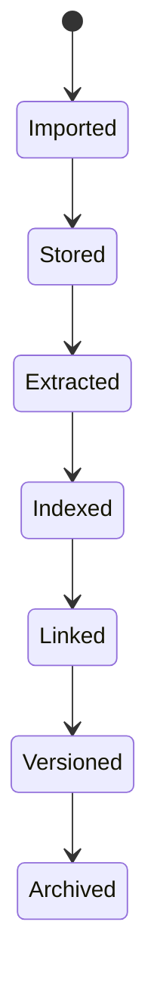

# Задача для DeepSeek: обновить русскую Obsidian wiki

## Safety instructions / Инструкции безопасности

- Do not print, infer, summarize, or request secrets. / Не печатай, не выводи, не пересказывай и не запрашивай секреты.
- Treat `.env`, credential, token, key, certificate, and private paths as redacted even if referenced. / Считай `.env`, учетные данные, токены, ключи, сертификаты и приватные пути редактированными.
- Keep code identifiers, file paths, commands, package names, API names, and ADR titles exactly as written. / Сохраняй идентификаторы кода, пути, команды, имена пакетов, API и названия ADR без изменений.
- Write wiki prose in Russian and keep Markdown Obsidian-compatible. / Пиши текст wiki на русском и сохраняй совместимость с Obsidian Markdown.
- Do not invent source facts. If the context is insufficient, state that explicitly. / Не выдумывай факты об исходниках. Если контекста недостаточно, напиши это явно.
- Every behavioral statement in proposed wiki pages must be directly supported by the embedded source text. / Каждое утверждение о поведении в предлагаемых wiki-страницах должно напрямую подтверждаться встроенным текстом исходников.
- Do not infer semantics for profiles, flags, annotations, environment variables, or framework conventions unless this context pack explicitly defines them. / Не выводи семантику профилей, флагов, аннотаций, переменных окружения или framework-конвенций, если этот context pack явно её не определяет.
- Do not add external background knowledge about tools, frameworks, or CLIs. / Не добавляй внешние справочные знания об инструментах, framework или CLI.
- When only a command or config value is visible, document only the literal command or value. For deeper meaning, write only that it is not confirmed by this context. / Когда видна только команда или значение конфигурации, документируй только буквальную команду или значение. Для более глубокого смысла пиши только, что он не подтвержден этим контекстом.
- Do not name likely related files unless they are embedded in this context pack. / Не называй вероятные связанные файлы, если они не встроены в этот context pack.
- Use only the embedded Source Files section below. Do not call tools, read files, inspect the filesystem, or access MCP/web resources. / Используй только встроенный ниже раздел Source Files. Не вызывай tools, не читай файлы, не инспектируй файловую систему и не обращайся к MCP/web ресурсам.
- If a referenced path or wiki page is not embedded in this context pack, report insufficient context instead of trying to open it. / Если упомянутый путь или wiki-страница не встроены в этот context pack, укажи недостаток контекста вместо попытки открыть файл.

## Chunk details / Детали чанка

- Chunk ID / ID чанка: `111-doc-docs-part-002`
- Group / Группа: `docs`
- Role / Роль: `doc`
- Status / Статус: `pending`
- Repository / Репозиторий: `/Users/avm/projects/Personal/hermes-hub`
- Wiki path / Путь wiki: `/Users/avm/projects/Personal/hermes-hub/docs/wiki`
- Metadata path / Путь metadata: `/Users/avm/projects/Personal/hermes-hub/docs/wiki/_meta`
- Plan generated at / План создан: `2026-06-28T19:48:55Z`
- Per-file source limit / Лимит источника на файл: `12000` characters

## Target pages / Целевые страницы

- `operations/documentation-map.md`

## Required Output / Требуемый результат

Return one Markdown response with these sections and no extra wrapper text. / Верни один Markdown-ответ с этими разделами и без дополнительной обертки.

### Summary / Резюме

Briefly describe what should change in the Russian wiki and why. / Кратко опиши, что нужно изменить в русской wiki и почему.

### Proposed pages / Предлагаемые страницы

For each target page, provide the wiki-relative path and full proposed Obsidian-compatible Markdown content. / Для каждой целевой страницы укажи путь относительно wiki и полный предложенный Markdown, совместимый с Obsidian.

### Source coverage / Покрытие источников

List each source file and the facts from it that the proposed pages cover. / Перечисли каждый исходный файл и факты из него, покрытые предложенными страницами.

### Drift candidates / Кандидаты на drift

List possible code/docs/ADR drift found in this chunk, or state that none is visible from the provided context. / Перечисли возможные расхождения кода, документации и ADR в этом чанке либо укажи, что из данного контекста они не видны.

## Source Files / Исходные файлы

### `docs/architecture/storage-architecture.md`

- Resolved path / Полный путь: `/Users/avm/projects/Personal/hermes-hub/docs/architecture/storage-architecture.md`
- Size bytes / Размер в байтах: `2699`
- Included characters / Включено символов: `2699`
- Truncated / Обрезано: `no`

```markdown
# Storage Architecture

## Storage Goals

- durable local ownership
- reproducible projections
- source preservation
- efficient search and graph traversal
- clear backup and restore
- replaceable indexes

## Storage Components

| Component | Role |
| --- | --- |
| PostgreSQL | canonical relational data, event tables, graph tables, metadata |
| Host vault | secrets-only encrypted payload storage under `~/.hermes/vault` |
| Object storage | documents, attachments, OCR artifacts, extracted text |
| Tantivy | full text search indexes |
| Vector index | semantic retrieval indexes |
| Backup storage | encrypted local or self-hosted snapshots |

## PostgreSQL Responsibilities

- event envelope and payload storage
- normalized entities
- relationship objects
- task lifecycle
- provider account metadata
- secret reference metadata and account-to-secret bindings
- ingestion checkpoints
- projection offsets
- permissions and capability grants
- audit trails

Backend readiness verifies that the embedded SQLx migration ledger has the expected successful migration count and latest version before reporting the service ready.

PostgreSQL must not receive new provider credential ciphertext payloads. `encrypted_secret_vault_entries` is legacy/migration state after ADR-0076.

## Host Vault Responsibilities

- encrypted provider credential payloads
- encrypted local account keys, signing credentials and external service credentials
- recovery export material
- minimal non-secret manifest data needed to reconcile account secret bindings after PostgreSQL recreation

The host vault uses a dedicated SQLite `vault.db` under `~/.hermes/vault`. Release runtime stores the master key in macOS Keychain. Docker development mounts the host vault into the container and uses debug-only dev key storage.

## Object Storage Responsibilities

- immutable raw attachments
- imported document versions
- generated OCR text
- document previews
- extracted structured artifacts

Object keys must not encode secrets. Metadata that affects business logic belongs in PostgreSQL.

## Index Responsibilities

Indexes are derived. Tantivy and vector indexes may be rebuilt from canonical events, objects and relational state. Index corruption must be recoverable without losing memory.

## Backup Model

Backups must include:

- PostgreSQL dump or physical snapshot
- object storage content
- index rebuild metadata
- application configuration excluding secrets where possible
- host vault backup or recovery file/phrase handling plan

Restore must verify schema versions, projection offsets, index consistency and host-vault manifest reconciliation. PostgreSQL restore alone is not sufficient to recover secrets.
```

### `docs/architecture/ui-architecture.md`

- Resolved path / Полный путь: `/Users/avm/projects/Personal/hermes-hub/docs/architecture/ui-architecture.md`
- Size bytes / Размер в байтах: `1479`
- Included characters / Включено символов: `1479`
- Truncated / Обрезано: `no`

```markdown
# UI Architecture

## UI Goals

- desktop-first productivity;
- keyboard-first operation;
- dense but readable information;
- contextual AI actions throughout the product;
- responsive desktop layout;
- modern interaction quality.

The UI is not a collection of app clones. It is a Personal Operating System
surface over the Personal Memory System.

## Primary Surfaces

- communication context;
- command palette;
- Persona workspace;
- Organization workspace;
- Project workspace;
- document viewer;
- Task and Obligation view;
- memory search;
- graph explorer;
- agent activity drawer;
- settings and permissions.

## Navigation Model

The UI should support:

- global command palette;
- quick switcher for Personas, Organizations, Projects, Documents and Tasks;
- keyboard shortcuts;
- split panes;
- contextual sidebars;
- breadcrumb history;
- saved views.

## State Model

Frontend state should distinguish:

- server-backed canonical state;
- optimistic command state;
- local view state;
- search filters;
- agent workflow state;
- draft state.

Durable owner changes must pass through backend commands.

## AI Interaction Model

AI actions should be embedded where context exists:

- summarize communication context;
- extract Task or Obligation candidates;
- explain why entities are linked;
- find related documents;
- draft reply;
- analyze changes;
- prepare meeting context.

The UI must show source references and distinguish generated text from source
content.
```

### `docs/architecture/ui.md`

- Resolved path / Полный путь: `/Users/avm/projects/Personal/hermes-hub/docs/architecture/ui.md`
- Size bytes / Размер в байтах: `3347`
- Included characters / Включено символов: `3347`
- Truncated / Обрезано: `no`

```markdown
# Canonical UI Architecture

Status: Canonical architecture baseline for the 2026-06-18 documentation
consolidation.

Scope: UI architecture and operating-surface principles. This document does not
authorize frontend refactoring by itself.

## Purpose

The UI is the Personal Operating System surface over Hermes memory and context.
It is not a collection of provider clones.

## Responsibility

The UI is responsible for:

- exposing context-rich workspaces;
- making evidence and provenance visible;
- supporting dense desktop workflows;
- surfacing review queues and capability states;
- enabling fast navigation across Personas, Organizations, Communications,
  Projects, Documents, Tasks, Decisions, Obligations and Timeline;
- showing agent outputs as generated and cited;
- preventing unavailable or unsafe provider actions from appearing as working
  commands.

## Boundaries

The UI does not own:

- durable domain state;
- provider credentials;
- capability authority;
- source evidence truth;
- server-derived cache truth;
- AI conclusions.

Durable owner changes must go through backend APIs and owning domain commands.

## Platform Baseline

Current accepted frontend baseline:

- Vue 3;
- TypeScript;
- Vite;
- Tauri 2;
- Pinia for transient UI state;
- TanStack Query for server state;
- centralized API client using `X-Hermes-Secret`;
- shared realtime bootstrap for cache patching;
- desktop/laptop scope while the mobile ADR remains active.

SvelteKit-specific ADRs are historical and superseded.

## Surface Model

Primary UI surfaces:

- Home and operating overview;
- Communications workspace;
- Telegram channel workbench;
- WhatsApp channel workbench when implemented;
- Personas workspace;
- Organizations workspace;
- Projects workspace;
- Documents workspace;
- Tasks and Obligations views;
- Review workspace;
- Knowledge/Graph/Memory exploration;
- Timeline;
- Agents;
- Settings and capability control.

These are operating surfaces. They do not imply independent backend domains.

## State Model

| State kind | Owner |
|---|---|
| Durable domain state | Backend domain APIs. |
| Server-derived state | TanStack Query. |
| Transient UI state | Pinia or component-local state. |
| Draft state | UI plus backend draft APIs where durable. |
| Realtime patches | Shared platform bootstrap and query invalidation. |
| Capability state | Backend capability contract. |
| Agent workflow state | Agent run/proposal APIs. |

Direct component-level API calls for server-derived state remain prohibited by
the Vue architecture direction.

## Interaction Rules

- Desktop-first dense layouts are expected.
- Keyboard-first workflows and command palette remain target UI patterns.
- Provider channel workbenches may look familiar, but they must show Hermes
  evidence, review, context and capability semantics.
- Message bodies, document contents and private data must not leak into audit,
  telemetry or unsafe logs.
- AI-generated text must be visually and semantically distinct from source
  evidence.
- Review surfaces must show target owner domain and promotion result.

## Reasons For Existence

Hermes needs an operating surface because memory without action is passive, and
action without evidence is unsafe. The UI ties context, review and owner
decisions together without letting provider surfaces redefine the product.
```

### `docs/architecture/vision.md`

- Resolved path / Полный путь: `/Users/avm/projects/Personal/hermes-hub/docs/architecture/vision.md`
- Size bytes / Размер в байтах: `3984`
- Included characters / Включено символов: `3984`
- Truncated / Обрезано: `no`

````markdown
# Canonical Architecture Vision

Status: Canonical architecture baseline for the 2026-06-18 documentation
consolidation.

Scope: product and architecture direction only. This document does not authorize
code refactoring, API changes, database migrations or provider adapter work.

## Purpose

This document states what Hermes Hub is today at the architecture level.

Hermes is a local-first Personal Operating System built on durable personal
memory and context. Its product surface may include communication workbenches,
project views, tasks, documents, timelines, review queues and agents, but those
surfaces exist to serve one goal:

```text
help the owner remember, understand context and make decisions
```

The shorter product thesis is:

```text
Context + Memory
```

## Non-Identity

Hermes is not:

- an email client;
- a messenger;
- a CRM;
- an address book;
- a task tracker;
- a calendar app;
- a note-taking app;
- a generic knowledge base;
- an AI chatbot.

Those surfaces may exist when they preserve evidence, expose context or help the
owner act on memory. They must not become independent product centers.

## Responsibilities

The architecture is responsible for:

- preserving source evidence before extracting meaning;
- maintaining explicit domain ownership for durable truth;
- keeping Memory and Context as cross-domain outcomes;
- making Relationships, Decisions, Obligations and provenance first-class;
- keeping provider channels behind adapter and source-record boundaries;
- making AI and agents permissioned, cited and reviewable;
- keeping derived state rebuildable where practical;
- enabling a desktop-first operating surface over the local memory system.

## Boundaries

Hermes must separate these state categories:

| Category | Role | Source of truth |
|---|---|---|
| Source evidence | Raw imported or local artifacts. | Provider/source boundary and local artifact storage. |
| Events | Explain meaningful change. | Append-only event log. |
| Domain records | Durable accepted state and lifecycle. | Owning domain. |
| Relationships | Source-backed semantic links. | Relationships domain, projected into graph views. |
| Memory and knowledge | Reviewed, source-backed understanding. | Domain records plus Memory/Knowledge policy. |
| Derived views | Search, timeline, dossiers, context packs, scores. | Rebuildable projections and engines. |
| Agent outputs | Proposals, summaries, tool actions. | Agent run records until accepted by a domain. |

Provider state is not Hermes truth. AI output is not Hermes truth. UI state is
not Hermes truth. A durable mutation belongs to the owning domain and must cite
source evidence or an explicit owner action.

## System Shape

```text
External and local sources
  -> Provider and import boundaries
  -> Source evidence
  -> Canonical events
  -> Domain records
  -> Relationships and graph projections
  -> Shared engines
  -> Memory and context
  -> Review, UI and agents
  -> Owner decision or action
```

## Domain Connections

Communications are the main intake spine, but not the only source of evidence.
Documents, calendar events, local owner input, imported files and provider
records can also create source-backed memory.

Domains own durable entities. Engines compute reusable intelligence. Agents act
through capabilities and audit. The UI is the Personal Operating System surface
over those boundaries.

## Reasons For Existence

Hermes exists because personal context is fragmented across providers, files,
projects, relationships and time. A provider client can show messages. A task
tracker can show actions. A notes app can show text. Hermes should explain:

- what happened;
- who and what is involved;
- why it matters;
- what changed;
- what evidence supports it;
- what conflicts with prior memory;
- what decision, obligation, task or project context follows.

If a feature does not improve memory, context, evidence or decision quality, it
does not belong in the core architecture.
````

### `docs/development/README.md`

- Resolved path / Полный путь: `/Users/avm/projects/Personal/hermes-hub/docs/development/README.md`
- Size bytes / Размер в байтах: `257`
- Included characters / Включено символов: `257`
- Truncated / Обрезано: `no`

```markdown
# Development

Status: documentation package aligned to the current repository structure.

This package holds developer-process documentation that is not domain,
integration, engine or platform architecture.

## Navigation

- [Testing](./testing/README.md)
```

### `docs/development/testing/README.md`

- Resolved path / Полный путь: `/Users/avm/projects/Personal/hermes-hub/docs/development/testing/README.md`
- Size bytes / Размер в байтах: `2859`
- Included characters / Включено символов: `2859`
- Truncated / Обрезано: `no`

```markdown
# Testing Infrastructure

Status: documentation package aligned to the current repository structure.

Hermes uses a split test stack:

- Rust backend execution runs through `cargo-nextest`.
- Backend integration and coverage runs go through the `crates/testkit` session harness so PostgreSQL and NATS testcontainers are reused and cleaned correctly.
- Local wrapper scripts and Makefile nextest targets force a visible progress mode via `--show-progress`.
- Post-run JUnit analysis prints a compact completed/passed/failed/flaky summary with an ASCII progress bar, so non-interactive Codex/CI output is not silent after a test set finishes.
- Frontend unit tests stay on Vitest.
- Architecture checks remain first-class and are part of the test taxonomy.

## Command map

- `make test-fast` - local fast loop: backend unit + architecture + snapshots + frontend unit tests
- `make test` - full local validation-oriented test run
- `make test-ci` - backend CI-oriented nextest run plus frontend unit tests
- `make test-unit`
- `make test-integration`
- `make test-e2e`
- `make test-architecture`
- `make test-snapshot`
- `make coverage`
- `make coverage-html`
- `make coverage-ci`
- `make mutants`
- `make audit`
- `make deny`
- `make security`
- `make udeps`
- `make watch-test`
- `make watch-unit`
- `make watch-integration`
- `make cache-stats`
- `make cache-reset`
- `make test-performance-report`

## Classification model

Hermes does not yet physically relocate every backend test into `tests/unit`, `tests/integration`, `tests/e2e`, `tests/architecture`, `tests/snapshots`. The repository now uses a stable logical classification generated from the current target naming and a dedicated snapshot target:

- `unit` - Rust library tests under `backend/src` and `crates/testkit/src`
- `integration` - backend integration targets that are not architecture/e2e/snapshot targets
- `e2e` - high-surface API/runtime targets such as `*_api`, stream/websocket API targets, `communications_connectrpc`, `omniroute`, `hard_v1_routes`
- `architecture` - `*_architecture.rs` targets plus JS architecture guards
- `snapshot` - backend snapshot targets using `insta`

The classifier lives in `scripts/test/backend-test-targets.mjs`.

## Reports

`cargo-nextest` writes JUnit XML into `target/nextest/<profile>/junit.xml`.

Post-run summaries are written into `reports/test-performance/` by `scripts/test/analyze-nextest-junit.mjs`.

Current baseline and optimization notes live in:

- `reports/test-performance/README.md`
- `reports/test-performance/2026-06-23-baseline.md`
- `reports/test-performance/backend-full.md`
- `docs/development/testing/status.md`

## Navigation

- [Status](./status.md)
- [CI](./ci.md)
- [Coverage](./coverage.md)
- [Mutation Testing](./mutation-testing.md)
- [Nextest](./nextest.md)
- [Security](./security.md)
- [Snapshots](./snapshots.md)
```

### `docs/development/testing/ci.md`

- Resolved path / Полный путь: `/Users/avm/projects/Personal/hermes-hub/docs/development/testing/ci.md`
- Size bytes / Размер в байтах: `454`
- Included characters / Включено символов: `454`
- Truncated / Обрезано: `no`

```markdown
# CI Test Topology

The CI split is:

## Pull Requests

- architecture
- backend fmt
- backend clippy
- backend unit
- backend snapshots
- frontend lint/test/build

## Push to `main`

Everything from pull requests, plus:

- backend integration
- coverage
- security

## Nightly

- backend e2e
- mutation testing

This keeps the default PR gate fast enough for iteration while leaving heavy container-backed and mutation-based checks to the slower lanes.
```

### `docs/development/testing/coverage.md`

- Resolved path / Полный путь: `/Users/avm/projects/Personal/hermes-hub/docs/development/testing/coverage.md`
- Size bytes / Размер в байтах: `456`
- Included characters / Включено символов: `456`
- Truncated / Обрезано: `no`

```markdown
# Coverage

Coverage is provided by `cargo-llvm-cov` and runs through `cargo nextest`.

Commands:

- `make coverage` - summary report
- `make coverage-html` - HTML report under `target/coverage/html`
- `make coverage-ci` - LCOV report under `target/coverage/lcov.info`

Important constraint:

Coverage commands also run through the `hermes_test_session` harness so integration tests keep the same testcontainer lifecycle guarantees as normal backend runs.
```

### `docs/development/testing/mutation-testing.md`

- Resolved path / Полный путь: `/Users/avm/projects/Personal/hermes-hub/docs/development/testing/mutation-testing.md`
- Size bytes / Размер в байтах: `409`
- Included characters / Включено символов: `409`
- Truncated / Обрезано: `no`

```markdown
# Mutation Testing

Hermes uses `cargo-mutants` for targeted mutation analysis.

Command:

- `make mutants`

Current policy:

- use `nextest` as the test tool
- keep this out of the default PR gate because runtime is high
- run it in nightly CI and manually on risky backend work

Because mutation testing is expensive, treat it as a scheduled or pre-merge quality signal, not as a default edit-loop command.
```

### `docs/development/testing/nextest.md`

- Resolved path / Полный путь: `/Users/avm/projects/Personal/hermes-hub/docs/development/testing/nextest.md`
- Size bytes / Размер в байтах: `742`
- Included characters / Включено символов: `742`
- Truncated / Обрезано: `no`

```markdown
# cargo-nextest

`cargo-nextest` is the default Rust test runner in Hermes.

Why:

- per-test process isolation
- retries and flaky detection
- slow test detection
- JUnit XML output
- better CI ergonomics than `cargo test`

Repository configuration lives in `.config/nextest.toml`.

Profiles:

- `default` - local broad runs
- `ci` - CI-oriented runs with more retries and separate JUnit output
- `integration` - slower container-backed runs

Important constraint:

For full backend runs, prefer `make backend-test`, `make backend-validate`, `make test`, `make test-ci`, `make test-integration`, or `make test-e2e`.

These routes keep the `hermes_test_session` harness in front of nextest so shared testcontainers are reused and cleaned up.
```

### `docs/development/testing/security.md`

- Resolved path / Полный путь: `/Users/avm/projects/Personal/hermes-hub/docs/development/testing/security.md`
- Size bytes / Размер в байтах: `1382`
- Included characters / Включено символов: `1382`
- Truncated / Обрезано: `no`

```markdown
# Security and Dependency Hygiene

Commands:

- `make audit` - RustSec vulnerability scan via `cargo-audit`
- `make deny` - advisory/license/source/multi-version checks via `cargo-deny`
- `make security` - combined audit + deny
- `make udeps` - unused dependency scan via `cargo-udeps` on nightly

Files:

- `deny.toml`
- `Makefile`

Notes:

- `cargo-udeps` requires nightly Rust to execute.
- `cargo-deny` is broader than `cargo-audit`; it also checks sources, versions, and licenses.
- `make audit` intentionally passes `--ignore RUSTSEC-2023-0071`. The affected `rsa` crate is pulled into `Cargo.lock` through `sqlx-mysql`, while the active backend/testkit SQLx graph uses PostgreSQL only and `cargo tree -i sqlx-mysql` prints no active path. The upstream advisory has no fixed version, so this is a documented lockfile-only exception rather than a hidden greenwash.

Current repository state as of `2026-06-23`:

- tooling is wired and executable locally;
- `make security` is green after updating `testcontainers`, updating `quinn-proto`, and documenting the inactive `sqlx-mysql` / `rsa` cargo-audit exception;
- `make audit` still reports allowed warnings for `lru` and `memmap2`;
- `cargo-deny` still reports duplicate-version warnings, but the deny gate exits successfully;
- `make udeps` is green after removing unused `mockall` and `testcontainers-modules` dependencies.
```

### `docs/development/testing/snapshots.md`

- Resolved path / Полный путь: `/Users/avm/projects/Personal/hermes-hub/docs/development/testing/snapshots.md`
- Size bytes / Размер в байтах: `480`
- Included characters / Включено символов: `480`
- Truncated / Обрезано: `no`

```markdown
# Snapshot Testing

Hermes uses `insta` for stable output snapshots.

Current baseline target:

- `backend/tests/snapshot_smoke.rs`

Commands:

- `make snapshot-test`
- `make snapshot-accept`

Acceptance flow:

1. Run `make snapshot-test`
2. Inspect `.snap.new` output if the snapshot changed
3. Accept the update with `make snapshot-accept`

Snapshot tests are intended for:

- JSON payloads
- Connect/HTTP response shapes
- parsing output
- event payloads
- Markdown generation
```

### `docs/development/testing/status.md`

- Resolved path / Полный путь: `/Users/avm/projects/Personal/hermes-hub/docs/development/testing/status.md`
- Size bytes / Размер в байтах: `9996`
- Included characters / Включено символов: `9996`
- Truncated / Обрезано: `no`

```markdown
# Test Modernization Status

Status date: `2026-06-23`

This file tracks what is actually completed for the Hermes test modernization plan, what is only partially implemented, and what is still unverified.

## Overall readiness

- Completed: `13 / 16`
- Partial or integrated but not fully proven: `3 / 16`
- Not started: `0 / 16`

This is not a marketing summary. It is the current evidence-based state from the repository worktree and the validation executed so far.

## Acceptance criteria matrix

1. `cargo-nextest` is used by default  
   Status: `complete`  
   Evidence: `.config/nextest.toml`, `.cargo/config.toml`, `Makefile`, `scripts/test/run-nextest.sh`

2. All tests are split into categories  
   Status: `partial`  
   Evidence: `scripts/test/backend-test-targets.mjs`, `Makefile` category targets, snapshot target.  
   Gap: classification is logical and automated, but backend tests were not physically relocated into `tests/unit`, `tests/integration`, `tests/e2e`, `tests/architecture`, `tests/snapshots`.

3. Coverage works through `cargo-llvm-cov`  
   Status: `complete`  
   Evidence: `scripts/test/run-llvm-cov.sh`, `Makefile` coverage targets, CI coverage job, real local run that produced `target/coverage/lcov.info`.

4. Snapshot testing works through `insta`  
   Status: `complete`  
   Evidence: `backend/tests/snapshot_smoke.rs`, committed snapshot file, targeted test pass.

5. Mutation testing works through `cargo-mutants`  
   Status: `partial`  
   Evidence: `Makefile`, nightly CI workflow, docs, real local mutant enumeration observed `38` mutants, interrupted local execution attempt against `backend/src/app/handlers/communications/remote_images/url_policy.rs`.  
   Gap: a full local mutation test pass is still too expensive for the current crate shape; the local run spent almost five minutes in baseline build inside a 2.6 GB scratch copy before being interrupted.

6. `sccache` is integrated  
   Status: `complete`  
   Evidence: `Makefile` exports `RUSTC_WRAPPER` when `sccache` is present, cache commands exist, and a measured local cold/warm experiment was executed.  
   Result: `sccache --show-stats` reported 1300 compile requests, 124 hits, 996 Rust misses, 11.07% overall hit rate, 0.00% Rust hit rate in the cross-target-dir experiment. Integration is proven; optimization remains open.

7. `cargo-watch` is integrated  
   Status: `complete`  
   Evidence: `Makefile` watch targets, docs.

8. `cargo-audit` is integrated  
   Status: `complete`  
   Evidence: `Makefile`, CI security lane, docs, real `make security` / `cargo audit` execution.  
   Note: `make audit` is green with a documented `RUSTSEC-2023-0071` ignore for the inactive optional `sqlx-mysql -> rsa` lockfile path. `cargo tree -i sqlx-mysql` prints no active backend/testkit path; SQLx is configured for PostgreSQL only.

9. `cargo-deny` is integrated  
   Status: `complete`  
   Evidence: `Makefile`, `deny.toml`, CI security lane, docs, real `make deny` execution.  
   Note: `make deny` is green after updating the testcontainers dependency chain. Duplicate-version warnings remain non-fatal.

10. `cargo-udeps` is integrated  
   Status: `complete`  
   Evidence: `Makefile`, docs, installed nightly toolchain, real `make udeps` execution.  
   Result: current graph is green after removing unused `mockall` and `testcontainers-modules` dependencies.

11. Documentation exists  
    Status: `complete`  
    Evidence: `docs/development/testing/`

12. Updated `Makefile` exists  
    Status: `complete`  
    Evidence: root `Makefile`

13. CI integration exists  
    Status: `complete`  
    Evidence: `.github/workflows/ci.yml`, `.github/workflows/nightly.yml`

14. Acceleration report exists  
   Status: `partial`  
   Evidence: `reports/test-performance/2026-06-23-baseline.md`, `2026-06-23-testcontainers-audit.md`, `reports/test-performance/backend-full.md`, `reports/test-performance/unit.md`  
   Gap: the repository now has measured after-state timings, but it still lacks a normalized before/after comparison from equivalent full-suite runs.

15. Slowest-tests report exists  
    Status: `complete`  
    Evidence: baseline report, JUnit analyzer, `make test-unit`, `reports/test-performance/unit.md`, `reports/test-performance/unit.json`

16. No degradation of existing functionality  
   Status: `complete`  
   Evidence: `make validate` passed with architecture/code-boundary/backend/frontend gates green. After the NATS cleanup fix, `make backend-validate` passed again with `1223` backend tests green.

## What was done in this pass

- Added `cargo-nextest` configuration and dedicated profiles.
- Added reusable shell helpers for Rust tooling checks.
- Added nextest/coverage/report scripts.
- Added a first committed backend snapshot test.
- Added CI split for PR, main, and nightly quality lanes.
- Added docs for nextest, coverage, snapshots, mutation testing, security, and CI.
- Added baseline and testcontainers audit reports.
- Added `color-eyre` bootstrap in the backend binary.
- Added explicit nextest progress-bar flags in the local wrappers so future `make backend-test` / coverage runs are not silent.
- Added nextest progress flags to direct Makefile nextest targets and post-run ASCII summary output after JUnit report generation.
- Upgraded the testcontainers chain and `quinn-proto`, removed unused Rust dependencies, and documented the remaining cargo-audit lockfile-only `rsa` exception.

## What is still not fully closed

- A complete local mutation test pass on a real backend module
- A normalized before/after acceleration comparison from equivalent full-suite runs

## Confirmed command results in this pass

- `make test-unit`
  - Result: passed
  - Evidence: `261 tests run: 261 passed`, `target/nextest/default/junit.xml`, `reports/test-performance/unit.{json,md}`
- `make backend-test`
  - Result: passed
  - Evidence: `1223 tests run: 1223 passed`, `reports/test-performance/backend-full.{json,md}`
- `make backend-validate`
  - Result: passed after the NATS session-container cleanup fix
  - Evidence: `1223 tests run: 1223 passed`, final post-run summary in `reports/test-performance/backend-full.{json,md}`
- `make backend-clippy`
  - Result: passed
- `make frontend-validate`
  - Result: passed
  - Evidence: `132` frontend test files passed, `468` frontend tests passed, `vite build` passed
- `make architecture-check`
  - Result: passed after adding an application-layer project review mirror wrapper and explicit transitional projection-bridge exceptions for existing derived-domain stores
- `make code-boundaries-check`
  - Result: passed after excluding generated frontend protobuf and frontend build output from source-boundary scanning
- `make backend-fmt-check`
  - Result: passed after applying `cargo fmt`
- `./scripts/test/run-llvm-cov.sh ci --test snapshot_smoke --lcov --output-path target/coverage/lcov.info`
  - Result: passed
  - Evidence: `target/coverage/lcov.info`
- `make udeps`
  - Result: passed after removing `backend` dev-dependency `mockall` and `crates/testkit` dependency `testcontainers-modules`
- `make security`
  - Result: passed after dependency updates and the documented inactive `sqlx-mysql -> rsa` cargo-audit ignore
- `make deny`
  - Result: passed; duplicate-version warnings remain non-fatal
- `make validate`
  - Result: passed
  - Evidence: architecture/code-boundary/backend/frontend gates completed; frontend reported `132` files and `468` tests passed, and `vite build` completed.

## Mutation testing note

- `cargo mutants --list -f 'backend/src/app/handlers/communications/remote_images/url_policy.rs'`
  - Result: found `38` mutants
- `cargo mutants -f 'backend/src/app/handlers/communications/remote_images/url_policy.rs' --test-tool nextest -j 1`
  - Result: started real execution, but local run was interrupted during the baseline build phase after ~5 minutes
  - Evidence: command output was observed locally; generated `mutants.out*` scratch directories were removed instead of being retained in the worktree.
  - Important nuance: in this repository layout the working file filter must match `backend/src/...`, not only `src/...`, or `cargo-mutants` reports `0 mutants to test`

## Container cleanup note

- Earlier full runs left stale anonymous NATS testcontainers because `NATS_CONTAINER` was stored in a static `OnceCell`; Rust statics are not dropped at test-binary exit, so `ContainerAsync` did not reliably clean up.
- `hermes_test_session` now owns one NATS container and one PostgreSQL container per backend session and passes their ports to test binaries through environment variables.
- Verified with targeted `event_platform` and final `make backend-validate`: temporary testcontainers were removed after the harness exited; only the named development Compose service `hermes-hub-dev-postgres-1` remained.

## Current security posture

From `cargo audit`:

- `RUSTSEC-2023-0071` for `rsa 0.9.10` is ignored by `make audit` because it is pulled into `Cargo.lock` through inactive optional `sqlx-mysql`; active SQLx usage is PostgreSQL only.
- warnings remain for `lru 0.12.5` and `memmap2 0.9.10`, and cargo-audit treats them as allowed warnings.

From `cargo deny`:

- `advisories`, `bans`, `licenses`, and `sources` pass.
- duplicate-version warnings remain, but they are not hard failures under current policy.

The previous `tokio-tar`, `rustls-pemfile`, and `quinn-proto` blockers were removed by updating the testcontainers chain and `quinn-proto`.

## Repository-wide gate status

- `make validate` was executed and passed.
- `make backend-validate` was executed and passed again after the NATS testcontainer cleanup fix.
- `make frontend-validate` was executed and passed.
- `make security` and `make udeps` were executed and passed.
- `make architecture-check`, `make code-boundaries-check`, and `make backend-fmt-check` were executed and passed.
- Docker cleanup was verified after backend validation; no anonymous testcontainers remained.
```

### `docs/domains/README.md`

- Resolved path / Полный путь: `/Users/avm/projects/Personal/hermes-hub/docs/domains/README.md`
- Size bytes / Размер в байтах: `7254`
- Included characters / Включено символов: `7254`
- Truncated / Обрезано: `no`

```markdown
# Hermes Domain Catalog

Status: documentation package aligned to the current repository structure.

This catalog is the canonical entry point for active Hermes domains. It should
be read together with:

- [Product Master Spec](../product/master-spec.md)
- [World Model](../foundation/world-model.md)
- [Glossary](../foundation/glossary.md)
- [Domain Map](../foundation/domain-map.md)

Hermes is a local-first Personal Memory System. Domains own source-of-truth
entities. Engines build derived memory, context, scores, timelines and
recommendations from those entities.

## Domain Rule

A domain exists when Hermes needs a durable source of truth for an entity type.
A domain does not exist merely because the UI has a page or because an engine
needs a projection.

## Package Shape

Domain documentation mirrors `backend/src/domains/<domain>/` where possible.
Each domain package should use the Zoom-style document set when the content
exists:

- `README.md` for the bounded-context overview or implementation package index;
- `spec.md` for canonical product/domain semantics when the package also has
  implementation-heavy docs;
- `architecture.md` for ownership, flows and boundaries;
- `api.md` for public or local API shape;
- `data-model.md`, `modules.md`, `status.md`, `gap-analysis.md` and
  `blockers.md` when those documents are backed by real current content.

Do not create empty placeholder files just to fill the shape.

## Canonical Domains

| Domain | Canonical document | Status |
|---|---|---|
| Signal Hub | [Signal Hub](signal-hub/spec.md), [package](signal-hub/README.md) | target system domain for source registry, signal control, fixtures, NATS-backed event delivery and ConnectRPC APIs |
| Communications | [Communications](communications/README.md) | implemented as the single communication domain; Mail, Telegram and WhatsApp are channel integrations |
| Personas | [Personas](persons/spec.md), [package](persons/README.md) | partially implemented through `persons` and compatibility migrations |
| Relationships | [Relationships](relationships/README.md) | partially implemented through first-class persistence, graph projection for all current Relationship entity kinds, guarded global suggested review, organization contact link adapters, person role adapters, task relation adapters, project link review adapters and Personas workspace review; remaining cross-domain inbox work incomplete |
| Organizations | [Organizations](organizations/spec.md), [package](organizations/README.md) | implemented as a memory anchor domain |
| Projects | [Projects](projects/README.md) | implemented, needs stronger domain documentation |
| Documents | [Documents](documents/README.md) | implemented, needs clearer Knowledge boundary |
| Tasks | [Tasks](tasks/spec.md), [package](tasks/README.md) | implemented, needs stronger Obligation boundary |
| Calendar/Events | [Calendar And Events](calendar/spec.md), [package](calendar/README.md) | implemented under calendar/calls/meetings surfaces |
| Decisions | [Decisions](decisions/README.md) | partially implemented through first-class persistence, accepted graph projection, guarded entity/global API, explicit message/imported-document candidate refresh, email plus Telegram/WhatsApp fixture ingestion refresh, meeting outcome adapter, project link review adapter and Tasks workspace review; adapters incomplete |
| Obligations | [Obligations](obligations/README.md) | partially implemented through first-class persistence, accepted graph projection, guarded entity/global API, obligation-derived task-candidate review-state synchronization, document candidate refresh, email plus Telegram/WhatsApp fixture ingestion refresh, person promise adapter, meeting outcome adapter and Tasks workspace review; adapters incomplete |
| Review | [Review](review/README.md) | implemented as the evidence-backed inbox for review items, approval, dismissal and promotion state per ADR-0096 |
| Knowledge Graph | [Knowledge Graph](graph/README.md) | implemented as graph domain/projection substrate |
| Agents | [Agents](agents/README.md) | partially implemented through AI runtime/control surfaces |
| Notes | [Notes](notes/README.md) | not a first-class domain; treated as document-like artifacts |

## Channel And Provider Capability Specs

Channel and provider capability specs document provider-specific behavior
without promoting a provider into a standalone Hermes domain.

| Provider | Spec | Status |
|---|---|---|
| Telegram | [Telegram Channel Capability Spec](../integrations/telegram/README.md) | target production capability matrix with current implementation baseline |
| Mail | [Email Channel Capability Spec](../integrations/mail/README.md) | implemented email channel framing and current API/status docs |
| WhatsApp | [WhatsApp Provider Stage](../integrations/whatsapp/README.md) | provider/runtime capability docs; not a Hermes domain |
| Zoom | [Zoom Provider Stage](../integrations/zoom/README.md) | provider foundation implemented; not a Hermes domain |

## Engine Documents

Engines are not domains. Engine ownership lives in
[Engines](../foundation/engines.md). Search-specific details live in
[Search Engine Architecture](../engines/search/architecture.md).

## Current Implementation Caveats

The repository still contains historical naming and compatibility boundaries:

- `communications` backend modules still contain some mail-heavy compatibility
  names because email was the first implemented channel.
- `person_id` and `/api/v1/persons/*` are current implementation names, while
  new domain language is Persona.
- `contacts` appears in migration history because the persistence model evolved
  from contact records into Personas.
- `backend/src/domains/settings` is currently an exported but empty backend
  module. Settings is core application surface, not a product domain; the
  working settings logic lives under [Platform Settings](../platform/settings/README.md).
- Notes have a frontend surface but no ADR that promotes them to a first-class
  domain.
- Agents have product-domain language and a frontend package, but no current
  `backend/src/domains/agents` package. Backend AI/runtime code is split across
  AI, app, platform settings and integration boundaries.
- Decisions and Obligations are canonical product domains. Both have initial
  persistence baselines, accepted graph projection and guarded backend APIs.
  Decisions have explicit message/imported-document candidate refresh, a
  meeting `decision` outcome adapter, Telegram/WhatsApp fixture ingestion
  refresh and a project link review adapter.
  Relationships have organization contact link, task relation and project link
  review adapters.
  Obligations have review-state synchronization for obligation-derived task
  candidates, document commitment candidate refresh, email-sync plus
  Telegram/WhatsApp fixture ingestion candidate refresh, a person promise
  adapter and a meeting `promise`/`task`/`follow_up` outcome adapter. Desktop
  UI, live-provider ingestion and remaining compatibility adapters remain
  incomplete.

These caveats are not new terminology. They are migration facts that must be
resolved by implementation plans and ADRs before code-level renames or schema
changes.
```

### `docs/domains/agents/README.md`

- Resolved path / Полный путь: `/Users/avm/projects/Personal/hermes-hub/docs/domains/agents/README.md`
- Size bytes / Размер в байтах: `2081`
- Included characters / Включено символов: `2081`
- Truncated / Обрезано: `no`

````markdown
# Agents Domain

Status: documentation package aligned to the current repository structure.

Agents are tool-mediated actors that help the Owner Persona operate Hermes.

Agents are not source-of-truth owners. They work through permissions, audit
records, source evidence and reviewable actions.

## Responsibilities

The Agents domain owns:

- agent identity;
- capability policy;
- tool access boundaries;
- action audit trails;
- agent run records;
- proposed actions;
- owner approvals and denials;
- agent-to-Persona representation where needed.

The Agents domain does not own:

- private data truth;
- domain entity state outside approved actions;
- provider credentials;
- automatic source-of-truth overwrites;
- fine-tuning on private data.

## Agent Persona

AI agents can exist in the Persona graph as:

```yaml
PersonaType: ai_agent
```

This allows Hermes to represent HESTIA and future agents as actors with
relationships, permissions and provenance. The Owner Persona remains the only
`is_self: true` Persona.

## Agent Workflow

```text
context request
  -> permission check
  -> retrieval from domains and engines
  -> proposed observation/action
  -> review or policy gate
  -> audited domain event
```

Agents must cite source records when producing conclusions.

## Current Implementation Evidence

Current implementation includes:

- AI runtime and control center migrations `0018` and `0057`;
- Ollama integration;
- AI-related route groups;
- settings and capability infrastructure;
- frontend Agents and Settings surfaces.

The agent domain is partially implemented as runtime/control infrastructure, but
the product-level agent model still needs explicit capability and Persona graph
documentation before broader automation.

## Migration Plan

1. Keep agents permissioned and audited.
2. Represent durable AI actors as `PersonaType: ai_agent` when they need graph
   identity.
3. Require cited context for agent conclusions.
4. Keep private data out of fine-tuning.
5. Add ADRs before allowing autonomous write behavior beyond narrow approved
   policies.
````

### `docs/domains/calendar/README.md`

- Resolved path / Полный путь: `/Users/avm/projects/Personal/hermes-hub/docs/domains/calendar/README.md`
- Size bytes / Размер в байтах: `1219`
- Included characters / Включено символов: `1219`
- Truncated / Обрезано: `no`

```markdown
# Hermes Calendar And Events

Status: documentation package aligned to the current repository structure.

Calendar is the scheduled-event channel inside Hermes. Hermes is not a calendar
app. Calendar data becomes Events, Communications, Decisions, Obligations,
Tasks, Documents and Relationships in the Personal Memory System.

## Key Capabilities

- multi-provider account/source model;
- local and provider-backed scheduled events;
- event relationships to Personas, Organizations, Projects, Documents, Tasks,
  Communications, Decisions and Obligations;
- meeting preparation as context assembly;
- meeting outcomes as source-backed Decisions, Obligations and Task candidates;
- deadlines and focus blocks as event/context records;
- scheduling support under explicit policy.

## Engine Use

Calendar uses shared engines:

- Timeline Engine for chronological views;
- Memory Engine for meeting context;
- Obligation Engine for commitments and follow-ups;
- Risk Engine for preparation gaps and load risks;
- Search Engine for recall;
- Enrichment Engine for candidate links.

## Navigation

- [API Reference](api.md)
- [Data Model](data-model.md)
- [Architecture](architecture.md)
- [Status and Blockers](status.md)
```

### `docs/domains/calendar/api.md`

- Resolved path / Полный путь: `/Users/avm/projects/Personal/hermes-hub/docs/domains/calendar/api.md`
- Size bytes / Размер в байтах: `2823`
- Included characters / Включено символов: `2566`
- Truncated / Обрезано: `no`

```markdown
# Calendar/Events — API Reference

This file documents current compatibility routes for scheduled events. The
canonical model is `Event` plus shared engines such as Timeline, Obligation,
Risk and Search; route names such as `follow-up`, `health` and `watchtower`
are compatibility names, not separate domain concepts.

Base: `/api/v1/calendar`

## Accounts

| Метод | Путь | Описание |
|---|---|---|
| GET | `/accounts` | Список (?provider) |
| POST | `/accounts` | Создать |
| GET | `/accounts/{id}` | Профиль |
| PUT | `/accounts/{id}` | Обновить |
| DELETE | `/accounts/{id}` | Удалить |
| GET | `/accounts/{id}/sources` | Календари аккаунта |
| POST | `/accounts/{id}/sources` | Добавить календарь |
| POST | `/accounts/{id}/sync` | Триггер синхронизации |

## Events

| Метод | Путь | Описание |
|---|---|---|
| GET | `/events` | Список (?account_id, ?source_id, ?from, ?to, ?status, ?event_type, ?limit) |
| POST | `/events` | Создать |
| GET | `/events/{id}` | Детали |
| PUT | `/events/{id}` | Обновить |
| DELETE | `/events/{id}` | Удалить |
| POST | `/events/{id}/reschedule` | Перенести |
| POST | `/events/{id}/cancel` | Отменить |

## Participants & Relations

| Метод | Путь |
|---|---|
| GET, POST | `/events/{id}/participants` |
| GET, POST | `/events/{id}/relations` |

## Context & Preparation

| Метод | Путь |
|---|---|
| GET, POST | `/events/{id}/context-pack` |
| GET, POST | `/events/{id}/agenda` |
| GET, POST | `/events/{id}/checklist` |

## Intelligence

| Метод | Путь |
|---|---|
| POST | `/events/{id}/classify` |
| POST | `/events/{id}/analyze` |
| GET | `/events/{id}/risks` |
| GET | `/events/{id}/brief` |
| POST | `/events/{id}/generate-agenda` |

## Meetings

| Метод | Путь |
|---|---|
| GET, POST | `/events/{id}/notes` |
| GET, POST | `/events/{id}/outcomes` |
| GET, POST | `/events/{id}/recording` |
| GET | `/events/{id}/transcript` |
| POST | `/events/{id}/follow-up` |
| GET | `/events/{id}/follow-up-status` |

## Deadlines & Focus

| Метод | Путь |
|---|---|
| GET, POST | `/deadlines` |
| GET, POST | `/focus-blocks` |
| POST | `/smart-schedule` |

## Risk, Attention & Analytics

| Метод | Путь |
|---|---|
| GET | `/watchtower` |
| GET | `/health` |
| GET | `/weekly-brief` |
| GET | `/analytics` |

## Context Explanation & Search

| Метод | Путь |
|---|---|
| POST | `/brain` |
| GET | `/search?q=` |

## Rules

| Метод | Путь |
|---|---|
| GET, POST | `/rules` |
| PUT, DELETE | `/rules/{id}` |

## Import/Export

| Метод | Путь |
|---|---|
| POST | `/import` |
| GET | `/events/{id}/export?format=ics\|md\|json` |
```

### `docs/domains/calendar/architecture.md`

- Resolved path / Полный путь: `/Users/avm/projects/Personal/hermes-hub/docs/domains/calendar/architecture.md`
- Size bytes / Размер в байтах: `1256`
- Included characters / Включено символов: `1256`
- Truncated / Обрезано: `no`

````markdown
# Calendar And Events Architecture

## Position

Calendar owns scheduled event records and calendar source identity. It does not
own the global Timeline Engine.

## Modules

Paths below refer to `backend/src/domains/calendar/`.

| Module | Responsibility |
|---|---|
| `core.rs` | CalendarAccount, CalendarSource, CalendarEvent and stores |
| `events.rs` | participants, relations, context packs, agendas, checklists |
| `intelligence.rs` | engine-facing classification and readiness helpers |
| `meetings.rs` | meeting notes, outcomes, recordings and transcripts |
| `scheduling.rs` | deadlines, focus blocks and scheduling support |
| `health.rs` | Risk Engine/attention signals for calendar context |
| `brain.rs` | context answers and briefs over shared engines |
| `rules.rs` | calendar rules |
| `sync.rs` | import/export helpers |
| `reminders.rs` | reminder records and toggles |

## Layers

```text
API
  -> Calendar domain services
  -> Stores
  -> PostgreSQL
  -> Shared engines for context, timeline, risk and search
```

## Patterns

- Store pattern: stores receive a pool and return domain errors.
- Event-backed changes.
- Provider identity remains at the provider/source boundary.
- Heuristic-first intelligence should work without Ollama.
````

### `docs/domains/calendar/data-model.md`

- Resolved path / Полный путь: `/Users/avm/projects/Personal/hermes-hub/docs/domains/calendar/data-model.md`
- Size bytes / Размер в байтах: `2623`
- Included characters / Включено символов: `2249`
- Truncated / Обрезано: `no`

```markdown
# Calendar/Events — Current Data Model

This file documents current scheduled-event storage. It is not the canonical
global Timeline model. Timeline, Obligation, Risk, Search and Enrichment are
shared engines that consume calendar event records together with other sources.

## Таблицы (15)

### Core (Phase 0)

| Таблица | Назначение |
|---|---|
| `calendar_accounts` | Учетные записи провайдеров (Google, Microsoft, Apple, CalDAV, ICS, Local) |
| `calendar_sources` | Календари внутри аккаунта |
| `calendar_events` | События с source identity, статусом, типом, importance/readiness |

### Participants & Relations (Phase 1)

| Таблица | Назначение |
|---|---|
| `event_participants` | Участники с email, role, response_status и совместимым `person_id`, который должен трактоваться как Persona reference |
| `event_relations` | Связи с entity_type/entity_id (Persona, Organization, Project, Document, ...) |
| `context_packs` | Engine-owned derived context packs for calendar subjects. Legacy `event_context_packs` remains historical schema compatibility only and must not be used by runtime code. |
| `event_agendas` | Повестки встреч |
| `event_checklists` | Чеклисты подготовки |

### Meetings (Phase 3)

| Таблица | Назначение |
|---|---|
| `meeting_notes` | Заметки встреч |
| `meeting_outcomes` | Результаты: decisions, tasks, obligations, risks, follow-ups |
| `event_recordings` | Записи встреч |
| `event_transcripts` | Расшифровки |

### Scheduling (Phase 4)

| Таблица | Назначение |
|---|---|
| `deadline_events` | Дедлайны с severity и статусом |
| `focus_blocks` | Фокус-блоки с protection_level |

### Rules (Phase 7)

| Таблица | Назначение |
|---|---|
| `calendar_rules` | Правила автоматизации с approval_mode |

## ID-форматы

| Сущность | Формат |
|---|---|
| Calendar Account | `cal:v1:{nanos_hex}` |
| Calendar Source | `src:v1:{nanos_hex}` |
| Calendar Event | `evt:v1:{nanos_hex}` |
| Calendar Rule | `rule:v1:{nanos_hex}` |

## Индексы

- `calendar_events`: account_id, source_id, start_at, end_at, status, event_type, time_range (start_at, end_at)
- `event_participants`: event_id, person_id
- `event_relations`: event_id, (entity_type, entity_id)
- `deadline_events`: due_at, status
- `focus_blocks`: (start_at, end_at)
```

### `docs/domains/calendar/spec.md`

- Resolved path / Полный путь: `/Users/avm/projects/Personal/hermes-hub/docs/domains/calendar/spec.md`
- Size bytes / Размер в байтах: `1919`
- Included characters / Включено символов: `1919`
- Truncated / Обрезано: `no`

```markdown
# Calendar And Events Domain

Calendar and Events represent scheduled, observed and attended happenings.

This domain owns event records. It does not own the global Timeline Engine.

## Responsibilities

The Calendar/Events domain owns:

- calendar accounts and provider event identity;
- meetings;
- calls when represented as events;
- attendees and participation records;
- schedules and recurrence metadata;
- reminders and scheduling rules;
- event evidence and links.

The domain does not own:

- global timeline assembly;
- task lifecycle;
- Persona identity;
- meeting summary truth beyond cited evidence;
- communication message source records.

## Event Types

Events include:

- calendar meetings;
- calls;
- deadlines when represented as scheduled events;
- reminders;
- imported provider events;
- future observed lifecycle events that require scheduling semantics.

Communications may happen inside events. Events may generate communications,
documents, decisions, obligations and tasks.

## Meeting Memory

Meeting memory is built from:

- calendar source evidence;
- attendees;
- linked communications;
- notes or documents;
- decisions;
- obligations;
- tasks;
- follow-up communications.

The meeting context view is derived and must cite source records.

## Current Implementation Evidence

Current backend implementation includes:

- `backend/src/domains/calendar/*`;
- `backend/src/platform/calls/*`;
- calendar migrations `0044` through `0047`;
- route groups for calendar and calls;
- Calendar frontend page.

## Migration Plan

1. Keep Calendar/Events distinct from the global Timeline Engine.
2. Treat calls and meetings as event-capable communication contexts.
3. Link decisions, obligations and tasks to event evidence.
4. Avoid building separate timeline logic inside Calendar docs; use Timeline
   Engine language.
5. Add event-to-communication relationship semantics to future graph plans.
```

### `docs/domains/calendar/status.md`

- Resolved path / Полный путь: `/Users/avm/projects/Personal/hermes-hub/docs/domains/calendar/status.md`
- Size bytes / Размер в байтах: `6145`
- Included characters / Включено символов: `5552`
- Truncated / Обрезано: `no`

```markdown
# Calendar/Events — Implementation Status

Этот файл описывает текущую реализацию. Calendar owns scheduled events; global
timeline, risk, search and obligation behavior belongs to shared engines.

The percentages below describe scheduled-event implementation coverage only.
They are not product completion scores for Timeline, Risk, Memory, Obligations
or Decisions.

## Реализовано (68/75 разделов спеки — 91%)

| § | Раздел | Доказательство |
|---|---|---|
| 1–2 | Назначение, принципы | ADR-0067, README |
| 3 | Провайдеры (schema) | `calendar_accounts` + `calendar_sources`, 7 providers, capabilities JSONB |
| 4 | Unified Calendar | Фронтенд: day/week/month/agenda с фильтрацией |
| 5 | Calendar Identity | `source_event_id`, `account_id`, `source_id` в `calendar_events` |
| 6 | Event Model | 29 полей: title, description, location, start/end, timezone, all_day, recurrence, status, visibility, event_type, importance/readiness, conference_url/provider, preparation_reminder_minutes, travel_buffer_minutes |
| 7 | Event Types | `event_type` + `classify_event()` — 18 типов через keyword heuristic |
| 8 | Event Intelligence | `analyze` endpoint: classify, importance, readiness, risks |
| 9 | Context Pack | `engines/context_packs` owns calendar-derived packs; legacy `event_context_packs` is compatibility-only schema history |
| 10 | Relationships | `event_relations` — Persona, Organization, Project, Document, Task, Communication, Note, Decision, Obligation, Recording |
| 11 | Meeting Preparation | UI: клик → prepareEvent() → context pack + brief + agenda |
| 12 | AI Meeting Brief | `meeting_brief()` — участники, контекст, риски из БД |
| 13 | Agenda Generator | `generate_agenda()` — template-based: meeting/review/planning |
| 14 | Checklist | `event_checklists` — CRUD, items JSONB |
| 15 | Readiness Score | `calculate_readiness()` — 5 факторов (agenda, docs, context, checklist, participants) |
| 16 | Risk Analysis | `detect_risks()` — нет agenda, нет docs, нет participants, нет project, скоро-без-подготовки |
| 17 | Participants Intelligence | `event_participants` — person_id, email, display_name, role, response_status, org_id, timezone, confidence |
| 18 | Meeting Notes | `meeting_notes` — CRUD, markdown format |
| 19 | Meeting Outcomes | `meeting_outcomes` — decision, task, obligation, risk, question, document_request, follow_up, agreement, blocker |
| 20 | Follow-Up Generator | `POST /events/{id}/follow-up` — compatibility route for Follow-Up candidates |
| 21 | Follow-Up Tracking | `GET /events/{id}/follow-up-status` — compatibility route for Follow-Up state |
| 22 | Event Replay | GET event + все sub-ресурсы доступны |
| 23 | Calendar Memory | Compatibility brain/search routes over shared Search and Memory engines |
| 24 | Search By Memory | ILIKE по title + description, 20 результатов |
| 25–27 | Smart Scheduling | `find_slots()` — эвристический поиск свободных окон |
| 28–31 | Deadline Calendar + Focus | `deadline_events` + `focus_blocks` — CRUD + severity/protection |
| 32–40 | Risk/attention views | events_needing_preparation, without_outcomes, weekly_brief, meeting_load_analysis, focus_balance, back_to_back, time_distribution |
| 41–49 | Analytics | `/analytics/distribution`, `/analytics/focus-balance`, `/analytics/back-to-back` |
| 50 | Travel Events | `location` field + `travel_buffer_minutes` |
| 51 | Location Intelligence | `parse_location()` — online/offline detection, parsed name, travel buffer |
| 52 | Conference Link Intelligence | `conference_url` + `conference_provider` + `detect_conference_provider()` — Google Meet, Zoom, Teams, Jitsi, Webex |
| 55 | Notifications | `calendar_reminders` table — CRUD |
| 56 | Smart Reminders | 6 типов: time_based, context_based, preparation_based, location_based, deadline_based, document_based |
| 57 | Event Status | 9 статусов с CHECK constraint |
| 58 | Event Lifecycle | Status transitions: scheduled → prepared → in_progress → completed |
| 59 | Rescheduling | `POST /events/{id}/reschedule` с переносом времени |
| 60 | Cancellation | `POST /events/{id}/cancel` → status = 'cancelled' |
| 61–62 | Import/Export | JSON import, ICS/MD/JSON export |
| 65–66 | Privacy/Security | visibility CHECK, credentials_reference, verify_local_api_capability |
| 67–68 | UI | Toolbar + event list + upcoming panel + weekly brief + event detail card + search + new event form |
| 69 | Actions Catalog | Все действия через API endpoint |
| 70 | AI Rules | `calendar_rules` — CRUD + approval_mode (suggest_only/ask_before_execute/auto_execute/dry_run) |
| 71 | Data Domains | 15 типов: CalendarAccount, CalendarSource, CalendarEvent, EventParticipant, EventRelation, ContextPack (engine-owned), EventAgenda, EventChecklist, MeetingNote, MeetingOutcome, EventRecording, EventTranscript, DeadlineEvent, FocusBlock, CalendarRule |
| 73 | Главные фичи | 20/20 покрыто |
| 74 | Out of scope | Соблюдено — нет multi-user, Calendly-клона, биллинга |
| 75 | Итог | Соответствует |

## Deferred (7/75 — 9%)

| § | Раздел | Причина |
|---|---|---|
| 53 | Recording Intelligence | Нужен speech-to-text сервис. Таблицы `event_recordings` + `event_transcripts` готовы, pipeline deferred |
| 54 | Transcript Intelligence | Нужен STT + NLP анализ |
| 63 | Calendar Sync (real) | Нужна OAuth-интеграция с Google/Microsoft/Apple. Заглушка `POST /accounts/{id}/sync` есть |
| 64 | Conflict Resolution | Зависит от §63 |

## Метрики

| Метрика | Значение |
|---|---|
| Rust-модулей | 10 |
| Таблиц | 16 |
| API endpoint | 42 |
| Миграций | 4 |
| ADR | 3 |
| Тестов | 23 |
```

### `docs/domains/communications/README.md`

- Resolved path / Полный путь: `/Users/avm/projects/Personal/hermes-hub/docs/domains/communications/README.md`
- Size bytes / Размер в байтах: `5071`
- Included characters / Включено символов: `5071`
- Truncated / Обрезано: `no`

````markdown
# Communications Domain

Status: documentation package aligned to the current repository structure.

Communications are the primary ingestion spine of Hermes.

Hermes receives messages, meetings, calls and provider events as evidence. From
that evidence it extracts knowledge, memory, relationships, obligations, tasks,
decisions and project context.

```text
Communication
  -> Source Evidence
  -> Extracted Knowledge
  -> Memory
  -> Relationships
  -> Context
  -> Obligations / Tasks / Decisions / Projects
```

Hermes is not an email client or messenger. Provider surfaces are capture and
interaction boundaries for the Personal Memory System.

Invariant: A channel is never a domain. A channel is an integration. A
communication is the domain object.

## Responsibilities

The Communications domain owns:

- canonical conversations;
- canonical communication records;
- participants as observed in a source;
- provider channel accounts;
- source message/event metadata;
- delivery and draft state;
- attachments at communication boundaries;
- communication-to-entity links;
- provenance for all extracted observations.

The Communications domain does not own:

- Persona truth;
- Organization truth;
- Task lifecycle;
- Project lifecycle;
- global memory;
- global timeline;
- search indexes;
- AI conclusions.

## Communication Types

Hermes treats the following as one family of interactions:

- email;
- Telegram messages;
- WhatsApp messages;
- calls;
- meetings;
- future chat or provider streams.

Provider-specific details remain at adapter and source-record boundaries.
Product workflows operate over Communication, Conversation, Participant,
Attachment, Event and Context.

Telegram provider-specific production behavior is documented in
[Telegram Channel Capability Spec](../../integrations/telegram/README.md). That
document set is a channel capability spec, not a separate domain.

## Source Evidence

Each imported communication must preserve source provenance:

- provider kind;
- provider account;
- provider message/event identifier;
- raw source reference where available;
- import time;
- observed participants;
- content hash or blob reference where appropriate;
- extraction run metadata.

Source evidence is immutable. Corrections are represented as later events,
review decisions or superseding derived records.

## Trace Context

Communications consumes accepted provider/source signals and emits canonical
communication events with inherited trace context.

```text
signal.accepted.<source>.message
  -> communication.message.recorded / communication.message.updated
```

Communication events set `causation_id = accepted_signal.event_id` and inherit
`correlation_id = accepted_signal.correlation_id`. Subjects must identify the
canonical communication entity, for example:

```json
{
  "kind": "communication_message",
  "entity_id": "message_...",
  "message_id": "message_..."
}
```

Provider-specific runtime state stays in integrations. Trace reconstruction
stays in `platform/events`.

## Extraction Pipeline

```text
source record
  -> normalization
  -> conversation/thread linking
  -> participant resolution candidates
  -> entity extraction
  -> knowledge candidates
  -> obligation/task/decision candidates
  -> consistency checks
  -> reviewable memory updates
```

AI may assist each stage, but AI output is not source of truth.

## Engine Use

Communications use:

- Memory Engine for durable communication memory;
- Timeline Engine for interaction history;
- Search Engine for recall;
- Enrichment Engine for entity and link candidates;
- Obligation Engine for commitments and duties;
- Risk Engine for spam, phishing, urgency and attention signals;
- Consistency / Contradiction Engine for conflicts with accepted memory.

## Current Implementation Evidence

Current backend implementation is split across:

- `backend/src/domains/communications/*`;
- `backend/src/integrations/mail/gmail/*`;
- `backend/src/integrations/telegram/*`;
- `backend/src/integrations/whatsapp/*`;
- calls and communication-related routes registered in
  `backend/src/app/router.rs`;
- migrations `0005`, `0007`, `0011`, `0012`, `0020`, `0021`, `0025` through
  `0032`, `0055`, `0056` and `0149`.

Current UI uses `/communications` as the single communication workspace.
Telegram, WhatsApp and Mail appear as filters, account setup panels, runtime
status panels or capability panels. The backend still has some email-heavy
compatibility names because email was implemented first.

## Migration Plan

1. Keep provider-specific code inside integration modules.
2. Document new behavior under Communications, not Mail, Telegram or WhatsApp
   domains.
3. Treat mail, Telegram, WhatsApp, calls and meetings as channel-specific
   adapters feeding the same Communication model.
4. Use `/api/v1/communications/{mail,telegram,whatsapp}/*` for public
   channel-scoped communication APIs.
5. Introduce Consistency / Contradiction Engine review output before any
   automatic memory overwrite behavior.

## Navigation

- [Architecture](./architecture.md)
````

### `docs/domains/communications/architecture.md`

- Resolved path / Полный путь: `/Users/avm/projects/Personal/hermes-hub/docs/domains/communications/architecture.md`
- Size bytes / Размер в байтах: `2626`
- Included characters / Включено символов: `2626`
- Truncated / Обрезано: `no`

```markdown
# Communications Architecture

Canonical domain definition: [Communications Domain](README.md).

This document describes architecture concerns for the Communications domain.

## Purpose

Communications unify email, Telegram, WhatsApp, calls and meetings as one
canonical interaction model. Provider-specific behavior is preserved at adapter
and source-record boundaries, but user workflows operate over Communications,
Participants, Conversations, Events, Personas and Context.

Hermes is not an email client or messenger. Communication surfaces are entry
points into the Personal Memory System.

## Channel Adapters

Adapters are responsible for:

- authentication through the secret boundary;
- provider sync;
- raw source preservation;
- idempotency;
- pagination and checkpoints;
- attachment ingestion;
- delivery/send capabilities where supported;
- rate limit handling.

## Provider Accounts

Initial email ingestion supports:

- `gmail` - Gmail API with OAuth and Gmail history checkpoints.
- `icloud` - iCloud Mail over IMAP with app-specific credentials and mailbox UID checkpoints.
- `imap` - generic raw IMAP with host/port/TLS metadata and mailbox UID checkpoints.

Telegram, WhatsApp and future providers follow the same principle: provider
accounts store non-secret metadata and adapter configuration only. Credentials
belong behind the secret boundary and are linked through secret references.

Telegram production capability behavior is specified in
[Telegram Channel Capability Spec](../../integrations/telegram/README.md). It
remains a Communications channel and does not own durable truth outside
Communications, Personas, Relationships, Documents, Decisions, Obligations,
Tasks and Events.

## Canonical Objects

- ChannelAccount.
- Conversation.
- Communication.
- Message.
- Participant.
- Attachment.
- DeliveryState.
- ThreadLink.
- CommunicationEvent.

## Engine Use

Communications use engines rather than owning separate intelligence systems:

- Search Engine for retrieval.
- Memory Engine for communication memory.
- Timeline Engine for interaction history.
- Obligation Engine for commitments and follow-ups.
- Risk Engine for spam, phishing and attention signals.
- Enrichment Engine for candidate links and entity extraction.

## Outbound Messages

Drafting and sending are separate. AI can draft a response, but sending requires
explicit owner confirmation unless the owner later defines a narrowly scoped
automation policy.

## Threading

Threading must support provider-native threads and cross-provider conversation
grouping. Cross-provider grouping is graph-backed and confidence-scored.
```

### `docs/domains/decisions/README.md`

- Resolved path / Полный путь: `/Users/avm/projects/Personal/hermes-hub/docs/domains/decisions/README.md`
- Size bytes / Размер в байтах: `4963`
- Included characters / Включено символов: `4963`
- Truncated / Обрезано: `no`

````markdown
# Decisions Domain

Status: documentation package aligned to the current repository structure.

Decisions are durable choices with rationale, evidence and consequences.

Hermes needs Decisions because the Personal Memory System must remember not only
what happened, but why a direction was chosen.

## Responsibilities

The Decisions domain owns:

- decision records;
- decision status;
- rationale;
- alternatives considered;
- evidence links;
- impacted entities;
- review and supersession history.

The Decisions domain does not own:

- generic notes;
- project lifecycle;
- task status;
- AI summaries;
- every preference or fact.

## Decision Sources

Decisions can come from:

- explicit owner entry;
- communication evidence;
- meetings and calls;
- documents;
- project reviews;
- agent suggestions that are confirmed by the owner.

AI can propose a decision candidate. A durable decision requires review or an
explicit policy that allows automatic capture for a narrow source.

## Decision Model

```yaml
Decision:
  id:
  title:
  status:
  rationale:
  alternatives:
  decided_by:
  decided_at:
  evidence:
  impacted_entities:
  supersedes:
  review_state:
```

## Current Implementation Evidence

Current backend baseline:

- `backend/migrations/0064_create_decisions.sql`;
- `backend/src/domains/decisions/mod.rs`;
- `backend/src/domains/decisions/api.rs`;
- `backend/src/domains/decisions/extraction/`;
- `backend/migrations/0065_decision_graph_projection.sql`;
- `backend/tests/decisions.rs`;
- `backend/tests/decisions_api.rs`;
- `backend/tests/decision_engine.rs`;
- `backend/tests/calendar.rs`;
- `backend/tests/project_link_reviews.rs`;
- ADR-0089.

This baseline provides source-backed Decision persistence with evidence,
rationale, alternatives, review state, confidence and impacted entities. It
also includes a deterministic Decision candidate detector for explicit
Communication and Document evidence such as `Decision: ... because ...`. The
candidate detector can produce a `NewDecision` draft, source evidence and
impacted entity links. `DecisionStore::refresh_deterministic_candidates`
provides the first backend persistence path for explicit Communication message
and imported Document candidates: it stores them as source-backed `suggested`
Decisions impacted by the source Communication or Document and preserves
reviewed state across repeat refreshes.
Email sync and Telegram/WhatsApp fixture ingestion call the same targeted
message refresh path for newly projected Communications. This creates
reviewable suggested Decisions only; it does not auto-create Tasks, Projects or
Obligations.
The existing review route can then confirm or reject the suggested Decision. The
store projects accepted Decisions into the graph for supported impacted entity
kinds, using `decision` graph nodes and source-backed `entity_relationship`
edges. It explicitly does not auto-create Tasks, Projects or Obligations.
Meeting outcomes with `outcome_type = decision` now adapt into source-backed
`suggested` Decisions impacted by the meeting Event. The meeting outcome keeps
the created Decision id in `linked_entity_id` so the calendar compatibility
surface points at the durable Decision record.

Project link review commands with explicit `user_confirmed` or `user_rejected`
state now adapt into source-backed `user_confirmed` Decisions impacted by the
Project and the reviewed Communication or Document. This keeps the existing
project review workflow but records the owner decision in the Decisions domain.

Backend routes currently expose:

- `GET /api/v1/decisions?entity_kind=&entity_id=&limit=`;
- `GET /api/v1/decisions?review_state=&limit=`;
- `PUT /api/v1/decisions/{decision_id}/review`.

These routes are guarded by the local API secret and support accepted Decision
review state changes. They do not create Tasks, Projects or Obligations and do
not convert meeting outcomes or project review decisions into accepted
Decisions.

The Tasks workspace includes the first desktop review panel for global
suggested Decisions and Obligations, with optional entity-scoped filtering. It
lists Decisions through the guarded Decision route and submits explicit owner
confirm/reject review state without creating Tasks, Projects or Obligations.

Decisions still also appear indirectly through project context, documents and
communications. Those are source or compatibility surfaces until remaining
candidate routing is complete.

## Migration Plan

1. Keep ADR-0089 as the persistence boundary.
2. Keep decision capture candidate-first.
3. Expand Communication and Meeting ingestion beyond the initial explicit
   message/imported-document refresh path and meeting outcome adapter.
4. Add candidate-to-Decision review before any automatic decision capture.
5. Require evidence citations and review state.
6. Expand graph projection beyond the current supported impacted entity kinds.
7. Project reviewed Decisions into timeline and dossier views.
````

### `docs/domains/documents/README.md`

- Resolved path / Полный путь: `/Users/avm/projects/Personal/hermes-hub/docs/domains/documents/README.md`
- Size bytes / Размер в байтах: `1628`
- Included characters / Включено символов: `1628`
- Truncated / Обрезано: `no`

````markdown
# Documents Domain

Status: documentation package aligned to the current repository structure.

## Responsibilities

The documents domain owns imported or created artifacts, immutable versions,
extracted text, OCR artifacts, metadata, entity mentions and document evidence.

Documents are evidence. Knowledge is the reviewed understanding built from
documents and other sources.

## Supported Types

- PDF.
- Office documents.
- Images.
- Markdown.
- Lightweight Notes as document-like artifacts.

## Notes Boundary

Notes are not a separate domain in the current model. A Note is a lightweight
document-like capture artifact or memory input. If Notes become a first-class
domain later, that requires an ADR.

## Document Lifecycle



## Extraction Outputs

- plain text;
- OCR text;
- metadata;
- page structure;
- tables where feasible;
- entity mentions;
- candidate summaries;
- document type classification;
- candidate graph links.

Extraction outputs are derived until reviewed or stored as evidence-backed
knowledge.

## Versioning

Documents require immutable version records. A later upload or edit must not
silently overwrite past evidence used by Tasks, Decisions, Obligations or AI
summaries.

## Linking

Documents can link to:

- Personas;
- Organizations;
- Projects;
- Tasks;
- Events;
- Communications;
- Decisions;
- Obligations.

Links may be owner-confirmed or AI-suggested with confidence and provenance.
````
