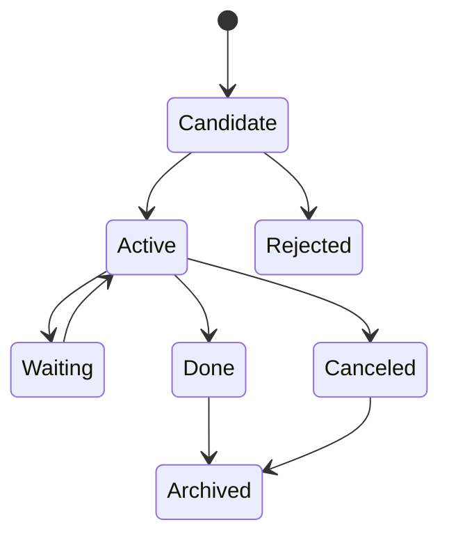
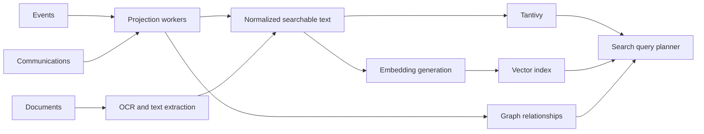

# Задача для DeepSeek: обновить русскую Obsidian wiki

## Safety instructions / Инструкции безопасности

- Do not print, infer, summarize, or request secrets. / Не печатай, не выводи, не пересказывай и не запрашивай секреты.
- Treat `.env`, credential, token, key, certificate, and private paths as redacted even if referenced. / Считай `.env`, учетные данные, токены, ключи, сертификаты и приватные пути редактированными.
- Keep code identifiers, file paths, commands, package names, API names, and ADR titles exactly as written. / Сохраняй идентификаторы кода, пути, команды, имена пакетов, API и названия ADR без изменений.
- Write wiki prose in Russian and keep Markdown Obsidian-compatible. / Пиши текст wiki на русском и сохраняй совместимость с Obsidian Markdown.
- Do not invent source facts. If the context is insufficient, state that explicitly. / Не выдумывай факты об исходниках. Если контекста недостаточно, напиши это явно.
- Every behavioral statement in proposed wiki pages must be directly supported by the embedded source text. / Каждое утверждение о поведении в предлагаемых wiki-страницах должно напрямую подтверждаться встроенным текстом исходников.
- Do not infer semantics for profiles, flags, annotations, environment variables, or framework conventions unless this context pack explicitly defines them. / Не выводи семантику профилей, флагов, аннотаций, переменных окружения или framework-конвенций, если этот context pack явно её не определяет.
- Do not add external background knowledge about tools, frameworks, or CLIs. / Не добавляй внешние справочные знания об инструментах, framework или CLI.
- When only a command or config value is visible, document only the literal command or value. For deeper meaning, write only that it is not confirmed by this context. / Когда видна только команда или значение конфигурации, документируй только буквальную команду или значение. Для более глубокого смысла пиши только, что он не подтвержден этим контекстом.
- Do not name likely related files unless they are embedded in this context pack. / Не называй вероятные связанные файлы, если они не встроены в этот context pack.
- Use only the embedded Source Files section below. Do not call tools, read files, inspect the filesystem, or access MCP/web resources. / Используй только встроенный ниже раздел Source Files. Не вызывай tools, не читай файлы, не инспектируй файловую систему и не обращайся к MCP/web ресурсам.
- If a referenced path or wiki page is not embedded in this context pack, report insufficient context instead of trying to open it. / Если упомянутый путь или wiki-страница не встроены в этот context pack, укажи недостаток контекста вместо попытки открыть файл.

## Chunk details / Детали чанка

- Chunk ID / ID чанка: `113-doc-docs-part-004`
- Group / Группа: `docs`
- Role / Роль: `doc`
- Status / Статус: `pending`
- Repository / Репозиторий: `/Users/avm/projects/Personal/hermes-hub`
- Wiki path / Путь wiki: `/Users/avm/projects/Personal/hermes-hub/docs/wiki`
- Metadata path / Путь metadata: `/Users/avm/projects/Personal/hermes-hub/docs/wiki/_meta`
- Plan generated at / План создан: `2026-06-28T19:48:55Z`
- Per-file source limit / Лимит источника на файл: `12000` characters

## Target pages / Целевые страницы

- `operations/documentation-map.md`

## Required Output / Требуемый результат

Return one Markdown response with these sections and no extra wrapper text. / Верни один Markdown-ответ с этими разделами и без дополнительной обертки.

### Summary / Резюме

Briefly describe what should change in the Russian wiki and why. / Кратко опиши, что нужно изменить в русской wiki и почему.

### Proposed pages / Предлагаемые страницы

For each target page, provide the wiki-relative path and full proposed Obsidian-compatible Markdown content. / Для каждой целевой страницы укажи путь относительно wiki и полный предложенный Markdown, совместимый с Obsidian.

### Source coverage / Покрытие источников

List each source file and the facts from it that the proposed pages cover. / Перечисли каждый исходный файл и факты из него, покрытые предложенными страницами.

### Drift candidates / Кандидаты на drift

List possible code/docs/ADR drift found in this chunk, or state that none is visible from the provided context. / Перечисли возможные расхождения кода, документации и ADR в этом чанке либо укажи, что из данного контекста они не видны.

## Source Files / Исходные файлы

### `docs/domains/signal-hub/gap-analysis.md`

- Resolved path / Полный путь: `/Users/avm/projects/Personal/hermes-hub/docs/domains/signal-hub/gap-analysis.md`
- Size bytes / Размер в байтах: `16685`
- Included characters / Включено символов: `12000`
- Truncated / Обрезано: `yes`

```markdown
# Signal Hub Gap Analysis

Status: target-vs-current gap analysis for the uploaded repository snapshot.

## Summary

The repository now has the first Signal Hub control-plane implementation on top
of the existing event foundation. The remaining gap is end-to-end migration of
provider producers and consumers onto accepted signal events.

The current final-mile validation gap is concrete: backend
`cargo clippy --manifest-path backend/Cargo.toml --all-targets --all-features -- -D warnings`
still reports the remaining cleanup in the new Signal Hub/communications wiring,
and frontend `pnpm lint` is now reduced to two oversized production files:
`src/domains/settings/components/SignalHubSettings.vue` and
`src/domains/communications/api/connectCommunications.ts`.

The largest gap is not transport. The largest gap is ownership: Hermes needs a
domain that owns source registry, source runtime policy, health, profiles,
fixtures, mute/pause/replay and source recovery without making Telegram, Mail or
WhatsApp separate product domains.

## Current Strengths

- Event envelope and append-only event log already exist.
- Event consumers already have retry/DLQ direction.
- Communications is already documented as the owner of communication state.
- Telegram and Mail docs already demote providers to integrations/channels.
- Architecture boundary ADRs already prohibit direct domain-to-domain mutation.
- PostgreSQL and Axum are already part of the backend stack.

## Missing Pieces

| Gap | Impact |
|---|---|
| Provider producers still use partial migration paths | Telegram provider-observation events now publish canonical raw signals through the durable outbox-dispatch path, Telegram fixture ingestion now emits canonical raw message signals, Telegram manual send/reply/forward responses now re-enter through canonical raw signals, and the TDLib runtime/history/search/background-command ingest paths now persist raw records through a neutral platform port and publish the same canonical raw Telegram signals without direct `domains::signal_hub` imports; central Mail sync/fixture workflows now publish canonical mail raw signals through the accepted-signal projection entry point, Mail delivery/read-notification callbacks now publish canonical `signal.raw.mail.delivery_status|read_receipt.observed` facts instead of writing Communications directly, and WhatsApp fixture ingestion now emits canonical raw signals too. The current repository does not yet implement a separate WhatsApp live send/reply/forward runtime path, so the remaining gap here is provider breadth outside the implemented Telegram/Mail/WhatsApp fixture-or-central slice rather than an undiscovered WhatsApp write bypass |
| Accepted-signal Communications consumers are not fully wired | Telegram provider-observation projection now accepts `signal.accepted.telegram.*` including the base `signal.accepted.telegram.message` path, Telegram fixture/manual-write/runtime-ingest message projection now routes through the accepted-signal owner helper instead of direct projection primitives, mail message acceptance is wired for central sync/fixture flows through the shared accepted-signal projection entry point, mail delivery/read callbacks now also re-enter Communications only from accepted Signal Hub events, WhatsApp fixture projection now accepts `signal.accepted.whatsapp.message`, and the synchronous accepted-signal helpers now also respect the durable runtime gate of `communication_provider_observation_projection` instead of bypassing paused consumer state. Remaining work here is broader accepted-signal consumer breadth and future provider/runtime surfaces that do not yet exist in the current repository slice |
| Capability coverage is still partial | Signal Hub now materializes first-class generic capability snapshots into durable `signal_capabilities` rows, serves them through REST/ConnectRPC and renders them in the Settings source inspector, but richer provider-specific operation matrices and side effects still primarily live on integration surfaces |
| ConnectRPC coverage is still partial | generated server/client wiring now exists in the build for source list/get/enable/disable, generic scoped disable/enable, capability list, scoped mute/unmute/pause/resume, connection CRUD, health, runtime list/update, policy list/create, replay request create/list, fixture catalog listing, fixture emission and fixture restore; root contracts now also include a provider-neutral `communications/v1/communications.proto` foundation alongside `common`, `events` and `signal_hub`, frontend generated code exists for those roots, and the frontend manifest now explicitly declares the required `@bufbuild/protobuf` and `@connectrpc/*` runtime dependencies instead of relying on transitive installation state; the backend now also serves a first provider-neutral `CommunicationsService` ConnectRPC slice for `ListMessages`, `GetMessage`, `TransitionMessageWorkflowState`, `TrashMessage`, `RestoreMessage`, `MarkMessageRead`, `DeleteMessageFromProvider`, `BulkMessageAction`, `ToggleMessagePin`, `ToggleMessageImportant`, `ToggleMessageMute`, `SnoozeMessage`, `AddMessageLabel`, `RemoveMessageLabel`, `ListMessageWorkflowStateCounts`, `RunWorkflowAction`, `ListSubscriptions`, `GetMailboxHealth`, `ListTopSenders`, `ListCommunicationBlockers`, `ListCommunicationPersonas`, `ListRichTemplates`, `UpsertRichTemplate`, `DeleteRichTemplate`, `RenderRichTemplate`, `PreviewRichTemplateMailMerge`, `SearchMessages`, `AnalyzeMessage`, `GetMessageExplain`, `GetMessageSmartCc`, `GetMessageExport`, `GetMessageAuth`, `GetMessageSignature`, `GenerateAiReply`, `GenerateAiReplyVariants`, `DetectMessageLanguage`, `TranslateMessage`, `ExtractMessageTasks`, `ExtractMessageNotes`, `SearchAttachments`, `GetAttachmentPreview`, `GetAttachmentArchiveInspection`, `TranslateAttachment`, `ListThreads`, `ListThreadMessages`, `TranslateThread`, `ListSavedSearches`, `CreateSavedSearch`, `UpdateSavedSearch`, `DeleteSavedSearch`, `ListFolders`, `CreateFolder`, `UpdateFolder`, `DeleteFolder`, `ListFolderMessages`, `CopyMessageToFolder`, `MoveMessageToFolder`, `ListDrafts`, `CreateDraft`, `DeleteDraft`, `ListOutbox`, `UndoOutboxItem`, confirmed `SendMessage` and `RedirectMessage`, and the frontend now also has a typed wrapper with targeted regression coverage for the current query/command surface; the remaining gap here is wider domain coverage that still uses compatibility paths, not the main Communications UI/API surface |
| Frontend boundary coverage is now only partially remaining | targeted frontend tests now prove generated Signal Hub client wrapper calls, query-key stability, realtime invalidation for the declared `signal.raw/accepted/rejected/muted/paused/resumed/replayed` families, the rule that Signal Hub stays under Settings without direct integration imports, and that the Settings component keeps rendering connection/runtime/health diagnostics from Settings-domain data instead of flattening them away; broader interactive component behavior coverage still remains if the UI surface grows materially |
| Signal profiles are still partial | system and custom profiles are now persisted, listed, created, updated, removed and applicable through Signal Hub, but richer profile composition beyond the current policy-list editor is still missing |
| Connection control is still partial | create/update/remove now exist for `signal_connections`, the Settings UI now also exposes connection-scoped policy/replay selectors on top of the backend support, connection status now reconciles connection-scoped operator policies for `paused`, `muted` and `disabled`, and Mail/Telegram/WhatsApp bootstrap+lifecycle handlers now auto-sync provider accounts into Signal Hub connection rows; richer settings validation, provider breadth and capability-driven side effects still remain |
| Health controls are still partial | health can now be listed and recomputed through Signal Hub run-health-check commands, and the `ai` source now has a source-specific runtime/models probe, but richer provider-specific ping/retry orchestration and capability-aware remediation are still missing |
| Dynamic subscriber/workflow controls are only partially implemented | core subscriber/scheduler runtime state can now be listed and switched through `signal_runtime_states`, bootstrap loops honor `running/paused/muted/stopped`, source-level controls now reconcile existing and lazy runtime rows with priority `disabled > paused > muted > running`, the synchronous Telegram/Mail/WhatsApp raw-signal helpers now respect the same `signal_hub_raw_signal_dispatcher` runtime gate before emitting accepted signals, the replay dispatcher also runs behind the same durable `system` runtime control surface, owner-facing AI command routes now respect the durable `ai_request_runtime` gate, communication-facing AI helpers for translation/reply drafting/task extraction now also respect that same `ai_request_runtime` gate and fall back cleanly when `ai` is muted or disabled, the current owner-facing AI run lifecycle/task-extraction path now also emits canonical `signal.raw.ai.*` and accepted `signal.accepted.ai.*` facts, the runtime-backed message translation, thread message translation, bilingual reply flow translations, LLM task extraction, note extraction, reply drafting/reply variant generation and attachment translation helper paths now also emit canonical `signal.raw.ai.*` and accepted `signal.accepted.ai.*` facts where LLM execution actually occurs, the current backend regression suite explicitly proves those named communication-facing helper slices, and dedicated ConnectRPC regressions now prove that pausing then resuming both `signal_hub_raw_signal_dispatcher` and `communication_provider_observation_projection` changes raw-to-accepted publication and accepted-signal materialization behavior immediately without process restart; the live Telegram TDLib runtime bridge now respects its own durable `telegram_runtime_event_bridge` gate before publishing runtime events; provider-wide breadth, broader AI source-event coverage beyond the current owner-facing path, and richer cross-source command semantics remain |
| Replay semantics are still partial | replay requests can now be created and executed through the background dispatcher for paused buffered raw signals, for event-log replay by raw-signal pattern plus position/time range, for consumer-targeted replay that rewinds one consumer cursor over a selected signal slice while preserving consumer idempotency markers, and for projection-targeted rebuild paths `timeline_event_log`, `communication_messages`, `person_derived_evidence` and `project_link_review_effects` that rewind either a projection cursor or the matching consumer cursor before replay while emitting `timeline.projection.updated`, `communications.projection.updated`, `persons.derived_evidence.updated` or `projects.link_review_effects.updated`; connection-scoped replay also works through non-secret `settings.account_id` bindings, but broader projection rebuild orchestration still remains |
| NATS dispatcher breadth is still narrow | outbox-to-JetStream dispatch is now wired and tested, and the same dispatcher now fans published events into the in-memory realtime bus for websocket delivery, but only the migrated Signal Hub write paths currently rely on it; broader event-source adoption is still pending |

## Migration Risks

- Duplicating event systems instead of extending `platform/events`.
- Treating Signal Hub as another integration folder.
- Letting Signal Hub write Communications/Tasks/Documents tables directly.
- Storing provider secrets or raw message bodies in Signal Hub state.
- Encoding fixture row IDs or FK references that break on future migrations.
- Introducing sidecar processes before the modular boundary is stable.
- Adding Redis as a second event system without a clear ownership problem.

## Closure Conditions

Signal Hub documentation can be considered imple
```
_Source file truncated after 12000 characters. / Исходный файл обрезан после 12000 символов._

### `docs/domains/signal-hub/modules.md`

- Resolved path / Полный путь: `/Users/avm/projects/Personal/hermes-hub/docs/domains/signal-hub/modules.md`
- Size bytes / Размер в байтах: `4626`
- Included characters / Включено символов: `4172`
- Truncated / Обрезано: `no`

````markdown
# Signal Hub Modules

Status: target module layout.

Signal Hub is implemented as a modular-monolith bounded context first. It must
not require sidecar provider processes in the initial implementation.

## Backend Target Layout

```text
backend/src/domains/signal_hub/
├── mod.rs
├── api/
│   ├── commands.rs
│   ├── queries.rs
│   └── dto.rs
├── core/
│   ├── entities.rs
│   ├── errors.rs
│   ├── policies.rs
│   ├── capabilities.rs
│   ├── health.rs
│   ├── profiles.rs
│   └── validation.rs
├── store/
│   ├── mod.rs
│   ├── sources.rs
│   ├── connections.rs
│   ├── capabilities.rs
│   ├── runtime.rs
│   ├── health.rs
│   ├── policies.rs
│   └── replay.rs
├── runtime/
│   ├── registry.rs
│   ├── controller.rs
│   ├── source.rs
│   └── fixture_source.rs
├── fixtures/
│   ├── loader.rs
│   ├── recovery.rs
│   ├── schema.rs
│   └── system.toml
└── projections/
    ├── dashboard.rs
    ├── source_list.rs
    └── health.rs
```

## Platform Event Target Layout

```text
backend/src/platform/events/
├── envelope.rs / models.rs
├── bus.rs
├── transport.rs
├── nats.rs
├── publisher.rs
├── dispatcher.rs
├── consumers.rs
├── cursors.rs
├── store.rs
├── replay.rs
└── validation.rs
```

Current repository files under `platform/events` should evolve instead of being
bypassed. New code must not create a second event subsystem.

## Contracts Target Layout

```text
contracts/
├── proto/
│   └── hermes/
│       ├── signal_hub/v1/signal_hub.proto
│       ├── events/v1/event_envelope.proto
│       ├── communications/v1/communications.proto
│       └── common/v1/ids.proto
└── README.md
```

If contracts remain inside backend at first, keep the same logical layout under:

```text
backend/contracts/proto/
```

## Frontend Target Layout

```text
frontend/src/domains/settings/
├── api/
│   └── signalHub.ts
├── queries/
│   └── useSignalHubQuery.ts
├── components/
│   └── SignalHubSettings.vue
├── views/
│   └── SettingsPage.vue
└── lib/
    └── signalHubReplay.ts
```

Current implementation keeps Signal Hub under Settings rather than a standalone
top-level frontend domain. Provider setup/runtime details can stay under
`frontend/src/integrations/*`, but the Settings-owned Signal Hub UI owns the
cross-source overview and source control commands.

## Required Traits / Ports

```rust
trait SignalSource {
    async fn start(&self) -> Result<(), SignalSourceError>;
    async fn stop(&self) -> Result<(), SignalSourceError>;
    async fn pause(&self) -> Result<(), SignalSourceError>;
    async fn resume(&self) -> Result<(), SignalSourceError>;
    async fn health_check(&self) -> Result<SignalHealthSnapshot, SignalSourceError>;
}

trait SignalPublisher {
    async fn publish_signal(&self, signal: NewEventEnvelope) -> Result<(), EventError>;
}

trait SignalFixtureSource {
    async fn emit_fixture(&self, fixture_id: &str) -> Result<(), SignalFixtureError>;
}
```

These are conceptual contracts. Exact Rust shape can change, but all provider
sources must be replaceable by deterministic fixture sources.

## Module Boundaries

Allowed:

- Signal Hub imports `platform/events`, `platform/settings`, `platform/audit`,
  `platform/secrets` resolver abstractions and its own modules.
- Signal Hub emits events for Communications, Radar, Calendar, Documents and
  other owners to consume.
- Integration adapters ask Signal Hub for source policy/runtime decisions through
  public ports.

Forbidden:

- Signal Hub directly writes `communication_*`, `task_*`, `document_*`,
  `calendar_*`, `persona_*` or `radar_*` tables.
- Signal Hub imports provider-specific stores from `backend/src/integrations/*`.
- Integration adapters import business domain stores or services.
- Signal Hub stores secret values or raw private message bodies.

## Code Size Rule

Signal Hub must follow existing Hermes anti-god-file rules:

- files over 700 lines require written justification;
- files over 1000 lines are architectural problems;
- avoid `manager.rs`, `service.rs`, `helper.rs` and `utils.rs` as large dumping
  grounds.

Preferred names are ownership-specific: `source_registry.rs`, `policy_store.rs`,
`fixture_loader.rs`, `runtime_controller.rs`, `health_projection.rs`.
````

### `docs/domains/signal-hub/operations.md`

- Resolved path / Полный путь: `/Users/avm/projects/Personal/hermes-hub/docs/domains/signal-hub/operations.md`
- Size bytes / Размер в байтах: `3520`
- Included characters / Включено символов: `3520`
- Truncated / Обрезано: `no`

````markdown
# Signal Hub Operations

Status: target operations contract.

Signal Hub operations are owner-facing controls for the external and synthetic
signal world.

## Control States

| State | Meaning |
|---|---|
| Enabled | source can capture and publish signals |
| Disabled | source should not run or publish |
| Muted | runtime may run, but publication is suppressed by policy |
| Paused | runtime may capture, but publication is buffered/deferred |
| Fixture-only | real source disabled; fixture source enabled |
| Replay-only | no live runtime; replay commands are allowed |

## Global Controls

Global controls affect all sources.

Use cases:

- integration tests;
- deterministic development mode;
- projection rebuild;
- emergency stop when a provider floods the system;
- privacy mode.

Global controls must be explicit and auditable. A global mute without an expiry
should be visually obvious in the UI. Humans will absolutely forget they muted
the universe and then blame the computer. Naturally.

## Selective Mute

Selective mute can target:

```text
source code
connection id
event type pattern
capability family
profile
```

Examples:

```text
mute telegram
mute telegram.message.*
mute mail.attachment.*
mute github.issue.*
mute all during test profile
```

## Pause And Buffer

Pause means Signal Hub can accept/capture events but must not publish to
downstream domain consumers until resumed.

Pause must record:

- policy id;
- source/connection scope;
- started_at;
- reason;
- owner/actor;
- buffered event count;
- maximum buffer policy.

If buffering is not supported for a source, pause degrades to mute and must make
that visible through capability state.

## Replay

Replay can target:

- source;
- connection;
- event type pattern;
- event position range;
- time range;
- target consumer;
- projection rebuild.

Replay must be idempotent and consumer-safe.

Consumers must not assume replay means a new fact. Replay means a previously
stored fact is delivered again for reconstruction, recovery or diagnostics.

## Health Checks

Health checks should produce durable, reviewable state:

```text
signal.source.health_changed
```

Health dimensions:

- runtime process/module state;
- provider authorization state;
- secret reference availability;
- last successful signal;
- last provider failure;
- backoff/retry state;
- capability degradation;
- fixture availability.

## Profiles

Profiles are named policy bundles.

Target system profiles:

| Profile | Intent |
|---|---|
| production | all configured real sources enabled according to owner settings |
| development | selected real sources enabled; noisy providers muted by default |
| testing | real sources muted/disabled; fixture sources enabled |
| maintenance | capture may pause; replay and projections allowed |

Profiles are not security boundaries. They are operational presets.

## UI Requirements

Signal Hub UI should show:

- all source cards;
- status and health;
- active mute/pause/global policies;
- active profile;
- last signal time;
- last error summary;
- replay jobs;
- fixture mode indicators;
- dangerous controls with explicit confirmation.

Recommended workspace:

```text
Settings / Signal Hub
```

or product-level:

```text
Hub / Signals
```

## Auditing

All control operations produce audit records and events:

```text
signal.policy.changed
signal.source.enabled
signal.source.disabled
signal.source.muted
signal.source.paused
signal.replay.requested
signal.fixture.restored
```

Audit payloads must be redacted.
````

### `docs/domains/signal-hub/spec.md`

- Resolved path / Полный путь: `/Users/avm/projects/Personal/hermes-hub/docs/domains/signal-hub/spec.md`
- Size bytes / Размер в байтах: `1784`
- Included characters / Включено символов: `1784`
- Truncated / Обрезано: `no`

````markdown
# Signal Hub Domain

Signal Hub is the domain that owns the durable registry and control state for
all signal sources in Hermes.

It exists because Hermes is a memory system that receives evidence from many
places, not a collection of provider apps. Email, Telegram, WhatsApp, GitHub,
Browser capture, RSS, Calendar, Filesystem, Home Assistant and fixtures are all
sources of signals.

## Owns

Signal Hub owns:

- SignalSource;
- SignalConnection;
- SignalCapability;
- SignalRuntime;
- SignalHealth;
- SignalPolicy;
- SignalProfile;
- SignalReplayRequest;
- system recovery fixture definitions;
- fixture source catalog metadata.

## Does Not Own

Signal Hub does not own:

- provider protocol code;
- provider secrets;
- raw private message bodies;
- Communication messages or conversations;
- Tasks;
- Personas;
- Documents;
- Calendar event source-of-truth state;
- Radar review lifecycle;
- Knowledge Graph relationships.

## Flow

```text
Signal Source
  -> Signal Hub policy/runtime control
  -> Event Backbone
  -> Owning domain consumer
  -> Projection / Memory / Knowledge
```

Communication sources follow:

```text
signal.telegram.message.observed
  -> communication.message.recorded
  -> radar.signal.detected
  -> review.item.promoted
  -> owning domain command
```

## Domain Rules

- Signal Hub emits events; it does not mutate other domains.
- Integration adapters ask Signal Hub for control state, but remain protocol
  owners.
- Signal Hub state is non-secret and policy-oriented.
- Recovery fixtures are canonical-code based and schema-agnostic.
- Fixture sources are first-class test sources.
- Mute, pause, resume and replay are core domain behavior, not testing hacks.

## Canonical Documentation

Detailed implementation docs live in [Signal Hub](README.md).
````

### `docs/domains/signal-hub/status.md`

- Resolved path / Полный путь: `/Users/avm/projects/Personal/hermes-hub/docs/domains/signal-hub/status.md`
- Size bytes / Размер в байтах: `27112`
- Included characters / Включено символов: `12000`
- Truncated / Обрезано: `yes`

```markdown
# Signal Hub Status

Status date: 2026-06-23.

## Overall Status

`IMPLEMENTATION STARTED`

Signal Hub is now implemented as a first backend/control-plane slice. Policy
evaluation applies to all raw signals, including `system` and `ai` sources.
The remaining work is provider migration breadth outside the now-migrated
Telegram/Mail/WhatsApp slices, richer provider-side control semantics beyond
the current bootstrap/lifecycle bridge, broader
projection-rebuild replay orchestration beyond the current paused-buffer /
event-log / consumer-targeted paths plus the first projection targets, and the
rest of the domain surface that is still outside the current ConnectRPC slice.
The current final-mile validation blockers are narrower: backend
`cargo clippy --all-targets --all-features -D warnings` still needs the
remaining Signal Hub cleanup pass, and frontend `pnpm lint` is now reduced to
two oversized production files, `src/domains/settings/components/SignalHubSettings.vue`
and `src/domains/communications/api/connectCommunications.ts`.

## Readiness

| Track | Readiness | Notes |
|---|---:|---|
| End-to-end uploaded plan | ~99% | foundation, policy engine, system and custom profiles, fixture restore, deterministic fixture emission, event outbox dispatcher and Settings UI are in place; Telegram provider-observation flow, fixture ingestion, TDLib runtime/history/search/background-command ingest paths and manual send/reply/forward response projection, central Mail sync/fixture flows, Mail delivery/read callbacks, WhatsApp fixture ingestion, and the current owner-facing AI run lifecycle/task-extraction path now use raw-to-accepted signal flow; runtime state control, connection control and the current generated ConnectRPC server/client slice now cover sources, source get/enable/disable with source-level runtime orchestration, generic scoped disable/enable, capability listing, scoped mute/unmute/pause/resume, profiles with create/update/remove/apply, connection CRUD, health list/check, runtime, policies, replay request create/list with event-log selectors, consumer-targeted replay, projection-targeted replay for `timeline_event_log`, `communication_messages`, `person_derived_evidence` and `project_link_review_effects`, fixture catalog listing, fixture emission and fixture restore; that ConnectRPC slice now also carries connection `settings`, health `evidence`, runtime timestamps/error diagnostics, profile policy definitions and durable capability rows instead of flattening those views into placeholders, and now also exposes the first provider-neutral `CommunicationsService` surface for message/thread/saved-search/folder/draft/outbox queries, workflow-state transition, workflow-state counts, workflow actions, local trash/restore, mark-read, provider-delete alias, bulk message action, pin/important/mute toggles, snooze, label add/remove, message search, message analysis/explain/smart-cc, message export, auth review, signature detection, AI reply drafting/variants, detect-language, single-message translation, task extraction, note extraction, attachment search, attachment preview, attachment archive inspection, attachment translation, thread translation, saved-search create/update/delete, folder create/update/delete/message actions, draft create/delete, outbox undo, confirmed send flow, redirect enqueue, communication personas, subscription/health/sender/blocker read models, and durable rich-template list/upsert/delete/render/mail-merge-preview behind the same `X-Hermes-Secret` guard, so the root `communications/v1` contract is no longer codegen-only on the backend; the frontend now also has a dedicated typed `communications/v1` ConnectRPC wrapper with targeted regression coverage for message/thread/saved-search/folder/draft/outbox, local-state/bulk-action, message-flag/label/snooze, multilingual/AI-helper, attachment query mapping, communication personas, rich templates, workflow-state transition, workflow-state counts, workflow actions, message search, mark-read/provider-delete alias, message analysis/explain/smart-cc, export/auth/signature, AI reply/variants, thread translation, saved-search CRUD, folder CRUD/message actions, draft create/delete, outbox undo, confirmed send flow and redirect enqueue, and the main Communications provider-neutral query entrypoints for messages, message detail, saved searches, folders, folder messages, drafts, outbox, threads, thread messages, local trash/restore, mark-read, provider-delete alias, bulk message action, pin/important/mute, snooze, label add/remove, analyze/explain/smart-cc, export/auth/signature, AI reply/variants, detect-language, single-message translation, task extraction, note extraction, attachment search, attachment preview, attachment archive inspection, attachment translation, workflow-state transition, workflow-state counts, workflow actions, message search, `translateThread`, `sendEmail`, `redirectMessage`, communication personas, draft save/delete, saved-search CRUD, folder CRUD/message actions, rich-template CRUD/render/preview and outbox undo now already call that ConnectRPC layer instead of compatibility REST; the Settings UI now renders those non-secret diagnostics directly in the sources/connections/runtime/health/profile lists instead of dropping them on the floor; the Settings Signal Hub UI now also exposes connection-scoped policy creation and connection-scoped replay requests on top of the existing backend support, connection status changes themselves reconcile connection-scoped operator policies for `paused`, `muted` and `disabled`, custom profile authoring/editing/removal now exists alongside system profile apply flow, provider bootstrap/lifecycle handlers for Mail, Telegram and WhatsApp now automatically create or update `signal_connections` so live operator controls for individual provider accounts no longer depend on manual Signal Hub setup, and the source inspector now shows first-class generic capability snapshots from durable `signal_capabilities` rows; the current frontend slice is now also covered by targeted tests for generated client wrappers, Signal Hub query keys, Settings-boundary placement/import rules, realtime invalidation for the declared `signal.raw.*`, `signal.accepted.*`, `signal.rejected.*`, `signal.muted.*`, `signal.paused.*`, `signal.resumed.*` and `signal.replayed.*` families, plus provider-neutral `communications/v1` query and command wrapper mapping, so the implemented control-plane and first communications contract layer have direct regression coverage instead of docs-only claims; the Communications accepted-signal owner now also consumes base `signal.accepted.telegram.message` events, direct projection primitives are no longer called from workflow/app paths, connection-scoped raw-signal policy and connection-scoped event-log replay now work through non-secret `settings.account_id` bindings, provider-observation raw signal facts now also use the durable outbox-dispatch path, synchronous raw-signal helpers now honor the durable `signal_hub_raw_signal_dispatcher` runtime state, synchronous accepted-signal projection helpers now honor the durable `communication_provider_observation_projection` runtime state, owner-facing AI command routes now honor the durable `ai_request_runtime` gate, owner-facing AI run events now also publish canonical `signal.raw.ai.*` plus accepted `signal.accepted.ai.*` facts through Signal Hub, communication-facing AI helpers now also honor the same durable `ai_request_runtime` gate and fall back to their existing no-LLM/heuristic behavior when `ai` is muted or disabled, and the current runtime-backed message translation, thread message translation, bilingual reply flow translations, LLM task-extraction, reply drafting/reply-variant generation, and attachment translation helper paths now also publish canonical `signal.raw.ai.*` plus accepted `signal.accepted.ai.*` facts through Signal Hub with targeted backend regression coverage on each named slice, Telegram TDLib realtime bridge events now honor their own durable runtime gate, and source-level runtime orchestration now consistently applies the priority `disabled > paused > muted > running` to both existing and lazy runtime rows; websocket realtime fan-out now follows the same persisted outbox-dispatch path for published `signal.*` events, and accepted-signal / domain-boundary rules are enforced in the architecture checker; the remaining repository-level gap is provider breadth plus richer provider-specific control semantics and any future projection rebuild targets that do not yet justify first-class replay coverage |
| Signal Hub control-plane slice | ~99% | source registry, first-class durable capability snapshots, system and custom profiles with create/update/remove/apply flow, policies, source get/enable/disable commands with source-level runtime orchestration, generic scoped disable/enable plus scoped mute/unmute/pause/resume commands, fixture restore, deterministic fixture emission, connection create/update/remove with operator-policy reconciliation for `paused`/`muted`/`disabled`, runtime read/write path, health list/check path including source-specific AI runtime probing, replay request create/list path, paused-buffer replay runtime, event-log position/time selectors, consumer-targeted replay preparation through consumer cursor rewind, projection-targeted rebuild paths for `timeline_event_log` via projection cursor rewind + `timeline.projection.updated`, `communication_messages` via accepted-signal consumer marker reset + `communications.projection.updated`, `person_derived_evidence` via consumer marker reset + `persons.derived_evidence.updated`, and `project_link_review_effects` via consumer marker reset + `projects.link_review_effects.updated`, connection-scoped raw-signal policy/replay bindings, core subscriber/runtime gating including owner-facing AI command runtime gating plus owner-facing AI raw/accepted source-event publication plus communication-facing AI helper gating/fallback plus runtime-backed single-message/thread translation, bilingual-reply translation, task-extraction, reply and attachment helper signal publication, unified source runtime priority `disabled > paused > muted > running` for existing and lazy runtime rows, outbox-to-JetStream dispatcher with realtime in-memory fan-out for published events, raw-signal decision flow, accepted-signal Communications boundaries and current ConnectRPC control/query slice exist |
| Provider migration to Signal Hub | ~82% | Telegram provider-observation events now publish `signal.raw.telegram.*.observed`, and those provider-observation raw facts now also enter the durable outbox-dispatch path instead of only appending to `event_log`; Telegram fixture ingestion now emits `signal.raw.telegram.message.observed` and projects only from `signal.accepted.telegram.message`, Telegram manual send/reply/forward response projection now also re-enters through the same raw-to-accepted path, and TDLib runtime/history/search/background-command ingest paths now persist provider raw records through a neutral platform port and publish the same canonical raw Telegram signal family without importing `domains::signal_hub` directly; the synchronous raw-signal dispatch helpers for Telegram/Mail/WhatsApp now also honor the durable runtime state of `signal_hub_raw_signal_dispatcher`, so pausing or stopping the system dispatcher prevents immediate accepted-signal emission even on direct helper paths and leaves the raw fact queued in the durable outbox flow; the synchronous accepted-signal projection helpers used by fixture ingest, mail sync, mail fixture projection and Telegram manual-send projection now also honor the durable runtime state of `communication_provider_observation_projection`, so pausing that consumer blocks immediate message projection even on sync app/workflow paths and leaves the accepted event for later durable consumption; the Communications accepted-signal cons
```
_Source file truncated after 12000 characters. / Исходный файл обрезан после 12000 символов._

### `docs/domains/signal-hub/testing.md`

- Resolved path / Полный путь: `/Users/avm/projects/Personal/hermes-hub/docs/domains/signal-hub/testing.md`
- Size bytes / Размер в байтах: `4050`
- Included characters / Включено символов: `4050`
- Truncated / Обрезано: `no`

````markdown
# Signal Hub Testing

Status: target testing strategy.

Signal Hub must be designed for tests from the first implementation. Tests
should not require live Telegram, WhatsApp, Mail, GitHub, browser or Home
Assistant providers unless the test explicitly validates a provider adapter.

## Testing Principle

Every real source must have a deterministic replacement.

```text
TelegramSource  -> FixtureTelegramSource
MailSource      -> FixtureMailSource
WhatsAppSource  -> FixtureWhatsAppSource
GitHubSource    -> FixtureGitHubSource
```

Domain tests should operate on signals, not live providers.

## Test Layers

| Layer | Event transport | Database | Purpose |
|---|---|---|---|
| Unit | InMemoryEventBus | none/fake store | policy, validation, fixture parsing |
| Domain integration | InMemoryEventBus or Postgres event store | test PostgreSQL | Signal Hub -> Communications/Radar flows |
| Event integration | NATS JetStream test container + PostgreSQL | test PostgreSQL | publish/consume/replay/DLQ behavior |
| Provider adapter | in-process runtime fixture or mocked provider | test PostgreSQL | protocol-specific parser/runtime boundary |
| E2E local | NATS JetStream + PostgreSQL + SSE | test PostgreSQL | UI-visible source controls and projections |

## Required Test Features

Signal Hub must support:

- global mute;
- selective source mute;
- event-pattern mute;
- pause/resume;
- replay;
- fixture-only profile;
- deterministic fixture emission;
- health check fakes;
- no-provider integration tests.

## FixtureSource Contract

Fixture sources emit normal Signal Hub events. Downstream domains must not know
whether an event came from Telegram, Mail, WhatsApp or a fixture.

```text
FixtureSource
  -> signal.telegram.message.observed
  -> communication.message.recorded
  -> radar.signal.detected
```

## No Live Provider In Core Tests

The following must not be required for core domain tests:

- TDLib login;
- WhatsApp QR login;
- IMAP server credentials;
- GitHub token;
- browser extension runtime;
- Home Assistant instance.

Those belong to provider-specific adapter tests.

## Mute Tests

Test cases:

```text
global mute suppresses all publication
source mute suppresses only selected source
pattern mute suppresses selected event family
muted source still updates health if configured
mute event is audited
mute expiry restores publication
```

## Pause Tests

Test cases:

```text
pause buffers events
resume publishes buffered events in deterministic order
pause degrades to mute when buffering unsupported
pause/resume preserves correlation_id and causation_id
pause does not drop health events unless policy says so
```

## Replay Tests

Test cases:

```text
replay by position range
replay by event type pattern
replay to one consumer
replay projection update flow
replay skips already-processed event when consumer idempotency says so
replay dead-letter after owner review
```

## Snapshot Testing

Use snapshot tests for:

- fixture parsing;
- event envelope shape;
- redacted error payloads;
- capability snapshots;
- health projection rows;
- ConnectRPC DTO examples.

The repository already uses `insta`; Signal Hub should continue using snapshot
assertions for contract drift.

## Mocking

Use mocks for ports, not for internal random functions.

Good:

```text
mock SignalSource
mock EventPublisher
mock SecretResolver
mock Clock
```

Bad:

```text
mock half of SignalHubService internals
```

## Deterministic IDs And Time

Tests should inject:

- clock;
- event id generator;
- provider event id generator for fixture events.

Do not depend on wall-clock time or random IDs in snapshot tests.

## CI Profile

The recommended CI profile:

```text
SignalProfile = testing
Real sources = disabled or muted
Fixture sources = enabled
Event transport = InMemoryEventBus for unit tests
PostgreSQL = testcontainer for integration tests
NATS JetStream = testcontainer for event transport tests
```

If testcontainers are not yet introduced in this repository slice, document the
gap rather than weakening the architecture.
````

### `docs/domains/tasks/README.md`

- Resolved path / Полный путь: `/Users/avm/projects/Personal/hermes-hub/docs/domains/tasks/README.md`
- Size bytes / Размер в байтах: `1294`
- Included characters / Включено символов: `1294`
- Truncated / Обрезано: `no`

```markdown
# Hermes Tasks

Status: documentation package aligned to the current repository structure.

Tasks are actionable units inside the Personal Memory System. Hermes is not a
task tracker. External trackers can be providers, but Hermes keeps local
context, evidence and relationships under owner control.

## Domain Boundary

A Task:

- has a lifecycle;
- has an owner/status;
- has source evidence or explicit manual provenance;
- can link to Personas, Organizations, Projects, Documents, Communications,
  Events, Decisions and Obligations.

A Task is not:

- every Obligation;
- every Follow-Up;
- a Project;
- an external issue copy without local context.

## Engine Use

- Obligation Engine creates obligation and task candidates from evidence.
- Risk Engine identifies blockers and attention signals.
- Search Engine finds task context.
- Timeline Engine shows task history.
- Memory Engine assembles task context packs.

## Current Implementation Surface

Implementation details, route counts and status live in:

- [API Reference](api.md)
- [Data Model](data-model.md)
- [Architecture](architecture.md)
- [Status](status.md)

## Navigation

- [Canonical Spec](./spec.md)
- [Architecture](./architecture.md)
- [API Reference](./api.md)
- [Data Model](./data-model.md)
- [Status](./status.md)
```

### `docs/domains/tasks/api.md`

- Resolved path / Полный путь: `/Users/avm/projects/Personal/hermes-hub/docs/domains/tasks/api.md`
- Size bytes / Размер в байтах: `1696`
- Included characters / Включено символов: `1562`
- Truncated / Обрезано: `no`

```markdown
# Tasks — API Reference

This file documents current compatibility routes. Canonical Task, Obligation
and Follow-Up definitions are maintained in `../../foundation/glossary.md`; health
and watchtower routes are read-model names, not separate domains.

Base: `/api/v1`

## Core

| Метод | Путь | Описание |
|---|---|---|
| GET | `/tasks` | Список (?status, ?project_id, ?source_type, ?limit) |
| POST | `/tasks` | Создать |
| GET | `/tasks/{id}` | Детали |
| PUT | `/tasks/{id}` | Обновить |
| POST | `/tasks/{id}/status` | Сменить статус |
| POST | `/tasks/{id}/archive` | Архивировать |

## Context & Evidence

| Метод | Путь |
|---|---|
| GET, POST | `/tasks/{id}/context-pack` |
| GET, POST | `/tasks/{id}/evidence` |
| GET, POST | `/tasks/{id}/relations` |
| GET, POST | `/tasks/{id}/checklist` |
| GET, POST | `/tasks/{id}/subtasks` |

## Intelligence

| Метод | Путь |
|---|---|
| POST | `/tasks/{id}/analyze` |

## Context Explanation & Search

| Метод | Путь |
|---|---|
| POST | `/tasks/brain` |
| GET  | `/tasks/search?q=` |
| GET  | `/tasks/daily-brief` |

## Providers & External

| Метод | Путь |
|---|---|
| GET, POST | `/tasks/providers` |
| GET | `/tasks/{id}/external` |

## Rules & Templates

| Метод | Путь |
|---|---|
| GET, POST | `/tasks/rules` |
| DELETE | `/tasks/rules/{id}` |
| GET | `/tasks/templates` |

## Risk, Attention & Analytics

| Метод | Путь |
|---|---|
| GET | `/tasks/watchtower` |
| GET | `/tasks/health` |
| GET | `/tasks/analytics` |

## Export

| Метод | Путь |
|---|---|
| GET | `/tasks/{id}/export?format=md\|json` |
```

### `docs/domains/tasks/architecture.md`

- Resolved path / Полный путь: `/Users/avm/projects/Personal/hermes-hub/docs/domains/tasks/architecture.md`
- Size bytes / Размер в байтах: `1297`
- Included characters / Включено символов: `1297`
- Truncated / Обрезано: `no`

````markdown
# Tasks Architecture

## Position

The Tasks domain owns actionable work-item lifecycle and evidence links. It uses
shared engines for priority, readiness, risk, context and obligation extraction.

## Modules

Paths below refer to `backend/src/domains/tasks/`.

| Module | Responsibility |
|---|---|
| `core.rs` | Task core, providers, external identities, evidence, relations, checklists, subtasks and status transitions |
| `candidates.rs` | task candidates created from Communications, Documents, Events or engines |
| `intelligence.rs` | engine-facing priority/readiness helpers |
| `brain.rs` | context answers over Search/Memory engines |
| `health.rs` | Risk Engine/attention views for stale or blocked work |
| `rules.rs` | rules and templates |
| `sync.rs` | export/import helpers |
| `api.rs` | current route handlers and DTO-facing compatibility surface |

## Layers

```text
API
  -> Task domain services
  -> shared engines for context, risk, obligations and search
  -> stores
  -> PostgreSQL
```

## Domain Rules

- AI and engine extraction produce candidates.
- Low-confidence candidates require review.
- Confirmed candidates can become Tasks.
- Obligations remain separate commitments even when they generate Tasks.
- Status changes and destructive operations must be auditable.
````

### `docs/domains/tasks/data-model.md`

- Resolved path / Полный путь: `/Users/avm/projects/Personal/hermes-hub/docs/domains/tasks/data-model.md`
- Size bytes / Размер в байтах: `1615`
- Included characters / Включено символов: `1615`
- Truncated / Обрезано: `no`

```markdown
# Tasks Data Model

## Tables

| Table | Phase | Purpose |
|---|---|---|
| `tasks` | 0 | actionable work items with status, priority, readiness and context fields |
| `task_candidates` | existing | AI/engine-extracted candidates requiring review |
| `task_provider_accounts` | 1 | external tracker accounts |
| `external_task_identities` | 1 | local-to-provider task identity mapping |
| `provider_status_mappings` | 1 | provider status mapping |
| `context_packs` | 2 | engine-owned derived task context packs; legacy `task_context_packs` is historical schema compatibility only |
| `task_evidence` | 2 | provenance for extracted or linked tasks |
| `task_relations` | 2 | links between tasks and world-model entities |
| `task_checklists` | 2 | checklist items |
| `task_subtasks` | 2 | task decomposition |
| `task_rules` | 4 | task automation rules |
| `task_templates` | 4 | task templates |
| `task_snapshots` | 4 | state snapshots |

## ID Formats

| Entity | Format |
|---|---|
| Task | `task:v1:{nanos_hex}` |
| Task Provider | `tprov:v1:{nanos_hex}` |
| Task Rule | `taskrule:v1:{nanos_hex}` |

## Statuses

`new` -> `triaged` -> `ready` -> `in_progress` -> `review` -> `done` -> `archived`

Blocking: `blocked`.

Waiting: `waiting`.

## Obligation Boundary

Obligations are commitments or duties with evidence. A Task may implement an
Obligation, but the Task table is not the canonical model for every Obligation.

## Pre-Seeded Templates

Bug, feature, research, contract review, AEAT response, client follow-up,
invoice review and code review templates are task creation aids, not domain
definitions.
```

### `docs/domains/tasks/spec.md`

- Resolved path / Полный путь: `/Users/avm/projects/Personal/hermes-hub/docs/domains/tasks/spec.md`
- Size bytes / Размер в байтах: `1663`
- Included characters / Включено символов: `1663`
- Truncated / Обрезано: `no`

````markdown
# Tasks Domain

## Responsibilities

The Tasks domain owns concrete actionable units with lifecycle, owner, status,
evidence and links to context.

A Task is not the same as an Obligation or Follow-Up:

- an Obligation is a commitment or duty with evidence;
- a Follow-Up is a prompt to revisit something;
- a Task is an actionable unit with status lifecycle.

## Task Sources

- manual creation;
- Communication extraction;
- Document extraction;
- meeting summary;
- Obligation Engine output;
- agent suggestion;
- imported task provider in future versions.

## Lifecycle



## Required Fields

- title;
- source or manual provenance;
- status;
- owner;
- created_at;
- updated_at;
- optional deadline;
- optional reminder policy;
- linked entities.

## Extraction Rules

AI extraction and engine output create task candidates, not automatically active
commitments, unless a user policy explicitly allows auto-activation for a
low-risk source.

Manual owner-created Tasks may exist without a `task_candidate_id`. Task
candidates are review surfaces, not the universal source of truth for every
Task.

Task candidate refresh must be idempotent by source evidence and candidate
title. Repeated extraction should update the same review surface instead of
creating duplicate candidates or overwriting an explicit owner review.

## Audit

Status changes, deadline changes, assignment changes and deletions must emit
events.
````

### `docs/domains/tasks/status.md`

- Resolved path / Полный путь: `/Users/avm/projects/Personal/hermes-hub/docs/domains/tasks/status.md`
- Size bytes / Размер в байтах: `6386`
- Included characters / Включено символов: `5616`
- Truncated / Обрезано: `no`

```markdown
# Tasks — Статус реализации

Этот файл описывает текущую реализацию. Канонические определения Task,
Obligation и Follow-Up находятся в `docs/foundation/glossary.md`.

The percentages below describe current Tasks implementation coverage only. They
are not product completion scores for Obligations, Decisions, Memory or
Polygraph.

## Реализовано (87/104 разделов спеки — 84%)

| § | Раздел | Доказательство |
|---|---|---|
| 1–2 | Назначение, принципы | ADR-0070, README |
| 3 | Провайдеры (schema) | `task_provider_accounts` — 10 providers, capabilities JSONB |
| 4 | Unified Inbox | `GET /tasks` с фильтрацией: status, project_id, source_type, limit |
| 5 | Local Task Layer | 30+ полей на `tasks`: AI summary, private notes, context, risks, why, outcome |
| 6 | Task Identity | `task_id` + `external_task_identities` — provider, account_id, external_project_id, external_task_id, external_url |
| 7 | Deduplication | `task_relations` с `relation_type = 'duplicates'` |
| 8 | Lifecycle | 10 статусов: new → triaged → ready → in_progress → waiting/blocked → review → done → cancelled → archived |
| 9 | Provider Status Mapping | `provider_status_mappings` — provider, external_status → hermes_status |
| 10 | Source Tracking | `source_type` CHECK — 18 источников (manual, email, telegram, whatsapp, calendar, meeting, jira, youtrack, github, ...) |
| 11 | Task Evidence | `task_evidence` — source_type, source_id, quote, confidence |
| 12 | Task Confidence | confidence REAL поле + Low → suggested inbox |
| 13 | Suggested Tasks | `GET /task-candidates` (existing pipeline) |
| 14 | AI Task Extraction | Существующий `task_candidates` pipeline из messages/documents |
| 15 | NL Task Creation | `POST /tasks` с NLP-ready полями |
| 17 | Context Pack | `engines/context_packs` owns task-derived packs; legacy `task_context_packs` is compatibility-only schema history |
| 18 | Task context explanation | `POST /tasks/brain` compatibility route → what, why, status, source, context, evidence |
| 19 | Task Why | `why` поле на `tasks` |
| 20 | Next Action | `suggest_next_action()` — template per status: "Review and set priority", "Start working", "Follow up: {reason}", "Resolve blockers", "Archive" |
| 21 | Blocking Intelligence | `hermes_status = 'blocked'` + `waiting_reason` |
| 22 | Waiting Tasks | `hermes_status = 'waiting'` + waiting_reason + waiting_too_long detector |
| 23 | Priority Score | `calculate_priority()` — deadline proximity, legal/tax context, Persona/Organization/Project presence, blockers |
| 24 | Risk Analysis | `calculate_risk()` — deadline close, missing docs, no owner, external dependency, legal, urgent keywords |
| 25 | Readiness Score | `calculate_readiness()` — description, context, docs, deadline, no blockers, Personas resolved |
| 26 | Missing Context Detector | `detect_missing_context()` — description, context pack, deadline, Persona, Project |
| 27 | Templates | `task_templates` — 8 pre-seeded: bug, feature, research, contract_review, aeat_response, client_followup, invoice_review, code_review |
| 28 | Checklists | `task_checklists` — CRUD, items JSONB |
| 29 | Dependencies | `task_relations` — blocks, blocked_by, depends_on, relates_to, duplicates, caused_by, derived_from, follow_up_for, parent, subtask |
| 30 | Subtasks | `task_subtasks` — parent_task_id, child_task_id, sort_order |
| 78 | Personal vs External | `confidentiality` поле |
| 79 | Confidentiality | `confidentiality` CHECK — public_to_provider, private_local, sensitive, confidential |
| 85 | Archive | `POST /tasks/{id}/archive` + `archived_at` поле |
| 86 | Completed Task Memory | `outcome` поле + `completed_at` timestamp |
| 87 | Task Outcome | `outcome` поле |
| 89 | Analytics | `GET /tasks/analytics` |
| 90 | Cycle Time | `cycle_time()` — average hours from created_at to completed_at |
| 91 | Workload | `workload()` — active_count + overdue_count |
| 93 | Priority Matrix | Доступен через сортировку по `priority_score` |
| 100.2 | Task model | 30+ полей на `tasks` |
| 100.3 | ExternalTaskIdentity | Таблица + API |
| 100.4 | TaskContextPack | Engine-owned `context_packs` + compatibility facade |
| 100.5 | TaskRelation | Таблица + API |
| 100.6 | TaskEvidence | Таблица + API |
| 100.7 | TaskChecklist | Таблица + API |
| 100.11 | TaskRule | Таблица + API |
| 100.13 | TaskSnapshot | Таблица готова |

## Deferred (12/104 — 11%)

| § | Раздел | Причина |
|---|---|---|
| 16 | Smart Task Creation Target | Нужна реальная интеграция с Jira/YouTrack/GitHub API |
| 31–71 | Focus Sessions, Sprint, Gantt, Time Tracking, External Sync | Нужна интеграция с внешними трекерами. Таблицы и API готовы |
| 72–73 | Developer Integration (PR, branch, CI) | Нужен GitHub/GitLab API |
| 74 | Bug Report Intelligence | Нужен NLP/LLM для конвертации текста в структуру |
| 75–77 | Research/Decision/Review Tasks | Специализированные поля доступны через `task_metadata` JSONB |
| 81 | Offline Mode | Нужна local-first архитектура (IndexedDB/SQLite) |
| 82–83 | Import/First-run | Нужен парсинг внешних форматов |
| 94 | Command Palette | Нужен Cmd+K UI |
| 96 | Notifications Center | Нужна OS notification интеграция |
| 100.8–100.10 | Comments, Attachments, Worklog | Нужна интеграция с API провайдеров |
| 101 | UI Scenarios | Нет фронтенд-виджетов (типы и API готовы) |

## Out of scope (§103)

Сознательно исключены: enterprise PM, SaaS, биллинг, marketplace, замена Jira, agile-методология, HR capacity planning, team permissions, multi-tenant.

## Метрики

| Метрика | Значение |
|---|---|
| Rust-модулей | 7 |
| Таблиц | 13 |
| API endpoint | 25 |
| Миграций | 4 |
| ADR | 3 |
| Тестов | 18 |
```

### `docs/engines/README.md`

- Resolved path / Полный путь: `/Users/avm/projects/Personal/hermes-hub/docs/engines/README.md`
- Size bytes / Размер в байтах: `3444`
- Included characters / Включено символов: `3444`
- Truncated / Обрезано: `no`

```markdown
# Hermes Engine Catalog

Status: documentation package aligned to the current repository structure.

Engines are reusable system mechanisms. They are used by domains but do not own
domain source-of-truth entities.

Canonical foundation map: [Foundation Engines](../foundation/engines.md).

## Engine Boundary

An engine may:

- read domain entities and event history;
- build derived views;
- emit candidates, observations, scores or review items;
- maintain rebuildable projections or indexes.

An engine must not:

- become the owner of Persona, Organization, Project, Task, Document,
  Communication, Decision or Obligation truth;
- silently overwrite accepted memory;
- hide uncertainty;
- emit conclusions without provenance.

## Engine Specs

| Engine | Spec |
|---|---|
| Memory Engine | [Memory Engine](memory/README.md) |
| Timeline Engine | [Timeline Engine](timeline/README.md) |
| Trust Engine | [Trust Engine](trust/README.md) |
| Search Engine | [Search Engine](search/README.md), [architecture](search/architecture.md) |
| Enrichment Engine | [Enrichment Engine](enrichment/README.md) |
| Obligation Engine | [Obligation Engine](obligation/README.md) |
| Risk Engine | [Risk Engine](risk/README.md) |
| Consistency / Contradiction Engine | [Consistency / Contradiction Engine](consistency/README.md) |
| Automation Engine | [Automation Engine](automation/README.md) |
| Context Packs Engine | [Context Packs Engine](context-packs/README.md) |
| Identity Resolution Engine | [Identity Resolution Engine](identity-resolution/README.md) |
| Relationship Candidate Engine | [Relationship Candidate Engine](relationships/README.md) |
| Call Intelligence Engine | [Call Intelligence Engine](call-intelligence/README.md) |
| Speaker Identity Engine | [Speaker Identity Engine](speaker-identity/README.md) |

## Package Shape

Engine documentation mirrors `backend/src/engines/<engine>/` where possible.
Use `README.md` for engine semantics and add `architecture.md`, `api.md`,
`status.md`, `gap-analysis.md` or `modules.md` only when the current
implementation needs that detail.

## Current Implementation Evidence

The current repository contains dedicated baseline modules for:

- `backend/src/engines/automation.rs` and `backend/src/engines/automation/`;
- `backend/src/engines/call_intelligence/`;
- `backend/src/engines/search.rs`;
- `backend/src/engines/consistency.rs`;
- `backend/src/engines/context_packs/`;
- `backend/src/engines/enrichment/`;
- `backend/src/engines/identity_resolution/`;
- `backend/src/engines/memory.rs` and `backend/src/engines/memory/`;
- `backend/src/engines/obligation/`;
- `backend/src/engines/relationships/`;
- `backend/src/engines/risk/`;
- `backend/src/engines/speaker_identity/`;
- `backend/src/engines/timeline.rs` and `backend/src/engines/timeline/`;
- `backend/src/engines/trust/`.

Many other engine-like behaviors are still domain-local:

- `backend/src/domains/persons/memory.rs`;
- `backend/src/domains/persons/trust.rs`;
- `backend/src/domains/persons/enrichment_engine.rs`;
- `backend/src/domains/organizations/memory.rs`;
- `backend/src/domains/*/health.rs`;
- `backend/src/domains/*/intelligence.rs`;
- `backend/src/workflows/email_intelligence.rs`.

That implementation shape is a migration fact, not a domain rule. Future
refactors should move shared reusable behavior toward engine boundaries only
after an implementation plan and ADR where persistence or public contracts
change.
```

### `docs/engines/automation/README.md`

- Resolved path / Полный путь: `/Users/avm/projects/Personal/hermes-hub/docs/engines/automation/README.md`
- Size bytes / Размер в байтах: `1227`
- Included characters / Включено символов: `1227`
- Truncated / Обрезано: `no`

```markdown
# Automation Engine

Status: code-aligned documentation package created from current backend
modules.

The Automation Engine is a reusable policy and dry-run mechanism for owner
approved automation. It is not a provider adapter and not a task or
communication domain.

## Current Implementation Evidence

Current backend files:

- `backend/src/engines/automation.rs`;
- `backend/src/engines/automation/models.rs`;
- `backend/src/engines/automation/policy.rs`;
- `backend/src/engines/automation/store.rs`;
- `backend/src/engines/automation/validation.rs`;
- `backend/src/engines/automation/dry_run.rs`.

The current implementation exports:

- `AutomationTemplate`;
- `AutomationPolicy`;
- `TelegramSendDryRunRequest`;
- `TelegramSendDryRunResponse`;
- `AutomationStore`.

The implemented policy baseline validates declared template variables, enabled
policy state, expiry, allowed chat ids, JSON object payloads and
`max_sends_per_hour`. The current owner-facing dry-run surface is Telegram send
automation.

## Boundary Rule

Automation can evaluate policy and produce dry-run or command metadata. It must
not bypass owner-visible provider-write capability, provider runtime policy or
the target integration command boundary.
```

### `docs/engines/call-intelligence/README.md`

- Resolved path / Полный путь: `/Users/avm/projects/Personal/hermes-hub/docs/engines/call-intelligence/README.md`
- Size bytes / Размер в байтах: `2448`
- Included characters / Включено символов: `2428`
- Truncated / Обрезано: `no`

````markdown
# Call Intelligence Engine

The Call Intelligence engine transforms a Call Bundle into structured,
evidence-backed candidates.

It does not create domain objects directly. It creates candidates that Radar,
Review or a workflow can promote later.

## Pipeline

```text
Call Bundle
↓
Artifact validation
↓
Transcription
↓
Diarization
↓
Speaker identity merge
↓
Topic timeline
↓
Entity extraction
↓
Decision detection
↓
Action item detection
↓
Knowledge extraction
↓
Radar projection
```

## Output classes

```text
summary
transcript segment
topic segment
speaker identity candidate
person candidate
organization candidate
project candidate
document reference
decision candidate
action item candidate
open question candidate
risk signal
radar signal
knowledge note candidate
```

## Candidate schema

```json
{
  "candidate_kind": "decision",
  "title": "Use provider-neutral Call Bundle for meeting memory",
  "confidence": 0.84,
  "evidence": {
    "bundle_id": "call_...",
    "transcript_segments": [42, 43],
    "time_range": {
      "start_ms": 912000,
      "end_ms": 972000
    },
    "source_artifacts": ["audio.mp3", "transcript.json"]
  }
}
```

## Decision detection

Decision candidates should capture durable commitments:

```text
We decided to use X.
We will not support Y.
The target architecture is Z.
This issue is accepted/rejected/deferred.
```

A decision candidate can later become:

```text
ADR candidate
project note
knowledge graph edge
meeting outcome
```

## Action detection

Action item candidates should preserve assignment uncertainty:

```json
{
  "candidate_kind": "action_item",
  "title": "Implement Telemost provider runtime",
  "assignee_hint": "Alex",
  "due_date_hint": null,
  "confidence": 0.77,
  "truth_status": "candidate"
}
```

The engine must not create a Task directly. It sends the candidate through
Radar/Review so the owning workflow can preserve source evidence and user
review semantics.

## Topic timeline

Topic segments allow replay and search by discussion area:

```json
{
  "title": "Audio capture architecture",
  "start_ms": 300000,
  "end_ms": 620000,
  "confidence": 0.81,
  "evidence_segments": [12, 13, 14, 15]
}
```

## Screen intelligence

When screenshots exist, the engine can trigger:

```text
OCR
UI detection
diagram detection
code snippet detection
document reference extraction
```

These outputs become knowledge candidates with screenshot/time evidence.
````

### `docs/engines/consistency/README.md`

- Resolved path / Полный путь: `/Users/avm/projects/Personal/hermes-hub/docs/engines/consistency/README.md`
- Size bytes / Размер в байтах: `4394`
- Included characters / Включено символов: `4394`
- Truncated / Обрезано: `no`

````markdown
# Consistency / Contradiction Engine

Status: documentation package aligned to the current repository structure.

User-facing alias: Polygraph.

The Consistency / Contradiction Engine detects conflicts between new evidence
and accepted memory or knowledge.

It does not determine that a person is lying. It does not silently overwrite
truth. It creates source-backed contradiction observations and review items.

## Responsibilities

The engine produces:

- contradiction observations;
- stale fact warnings;
- disputed claim candidates;
- mismatched obligation signals;
- conflicting decision signals;
- review items for the owner or an authorized agent.

It does not own:

- accepted memory;
- domain truth;
- relationship trust;
- final conflict resolution;
- punitive judgments about Personas.

## Inputs

- new communications;
- documents and document versions;
- meeting or call notes;
- decisions;
- obligations;
- accepted facts;
- memory records;
- knowledge graph relationships;
- source reliability and trust signals.

## Detection Scope

The engine detects:

- direct contradictions;
- stale facts;
- conflicting dates;
- conflicting ownership or responsibility claims;
- obligation status conflicts;
- decision conflicts;
- claims that weaken an existing trust assumption.

## Output Model

```yaml
ContradictionObservation:
  id:
  old_source:
  new_source:
  affected_entities:
  conflict_type:
  old_claim:
  new_claim:
  confidence:
  severity:
  review_state:
  created_at:
```

## Review Rules

The engine can suggest:

- accept new claim;
- keep existing memory;
- mark both claims disputed;
- split entities;
- update relationship confidence;
- create a task or follow-up for manual verification.

The owner or an explicitly authorized policy decides what becomes accepted
memory.

## Current Implementation Evidence

Current backend baseline:

- `backend/migrations/0062_create_contradiction_observations.sql`;
- `backend/src/engines/consistency.rs`;
- `backend/src/engines/consistency/`;
- `backend/src/app/handlers/consistency.rs`;
- `backend/src/application/consistency_review.rs`;
- `backend/tests/consistency_contradiction.rs`;
- `backend/tests/contradictions_api.rs`;
- ADR-0087.

This baseline provides structured direct-contradiction detection and
reviewable `ContradictionObservation` persistence. It also provides a
deterministic baseline that extracts simple structured claim lines from
Communication and Document evidence, for example `status: blocked` or
`location=Madrid`, and limited natural-language `location` / `status` patterns,
for example `I am now in Madrid` or `status is blocked`. It feeds those claims
into the contradiction detector.
`ContradictionObservationStore::refresh_deterministic_observations` now adds the
first backend refresh paths from projected Communication messages, imported
Documents, meeting notes and call transcripts to Polygraph: active
`person_facts` are treated as accepted Memory claims, matched through the
compatibility `persons.email_address` field, active Telegram/WhatsApp
`person_identities`, `event_participants.person_id` or active Telegram call
identity, and compared with structured claims extracted from projected email
message subject/body evidence, projected Telegram/WhatsApp message evidence
matched by provider `sender_id`, Document title/extracted-text evidence that
references the Persona email, meeting-note content for linked event
participants or successful call transcript text for linked Telegram identities.
Guarded backend routes can list open contradiction observations and update
review state without automatically overwriting Memory. The Knowledge workspace
now includes a Polygraph review panel for listing open observations and
confirming or rejecting them. It does not yet provide broad natural-language
claim extraction from Communications and Documents.

## Migration Plan

1. Keep this spec as the source for Polygraph terminology.
2. Keep reviewable contradiction observations, not automatic memory rewrites.
3. Expand refresh wiring beyond projected email/Telegram/WhatsApp messages,
   imported Documents, meeting notes and call transcripts to broader provider
   evidence.
4. Expand natural-language claim extraction beyond deterministic `location` and
   `status` patterns behind explicit review policy.
5. Feed reviewed outcomes into Memory, Trust, Risk and Relationship semantics.
````

### `docs/engines/context-packs/README.md`

- Resolved path / Полный путь: `/Users/avm/projects/Personal/hermes-hub/docs/engines/context-packs/README.md`
- Size bytes / Размер в байтах: `1150`
- Included characters / Включено символов: `1150`
- Truncated / Обрезано: `no`

```markdown
# Context Packs Engine

Status: code-aligned documentation package created from ADR-0096 and current
backend modules.

Context Packs are rebuildable context bundles derived from observations,
domains, knowledge, relationships and prior decisions. They are engine output,
not source-of-truth domain records.

ADR source of truth:

- [ADR-0096 Canonical Evidence, Review Inbox and Context Packs](../../adr/ADR-0096-canonical-evidence-review-and-context-packs.md)

## Current Implementation Evidence

Current backend files:

- `backend/src/engines/context_packs/mod.rs`;
- `backend/src/engines/context_packs/models.rs`;
- `backend/src/engines/context_packs/store.rs`.

Current model kinds include:

- persona;
- meeting;
- task;
- calendar;
- project.

Current source kinds include observations, domain entities, knowledge,
relationships, decisions, tasks, obligations, documents, calendar events and
projects.

## Boundary Rule

Context Packs may persist rebuildable content and source links in
`context_packs` and `context_pack_sources`. They must not become the canonical
owner of memory, domain truth, provider records or accepted review outcomes.
```

### `docs/engines/enrichment/README.md`

- Resolved path / Полный путь: `/Users/avm/projects/Personal/hermes-hub/docs/engines/enrichment/README.md`
- Size bytes / Размер в байтах: `2548`
- Included characters / Включено символов: `2548`
- Truncated / Обрезано: `no`

```markdown
# Enrichment Engine

Status: documentation package aligned to the current repository structure.

The Enrichment Engine proposes new candidate knowledge.

Enrichment is not authority. It suggests updates that domains can review or
accept according to policy.

## Responsibilities

The Enrichment Engine produces:

- entity candidates;
- relationship candidates;
- profile and dossier observations;
- missing-field suggestions;
- conflict candidates;
- evidence-backed enrichment notes.

It does not own:

- accepted domain truth;
- external-source policy;
- provider credentials;
- automatic overwrites.

## Inputs

- provider records;
- public or approved local sources;
- documents;
- communications;
- graph context;
- existing memory;
- owner-approved enrichment policies.

## Output Requirements

Enrichment output must include:

- source;
- extracted claim;
- affected entity;
- confidence;
- review state;
- freshness;
- conflict markers when it disagrees with accepted memory.

## Current Implementation Evidence

Current implementation includes enrichment modules under Persons and
Organizations. That is a current shape, not a reason to create separate
per-domain engines.

The first backend Enrichment Engine baseline lives in
`backend/src/engines/enrichment/`. It converts deprecated Persona
compatibility `persons.is_favorite` state into a source-backed preference draft:

- preference type: `ui:favorite`;
- value: `true`;
- source: `persons.is_favorite:<persona_id>`;
- confidence: `1.0`.

`PersonEnrichmentStore` uses this draft when materializing compatibility
`person_preferences`. Turning the favorite state off removes the compatibility
preference and does not create a replacement draft.

The shared engine also builds source-backed Persona observation candidates for
legacy `enrichment_results`. These candidates preserve:

- affected entity kind and ID;
- source reference;
- extracted claim;
- confidence;
- pending review state;
- freshness marker;
- conflict marker.

`EnrichmentResultStore` uses this draft before writing compatibility
`enrichment_results`, storing the candidate metadata under `_enrichment` in the
existing JSON payload without changing the table shape.

## Migration Plan

1. Keep compatibility favorite-to-preference assembly in the Enrichment Engine.
2. Keep enrichment outputs as candidates or observations.
3. Define approved sources per domain before automated enrichment.
4. Feed conflicts to the Consistency / Contradiction Engine.
5. Preserve provenance and freshness for all suggested updates.
```

### `docs/engines/identity-resolution/README.md`

- Resolved path / Полный путь: `/Users/avm/projects/Personal/hermes-hub/docs/engines/identity-resolution/README.md`
- Size bytes / Размер в байтах: `922`
- Included characters / Включено символов: `922`
- Truncated / Обрезано: `no`

```markdown
# Identity Resolution Engine

Status: code-aligned documentation package created from ADR-0096 and current
backend modules.

The Identity Resolution Engine creates evidence-backed candidates that two
subjects may represent the same entity.

ADR source of truth:

- [ADR-0096 Canonical Evidence, Review Inbox and Context Packs](../../adr/ADR-0096-canonical-evidence-review-and-context-packs.md)

## Current Implementation Evidence

Current backend file:

- `backend/src/engines/identity_resolution/mod.rs`.

The current implementation exports:

- `IdentityResolutionSubject`;
- `IdentityResolutionCandidate`;
- `IdentityResolutionError`.

Candidates require two different subjects, confidence in the inclusive
`0.0..=1.0` range and at least one evidence observation id.

## Boundary Rule

The engine proposes identity resolution candidates. Personas or another owning
domain must own accepted identity state after review.
```

### `docs/engines/memory/README.md`

- Resolved path / Полный путь: `/Users/avm/projects/Personal/hermes-hub/docs/engines/memory/README.md`
- Size bytes / Размер в байтах: `3692`
- Included characters / Включено символов: `3692`
- Truncated / Обрезано: `no`

```markdown
# Memory Engine

Status: documentation package aligned to the current repository structure.

The Memory Engine assembles durable, source-backed context across Hermes.

Memory is not a generic note store and not an AI summary. Memory is accepted,
reviewable understanding derived from evidence.

## Responsibilities

The Memory Engine produces:

- memory views;
- context packs;
- memory gaps;
- stale-memory candidates;
- source-backed summaries;
- recall inputs for agents.

It does not own:

- domain entities;
- raw communications;
- document versions;
- graph relationships;
- private-data fine-tuning.

## Inputs

- canonical events;
- accepted facts;
- relationship records;
- communications;
- documents;
- projects;
- tasks;
- decisions;
- obligations;
- owner-reviewed observations.

## Output Requirements

Every durable memory output must include:

- source citations;
- affected entities;
- confidence or review state;
- created or updated time;
- actor or process that produced it;
- invalidation or supersession behavior where relevant.

## Current Implementation Evidence

Memory behavior currently exists inside domain modules such as
`persons/memory.rs` and `organizations/memory.rs`, plus project and document
memory plans. This is acceptable during migration but should not be documented
as separate engines per domain.

The first backend Memory Engine baseline lives in `backend/src/engines/memory.rs`.
It converts deprecated Persona compatibility `persons.notes` text into a
source-backed Persona memory-card draft:

- title: `Compatibility notes`;
- description: trimmed notes text;
- source: `persons.notes:<persona_id>`;
- confidence: `1.0`;
- importance: `5`.

`PersonEnrichmentStore` uses this draft when materializing compatibility
`person_memory_cards`. Empty notes remove the compatibility memory-card source
and do not create a new card.

The shared engine also builds source-backed accepted Persona fact drafts for
compatibility `person_facts`. These drafts preserve affected entity, fact type,
value, source citation, confidence, accepted review state and the producing
process before the compatibility store writes the record.

The shared engine now also assembles bounded source-backed entity context packs
from accepted fact drafts and memory-card drafts. A context pack preserves the
affected entity, ordered memory items, deduplicated source citations, aggregate
confidence and producing process. It is a derived recall input, not a source of
truth.

The shared engine also detects required fact gaps for an entity. Gap outputs are
derived review candidates with affected entity, missing fact type, deterministic
source reference, suggested review state and producing process. They do not
create facts by themselves.

The shared engine also emits stale-memory candidates for accepted facts whose
verification timestamp is missing or older than a caller-provided threshold.
These candidates preserve source citation, confidence and last verification
time, and only request review. They do not decay confidence or overwrite the
fact directly.

## Migration Plan

1. Keep compatibility notes-to-card assembly in the Memory Engine.
2. Keep source-backed Persona fact normalization in the Memory Engine.
3. Keep source-backed context pack assembly in the Memory Engine.
4. Keep required fact gap detection in the Memory Engine.
5. Keep stale-memory candidate detection in the Memory Engine.
6. Keep domain-specific memory docs focused on owned source records.
7. Move reusable memory assembly language to this engine spec.
8. Preserve source citations and review state before expanding automation.
9. Treat AI summaries as derived observations until reviewed.
```

### `docs/engines/obligation/README.md`

- Resolved path / Полный путь: `/Users/avm/projects/Personal/hermes-hub/docs/engines/obligation/README.md`
- Size bytes / Размер в байтах: `2701`
- Included characters / Включено символов: `2701`
- Truncated / Обрезано: `no`

```markdown
# Obligation Engine

Status: documentation package aligned to the current repository structure.

The Obligation Engine detects commitments, duties and expected actions from
evidence.

It can create candidates for the Obligations and Tasks domains. It does not make
every obligation into a task.

## Responsibilities

The Obligation Engine produces:

- obligation candidates;
- follow-up candidates;
- task candidates;
- missing-response signals;
- due-date candidates;
- fulfillment evidence suggestions.

It does not own:

- accepted obligation truth;
- task lifecycle;
- calendar event identity;
- communication source records.

## Inputs

- communications;
- meetings and calls;
- documents;
- decisions;
- calendar events;
- owner rules;
- accepted obligations and tasks.

## Output Requirements

Every obligation candidate must include:

- source evidence;
- obligated party;
- beneficiary or counterparty when known;
- statement;
- due date or condition when detected;
- confidence;
- review state.

## Current Implementation Evidence

Current backend state:

- `backend/src/engines/obligation/` provides a deterministic candidate
  detection baseline for explicit commitment and request language;
- the Obligations domain has a persistence baseline in
  `backend/migrations/0063_create_obligations.sql` and
  `backend/src/domains/obligations/mod.rs`;
- `backend/src/domains/obligations/api.rs` exposes guarded backend routes for
  listing entity-scoped Obligations and changing accepted Obligation review
  state;
- message and document task candidate refresh in
  `backend/src/domains/tasks/candidates.rs` use the engine for explicit
  commitment/request language that the legacy task scanner does not match;
- related candidate behavior still appears in task candidate, task rule and
  task intelligence modules.

The engine baseline remains candidate-first. The message and document task
candidate wiring creates reviewable candidates only. It does not write accepted
Obligations, create Tasks, run full provider ingestion or provide broad review
candidate-to-Obligation routing. The desktop Tasks workspace now provides a
scoped review panel for already persisted entity-scoped Obligations and
Decisions.

## Migration Plan

1. Keep extracted obligations as candidates until reviewed.
2. Feed reviewed candidates into the ADR-0088 Obligations domain model.
3. Extend the current message/document task candidate wiring to full
   Communication, meeting and provider ingestion.
4. Link accepted obligations to tasks, events and communications.
5. Use Risk Engine for overdue or blocked obligations.
6. Use Consistency / Contradiction Engine when evidence conflicts with
   fulfillment state.
```

### `docs/engines/relationships/README.md`

- Resolved path / Полный путь: `/Users/avm/projects/Personal/hermes-hub/docs/engines/relationships/README.md`
- Size bytes / Размер в байтах: `1009`
- Included characters / Включено символов: `1009`
- Truncated / Обрезано: `no`

```markdown
# Relationship Candidate Engine

Status: code-aligned documentation package created from ADR-0096 and current
backend modules.

The Relationship Candidate Engine proposes source-backed links between
entities. It is separate from the Relationships domain, which owns accepted
Relationship records.

ADR source of truth:

- [ADR-0096 Canonical Evidence, Review Inbox and Context Packs](../../adr/ADR-0096-canonical-evidence-review-and-context-packs.md)

## Current Implementation Evidence

Current backend file:

- `backend/src/engines/relationships/mod.rs`.

The current implementation exports:

- `RelationshipSubject`;
- `RelationshipCandidate`;
- `RelationshipEngineError`.

Candidates require source and target subjects, a non-empty relationship type,
confidence in the inclusive `0.0..=1.0` range and at least one evidence
observation id.

## Boundary Rule

The engine creates relationship candidates. Accepted relationship truth belongs
to [Relationships Domain](../../domains/relationships/README.md).
```

### `docs/engines/risk/README.md`

- Resolved path / Полный путь: `/Users/avm/projects/Personal/hermes-hub/docs/engines/risk/README.md`
- Size bytes / Размер в байтах: `2539`
- Included characters / Включено символов: `2539`
- Truncated / Обрезано: `no`

```markdown
# Risk Engine

Status: documentation package aligned to the current repository structure.

The Risk Engine detects evidence-backed conditions that may require attention.

Risk is not generic anxiety text. A risk observation must identify what is at
risk, why, and which evidence supports it.

## Responsibilities

The Risk Engine produces:

- risk observations;
- attention signals;
- blocker signals;
- stale-state warnings;
- suspicious-source signals;
- risk review items.

It does not own:

- task status;
- project state;
- organization truth;
- relationship truth;
- final owner decisions.

## Inputs

- tasks;
- projects;
- organizations;
- communications;
- obligations;
- contradiction observations;
- trust signals;
- deadlines and events.

## Output Requirements

Risk output must include:

- affected entity;
- risk type;
- evidence;
- confidence;
- severity;
- suggested handling state;
- review state.

## Current Implementation Evidence

Risk-like behavior is currently named through domain-local `health` and
`intelligence` modules in Calendar, Organizations, Persons and Tasks. Those
modules should be treated as current implementation surfaces, not separate
engine ownership.

The first backend Risk Engine baseline lives in `backend/src/engines/risk/`.
It derives an attention status from unresolved risk severities:

- no unresolved risk -> `healthy`;
- unresolved `low` or `medium` risk -> `needs_attention`;
- unresolved `high` or `critical` risk -> `at_risk`.

The current Persona compatibility layer uses that output to update
`persons.health_status`. This field remains a compatibility cache, not the
Risk Engine source of truth.

The shared engine also builds source-backed Persona risk observation drafts.
Those drafts preserve affected entity, risk type, evidence, source, confidence,
severity, suggested handling state and suggested review state. The current
`PersonRiskStore` uses this draft before writing compatibility `person_risks`
records and then derives the legacy `persons.health_status` cache from the
unresolved observations.

## Migration Plan

1. Keep the shared attention-status logic in the Risk Engine.
2. Normalize health/watchtower language into Risk Engine semantics.
3. Keep risk source-backed and reviewable.
4. Do not let risk output directly mutate domain state without policy.
5. Route cross-domain risk observations through review workflows before they
   alter task, project, organization or relationship state.
6. Connect risk observations to tasks, obligations and project context.
```

### `docs/engines/search/README.md`

- Resolved path / Полный путь: `/Users/avm/projects/Personal/hermes-hub/docs/engines/search/README.md`
- Size bytes / Размер в байтах: `1516`
- Included characters / Включено символов: `1516`
- Truncated / Обрезано: `no`

```markdown
# Search Engine

Status: documentation package aligned to the current repository structure.

The Search Engine retrieves source-backed information across Hermes.

Search is an engine, not a domain. It operates over domain records, source
evidence, graph relationships and derived indexes.

## Responsibilities

The Search Engine produces:

- ranked search results;
- snippets;
- query plans;
- graph-expanded result sets;
- semantic recall candidates;
- source-backed answer contexts.

It does not own:

- source records;
- accepted memory;
- documents;
- communications;
- graph relationships.

## Inputs

- normalized text;
- document extraction output;
- communication text;
- event metadata;
- graph relationships;
- embeddings;
- source reliability signals;
- domain-specific ranking hints.

## Output Requirements

Search results must expose:

- source object;
- matched text or explanation;
- related entities;
- event time where known;
- confidence for inferred matches;
- ranking factors where feasible.

## Current Implementation Evidence

Current implementation includes `backend/src/engines/search.rs` and
`backend/src/domains/communications/search.rs`. Existing architecture also names Tantivy as
the full text search foundation.

## Migration Plan

1. Keep search indexes derived and rebuildable.
2. Consolidate search behavior under engine semantics.
3. Avoid making search results source of truth.
4. Preserve explainability for AI answer context.

## Navigation

- [Architecture](./architecture.md)
```

### `docs/engines/search/architecture.md`

- Resolved path / Полный путь: `/Users/avm/projects/Personal/hermes-hub/docs/engines/search/architecture.md`
- Size bytes / Размер в байтах: `2097`
- Included characters / Включено символов: `2097`
- Truncated / Обрезано: `no`

````markdown
# Search Engine Architecture

## Search Goals

- fast full text search;
- semantic recall;
- graph-aware memory queries;
- explainable ranking;
- source-backed AI answers.

Search is an engine, not a domain. It retrieves context from domain records,
source evidence, graph relationships and derived indexes.

## Search Modes

### Full Text Search

Tantivy indexes normalized text from communications, documents, tasks, Personas,
Organizations, Projects, Decisions and other indexed evidence. It supports exact
terms, phrases, fields, dates and facets.

### Semantic Search

Vector search supports conceptual recall across communications, documents,
tasks, decisions, obligations and summaries. Embeddings are derived and
rebuildable.

### Memory Queries

Memory queries combine full text, semantic retrieval, graph expansion and event
time constraints.

Examples:

- where VAT was discussed;
- what the accountant asked for;
- when a project started;
- which obligations relate to a client.

## Ranking Inputs

- text relevance;
- semantic distance;
- graph proximity;
- recency;
- source reliability;
- Project or Persona relevance;
- owner-pinned importance;
- Task or Obligation state.

## Result Requirements

Each result should expose:

- source object;
- snippet or summary;
- matched fields;
- related entities;
- event time;
- confidence for inferred matches;
- ranking explanation where possible.

## Indexing Pipeline



Indexes are derived. Search corruption must be recoverable from source records,
events, domain state and document artifacts.
````
