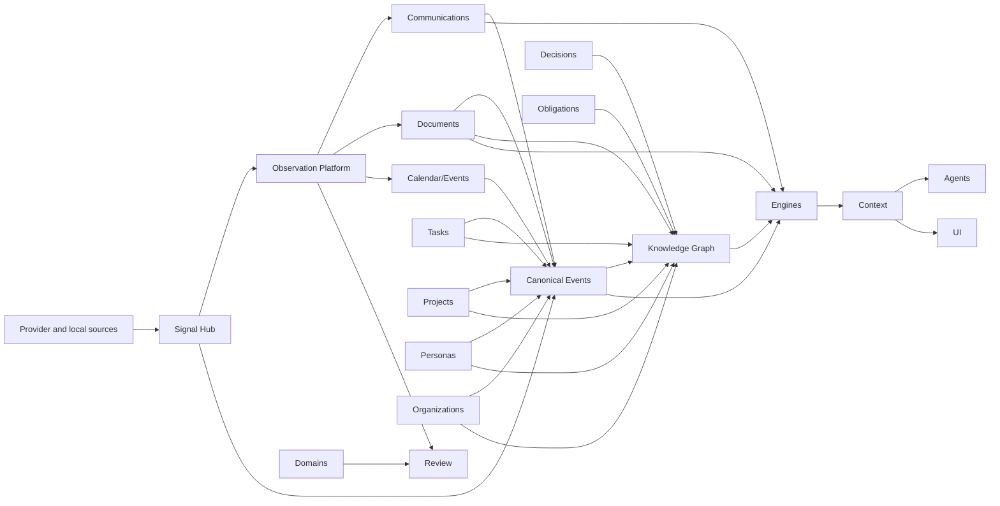

# Задача для DeepSeek: обновить русскую Obsidian wiki

## Safety instructions / Инструкции безопасности

- Do not print, infer, summarize, or request secrets. / Не печатай, не выводи, не пересказывай и не запрашивай секреты.
- Treat `.env`, credential, token, key, certificate, and private paths as redacted even if referenced. / Считай `.env`, учетные данные, токены, ключи, сертификаты и приватные пути редактированными.
- Keep code identifiers, file paths, commands, package names, API names, and ADR titles exactly as written. / Сохраняй идентификаторы кода, пути, команды, имена пакетов, API и названия ADR без изменений.
- Write wiki prose in Russian and keep Markdown Obsidian-compatible. / Пиши текст wiki на русском и сохраняй совместимость с Obsidian Markdown.
- Do not invent source facts. If the context is insufficient, state that explicitly. / Не выдумывай факты об исходниках. Если контекста недостаточно, напиши это явно.
- Every behavioral statement in proposed wiki pages must be directly supported by the embedded source text. / Каждое утверждение о поведении в предлагаемых wiki-страницах должно напрямую подтверждаться встроенным текстом исходников.
- Do not infer semantics for profiles, flags, annotations, environment variables, or framework conventions unless this context pack explicitly defines them. / Не выводи семантику профилей, флагов, аннотаций, переменных окружения или framework-конвенций, если этот context pack явно её не определяет.
- Do not add external background knowledge about tools, frameworks, or CLIs. / Не добавляй внешние справочные знания об инструментах, framework или CLI.
- When only a command or config value is visible, document only the literal command or value. For deeper meaning, write only that it is not confirmed by this context. / Когда видна только команда или значение конфигурации, документируй только буквальную команду или значение. Для более глубокого смысла пиши только, что он не подтвержден этим контекстом.
- Do not name likely related files unless they are embedded in this context pack. / Не называй вероятные связанные файлы, если они не встроены в этот context pack.
- Use only the embedded Source Files section below. Do not call tools, read files, inspect the filesystem, or access MCP/web resources. / Используй только встроенный ниже раздел Source Files. Не вызывай tools, не читай файлы, не инспектируй файловую систему и не обращайся к MCP/web ресурсам.
- If a referenced path or wiki page is not embedded in this context pack, report insufficient context instead of trying to open it. / Если упомянутый путь или wiki-страница не встроены в этот context pack, укажи недостаток контекста вместо попытки открыть файл.

## Chunk details / Детали чанка

- Chunk ID / ID чанка: `114-doc-docs-part-005`
- Group / Группа: `docs`
- Role / Роль: `doc`
- Status / Статус: `pending`
- Repository / Репозиторий: `/Users/avm/projects/Personal/hermes-hub`
- Wiki path / Путь wiki: `/Users/avm/projects/Personal/hermes-hub/docs/wiki`
- Metadata path / Путь metadata: `/Users/avm/projects/Personal/hermes-hub/docs/wiki/_meta`
- Plan generated at / План создан: `2026-06-28T19:48:55Z`
- Per-file source limit / Лимит источника на файл: `12000` characters

## Target pages / Целевые страницы

- `operations/documentation-map.md`

## Required Output / Требуемый результат

Return one Markdown response with these sections and no extra wrapper text. / Верни один Markdown-ответ с этими разделами и без дополнительной обертки.

### Summary / Резюме

Briefly describe what should change in the Russian wiki and why. / Кратко опиши, что нужно изменить в русской wiki и почему.

### Proposed pages / Предлагаемые страницы

For each target page, provide the wiki-relative path and full proposed Obsidian-compatible Markdown content. / Для каждой целевой страницы укажи путь относительно wiki и полный предложенный Markdown, совместимый с Obsidian.

### Source coverage / Покрытие источников

List each source file and the facts from it that the proposed pages cover. / Перечисли каждый исходный файл и факты из него, покрытые предложенными страницами.

### Drift candidates / Кандидаты на drift

List possible code/docs/ADR drift found in this chunk, or state that none is visible from the provided context. / Перечисли возможные расхождения кода, документации и ADR в этом чанке либо укажи, что из данного контекста они не видны.

## Source Files / Исходные файлы

### `docs/engines/speaker-identity/README.md`

- Resolved path / Полный путь: `/Users/avm/projects/Personal/hermes-hub/docs/engines/speaker-identity/README.md`
- Size bytes / Размер в байтах: `1925`
- Included characters / Включено символов: `1925`
- Truncated / Обрезано: `no`

````markdown
# Speaker Diarization and Identity

Speaker identity is a merge problem, not a single-source lookup.

## Inputs

```text
audio diarization speakers: Speaker A, Speaker B, Speaker C
WebView speaker hints: visible participant labels and time ranges
calendar attendees
provider cohosts/participants if available
known contacts/person identities
historical voice embeddings if explicitly enabled
manual user confirmations
```

## WebView hints

WebView active speaker state is useful, but not authoritative.

```json
{
  "observed_at_epoch_ms": 1780000000000,
  "speaker_label": "Ivan",
  "confidence": 0.35,
  "source": "webview_dom_heuristic",
  "truth_status": "hint_not_truth"
}
```

It can help answer:

```text
How many people likely spoke?
Which visible label was active around this time?
Which diarized speaker might map to which contact?
```

It cannot answer with certainty:

```text
Who truly spoke this segment?
Whether someone was speaking off-camera or from another audio source?
Whether a DOM label belongs to the audio speaker?
```

## Merge output

```json
{
  "diarized_speaker_id": "spk_01",
  "person_id": "person_...",
  "display_name": "Ivan Petrov",
  "confidence": 0.91,
  "evidence": {
    "audio_similarity": 0.88,
    "webview_hint_overlap": 0.74,
    "calendar_attendee_match": true,
    "manual_confirmation": false
  }
}
```

## Confidence policy

| Confidence | Meaning |
|---|---|
| `>= 0.90` | strong identity match |
| `0.70 - 0.89` | likely match, reviewable |
| `0.40 - 0.69` | weak candidate |
| `< 0.40` | keep unknown speaker |

Hermes should keep `Unknown Speaker #n` when confidence is low. Speaker labels
must remain reviewable when evidence is weak or contradictory.

## Manual confirmation

The UI should allow the owner to confirm speaker identity. Once confirmed, the
mapping becomes stronger evidence for future meetings, subject to privacy rules
and explicit local storage policy.
````

### `docs/engines/timeline/README.md`

- Resolved path / Полный путь: `/Users/avm/projects/Personal/hermes-hub/docs/engines/timeline/README.md`
- Size bytes / Размер в байтах: `3172`
- Included characters / Включено символов: `3172`
- Truncated / Обрезано: `no`

```markdown
# Timeline Engine

Status: documentation package aligned to the current repository structure.

The Timeline Engine builds chronological views from canonical events and dated
domain records.

Timeline is a view, not a domain.

## Responsibilities

The Timeline Engine produces:

- entity timelines;
- cross-domain timelines;
- period summaries;
- change diffs;
- recency signals;
- timeline gaps.

It does not own:

- calendar events;
- communication messages;
- task state changes;
- project lifecycle;
- source event truth.

## Inputs

- event log entries;
- domain lifecycle events;
- dated communications;
- calendar events;
- document versions;
- task status changes;
- project changes;
- decisions and obligations.

## Output Requirements

Timeline output must preserve:

- source event reference;
- event time and observed/imported time distinction;
- affected entities;
- confidence for inferred dates;
- sorting rules when exact time is unknown.

## Current Implementation Evidence

Timeline-like concepts appear in Personas, Organizations, Calendar and product
UI surfaces. Calendar owns scheduled events. The Timeline Engine owns derived
chronological views across those records.

The first backend baseline lives in `backend/src/engines/timeline.rs`. It owns
shared timeline policy for bounded entity timeline queries, source-backed
timeline event validation and period summaries over source-backed dated event
drafts. It also emits source-backed recency signals for a specific entity by
selecting the latest non-future event relative to an `as_of` time and preserving
the source reference, and detects source-backed gaps between adjacent entity
events when the interval exceeds a caller-provided threshold. It can also diff
two source-backed entity timeline snapshots by source reference to report added
and removed events, and assemble a bounded cross-domain timeline from
source-backed events across entity kinds. It also maps canonical
`StoredEventEnvelope` replay batches into bounded timeline entries while
tracking the last replayed event-log position. A cursor-backed projection
runner baseline now reads canonical events through `EventStore::list_after_position`,
validates them through the Timeline replay mapper, advances
`ProjectionCursorStore` progress and returns derived timeline entries. Persona
relationship events, Organization timeline events and Project detail timelines
now use this shared policy while retaining their current compatibility storage
and API shapes. Signal Hub replay now uses this same cursor-backed baseline as
the first projection rebuild target through `target_projection =
"timeline_event_log"`, rather than introducing a parallel rebuild substrate.

## Migration Plan

1. Avoid new domain-specific timeline ownership.
2. Link all timeline views to source events or dated records.
3. Keep Calendar/Events separate from Timeline Engine.
4. Keep compatibility tables as inputs until a schema migration ADR explicitly
   changes persisted event or timeline schemas.
5. Add durable Timeline read-model storage only after a follow-up schema/API
   decision defines which projected views must be persisted instead of rebuilt.
```

### `docs/engines/trust/README.md`

- Resolved path / Полный путь: `/Users/avm/projects/Personal/hermes-hub/docs/engines/trust/README.md`
- Size bytes / Размер в байтах: `2666`
- Included characters / Включено символов: `2666`
- Truncated / Обрезано: `no`

```markdown
# Trust Engine

Status: documentation package aligned to the current repository structure.

The Trust Engine computes relationship and source reliability signals.

Trust is not a vague profile field. Durable trust belongs to Relationship
records or source reliability observations when accepted.

## Responsibilities

The Trust Engine produces:

- trust signals;
- source reliability scores;
- confidence adjustments;
- relationship strength inputs;
- review recommendations;
- explanation of trust changes.

It does not own:

- relationship source of truth;
- Persona identity;
- Organization identity;
- final user judgment.

## Inputs

- relationship history;
- accepted and rejected suggestions;
- fulfilled or broken obligations;
- source consistency;
- communication patterns;
- contradiction observations;
- owner feedback.

## Output Requirements

Trust output must include:

- affected relationship or source;
- signal type;
- evidence;
- confidence;
- direction of impact;
- explanation suitable for review.

## Current Implementation Evidence

Current implementation includes `backend/src/domains/persons/trust.rs` and
trust-related Persona Intelligence language. This should be treated as an
implementation-local stage on the way to shared Trust Engine semantics.

The first backend Trust Engine baseline lives in `backend/src/engines/trust/`.
It converts the deprecated Persona compatibility `persons.trust_score` value
into a source-backed Relationship signal:

- relationship type: `trusts`;
- trust score: clamped compatibility score normalized from `0..100` to `0..1`;
- strength score: `0.5` until relationship strength has independent evidence;
- confidence: `1.0` because the adapter records an explicit compatibility
  source, not an inferred private judgment.

`PersonEnrichmentStore` uses this signal when materializing suggested Owner
Persona -> Persona `trusts` Relationships. The root `persons.trust_score`
column remains a temporary compatibility cache.

The shared engine also builds source reliability signals for reviewable
evidence. `PersonEnrichmentStore` records this signal in Relationship evidence
metadata when adapting compatibility `persons.trust_score` input, preserving:

- affected source;
- signal type;
- evidence;
- confidence;
- impact direction;
- review explanation.

## Migration Plan

1. Keep compatibility-score normalization in the Trust Engine.
2. Keep trust derivation source-backed.
3. Avoid storing unexplained trust values.
4. Reconcile Persona trust, Organization risk and Relationship strength through
   shared engine language.
5. Use contradiction observations as trust inputs, not as automatic judgments.
```

### `docs/foundation/README.md`

- Resolved path / Полный путь: `/Users/avm/projects/Personal/hermes-hub/docs/foundation/README.md`
- Size bytes / Размер в байтах: `517`
- Included characters / Включено символов: `517`
- Truncated / Обрезано: `no`

```markdown
# Foundation

Status: documentation package aligned to the current repository structure.

Foundation documents define canonical vocabulary, product model and long-term
architecture constraints. When lower-level docs conflict with foundation docs,
prefer foundation unless a newer ADR supersedes it.

## Navigation

- [Vision](./vision.md)
- [Glossary](./glossary.md)
- [World Model](./world-model.md)
- [Architecture Principles](./architecture-principles.md)
- [Domain Map](./domain-map.md)
- [Engines](./engines.md)
```

### `docs/foundation/architecture-principles.md`

- Resolved path / Полный путь: `/Users/avm/projects/Personal/hermes-hub/docs/foundation/architecture-principles.md`
- Size bytes / Размер в байтах: `2175`
- Included characters / Включено символов: `2175`
- Truncated / Обрезано: `no`

```markdown
# Hermes Architecture Principles

## 1. Context Over CRUD

CRUD screens are implementation surfaces. The system value is the ability to
assemble context from evidence, relationships and time.

## 2. Local-First Memory

Private memory belongs under the user's local control. Cloud providers are
sources or optional integrations, not the durable memory layer.

## 3. Evidence Before Inference

Imported records, canonical events and user-reviewed records outrank generated
summaries and scores.

## 4. Events Explain Change

Meaningful changes must be explainable through append-only events or equivalent
source evidence. Projections and views must be rebuildable where practical.

## 5. Relationships Are First-Class

Relationships are records with type, provenance, confidence and validity. They
must not be hidden as ad hoc fields on unrelated entities.

## 6. Domains Own Entities

Domains own source-of-truth entities and lifecycle rules. Domains may consume
engines, but they must not duplicate engine ownership.

## 7. Engines Are Reusable Mechanisms

Memory, Timeline, Trust, Search, Enrichment, Obligation, Risk and Consistency /
Contradiction are engines. They operate across domains and produce projections,
candidates, observations or scores.

## 8. AI Is Derived, Not Canonical

AI can summarize, classify, suggest links, propose tasks and detect risks. AI
does not mutate durable state directly and does not become the source of truth.

## 9. Provenance Is Mandatory

Every imported or AI-derived fact must be traceable to source evidence. If a
record cannot cite its source, it must be treated as incomplete.

## 10. Provider Boundaries Stay Explicit

Gmail, Telegram, WhatsApp, calendars and external task trackers are providers.
Their quirks stay in adapters and canonical observations, not in the core world
model.

## 11. Derived State Is Rebuildable

Search indexes, embeddings, graph views, dossiers, context packs and scores are
derived. Losing a derived artifact must not destroy memory.

## 12. One Term, One Meaning

Active documentation must use the glossary. If a term changes meaning, update
the glossary and the affected domain documents together.
```

### `docs/foundation/domain-map.md`

- Resolved path / Полный путь: `/Users/avm/projects/Personal/hermes-hub/docs/foundation/domain-map.md`
- Size bytes / Размер в байтах: `4182`
- Included characters / Включено символов: `4182`
- Truncated / Обрезано: `no`

````markdown
# Hermes Domain Map

This document is the canonical active domain map. Historical ADR and plans may
use older names.

## Domains

| Domain | Owns | Does not own |
|---|---|---|
| Signal Hub | signal sources, connections, capabilities, runtime state, health, profiles, mute/pause/replay policies and fixture recovery | provider protocol code, messages, tasks, personas, documents, graph truth |
| Personas | Personas, identity traces, Persona relationships, Persona memory anchors | provider messages, organization lifecycle, project lifecycle |
| Organizations | Organizations, organization identities, organization relationships, portals, procedures | Persona identity, project ownership |
| Communications | canonical messages, conversations, participants, channel metadata, delivery state | Persona truth, task lifecycle, document versions |
| Projects | bounded work contexts, project state, project decisions and linked context | organization identity, task lifecycle |
| Documents | document artifacts, versions, extracted text, metadata, document evidence | general knowledge truth, task status |
| Tasks | actionable work items, status lifecycle, task evidence, task provider overlay | obligations as commitments, provider message delivery |
| Calendar/Events | scheduled events, meetings, attendees, calendar source identity | global Timeline Engine ownership |
| Decisions | durable choices and rationale with evidence | generic notes or AI summaries |
| Obligations | commitments and duties with evidence | every task or every follow-up |
| Review | inbox items, approval, dismissal and promotion state | domain truth, provider state, Radar vocabulary |
| Knowledge Graph | relationship records, graph evidence, traversal model | raw binary storage, provider sync |
| Agents | tool-mediated workflows and audit trails | source-of-truth domain state |

## Engines

Engines are separate from domains:

- Memory Engine;
- Timeline Engine;
- Trust Engine;
- Search Engine;
- Enrichment Engine;
- Context Packs Engine;
- Identity Resolution Engine;
- Relationship Candidate Engine;
- Obligation Engine;
- Risk Engine;
- Consistency / Contradiction Engine.

Domains call engines. Engines do not own domain entities.

## Cross-Domain Rules

- Provider-specific source data first passes through Signal Hub control policy,
  then enters Communications, Calendar, Documents or other owning domains as
  canonical observations/events when used as evidence.
- Canonical events and observations preserve what happened.
- Domains create or update their own source-of-truth entities.
- Review owns inbox, approval, dismissal and promotion state for candidates.
- Relationships connect entities across domains with provenance.
- Engines build derived views, suggestions, scores and context.
- Agents use domain APIs and engines through permissions and audit.

## Notes And Knowledge

Notes are lightweight document-like artifacts in the current model. They are not
a separate domain until an ADR says otherwise.

Knowledge is evidence-backed understanding across domains. It is represented by
facts, relationships, decisions, observations and reviewed summaries, not by a
separate generic wiki silo.

## Mermaid Overview


````

### `docs/foundation/engines.md`

- Resolved path / Полный путь: `/Users/avm/projects/Personal/hermes-hub/docs/foundation/engines.md`
- Size bytes / Размер в байтах: `5264`
- Included characters / Включено символов: `5264`
- Truncated / Обрезано: `no`

````markdown
# Hermes Engines

Engines are reusable mechanisms used by domains. They are not domains and do not
own primary entities.

Detailed engine specs live under [Engine Catalog](../engines/README.md).

## Engine Map

| Engine | Purpose | Outputs | Uses |
|---|---|---|---|
| Memory Engine | Preserve and retrieve durable context. | memory records, context summaries, memory gaps | events, relationships, documents, communications, tasks |
| Timeline Engine | Build chronological views across entities. | timelines, diffs, period summaries | events and dated domain records |
| Trust Engine | Assess relationship and source reliability. | trust signals, confidence adjustments | provenance, relationship history, review outcomes |
| Search Engine | Retrieve source-backed information. | ranked results, snippets, query plans | full text, vectors, graph, source metadata |
| Enrichment Engine | Propose new candidate knowledge. | enrichment candidates, conflicts, observations | approved public/local sources and provider records |
| Obligation Engine | Detect and track commitments. | obligations, follow-ups, task candidates | communications, meetings, documents, decisions |
| Risk Engine | Detect evidence-backed risks. | risk observations, attention signals | tasks, projects, organizations, relationships, obligations |
| Consistency / Contradiction Engine | Detect conflicts between new evidence and accepted memory. | contradiction observations, stale fact warnings, review items | communications, documents, events, decisions, obligations, knowledge |
| Automation Engine | Evaluate owner-approved automation policies and dry-runs. | dry-run results, policy decisions, automation command metadata | templates, policies, provider capabilities, source context |
| Context Packs Engine | Build rebuildable context bundles. | context packs, source links | observations, domains, knowledge, relationships, decisions |
| Identity Resolution Engine | Propose same-entity candidates. | identity candidates | observations, identity traces, source evidence |
| Relationship Candidate Engine | Propose entity relationship candidates. | relationship candidates | observations, graph evidence, source-backed domain records |

## Memory Engine

The Memory Engine assembles source-backed memory across domains. It does not own
Personas, Organizations, Documents or Tasks. It uses their records to build
memory views and identify gaps.

Required properties:

- provenance-first;
- reviewable uncertainty;
- no private-data fine-tuning;
- rebuildable projections where possible.

## Timeline Engine

The Timeline Engine produces chronological views from canonical events and dated
domain records.

It is used by:

- Personas;
- Organizations;
- Projects;
- Documents;
- Communications;
- Tasks;
- Decisions;
- Obligations.

Timeline output is derived. The event log and domain records remain source of
truth.

## Trust Engine

The Trust Engine computes trust and reliability signals. Trust belongs primarily
to Relationships and source reliability, not as a generic root field on every
entity.

Inputs include:

- provenance;
- confirmed or rejected suggestions;
- fulfilled or broken obligations;
- source consistency;
- relationship history.

## Search Engine

The Search Engine combines:

- full text search;
- semantic retrieval;
- graph expansion;
- event/time filters;
- source reliability;
- domain-specific ranking hints.

Indexes are derived and rebuildable.

## Enrichment Engine

The Enrichment Engine proposes new information. It must not silently overwrite
domain truth.

Outputs are:

- candidates;
- observations;
- conflicts;
- reviewable updates.

Approved enrichment sources and policy boundaries are defined by the relevant
domain and ADR.

## Obligation Engine

The Obligation Engine detects commitments, duties and expected actions.

An Obligation may produce:

- a Task;
- a Follow-Up;
- a timeline event;
- a risk observation.

The engine must preserve the source quote or source reference that created the
obligation.

## Risk Engine

The Risk Engine detects evidence-backed conditions that may require attention.

Risk output is not a free-form warning. It must include:

- affected entity;
- risk type;
- source evidence;
- confidence;
- suggested handling state.

Domains decide how risk affects lifecycle, UI and automation.

## Consistency / Contradiction Engine

The Consistency / Contradiction Engine compares new evidence with accepted
Memory and Knowledge. Its user-facing alias is Polygraph.

It detects:

- direct contradictions;
- stale facts;
- disputed claims;
- conflicting decisions;
- mismatched obligations;
- claims that weaken existing trust assumptions.

It must not decide that a person is lying and must not silently overwrite
domain truth. It creates source-backed contradiction observations and review
items.

Required output properties:

- old source reference;
- new source reference;
- affected entities;
- conflict type;
- confidence;
- review state.

## Engine Boundary Rule

Do not create separate copies of engines inside domains.

Wrong:

```text
Persona Timeline
Project Timeline
Document Timeline
Organization Timeline
```

Correct:

```text
Timeline Engine
  used by Personas, Projects, Documents and Organizations.
```
````

### `docs/foundation/glossary.md`

- Resolved path / Полный путь: `/Users/avm/projects/Personal/hermes-hub/docs/foundation/glossary.md`
- Size bytes / Размер в байтах: `6087`
- Included characters / Включено символов: `6087`
- Truncated / Обрезано: `no`

```markdown
# Hermes Glossary

This glossary is the canonical vocabulary for active Hermes documentation.
Historical ADR and implementation plans may contain older terms; new documents
should use the definitions below.

## Agent

A software actor that uses typed tools, policy checks and source-backed context
to help the owner. Agents are Personas of type `ai_agent` when represented in the
graph. Agents are not sources of truth.

## Communication

An interaction between participants through a channel such as email, Telegram,
WhatsApp, calls or meetings. Communication is the canonical domain concept;
Email, Telegram and WhatsApp are provider/channel shapes, not separate product
identities.

## Context

The assembled explanation around an entity or situation: source evidence,
relationships, timeline, relevant memory, decisions, obligations, risks and open
questions. Context is the primary product value.

## Decision

A durable record that a choice was made. A Decision must link to source evidence
and the entities it affects. Decisions are primary memory records, not AI
summaries.

## Dossier

A generated read model for a Persona, Organization, Project or other context
anchor. A Dossier summarizes identity, relationships, interests, projects,
organizations, skills, communication patterns, observations and source
references. A Dossier is derived state, not source of truth.

## Document

An imported or created artifact with versions, extracted content, metadata and
links to other entities. A Document is source evidence. Notes are lightweight
document-like artifacts unless a future ADR creates a separate Notes domain.

## Domain

A bounded context that owns source-of-truth entities, lifecycle rules and
invariants. Domains may use engines, but engines do not own domain entities.

## Engine

A reusable system mechanism that operates across domains. Examples: Memory
Engine, Timeline Engine, Trust Engine, Search Engine, Enrichment Engine,
Obligation Engine, Risk Engine and Consistency / Contradiction Engine. Engines
produce projections, observations or scores; they do not replace domain
ownership.

## Consistency / Contradiction Engine

A reusable engine that compares new evidence with accepted Memory and Knowledge.
It creates source-backed contradiction observations and review items when claims
conflict. User-facing alias: Polygraph.

## Enrichment

The process of proposing additional information from approved sources.
Enrichment output is a candidate or observation until reviewed or otherwise
accepted under domain rules.

## Event

A meaningful thing that happened. Events are append-only facts used to rebuild
projections, timelines, graph links and indexes. Calendar events are scheduled
events; canonical events are system facts in the event log.

## Follow-Up

A prompt to revisit something. A Follow-Up is not always a Task. It becomes a
Task only when it has a concrete action and lifecycle. It becomes an Obligation
only when there is a commitment or expected duty.

## Knowledge

Evidence-backed understanding stored by Hermes: facts, relationships,
decisions, observations and reviewed summaries. Knowledge is not a loose wiki.
It is built from domain records and provenance.

## Memory

Durable, source-backed information that Hermes keeps over time. Memory includes
events, relationships, facts, decisions, obligations, document evidence and
curated knowledge. Memory is not an LLM weight, cache or unverified summary.

## Note

A lightweight captured artifact. A Note is treated as a Document or memory input
unless a future ADR makes Notes a first-class domain. Notes are not a separate
source of truth in the current model.

## Obligation

A commitment, duty or expected action that arose from communication, a document,
a decision, a meeting or manual entry. An Obligation may generate Tasks or
Follow-Ups, but it is not identical to either.

## Organization

A durable entity representing a company, institution, agency, community or
similar collective actor. Organizations are not fields on Personas or Projects.

## Owner Persona

The single Persona with `is_self: true`. It represents the owner of the local
Hermes instance. There is no separate Self domain or User Profile.

## Persona

A durable digital representation of a subject in Hermes. A Persona is not a
contact, address-book entry or CRM profile. A Persona owns identity,
relationships and memory anchors; timeline and dossier are derived views built
from source-backed records and shared engines.

## Project

A bounded work context with goals, participants, documents, communications,
decisions, tasks, obligations and timeline. A Project is not an Organization and
is not a Task.

## Provenance

The source trail that explains where a record, relationship, score or conclusion
came from. Provenance is required for imported and AI-derived facts.

## Relationship

A first-class connection between entities, especially Personas, Organizations,
Projects, Documents, Communications, Tasks, Events and Decisions. Relationships
carry type, direction where relevant, confidence, provenance and validity.

## Risk

An evidence-backed condition that may harm an objective, relationship,
obligation, project or decision. Risk is an observation or domain record with
provenance, not a vague label.

## Source Record

Legacy term for imported provider records or local artifacts preserved before
canonical projections are built. New architecture uses Observation Platform as
the canonical append-only evidence store.

## Task

A concrete actionable unit with lifecycle, owner, status and evidence. Tasks can
come from Obligations, Communications, Documents, Projects, Events or manual
entry. A Task is not the same as an Obligation or Follow-Up.

## Timeline

A chronological view produced from Events and domain records. Timeline is an
engine output used by domains; it is not separately implemented inside every
domain as a source of truth.

## Trust

An evidence-backed assessment attached primarily to Relationships and source
reliability. Trust is not a generic field on every entity.
```

### `docs/foundation/vision.md`

- Resolved path / Полный путь: `/Users/avm/projects/Personal/hermes-hub/docs/foundation/vision.md`
- Size bytes / Размер в байтах: `2184`
- Included characters / Включено символов: `2184`
- Truncated / Обрезано: `no`

````markdown
# Hermes Foundation Vision

## Canonical Definition

Hermes Hub is a local-first Personal Memory System.

Its product experience should feel like a Personal Operating System for:

- communications;
- knowledge;
- memory;
- relationships;
- projects;
- documents;
- decisions;
- obligations;
- context.

Hermes is not an email client, CRM, task tracker, calendar app or note-taking
app. Those surfaces may exist, but they are interfaces into one memory system.

## Primary Value

The primary value of Hermes is context.

CRUD is necessary plumbing. It is not the product thesis. Hermes exists to answer
questions such as:

- what happened;
- who and what is involved;
- why something matters;
- what evidence supports it;
- what obligations or decisions emerged;
- how this connects to the rest of the user's memory.

## System Shape

Hermes stores knowledge about:

- Personas;
- Organizations;
- Communications;
- Projects;
- Documents;
- Tasks;
- Events;
- Knowledge;
- Decisions;
- Obligations.

The system preserves source evidence, builds relationships, assembles context and
lets agents operate over that context with explicit permissions.

## Non-Identity

Hermes must not be described as:

- an email client;
- a CRM;
- an address book;
- a contact manager;
- a task tracker;
- a calendar app;
- a note-taking app;
- a generic knowledge base;
- an AI chatbot.

The correct framing is:

```text
Personal Memory System
  with operating-system-like surfaces
  for context, communication, knowledge and action.
```

## North Star

After years of use, Hermes should be able to explain:

- the history of a Persona, Organization, Project or Document;
- the evidence behind a Decision;
- the state of an Obligation;
- the context behind a Communication;
- how events changed over time;
- what the owner should pay attention to next.

Every answer must be source-backed. AI output is useful only when it preserves
provenance and uncertainty.

## Documentation Rule

All active documentation must use the foundation vocabulary:

- one term has one meaning;
- one entity has one owner;
- one source of truth is named;
- engines are not domains;
- derived views are not source of truth.
````

### `docs/foundation/world-model.md`

- Resolved path / Полный путь: `/Users/avm/projects/Personal/hermes-hub/docs/foundation/world-model.md`
- Size bytes / Размер в байтах: `4482`
- Included characters / Включено символов: `4482`
- Truncated / Обрезано: `no`

````markdown
# Hermes World Model

## What Exists In Hermes

Hermes models a personal world of evidence, entities, relationships and context.

The core entity types are:

- Persona;
- Organization;
- Communication;
- Project;
- Document;
- Task;
- Event;
- Decision;
- Obligation;
- Relationship;
- Knowledge item;
- Observation;
- Review item.

Provider-specific objects such as Gmail messages, Telegram chats, WhatsApp
threads and calendar provider records are captured as Observations or
channel-specific representations. They are not separate product domains.

Observation is evidence, not truth. If a provider message is deleted, Hermes
captures a deletion observation and keeps the original observation.

## Primary Entities

Primary entities are source-of-truth records with domain ownership:

| Entity | Owner | Source-of-truth role |
|---|---|---|
| Observation | Observation Platform | Canonical append-only evidence. |
| Review item | Review domain | Inbox item for triage, approval, dismissal and promotion. |
| Event | Event log | Append-only fact that something happened. |
| Persona | Personas domain | Subject memory anchor. |
| Organization | Organizations domain | Collective actor memory anchor. |
| Communication | Communications domain | Canonical interaction. |
| Project | Projects domain | Bounded work context. |
| Document | Documents domain | Versioned artifact and evidence. |
| Task | Tasks domain | Actionable unit with lifecycle. |
| Decision | Decisions model | Durable choice with evidence. |
| Obligation | Obligations model | Commitment or duty with evidence. |
| Relationship | Knowledge graph/domain workflow | First-class connection with provenance. |
| Knowledge item | Memory/knowledge model | Reviewed understanding with sources. |

## Derived Objects

Derived objects are rebuildable or generated from primary records:

- Timeline views;
- Dossiers;
- Context packs;
- Search results;
- Search indexes;
- Embeddings;
- AI summaries;
- AI observations;
- scores and rankings;
- graph views;
- attention and risk views.

Derived objects must cite observations or primary entities when they influence
decisions or user-facing explanations.

## Relationship Model

Hermes is relationship-first.

Relationships connect entities:

```text
Persona -> Organization
Persona -> Project
Communication -> Persona
Communication -> Project
Document -> Decision
Decision -> Project
Obligation -> Task
Event -> Relationship
```

Relationships must carry:

- source entity;
- target entity;
- relationship type;
- confidence;
- provenance;
- valid time range where relevant;
- review state where inferred.

## What Is Primary

The primary sources of truth are:

1. Append-only observations.
2. Canonical events.
3. Domain entities and relationships with provenance.
4. Reviewed memory, decisions, obligations and knowledge.

Search indexes, AI outputs, dossiers and timeline views are derived.

## Domain Versus Engine

A domain owns entities and invariants.

An engine provides reusable mechanisms:

- Memory Engine assembles durable memory.
- Timeline Engine builds chronological views.
- Search Engine retrieves source-backed context.
- Trust Engine computes trust signals.
- Context Packs Engine builds rebuildable Persona, Meeting, Task, Calendar and
  Project context packs from explicit sources.
- Identity Resolution Engine proposes same-subject candidates.
- Relationship Engine proposes links between entities.
- Enrichment Engine proposes additional knowledge.
- Obligation Engine detects and tracks commitments.
- Risk Engine detects evidence-backed risks.
- Consistency / Contradiction Engine detects conflicts between new evidence and
  accepted memory.

For example, there is no separate Persona Timeline, Project Timeline and
Document Timeline as independent source-of-truth systems. There is one Timeline
Engine used by Personas, Projects, Documents, Organizations and other domains.

## Owner Model

The owner of the local Hermes instance is represented by the Owner Persona:

```yaml
Persona:
  is_self: true
```

There is exactly one Owner Persona. Agents operate with context from the Owner
Persona and must preserve provenance and permissions.

## Knowledge Model

Knowledge is evidence-backed understanding over the world model. It can be:

- extracted from observations;
- manually created;
- inferred by AI and reviewed;
- linked through relationships;
- invalidated or superseded by later evidence.

Knowledge without provenance is incomplete.
````

### `docs/integrations/README.md`

- Resolved path / Полный путь: `/Users/avm/projects/Personal/hermes-hub/docs/integrations/README.md`
- Size bytes / Размер в байтах: `2402`
- Included characters / Включено символов: `2402`
- Truncated / Обрезано: `no`

```markdown
# Hermes Integration Catalog

Status: documentation package aligned to the current repository structure.

Integrations are provider and protocol adapters. They observe external systems,
manage provider runtime/setup state, preserve source provenance and emit events
or evidence into owner domains, workflows and engines.

An integration is not a Hermes product domain. Provider-specific runtime state
must not own durable product truth such as Personas, Tasks, Documents,
Decisions, Obligations or Communication business state.

## Package Shape

Integration documentation mirrors `backend/src/integrations/<provider>/` and
`frontend/src/integrations/<provider>/` where possible. The Zoom package is the
current reference shape:

- `README.md` for provider framing and scope;
- `architecture.md` for boundary, flow and ownership;
- `modules.md` for backend/frontend module map;
- `api.md` plus optional `api/` details for route references;
- `status.md` plus optional `status/` evidence logs;
- `gap-analysis.md`, `blockers.md`, `implementation-plan.md`,
  `fixture-test-matrix.md` and `live-smoke-checklist.md` when real current
  content exists.

Do not create empty placeholder files just to fill the shape.

## Providers

| Provider | Package | Backend owner |
|---|---|---|
| Mail | [mail](mail/README.md) | `backend/src/integrations/mail` |
| Telegram | [telegram](telegram/README.md) | `backend/src/integrations/telegram` |
| WhatsApp | [whatsapp](whatsapp/README.md) | `backend/src/integrations/whatsapp` |
| Zoom | [zoom](zoom/README.md) | `backend/src/integrations/zoom` |
| Yandex Telemost | [yandex-telemost](yandex-telemost/README.md) | `backend/src/integrations/yandex_telemost` |
| Ollama | [ollama](ollama/README.md) | `backend/src/integrations/ollama` |
| OmniRoute | [omniroute](omniroute/README.md) | `backend/src/integrations/omniroute` |

## Boundary Rules

- Provider setup/runtime APIs live under `/api/v1/integrations/*`.
- Provider-neutral product APIs live under owning domains such as
  `/api/v1/communications/*`.
- Raw credentials and session material stay behind the secret/vault boundary.
- Integration event payloads must be sanitized before append or broadcast.
- Provider adapters must not import business domains directly.
- AI runtime integrations are still integrations: they may produce model output
  or embeddings, but AI output is never source-of-truth memory.
```

### `docs/integrations/mail/README.md`

- Resolved path / Полный путь: `/Users/avm/projects/Personal/hermes-hub/docs/integrations/mail/README.md`
- Size bytes / Размер в байтах: `1686`
- Included characters / Включено символов: `1686`
- Truncated / Обрезано: `no`

````markdown
# Hermes Communications - Email Channel

Status: documentation package aligned to the current repository structure.

Email is a communication channel inside Hermes, not the product identity.
Hermes is not an email client. The email surface preserves source evidence and
projects provider records into the Communications domain.

Invariant: A channel is never a domain. A channel is an integration. A
communication is the domain object.

## Principles

- **Personal-first**: the system serves the local owner.
- **Provider-independent**: providers are transport and source-record
  boundaries.
- **Email as evidence**: email can produce Communications, Events, Documents,
  Obligations, Tasks, Decisions and Relationships.
- **AI-assisted, owner-controlled**: AI proposes; the owner or policy confirms.
- **Local-first**: private memory remains local.

## Current Implementation Surface

The current backend exposes email-related communication routes under:

```text
http://127.0.0.1:8080/api/v1/integrations/mail/
```

Implementation metrics and route details live in the API/status documents. This
README describes the domain framing.

## Lifecycle

```text
Email provider record
  -> raw source preservation
  -> RFC 2822 parsing
  -> canonical Communication projection
  -> event creation
  -> engine processing
     - Search Engine indexing
     - Risk Engine spam/phishing signals
     - Obligation Engine candidate extraction
     - Enrichment Engine entity/link candidates
  -> UI/API context
```

## Navigation

- [Architecture](architecture.md)
- [Modules](modules.md)
- [API Reference](api.md)
- [Status](status.md)
- [Gap Analysis](gap-analysis.md)
- [Blockers](blockers.md)
````

### `docs/integrations/mail/api.md`

- Resolved path / Полный путь: `/Users/avm/projects/Personal/hermes-hub/docs/integrations/mail/api.md`
- Size bytes / Размер в байтах: `15905`
- Included characters / Включено символов: `12000`
- Truncated / Обрезано: `yes`

```markdown
# Email Channel — API Reference

This file documents current email-channel compatibility routes under the
Communications domain. Hermes is not an email client; email messages are source
communications and evidence for Personas, Organizations, Projects, Documents,
Tasks, Decisions and Obligations.

Base: `/api/v1/communications/`

## Account Management

| Метод | Путь | Описание |
|---|---|---|
| GET | `/api/v1/integrations/mail/accounts` | Список email provider accounts с capability flags |
| GET | `/api/v1/integrations/mail/accounts/{account_id}` | Детали email account и capability flags |
| DELETE | `/api/v1/integrations/mail/accounts/{account_id}` | Удалить только unused account metadata; retained raw/messages block deletion |
| POST | `/api/v1/integrations/mail/accounts/{account_id}/logout` | Локально выйти: пометить account logged_out и выключить sync |
| GET | `/api/v1/integrations/mail/accounts/{account_id}/export` | Экспорт sanitized settings без credentials и secret refs |
| POST | `/api/v1/integrations/mail/accounts/import` | Импорт sanitized account metadata и sync settings; secret-bearing payload rejected |
| POST | `/api/v1/integrations/mail/accounts/gmail/oauth/start` | Начать Gmail OAuth setup |
| POST | `/api/v1/integrations/mail/accounts/gmail/oauth/complete` | Завершить Gmail OAuth setup |
| POST | `/api/v1/integrations/mail/accounts/imap` | Создать iCloud/generic IMAP+SMTP account |
| GET | `/api/v1/integrations/mail/accounts/sync-status` | Account-scoped sync status list |
| GET/PUT | `/api/v1/integrations/mail/accounts/{account_id}/sync-settings` | Read/update sync settings |
| POST | `/api/v1/integrations/mail/accounts/{account_id}/sync-now` | Manual sync |
| POST | `/api/v1/integrations/mail/accounts/{account_id}/sync-full-resync` | Manual full resync |

Account export/import never includes credential values. Import rejects payloads
that contain secret-like keys such as `password`, `secret_ref`, `token` or
`credential`; credentials must be reconnected through account setup.

`POST /api/v1/integrations/mail/accounts/imap` accepts optional SMTP settings
(`smtp_host`, `smtp_port`, `smtp_tls`, `smtp_starttls`, `smtp_username`) for
IMAP-backed sending. Credential values are still stored through the configured
secret resolver; account config stores only non-secret SMTP metadata.

## Realtime Events

| Метод | Путь | Описание |
|---|---|---|
| GET | `/api/events/ws?after_position=&hermes_secret=` | Protected WebSocket event stream with replay and heartbeat foundation; browser clients pass the local API secret as `hermes_secret` because native WebSocket requests cannot set `X-Hermes-Secret` |
| GET | `/api/events/stream?after_position=` | Protected SSE stream with replay and heartbeat |
| GET | `/api/v1/events?after_position=&limit=&wait_seconds=` | Protected JSON replay / long-poll fallback; records `event.list` audit entry |

Canonical mail sync event types emitted by sync runs:
`mail.sync.started`, `mail.sync.progress`, `mail.sync.completed`,
`mail.sync.failed`, `mail.sync.skipped`.

Canonical local message-action event types emitted by bounded bulk actions:
`mail.message.read`, `mail.message.unread`, `mail.message.archived`,
`mail.message.deleted`, `mail.message.restored`, `mail.message.pinned`,
`mail.message.unpinned`, `mail.message.important`,
`mail.message.not_important`, `mail.message.labeled`,
`mail.message.unlabeled`, `mail.message.snoozed`.

Canonical local draft event types emitted by draft mutations:
`mail.draft.created`, `mail.draft.updated`, `mail.draft.deleted`.

## Delivery / Receipts

| Метод | Путь | Описание |
|---|---|---|
| POST | `/read-receipts` | Record a provider read receipt, correlate to sent outbox by `account_id` + `provider_message_id` when possible, and append sanitized `mail.read_receipt.recorded` event |
| POST | `/delivery-notifications` | Parse a provider DSN/MDN notification payload; DSN records sanitized outbox delivery status and emits `mail.outbox.delivery_status_changed`, MDN records a sanitized read receipt |
| POST | `/provider-delivery-events` | Protected structured provider-runtime callback path for delivered/delayed/failed/read events; reuses sanitized outbox delivery status and read-receipt persistence |

## Communication Messages

| Метод | Путь | Описание |
|---|---|---|
| GET | `/messages` | Список email-backed Communication messages (?account_id, ?workflow_state, ?channel_kind, ?limit) |
| GET | `/messages/{id}` | Details for an email-backed Communication message with attachments |
| PUT | `/messages/{id}/workflow-state` | Изменить workflow-состояние |
| GET | `/messages/states` | Счётчики по состояниям |
| POST | `/messages/{id}/analyze` | Запустить AI-анализ (эвристики); returns and persists `summary_contract` with `key_points`, `action_items`, `risks`, `deadlines` and review-only Mail knowledge candidates for events, personas, organizations, documents and agreements under message metadata |
| GET | `/messages/{id}/explain` | Почему письмо важно |
| GET | `/messages/{id}/smart-cc` | Умные подсказки CC |
| POST | `/messages/{id}/pin` | Переключить pin |
| POST | `/messages/{id}/important` | Переключить локальный important flag в `message_metadata` |
| POST | `/messages/{id}/snooze` | Отложить до даты |
| POST | `/messages/{id}/mute` | Переключить mute |
| POST | `/messages/{id}/labels` | Добавить метку |
| DELETE | `/messages/{id}/labels` | Удалить метку |
| POST | `/messages/bulk-actions` | Bounded local bulk actions: mark read/unread, archive, trash, restore, pin/unpin, important/not important, snooze, add/remove label; successful matched updates append canonical `mail.message.*` events |
| GET | `/messages/{id}/export?format=md\|eml\|json` | Export source message |
| GET | `/messages/{id}/remote-image?url=` | Privacy-preserving remote image proxy; only fetches public HTTP(S) image URLs referenced by that message HTML |

## Отправка

| Метод | Путь | Описание |
|---|---|---|
| POST | `/send` | Отправить письмо immediately via SMTP/Gmail API or enqueue it into durable outbox for scheduled/undoable delivery |
| GET | `/outbox?account_id=&status=&cursor=&limit=` | Cursor-paginated durable outbox rows for delivery UX; response includes `items`, `next_cursor` and `has_more`, and `metadata.delivery_status` plus sanitized `metadata.latest_read_receipt` expose provider evidence without recipients or diagnostics |
| POST | `/outbox/{outbox_id}/undo` | Cancel a queued/scheduled outbox row while its undo deadline is still open |
| POST | `/messages/{id}/reply` | Ответить |
| POST | `/messages/{id}/reply-all` | Ответить всем |
| POST | `/messages/{id}/forward` | Переслать |
| POST | `/messages/{id}/redirect` | Redirect/resend original message body and subject through durable outbox with original-message provenance |
| POST | `/messages/{id}/forward-eml` | Переслать как EML |

## AI

| Метод | Путь | Описание |
|---|---|---|
| POST | `/messages/{id}/ai-reply` | Сгенерировать AI-ответ |
| POST | `/messages/{id}/ai-reply-variants` | Варианты ответа (языки × тоны) |
| POST | `/messages/{id}/bilingual-reply-flow` | Prepare bilingual reply review: original message, Russian translation, Russian reply text, back-translation, selected tone and send-readiness flag; degrades with explicit runtime fallback when local AI is unavailable |
| GET/PUT | `/messages/{id}/ai-state` | Read or transition first-class mail AI lifecycle state (`NEW`, `PROCESSING`, `PROCESSED`, `REVIEW_REQUIRED`, `FAILED`, `ARCHIVED`); transitions append `mail.ai_state.changed` events |
| POST | `/messages/{id}/extract-tasks` | Извлечь задачи |
| POST | `/messages/{id}/extract-notes` | Извлечь заметки |
| GET | `/messages/{id}/detect-language` | Определить язык |
| POST | `/messages/{id}/translate` | Перевести |

## Безопасность

| Метод | Путь | Описание |
|---|---|---|
| GET | `/messages/{id}/spf-dkim` | SPF/DKIM/DMARC анализ |
| GET | `/messages/{id}/signature` | Детекция подписей (S/MIME, PGP) |

## Треды

| Метод | Путь | Описание |
|---|---|---|
| GET | `/threads?account_id=&cursor=&limit=` | Cursor-paginated thread list ordered by most recent activity |
| GET | `/threads/messages?account_id=&subject=` | Сообщения в треде, включая `provider_record_id` для корректного inline reply handoff |
| POST | `/threads/translate?account_id=&subject=&limit=` | Translate every message body in a thread to `target_language`; returns per-message fallback entries when local AI runtime is unavailable |

## Черновики

| Метод | Путь | Описание |
|---|---|---|
| GET | `/drafts?account_id=&status=&cursor=&limit=` | Cursor-paginated draft list ordered by `updated_at DESC, draft_id ASC`; returns `items`, `next_cursor`, `has_more` |
| POST | `/drafts` | Создать/обновить; appends sanitized `mail.draft.created` or `mail.draft.updated` events without subject/body content |
| GET | `/drafts/{id}` | Детали черновика |
| DELETE | `/drafts/{id}` | Удалить; appends sanitized `mail.draft.deleted` when a draft existed |

## Финансы

| Метод | Путь | Описание |
|---|---|---|
| GET | `/finance/invoices` | Список счетов |
| POST | `/finance/invoices` | Создать/обновить счёт |

## Юрдокументы

| Метод | Путь | Описание |
|---|---|---|
| GET | `/legal` | Список юрдокументов |
| POST | `/legal` | Создать/обновить |

## Сертификаты

| Метод | Путь | Описание |
|---|---|---|
| GET | `/certificates` | Список сертификатов |
| POST | `/certificates` | Добавить сертификат |
| GET | `/certificates/expiring?days=90` | Истекающие сертификаты |

## Аналитика

| Метод | Путь | Описание |
|---|---|---|
| GET | `/analytics/health` | Compatibility route for mailbox attention analytics |
| GET | `/analytics/senders?account_id=&cursor=&limit=` | Cursor-paginated top sender analytics ordered by `message_count DESC, sender ASC`; returns `items`, `next_cursor`, `has_more` |

## Подписки

| Метод | Путь | Описание |
|---|---|---|
| GET | `/subscriptions?account_id=&cursor=&limit=` | Cursor-paginated newsletter/source detection ordered by `message_count DESC, sender ASC`; returns `items`, `next_cursor`, `has_more` |

## Поиск

| Метод | Путь | Описание |
|---|---|---|
| GET | `/search?q=...` | Полнотекстовый поиск |

## Saved Searches / Smart Folders

| Метод | Путь | Описание |
|---|---|---|
| GET | `/saved-searches?smart_folder=&account_id=&limit=` | List durable saved searches and smart-folder definitions with `message_count` derived from the same parsed Rules Builder semantics used by runtime message search, including `mode:any` and field rules such as `subject:`, `body:` and `from:` |
| POST | `/saved-searches` | Create a saved search or smart folder; appends a canonical event |
| PUT | `/saved-searches/{saved_search_id}` | Update a saved search definition; appends a canonical event |
| DELETE | `/saved-searches/{saved_search_id}` | Delete a saved search definition; appends a canonical event |

## Custom Folders

| Метод | Путь | Описание |
|---|---|---|
| GET | `/folders?account_id=&cursor=&limit=` | Cursor-paginated local custom folder list with per-folder `message_count` |
| POST | `/folders` | Create a local custom folder; appends a canonical event |
| PUT | `/folders/{folder_id}` | Update a local custom folder; appends a canonical event |
| DELETE | `/folders/{folder_id}` | Delete a local custom folder; appends a canonical event |
| GET | `/folders/{folder_id}/messages?cursor=&limit=` | Cursor-paginated messages assigned to a local custom folder |
| POST | `/folders/{folder_id}/messages/{message_id}/copy` | Copy a message into a local custom folder; returns the projected folder-message row and appends a canonical event |
| POST | `/folders/{folder_id}/messages/{message_id}/move` | Move a message into a local custom folder, removing it from other custom folders; returns the projected folder-message row and appends a canonical event |

Custom folders are local-first Hermes organization state. These routes do not
perform provider-side Gmail/IMAP folder mutations.

The current Mail UI presents slash-deli
```
_Source file truncated after 12000 characters. / Исходный файл обрезан после 12000 символов._

### `docs/integrations/mail/architecture.md`

- Resolved path / Полный путь: `/Users/avm/projects/Personal/hermes-hub/docs/integrations/mail/architecture.md`
- Size bytes / Размер в байтах: `1749`
- Included characters / Включено символов: `1749`
- Truncated / Обрезано: `no`

````markdown
# Email Channel Architecture

## Position

Email belongs to the Communications domain. It is not a separate product or a
parallel memory model.

Invariant: A channel is never a domain. A channel is an integration. A
communication is the domain object.

## Layers

```text
UI surface
  -> Communications API
  -> Communications domain services
  -> Email provider adapters
  -> raw source records
  -> canonical Communication projections
  -> shared engines
```

## Data Flow

### Ingestion

```text
Provider -> Raw Records -> Message Projection -> Events -> Graph -> Engines
```

### Sending

```text
Draft -> explicit owner confirmation/policy -> provider send capability
```

### Engine Processing

```text
Communication
  -> Search Engine
  -> Risk Engine
  -> Obligation Engine
  -> Enrichment Engine
  -> Memory Engine
```

## Key ADR

| ADR | Topic |
|---|---|
| ADR-0001 | Event sourcing as system spine |
| ADR-0005 | PostgreSQL primary store |
| ADR-0006 | Tantivy full-text search |
| ADR-0009 | Local AI through Ollama |
| ADR-0041 | Email provider ingestion foundation |
| ADR-0042 | Secret references for provider credentials |
| ADR-0044 | Account setup and encrypted vault |
| ADR-0046 | Blob storage for attachments |
| ADR-0053 | Database encrypted vault |
| ADR-0055 | Full email provider networking |

## Storage Boundary

Canonical communication tables own accounts, channels, conversations, messages,
drafts, outbox, attachments, saved searches and provider command state.
Historical email/mail-prefixed tables may remain for upgrade compatibility, but
new runtime/domain behavior must treat them as migration sources or adapter
compatibility, not as the product domain owner. Search indexes and AI summaries
are derived state.
````

### `docs/integrations/mail/blockers.md`

- Resolved path / Полный путь: `/Users/avm/projects/Personal/hermes-hub/docs/integrations/mail/blockers.md`
- Size bytes / Размер в байтах: `5676`
- Included characters / Включено символов: `4632`
- Truncated / Обрезано: `no`

```markdown
# Email Channel — Architectural Blockers

Явно задокументированные блокеры с причинами и планом решения.
API: `GET /api/v1/communications/blockers`

These blockers apply to the current email-channel implementation. Cross-channel
Communications, Obligations, Decisions and Polygraph work is tracked in
`../../refactoring/implementation-alignment-plan.md`.

## 1. §8 — Безопасность вложений (sandbox, антивирус)

**Текущий статус**: Mail projection now runs a conservative heuristic
attachment safety scanner. It can mark obvious executable payload magic bytes,
active-content extensions, macro-enabled Office extensions and known
MIME/filename mismatches as `malicious` or `suspicious` with structured
metadata. Unmatched attachments intentionally remain `not_scanned`; Hermes does
not mark attachments `clean` without a real scanner backend.

**Причина**: Full verdicts still require external tools — ClamAV,
containerized sandboxing and OLE macro parsing. This remains infrastructure
work, not only application code.

**План**: Интегрировать ClamAV как sidecar-контейнер в `docker-compose.yml`,
add a real scanner backend, keep heuristic scanning as a prefilter/fallback and
only replace `not_scanned` with `clean` when a real scanner backend produced the
verdict.

## 2. §12 — Криптографическая верификация подписей

**Причина**: Требует OpenSSL, GPG, КриптоПро SDK. Это внешние нативные библиотеки (C/C++), не Rust-крейты. Нужна отдельная интеграционная работа с FFI или вызовом CLI.

**План**: Создать `email_crypto` модуль с привязкой к OpenSSL/GPG. Сертификаты из macOS Keychain читать через Security framework. ГОСТ-подписи — через КриптоПро CLI или отдельный микросервис.

## 3. §16-17 — Outbox tracking и Follow-up engine

**Причина**: Durable outbox tracking, the domain delivery worker, retry/backoff
handling, backend runtime scheduling, account-scoped SMTP sender wiring, Gmail
OAuth send scopes, immediate and scheduled Gmail API send, sanitized DSN
delivery-status ingestion, MDN read-receipt ingestion, latest-read outbox
metadata enrichment and a compact query-backed delivery/read status strip now
exist. A protected structured provider-runtime callback path now records
delivered/delayed/failed/read events through the same stores. Production delivery
tracking still requires external provider webhook/subscription wiring and richer
provider-specific delivery UX. This remains an asynchronous event-driven flow.

**План**: Connect external provider webhook/subscription sources to the
structured provider-delivery event path and expand delivery/read status UX beyond
the compact outbox strip.

## 4. §28-29 — Интеграции и provider-side массовые действия

**Причина**: Каждая интеграция (Jira, YouTrack, Google Calendar, Apple Notes, Obsidian) — отдельный коннектор со своим API и аутентификацией. Local bounded bulk actions exist, but provider-side batch mutations, long-running jobs and progress events still require queues.

**План**: Реализовать интеграции как plugin-коннекторы по образцу существующих Telegram/WhatsApp модулей. Provider-side массовые действия — через фоновые задачи projection runner with progress events.

## 5. §8.2 — Безопасная распаковка архивов

**Текущий статус**: Bounded ZIP metadata inspection exists in the mail domain
with limits for archive size, uncompressed size, entry count, path depth and
path traversal. The protected attachment API can inspect a known local ZIP blob,
and the message-detail attachment table exposes an inspection action. It does
not extract files to disk.

**Остается**: Persisted inspection results, nested archive policy, RAR/7z
support and any future extraction workflow.

**План**: Persist sanitized inspection metadata, define nested archive policy,
then add RAR/7z support behind the same limits if product scope still requires
it.

## 6. §9.3 — OCR (распознавание текста)

**Причина**: Требует Tesseract OCR или облачного OCR-сервиса. Это тяжёлая зависимость (50+ MB trained data для каждого языка).

**План**: Опциональная фича под feature-флагом `ocr`. Добавить `tesseract-rs` крейт. Без флага — только извлечение текста из PDF/DOCX через существующие парсеры.

## Не-блокеры (не входят в scope email-модуля)

Следующие разделы спецификации не являются частью email-модуля и реализуются отдельно:

- **Exchange/Fastmail/Proton/Maildir адаптеры** (§3) — отдельные provider adapter'ы
- **Rich-редактор шаблонов в UI** (§31) — задача фронтенда, API готово
- **Импорт EML/MBOX через UI** (§30) — задача фронтенда, бекенд готов
- **Undo-send runtime UX** (§4.2) — depends on remaining §16 delivery-status
  work and user-facing timing/notification UX
```

### `docs/integrations/mail/gap-analysis.md`

- Resolved path / Полный путь: `/Users/avm/projects/Personal/hermes-hub/docs/integrations/mail/gap-analysis.md`
- Size bytes / Размер в байтах: `35269`
- Included characters / Включено символов: `12000`
- Truncated / Обрезано: `yes`

```markdown
# Mail Domain Gap Analysis

Status date: 2026-06-15.

This document tracks the requested production mail-platform scope against the
current repository state. It uses the required labels:

- `IMPLEMENTED` — implemented and covered by current code/tests or documented
  implementation.
- `PARTIAL` — meaningful implementation exists, but production scope is not
  complete.
- `BROKEN` — implementation exists but current evidence shows it does not work.
- `MISSING` — no durable implementation found in the current repository.
- `REGRESSION` — current behavior is worse than previously documented behavior.

Evidence sources: `docs/integrations/mail/*.md`, `backend/src/domains/communications/`,
`backend/src/platform/events_api/`, `frontend/src/domains/communications/` and
current validation results.

## Mail Functionality

| Capability | Status | Evidence / Gap |
|---|---|---|
| Inbox | PARTIAL | Workflow/channel views exist; canonical provider folder mapping is not first-class. |
| Sent | PARTIAL | SMTP send and outbox tracking exist; sent folder/provider correlation is incomplete. |
| Drafts | IMPLEMENTED | Draft CRUD and autosave-compatible empty subject are implemented. |
| Archive | IMPLEMENTED | Workflow archive/local archive paths exist. |
| Trash | IMPLEMENTED | Local trash/restore exists. |
| Spam | PARTIAL | Spam/phishing heuristics exist; quarantine is missing. |
| Message authentication review | PARTIAL | SPF/DKIM/DMARC API now has MessageBodyTab UI through the Security Review panel and stores the result in `MailMessageInsight`; real cryptographic verification, quarantine and provider policy enforcement remain incomplete. |
| Subscriptions / newsletters | IMPLEMENTED | Subscription detection API is cursor-paginated and wired through a TanStack infinite query plus virtualized ActionBar Mail Resource Overview strip with explicit load-more for the selected account. |
| Attachment Safety Scan | PARTIAL | Conservative heuristic scanner runs during mail projection and marks executable payload magic bytes, active-content extensions, macro-enabled Office extensions and known MIME/extension mismatches as `malicious` or `suspicious` with structured scan metadata. It intentionally leaves unmatched attachments `not_scanned` and does not emit `clean` without a real scanner backend; ClamAV, sandboxing, OLE macro parsing, quarantine and scanner-backed clean-state UX remain incomplete. |
| Outbox | PARTIAL | Durable `email_outbox_tracking`, cursor-paginated outbox API, due-claiming, domain delivery worker transitions, retry/backoff scheduling, backend runtime scheduler, account-scoped SMTP sender adapter, immediate and scheduled Gmail API send with `gmail.send` OAuth scope, sanitized DSN delivery-status ingestion, MDN read-receipt ingestion, protected structured provider-runtime delivery events, latest-read outbox metadata enrichment and compact infinite-load delivery/read status UI exist; external provider webhook/subscription wiring and richer delivery UX remain incomplete. |
| Provider sync settings | IMPLEMENTED | Existing `GET/PUT /api/v1/integrations/mail/accounts/{account_id}/sync-settings` API is wired through TanStack Query, a focused sync-actions controller helper and a Zod/Vee-backed ActionBar strip for enabling sync, batch size and poll interval changes without direct component API access. |
| Custom folders | PARTIAL | Durable local custom folder model, cursor API with per-folder message counts, event-log records, frontend API/hooks, typed realtime invalidation, virtualized infinite-load local create/edit/delete strip UI, hierarchy-aware slash-path presentation, parent-path suggestions with full-path preview in create/edit flows, quick create-child actions from existing folder rows, descendant-aware delete warnings for slash-path hierarchies, shared display-order sorting for visible rows and drag/drop reorder operations, folder create/update/delete realtime cache patching, folder-message copy/move projected event payloads and cache patching, folder message browsing through the virtualized mail list, selected-message drop-to-folder copy/move, and browser-verified live Folder Hierarchy dialog opening exist; provider folder synchronization remains incomplete. |
| Smart folders | PARTIAL | Durable smart-folder definitions, cursor API, virtualized infinite-load strip UI, create/edit/delete dialog flow, visual Mail-filter builder with workflow/local-state/channel controls, explicit `Match` (`all` / `any`) rule mode, presets, active rule chips, normalization of typed structured query tokens back into builder state on blur/save, explicit effective-query preview before save, validation that blocks empty or duplicate rules, resilient chip rendering for unsaved invalid drafts, a recursive visual nested-group Rules Builder (`All conditions` / `Any condition`) with explicit depth/structure summaries for nested groups, backend parsing of explicit parenthesized `AND` / `OR` expressions and dynamic SQL search filtering, per-definition message counts aligned with the parsed Rules Builder semantics, typed saved-search realtime invalidation plus saved-search/smart-folder infinite-cache patching, and browser-verified live dialog opening exist; broader Postgres integration validation for nested saved-search counts is still blocked in the current sandbox because testkit cannot start Docker PostgreSQL. |
| Read | IMPLEMENTED | Message list/detail routes and UI reader exist. |
| Reply | IMPLEMENTED | Reply route/action exists. |
| Reply All | IMPLEMENTED | Reply-all compose handoff is exposed from the message actions UI and preserves sender, original recipients, reply subject and `in_reply_to`. |
| Forward | IMPLEMENTED | Forward compose handoff is exposed from the message actions UI with forwarded subject/body context; source export still supports EML/JSON/Markdown. |
| Redirect | PARTIAL | Redirect/resend-as-original API now enqueues a durable outbox item with original-message provenance, and the Related tab exposes explicit recipient entry wired through a TanStack redirect mutation; richer delivery UX remains incomplete. |
| Auto Save Draft | IMPLEMENTED | Backend accepts autosave-shaped draft updates; ComposeDrawer uses a tested debounced autosave helper wired through TanStack Query draft mutations; the rendered browser path was verified from new compose through debounced draft POST and `Draft saved` UI feedback, with the first synced account auto-selected when no account is selected. |
| Move | PARTIAL | Local trash/archive, local custom-folder move API and selected-message drop-to-folder move UI exist; provider folder move/copy is incomplete. |
| Copy | PARTIAL | Local copy-to-custom-folder API and Alt-drop folder copy UI exist; provider copy is incomplete. |
| Archive | IMPLEMENTED | Implemented through workflow/local actions. |
| Delete | PARTIAL | Local trash and IMAP delete alias exist; provider-specific permanent delete lifecycle is incomplete. |
| Mark Read / Unread | PARTIAL | Single and bulk local read/unread workflow-state actions exist; provider read/unread synchronization is incomplete. |
| Flag / Star | PARTIAL | Important/pin flags exist; provider star/flag synchronization is incomplete. |
| Labels | IMPLEMENTED | Single-message Related tab shows local labels from message metadata, offers quick Mail labels, removes existing labels and routes add/remove through TanStack mutations plus message-detail refresh; selected-message toolbar exposes quick bulk Follow up label/unlabel actions through the same bulk endpoint, with realtime patching for affected rows. |
| Pin | IMPLEMENTED | Local pin toggle exists. |
| Snooze | IMPLEMENTED | Local snooze metadata exists; single-message Related tab shows current snooze metadata and offers quick Tomorrow / Next week snooze actions routed through TanStack mutation plus message-detail refresh; selected-message toolbar exposes quick bulk snooze for selected messages through the bulk endpoint. |
| Multi Select | PARTIAL | Mail list selection state, shift-click range selection, keyboard Space toggle, Shift+Arrow range extension, Ctrl/Cmd+A select visible, Escape clear selection and toolbar exist; richer cross-pane focus management and advanced mailbox shortcut workflows remain incomplete. |
| Bulk Actions | PARTIAL | Bounded local batch API and frontend mutation exist; selected-message toolbar now covers read/unread, archive, trash, pin/unpin, important/normal, Follow up label/unlabel and snooze commands. Provider-side batches, progress events and queued jobs are incomplete. |
| Thread View | IMPLEMENTED | Cursor-paginated thread list, server-backed navigator rows with load-more and thread messages exist. |
| Conversation View | PARTIAL | Thread/conversation navigation opens a query-backed detail timeline for selected thread messages, auto-expands the latest message on thread open, supports collapsed/expanded message bodies, global expand/collapse controls for long threads, global quoted-content show/hide for thread-wide scanning, quoted-content separation for expanded reads, inline thread attachment surfacing with scan-state badges, per-attachment inline preview/archive inspection actions, text-attachment translation from the thread timeline, rich inline per-message reply drafting, blur/explicit draft save through the existing draft mutation, inline send review before the existing provider-write send mutation, handoff to Compose with preserved HTML draft content, HTML/plain quoted reply content and per-message handoff back to the full mail reader; full Outlook/Gmail-style conversation ergonomics remain incomplete. |
| Full Text Search | PARTIAL | Search route exists and saved-search creation now pre-fills the current query/filter context from the Mail page; index freshness/rebuild controls remain incomplete. |
| Message Export | IMPLEMENTED | Source message export API supports Markdown, EML and JSON; Related tab exposes all three formats, routes through TanStack mutation/page controller, stores the latest export response and ActionBar surfaces a download link for the exported file. |
| Message Importance Explain | IMPLEMENTED | Existing `/messages/{id}/explain` mail-local heuristic API is wired through a TanStack mutation and MessageBodyTab `Importance & Language` panel, so users can request why a message matters from the reader without direct component API access. |
| Top senders analytics | IMPLEMENTED | Top sender analytics API is cursor-paginated and wired through a TanStack infinite query plus virtualized ActionBar Mail Resource Overview strip with explicit load-more for the selected account. |
| Attachment Search | PARTIAL | Cursor-paginated attachment metadata search API, TanStack infinite query, Zod/Vee search form and TanStack Table/Virtual metadata results panel exist; extracted-content search and OCR are incomplete. |
| Saved Searches | PARTIAL | Durable cursor API, event-log records, TanStack infinite query hooks, virtualized infinite-load apply-from-list UI, create/edit/delete dialog flow, current-search/filter prefill, typed visual Rules Builder for free text plus field rules (`subject`, `body`, `sender`, `all`) with explicit `Match` (`all` / `any`) mode, active rule chips, normalization of typed structured query tokens into builder state before save, an explicit effective-query preview, recursive nested `AND` / `OR` rule groups with explicit depth/structure summaries for nested groups, validation that blocks empty or duplicate rules, backend parsing of explicit parenthesized boolean expressions and dynamic SQL search filtering, per-definition message counts computed from the same parsed search semantics as runtime message search, and typed realtime invalidation plus cached infinite-list patching exist; Postgres-backed nested count validation is still blocked in the current sandbox because testkit cannot start Docker PostgreSQL. |
| Smart Filters | PARTIAL | Rule evaluation, workflow filters and user-managed saved-search/smart-fol
```
_Source file truncated after 12000 characters. / Исходный файл обрезан после 12000 символов._

### `docs/integrations/mail/modules.md`

- Resolved path / Полный путь: `/Users/avm/projects/Personal/hermes-hub/docs/integrations/mail/modules.md`
- Size bytes / Размер в байтах: `5149`
- Included characters / Включено символов: `4096`
- Truncated / Обрезано: `no`

```markdown
# Email Channel — Current Module Map

This file maps current email implementation modules. In the canonical domain
model, these modules belong to the Communications domain and shared engine
pipeline; they do not make Mail a product identity or standalone top-level
application.

Paths below refer to the current Rust implementation under
`backend/src/domains/communications/` unless another path is shown.

## Core Pipeline

| Модуль | Файл | Назначение |
|---|---|---|
| Email Ingestion | `ingestion.rs` | Точка входа авто-анализа. Каждое входящее письмо проходит через Hermes. |
| Email Sync | `sync.rs`, `background_sync.rs` | Планирование синхронизации (Gmail/IMAP/iCloud) |
| Email Sync Pipeline | `backend/src/workflows/email_sync_pipeline.rs` | Полный пайплайн: парсинг → проекция → анализ → вложения |
| Email RFC822 | `rfc822.rs` | Парсинг RFC 2822 / MIME |
| Email Import | `import.rs` | Импорт фикстур |
| Email Fixture Pipeline | `fixtures/pipeline.rs` | Пайплайн для тестовых данных |
| Email Fixture Export | `fixtures/export.rs` | Экспорт фикстур |
| Messages | `messages.rs` | Проекция сообщений. 8 workflow-состояний, AI-поля, фильтры |

## Intelligence & Analysis

| Модуль | Назначение |
|---|---|
| `backend/src/workflows/email_intelligence.rs` | AI-анализ: скоринг (0-100), 13 категорий, LLM-классификация |
| `spf_dkim.rs` | SPF/DKIM/DMARC парсинг заголовков, оценка риска спуфинга |
| `explain.rs` | "Почему это письмо важно?" + умные подсказки CC |
| `multilingual.rs` | Определение языка (ru/en/es/de/uk/zh), перевод через LLM |
| `extract.rs` | Извлечение задач и заметок из письма (LLM + эвристики) |

## Organization & Workflow

| Модуль | Назначение |
|---|---|
| `threads.rs` | Группировка писем в треды, attention metrics |
| `flags.rs` | Pin / Snooze / Label / Mute — флаги в JSONB метаданных |
| `subscriptions.rs` | Детектор рассылок, поиск unsubscribe |
| `analytics.rs` | Attention analytics for mailbox-like channel views and top senders |

## Outgoing

| Модуль | Назначение |
|---|---|
| `send.rs` | SMTP клиент (EHLO, AUTH LOGIN, MAIL FROM, RCPT TO, DATA) |
| `drafts.rs` | Черновики: 5 статусов, авто-устаревание |
| `actions.rs` | Reply/Forward/reply-all с цитированием, EML-forward |
| `ai_reply.rs` | AI генератор ответов: выбор тона и языка, варианты |
| `templates.rs` | Шаблоны с подстановкой переменных |
| `rich_template.rs` | Rich-шаблоны: conditional, table, button, divider |
| `personas.rs` | Channel sending personas for an account; not the canonical Persona domain |

## Documents & Finance

| Модуль | Назначение |
|---|---|
| `finance.rs` | Счета: 7 статусов, суммы, валюты, контрагенты |
| `legal.rs` | Юрдокументы: 11 типов (contract/NDA/MSA/DPA/...), 6 статусов |

## Security & Trust

| Модуль | Назначение |
|---|---|
| `signatures.rs` | Сертификаты: 7 типов, 9 провайдеров, детекция S/MIME+PGP |
| `backend/src/domains/documents/attachment_intelligence.rs` | Классификация вложений: 15 категорий, уровни риска |
| `storage/scanner.rs` | Conservative attachment safety prefilter: executable magic, active-content extensions, macro-enabled document extensions and MIME/filename mismatch; does not emit `clean` without a real scanner backend |
| `attachment_dedup.rs` | Поиск дубликатов по SHA-256 + похожие имена |

## Automation

| Модуль | Назначение |
|---|---|
| `rules.rs` | Channel rule execution: field/operator/value, 4 execution modes |

## Search & Export

| Модуль | Назначение |
|---|---|
| `search.rs` | Мост к Tantivy: индексация и поиск email-backed communications |
| `export.rs` | Экспорт source message в EML / Markdown / JSON |

## Provider Networking

| Модуль | Назначение |
|---|---|
| `backend/src/integrations/mail/gmail/client.rs`, `accounts.rs` | Gmail API + account metadata |
| `imap_write.rs` | IMAP write операции (STORE, EXPUNGE) |
| `accounts.rs` | Настройка аккаунтов: Gmail OAuth, IMAP, шифрование |

## Support

| Модуль | Назначение |
|---|---|
| `sources.rs` | Типы источников писем |
| `storage.rs` | Blob-хранилище вложений (LocalFS) |
| `blockers.rs` | Документирование архитектурных блокеров |
```

### `docs/integrations/mail/status.md`

- Resolved path / Полный путь: `/Users/avm/projects/Personal/hermes-hub/docs/integrations/mail/status.md`
- Size bytes / Размер в байтах: `27834`
- Included characters / Включено символов: `12000`
- Truncated / Обрезано: `yes`

```markdown
# Email Channel — Implementation Status

Этот файл описывает текущую email-channel реализацию. Канонический домен —
Communications; Email is a channel/source boundary, not the product identity.
Invariant: A channel is never a domain. A channel is an integration. A
communication is the domain object.

The percentages below describe email-channel coverage only. They are not product
completion scores for Communications, Memory, Knowledge, Obligations,
Decisions or Polygraph.

Спецификация: 36 разделов. Статус на 2026-06-15.

| § | Раздел | Статус | % |
|---|---|---|---|
| 1 | Назначение модуля | ✓ | 100 |
| 2 | Ключевые принципы | ✓ | 100 |
| 3 | Источники почты и аккаунты | ◐ | 80 |
| 4.1 | Получение и чтение | ✓ | 100 |
| 4.2 | Создание и отправка | ◐ | 85 |
| 4.3 | Ответы | ✓ | 100 |
| 4.4 | Пересылка | ✓ | 100 |
| 4.5 | Организация | ✓ | 100 |
| 5 | Состояния письма и workflow | ✓ | 100 |
| 6 | AI Inbox и понимание писем | ✓ | 100 |
| 7 | Spam, scam, phishing | ◐ | 80 |
| 8 | Безопасность вложений | ◐ | 20 |
| 9 | Вложения и документы | ◐ | 78 |
| 10 | Финансовые письма и счета | ✓ | 100 |
| 11 | Юридические письма и контракты | ✓ | 100 |
| 12 | Цифровые подписи и сертификаты | ◐ | 50 |
| 13 | Многоязычная почта | ✓ | 100 |
| 14 | Compose, AI Reply | ◐ | 88 |
| 15 | Шаблоны писем | ◐ | 90 |
| 16 | Доставка и Outbox | ◐ | 75 |
| 17 | Obligation/Follow-Up engine integration | ✗ | 0 |
| 18 | Persona identity traces | ✓ | 100 |
| 19 | Проекты и привязка писем | ✓ | 100 |
| 20 | Задачи из писем | ✓ | 100 |
| 21 | Заметки и knowledge | ✓ | 100 |
| 22 | AI Rules и автоматизация | ✓ | 100 |
| 23 | Поиск | ✓ | 100 |
| 24 | Треды | ✓ | 100 |
| 25 | Исходящие и черновики | ✓ | 100 |
| 26 | Email attention analytics | ✓ | 100 |
| 27 | Подписки и рассылки | ✓ | 100 |
| 28 | Интеграции из почты | ✗ | 0 |
| 29 | Массовые действия | ◐ | 35 |
| 30 | Import, export, архив | ◐ | 55 |
| 31 | UI идеи | ◐ | 70 |
| 32-36 | Каталоги, домены, итоги | ✓ | 100 |

### Легенда

- ✓ — полностью реализовано
- ◐ — частично (детали ниже)
- ✗ — не реализовано (см. [блокеры](blockers.md))

### Детали частичной реализации

**§3 (80%)**: Gmail, iCloud, IMAP работают. Exchange, Proton, Fastmail, Maildir — требуют отдельных провайдер-адаптеров.

**§4.2 (85%)**: Черновики, отправка, durable redirect enqueue,
scheduled-send foundation and undo-send foundation work. Compose now exposes
scheduled send time and undo-send window controls that pass through the existing
draft/send APIs, and send review shows the scheduled delivery time plus undo
window before delivery handoff. The message actions UI now exposes Reply All and
Forward compose handoffs plus explicit-recipient Redirect enqueue through the
existing outbox path. Production runtime delivery still depends on the
remaining outbox scheduler/provider wiring.

**§7 (80%)**: Эвристики и SPF/DKIM/DMARC-парсинг работают. Нет карантина (инфраструктурная задача).

**§6 / AI Summary**: `POST /messages/{id}/analyze` now returns and persists a
structured local `summary_contract` under message metadata with `key_points`,
`action_items`, `risks`, `deadlines` and review-only Mail knowledge candidates
for events, personas, organizations, documents and agreements. The contract is
deterministic and works without the local AI runtime. Full AI runtime
orchestration, source-evidence citation and durable result lifecycle remain
future slices.

**§8 (20%)**: Mail projection now uses a conservative heuristic attachment
safety scanner. It flags executable payload magic bytes, active-content
extensions, macro-enabled Office extensions and known MIME/filename mismatches
as `malicious` or `suspicious`, and stores scan engine, timestamp, summary and
structured reasons in attachment metadata. It deliberately leaves unmatched
attachments as `not_scanned` and never emits `clean` without a real scanner
backend. ClamAV, sandbox execution, OLE macro parsing, quarantine and
scanner-backed clean-state UX remain blockers.

**§9 (78%)**: 15 категорий, дедупликация, cursor-paginated attachment
metadata search, a Zod/Vee metadata search panel with TanStack
Query/Table/Virtual results and a TanStack Table-backed message attachment
metadata table work. Bounded ZIP metadata inspection now exists with traversal,
entry-count, depth and uncompressed-size limits, protected attachment API wiring
and a message-detail UI inspection action. The protected attachment API and
message-detail UI can now render bounded safe text previews plus bounded
PNG/JPEG/GIF/WebP image previews for known local blobs while preserving scan
status and avoiding HTML execution. OCR,
extracted attachment content search, rich/PDF preview, persisted preview
artifacts, persisted inspection metadata, nested archive policy and RAR/7z
support — future slices.

**§12 (55%)**: Метаданные и детекция работают. MessageBodyTab now exposes
on-demand Security Review for SPF/DKIM/DMARC plus signature detection through
TanStack Query mutations and stores the result in the existing Mail insight
state. Compose can now insert stored persona signatures through a TanStack
Query-backed signature picker, including plain-text and HTML draft insertion
with autosave. Certificate inventory, expiring certificate and add-certificate
metadata APIs are now wired into the mail ActionBar through TanStack Query and a
Zod/Vee form. The UI records metadata and storage references only; certificate
payloads/private keys remain behind the configured secret/vault boundary. Smart
CC recipient suggestions are also exposed in the message reader through a
dedicated Recipient Suggestions review panel. Remote images in HTML mail are
blocked by default in the reader and can be loaded only through the
message-scoped backend `/remote-image?url=` proxy after explicit user action.
Крипто-верификация and message signing remain blockers (OpenSSL/GPG).

**§14 (88%)**: AI-генератор работает. Compose now has explicit Text, Rich and
raw HTML modes; Rich mode uses a TipTap-backed editor runtime with a local
mail-safe paragraph/heading/bullet-list/ordered-list/blockquote/bold/italic/link/alignment
schema, normalizes compose links to safe `http`, `https` and `mailto` hrefs
with `noopener noreferrer`, sanitizes pasted/dropped HTML to the supported
mail-safe subset before insertion, emits dropped files to Compose attachment
staging, persists `body_html` in autosaved drafts, derives `body_text` fallback
and sends `body_html` through the send mutation. Backend RFC2822 assembly now
emits HTML sends as `multipart/alternative` with text/plain and text/html parts
instead of dropping the HTML body. Compose can stage dropped or selected
attachment files as removable local chips and blocks send while those files are
staged, because durable attachment upload/draft persistence/provider send
integration is not wired yet.
Single-message AI Reply is now exposed in MessageBodyTab through tone/language
controls, a TanStack Query mutation-backed review card and Apply-to-Compose
handoff with reply subject/body plus `in_reply_to`. AI reply variants are also
exposed through `/messages/{id}/ai-reply-variants`, a typed frontend API,
TanStack mutation and review cards for language x tone candidates with the same
Apply-to-Compose handoff.
Bilingual reply review now has a
protected API and Vue panel that prepare the Original → Translation → Russian
reply → Back Translation → Tone contract with explicit local-AI runtime
fallback. Send review now surfaces scheduled-send timing and undo-send delay
before handoff. Rich delivery feedback remains incomplete until SMTP
feedback/outbox runtime wiring is complete.

**§13**: Message-level language detection and translation exist. MessageBodyTab
now exposes mail-local importance explanation and language detection through a
TanStack mutation-backed `Importance & Language` panel. Thread-level translation
now returns ordered per-message translation entries and degrades per message when
the local AI runtime is unavailable. Attachment-level translation now accepts
caller-provided extracted text for a known attachment and degrades to a
runtime-unavailable fallback instead of failing the request. OCR, persisted
extracted attachment text and review/persistence UX remain incomplete.
Thread lists are cursor-paginated, rendered as server-backed navigator rows
with a load-more path and exposed through TanStack infinite query hooks.
Selecting a thread now loads thread messages through a dedicated query hook and
renders a conversation timeline in the detail pane with a per-message handoff
back to the full mail reader. The timeline now auto-expands the latest message
when a thread opens, supports collapsed/expanded message bodies, quoted-content
separation for expanded reads, inline thread attachment surfacing with
scan-state badges, per-attachment inline preview/archive inspection actions,
text-attachment translation from the thread timeline and inline per-message
reply handoff to Compose using `provider_record_id`; the handoff now pre-fills
HTML/plain quoted reply content. A rich inline reply editor is available inside
the thread timeline and preserves typed HTML when continuing in Compose. Inline
replies now save drafts on editor blur or explicit Save Draft through the
existing draft mutation, and use an inline review step before sending through
the existing provider-write send mutation. The conversation header now also
exposes global `Expand all` / `Collapse all` controls plus a thread-wide
quoted-content show/hide toggle, so long chains can be scanned without
expanding every message or visually carrying the full quoted history at once.
Full conversation-reader ergonomics still remain incomplete for deeper
Outlook/Gmail-style thread controls.

**§6/Realtime**: Mail AI lifecycle state now has a first-class durable
`mail_ai_states` table, `GET/PUT /messages/{id}/ai-state` API and sanitized
`mail.ai_state.changed` canonical events for SSE replay/invalidation. Automatic
AI runtime orchestration and review UI remain future slices. Realtime transport
now has a protected backend WebSocket event stream at
`GET /api/events/ws?after_position=&hermes_secret=`, uses WebSocket-first
browser transport selection with SSE fallback, and adds protected JSON long-poll fallback through
`GET /api/v1/events?after_position=&limit=&wait_seconds=` with `event.list`
audit records. The frontend now monotonically persists the last replay cursor for
offline resume, surfaces live/degraded/offline transport status in the shell and
uses typed query invalidation for AI state, outbox delivery, read receipts,
drafts, saved searches, sync progress, local bulk message actions and folder
events. Local `mail.message.*` events now also apply entity-level TanStack Query
cache patches for affected message list/detail rows before invalidation, reducing
visible reload churn for read/unread, archive/trash/restore, pin/important,
label and snooze actions. Outbox delivery-status and read-receipt events now
patch cached outbox row metadata before invalidation, so the compact delivery
strip can update without waiting for a full refetch. AI-state events now patch
the dedicated TanStack Query AI-state cache before invalidating message/list
views. Draft-delete events now remove cached draft rows before invalidation;
draft create/update events remain refetch-driven because sanitized realtime
payloads intentionally exclude private draft subject/body/recipient content.
Folder create/update/delete events now patch cached folder-list rows before
invalidation. Folder-message copy/move responses and events now include the
projected folder-message row, allowing cached folder-message lists to insert the
destination row and remove moved messages from other cached folder lists before
invalidation.
Saved-search and smart-folder create/update/delete events now patch cached
definition lists before invalidation, preserving smart-folder/account query
filters.
Sync progress events now patch cached account sync-status rows before
invalidation, so progress 
```
_Source file truncated after 12000 characters. / Исходный файл обрезан после 12000 символов._

### `docs/integrations/ollama/README.md`

- Resolved path / Полный путь: `/Users/avm/projects/Personal/hermes-hub/docs/integrations/ollama/README.md`
- Size bytes / Размер в байтах: `1167`
- Included characters / Включено символов: `1167`
- Truncated / Обрезано: `no`

```markdown
# Ollama Integration

Status: code-aligned documentation package created from ADR-0009 and current
backend modules.

Ollama is the initial local AI runtime boundary for Hermes. It is an
integration adapter, not a source of truth.

ADR source of truth:

- [ADR-0009 Local AI Through Ollama](../../adr/ADR-0009-local-ai-through-ollama.md)
- [ADR-0049 V3 Local AI Runtime And Retrieval](../../adr/ADR-0049-v3-local-ai-runtime-and-retrieval.md)

## Current Implementation Evidence

Current backend files:

- `backend/src/integrations/ollama/mod.rs`;
- `backend/src/integrations/ollama/client/config.rs`;
- `backend/src/integrations/ollama/client/chat.rs`;
- `backend/src/integrations/ollama/client/embeddings.rs`;
- `backend/src/integrations/ollama/client/catalog.rs`.

The current client configuration carries a base URL, chat model, embedding
model and timeout. Current result models carry chat content or embedding
vectors plus model metadata.

## Boundary Rule

Ollama can provide local model output and embeddings. AI output remains
proposal or derived state and must not become accepted memory without evidence
and review rules from the owning domain or workflow.
```

### `docs/integrations/omniroute/README.md`

- Resolved path / Полный путь: `/Users/avm/projects/Personal/hermes-hub/docs/integrations/omniroute/README.md`
- Size bytes / Размер в байтах: `1247`
- Included characters / Включено символов: `1247`
- Truncated / Обрезано: `no`

```markdown
# OmniRoute Integration

Status: code-aligned documentation package created from ADR-0081 and current
backend modules.

OmniRoute is an opt-in OpenAI-compatible AI runtime provider. Ollama remains
the local default.

ADR source of truth:

- [ADR-0081 Opt-In OmniRoute AI Runtime](../../adr/ADR-0081-opt-in-omniroute-ai-runtime.md)
- [ADR-0082 AI Settings Control Center](../../adr/ADR-0082-ai-settings-control-center.md)

## Current Implementation Evidence

Current backend files:

- `backend/src/integrations/omniroute/mod.rs`;
- `backend/src/integrations/omniroute/client/config.rs`;
- `backend/src/integrations/omniroute/client/chat.rs`;
- `backend/src/integrations/omniroute/client/embeddings.rs`;
- `backend/src/integrations/omniroute/client/catalog.rs`.

The current client configuration carries a base URL, chat model, embedding
model, timeout and `ResolvedSecret` API key. Current settings definitions
explicitly say the OmniRoute API key is read from `HERMES_OMNIROUTE_API_KEY`
and is not stored in `application_settings`.

## Boundary Rule

OmniRoute may send prompts or retrieved context to the configured upstream
gateway only after explicit opt-in/runtime selection. API keys must stay out of
PostgreSQL settings and event payloads.
```

### `docs/integrations/telegram/README.md`

- Resolved path / Полный путь: `/Users/avm/projects/Personal/hermes-hub/docs/integrations/telegram/README.md`
- Size bytes / Размер в байтах: `2585`
- Included characters / Включено символов: `2585`
- Truncated / Обрезано: `no`

````markdown
# Hermes Communications - Telegram Channel

Status: `COMPLETED` base channel capability set, 2026-06-18.

Telegram in Hermes is a Communication Channel inside Hermes Communications. It
does not own Memory, Knowledge, Persona, Organization, Project, Obligation or
Decision lifecycle. Telegram supplies source evidence, provider commands,
communication projections, realtime events, identity traces, timeline evidence
and media evidence for other systems.

Invariant: A channel is never a domain. A channel is an integration. A
communication is the domain object.

```text
Telegram Provider
  -> Source Evidence
  -> Communication Projection
  -> Realtime Events
  -> Timeline Evidence
  -> Shared Engines
```

## Completed Boundary

The base Telegram channel capability set is complete for daily desktop work:

- account setup, QR-authorized TDLib user runtime metadata and runtime health;
- provider-write outbox, command status, retry/dead-letter visibility and
  provider-observed reconciliation;
- dialog pin/archive/mute/read/unread/folder commands and realtime patches;
- message edit/delete/pin/reaction/reply/forward lifecycle evidence;
- edit versions, tombstones, provider edit/delete evidence and diff metadata;
- reply and forward attribution with bounded chain traversal and cycle guards;
- forum topic projection, unread state, realtime topic updates and command
  reconciliation;
- provider-refreshed message/media search with projection-backed UI results;
- media gallery, album metadata, preview/download/upload lifecycle through the
  shared Communication attachment boundary;
- frontend server state through TanStack Query composables and shared realtime
  bootstrap, without component-level fetches.

Provider ACK is not treated as success. Commands complete only from
provider-observed state or returned provider snapshots that have been projected
locally.

## Deferred Initiatives

The following are intentionally outside the base Telegram channel capability set
and are tracked as `planned` capabilities by ADR-0094/ADR-0097:

- Bot Runtime;
- Voice Recording;
- Voice Send;
- Video Recording;
- Live Calls;
- Session Export;
- Session Import;
- MTProxy;
- SOCKS5;
- AI Summary;
- Translation;
- Bilingual Reply;
- AI Review Flows.

Hidden recording, fine-tuning on private Telegram data and untrusted plugin
execution remain unsupported.

## Navigation

- [Architecture](architecture.md)
- [Modules](modules.md)
- [API Reference](api.md)
- [Status](status.md)
- [Gap Analysis](gap-analysis.md)
- [Blockers](blockers.md)
- [Product Research](product-research.md)
````

### `docs/integrations/telegram/api.md`

- Resolved path / Полный путь: `/Users/avm/projects/Personal/hermes-hub/docs/integrations/telegram/api.md`
- Size bytes / Размер в байтах: `1282`
- Included characters / Включено символов: `1068`
- Truncated / Обрезано: `no`

````markdown
# Telegram API Reference

Статус: verified route audit + целевой API scope на 2026-06-17.

Все текущие маршруты защищены локальным API guard из ADR-0056, если явно не
указано иначе. Browser WebSocket clients передают local secret через
`hermes_secret`, потому что native WebSocket requests не могут выставить
`X-Hermes-Secret`.

## Base

```text
/api/v1/integrations/telegram
```

## Navigation

- [Foundation: capability, accounts, runtime, QR login](api/foundation.md)
- [Conversations: chats, topics, messages, reactions](api/conversations.md)
- [Media and Search: media, attachments, search](api/media-search.md)
- [Operations and Realtime: automation, audit, calls, events, frontend client](api/operations-realtime.md)

## Scope Notes

- Telegram в Hermes остаётся Communication Channel, а не отдельным memory или
  intelligence доменом.
- Все provider writes должны проходить через capability gates, audit boundary и
  durable outbox/provider command model.
- Realtime контракты описаны отдельно, но используют общий Hermes event bus и
  общие transport routes.
````

### `docs/integrations/telegram/api/README.md`

- Resolved path / Полный путь: `/Users/avm/projects/Personal/hermes-hub/docs/integrations/telegram/api/README.md`
- Size bytes / Размер в байтах: `421`
- Included characters / Включено символов: `421`
- Truncated / Обрезано: `no`

```markdown
# Telegram API Details

Status: documentation package aligned to the current repository structure.

This package breaks the Telegram integration API surface into focused reference
documents. The parent package remains the integration owner.

## Navigation

- [Foundation](./foundation.md)
- [Conversations](./conversations.md)
- [Media And Search](./media-search.md)
- [Operations And Realtime](./operations-realtime.md)
```

### `docs/integrations/telegram/api/conversations.md`

- Resolved path / Полный путь: `/Users/avm/projects/Personal/hermes-hub/docs/integrations/telegram/api/conversations.md`
- Size bytes / Размер в байтах: `5623`
- Included characters / Включено символов: `5621`
- Truncated / Обрезано: `no`

````markdown
# Telegram API Reference — Conversations

See also: [API Index](../api.md), [Foundation](foundation.md), and [Media and Search](media-search.md).

## Ownership

Telegram runtime, sync, provider search, provider commands, and setup APIs live under:

```text
/api/v1/integrations/telegram/*
```

Communications business state remains provider-neutral and lives under:

```text
/api/v1/communications/*
```

## Current Telegram Runtime Routes

| Method | Path | Description |
|---|---|---|
| GET | `/api/v1/communications/conversations?account_id=&limit=` | Projected Telegram chat list |
| GET | `/api/v1/communications/conversations/{conversation_id}` | Projected conversation detail |
| GET | `/api/v1/communications/conversations/{conversation_id}/members` | Projected member list |
| POST | `/api/v1/integrations/telegram/provider-sync/conversations/{telegram_chat_id}/members` | Provider-backed member sync |
| GET | `/api/v1/communications/conversations/{conversation_id}/pinned-messages` | Projected pinned messages |
| GET | `/api/v1/communications/conversations/search` | Projected conversation search |
| GET | `/api/v1/integrations/telegram/conversation-folders` | Provider folder projection |
| POST | `/api/v1/integrations/telegram/provider-commands/conversations/join` | Join command |
| POST | `/api/v1/integrations/telegram/provider-commands/conversations/{telegram_chat_id}/leave` | Leave command |
| POST | `/api/v1/integrations/telegram/provider-commands/conversations/{telegram_chat_id}/pin` | Pin command |
| POST | `/api/v1/integrations/telegram/provider-commands/conversations/{telegram_chat_id}/unpin` | Unpin command |
| POST | `/api/v1/integrations/telegram/provider-commands/conversations/{telegram_chat_id}/archive` | Archive command |
| POST | `/api/v1/integrations/telegram/provider-commands/conversations/{telegram_chat_id}/unarchive` | Unarchive command |
| POST | `/api/v1/integrations/telegram/provider-commands/conversations/{telegram_chat_id}/mute` | Mute command |
| POST | `/api/v1/integrations/telegram/provider-commands/conversations/{telegram_chat_id}/unmute` | Unmute command |
| POST | `/api/v1/integrations/telegram/provider-commands/conversations/{telegram_chat_id}/read` | Provider read reconciliation command |
| POST | `/api/v1/integrations/telegram/provider-commands/conversations/{telegram_chat_id}/unread` | Provider unread reconciliation command |
| POST | `/api/v1/integrations/telegram/provider-commands/conversations/{telegram_chat_id}/folders/{provider_folder_id}` | Add folder assignment |
| POST | `/api/v1/integrations/telegram/provider-commands/conversations/{telegram_chat_id}/folders/{provider_folder_id}/remove` | Remove folder assignment |
| POST | `/api/v1/integrations/telegram/provider-commands/conversations/{telegram_chat_id}/folders/reassign` | Replace folder assignments |
| POST | `/api/v1/integrations/telegram/provider-sync/chats` | Provider chat sync |
| POST | `/api/v1/integrations/telegram/provider-sync/history` | Provider history sync |

## Topics

| Method | Path | Description |
|---|---|---|
| GET | `/api/v1/communications/conversations/{conversation_id}/topics` | Topic list |
| POST | `/api/v1/communications/conversations/{conversation_id}/topics` | Create topic command |
| GET | `/api/v1/communications/topics/{topic_id}` | Topic detail |
| POST | `/api/v1/integrations/telegram/provider-commands/topics/{topic_id}/close` | Close or reopen topic |
| GET | `/api/v1/communications/topics/{topic_id}/messages` | Topic-scoped message list |
| GET | `/api/v1/communications/topics/search` | Topic search |

## Message Runtime Routes

| Method | Path | Description |
|---|---|---|
| GET | `/api/v1/communications/messages?account_id=&provider_chat_id=&limit=` | Projected Telegram message list |
| POST | `/api/v1/integrations/telegram/fixtures/messages` | Fixture ingest |
| POST | `/api/v1/communications/conversations/{conversation_id}/messages` | User-facing send |
| POST | `/api/v1/communications/messages/{message_id}/reply` | User-facing reply |
| POST | `/api/v1/communications/messages/{message_id}/forward` | User-facing forward |
| PATCH | `/api/v1/communications/messages/{message_id}` | User-facing edit |
| DELETE | `/api/v1/communications/messages/{message_id}` | User-facing delete |
| POST | `/api/v1/communications/messages/{message_id}/restore-visibility` | Restore visibility command |
| POST | `/api/v1/communications/messages/{message_id}/pin` | Pin command |
| POST | `/api/v1/communications/messages/{message_id}/mark-read` | Message-level read command |
| GET | `/api/v1/communications/messages/{message_id}/versions` | Version list |
| GET | `/api/v1/communications/messages/{message_id}/tombstones` | Tombstone list |
| GET | `/api/v1/communications/messages/{message_id}/raw-evidence` | Sanitized raw evidence |
| GET | `/api/v1/communications/messages/{message_id}/reply-chain` | Reply chain |
| GET | `/api/v1/communications/messages/{message_id}/forward-chain` | Forward chain |
| GET/POST/DELETE | `/api/v1/communications/messages/{message_id}/reactions` | Reaction projection and commands |

## Notes

- Provider search and provider sync remain integration-scoped runtime surfaces.
- Provider-command message routes under `/api/v1/integrations/telegram/provider-commands/messages/*` are debug/control/recovery surfaces, not normal Communication UI APIs.
- Communication business UI should consume `/api/v1/communications/*` routes and not call these provider runtime routes directly.
- Provider observations are projected on the application side; integrations do not own communication business mutations.
````

### `docs/integrations/telegram/api/foundation.md`

- Resolved path / Полный путь: `/Users/avm/projects/Personal/hermes-hub/docs/integrations/telegram/api/foundation.md`
- Size bytes / Размер в байтах: `6250`
- Included characters / Включено символов: `5919`
- Truncated / Обрезано: `no`

````markdown
# Telegram API Reference — Foundation

См. также: [API Index](../api.md).

Статус: verified route audit + целевой API scope на 2026-06-17.

Все текущие маршруты защищены локальным API guard из ADR-0056, если явно не
указано иначе. Browser WebSocket clients передают local secret через
`hermes_secret`, потому что native WebSocket requests не могут выставить
`X-Hermes-Secret`.

## Base

```text
/api/v1/integrations/telegram
```

## Capability Contract

### Текущие маршруты

| Method | Path | Описание |
|---|---|---|
| GET | `/api/v1/integrations/telegram/capabilities` | Detailed per-operation capability matrix with `operation`, `category`, `status`, `action_class`, `reason`, `confirmation_required`, `closure_gate` |
| GET | `/api/v1/integrations/telegram/accounts/{account_id}/capabilities` | Account-scoped capability matrix with the same operation contract plus selected-account scope metadata and runtime/provider overrides |

### Целевые capability states

```text
available
degraded
blocked
unsupported
```

### Целевые operation groups

- account lifecycle;
- runtime;
- sync;
- read/search;
- send;
- edit;
- delete;
- react;
- pin;
- media download/upload;
- export;
- session/proxy;
- calls/recording;
- admin actions.

Account-scoped responses now also include:

```text
account_scope.account_id
account_scope.provider_kind
account_scope.runtime_kind
account_scope.lifecycle_state
```

Current account-aware overrides cover:

- bot accounts not using TDLib QR operations;
- user accounts not using Bot API runtime operations;
- bot accounts not exposing TDLib forum-topic projection/runtime operations;
- account-scoped degraded forum-topic reads when only local projection is available;
- forum-topic write operations available for QR-authorized TDLib user accounts via the durable provider-write outbox;
- `logged_out` / `removed` lifecycle blocking selected runtime/sync/write actions.

Telegram inspector `About` tab now also surfaces the account-scoped capability
route as a read-only matrix for the selected account, exposing operation status,
action class, reason, confirmation requirement and closure-gate metadata
alongside the existing capability-gated controls.

## Accounts

### Текущие маршруты

| Method | Path | Описание |
|---|---|---|
| POST | `/api/v1/integrations/telegram/fixtures/accounts` | Создать fixture `telegram_user` или `telegram_bot` account metadata |
| GET | `/api/v1/integrations/telegram/accounts?include_removed=` | Список Telegram provider accounts |
| POST | `/api/v1/integrations/telegram/accounts` | Создать live/live-blocked/QR-authorized Telegram account metadata и secret bindings |
| DELETE | `/api/v1/integrations/telegram/accounts/{account_id}` | Mark account `removed`, stop runtime actor, preserve local evidence |
| POST | `/api/v1/integrations/telegram/accounts/{account_id}/logout` | Mark account `logged_out`, stop runtime actor |

Account config хранит non-secret metadata. Credential payloads resolved через
host-vault/secret references. Telegram workbench `About` inspector tab now
contains a local account manager UI for `setup`, `logout` and `remove`, and the
header `Add Account` action opens that account-management surface.

### Дополнительно реализовано

| Method | Path | Назначение |
|---|---|---|
| GET | `/api/v1/integrations/telegram/accounts/{account_id}/capabilities` | Account-scoped detailed capability matrix |

### Недостающие маршруты

| Method | Path | Назначение |
|---|---|---|
| GET | `/api/v1/integrations/telegram/accounts/{account_id}/export-session` | Sanitized session bundle export без secrets unless explicitly encrypted |
| POST | `/api/v1/integrations/telegram/accounts/import-session` | Import encrypted session bundle |
| GET/PUT | `/api/v1/integrations/telegram/accounts/{account_id}/proxy` | Proxy / MTProxy / SOCKS5 profile binding |

## Runtime

### Текущие маршруты

| Method | Path | Описание |
|---|---|---|
| GET | `/api/v1/integrations/telegram/runtime/status?account_id=` | Account-scoped runtime status, runtime kind, TDLib readiness, split Telegram app-credential flags, TDLib probe error and derived runtime blockers |
| POST | `/api/v1/integrations/telegram/runtime/start` | Start fixture или TDLib QR-authorized runtime actor |
| POST | `/api/v1/integrations/telegram/runtime/stop` | Stop the account-scoped runtime actor idempotently and return the current runtime status with local audit evidence |
| POST | `/api/v1/integrations/telegram/runtime/restart` | Stop then start the account-scoped runtime actor and return the current runtime status with local audit evidence |

Runtime kinds observed:

```text
fixture
tdlib_qr_authorized
live_blocked
```

Current runtime status payload now also exposes:

```text
tdjson_path
tdjson_probe_error
telegram_api_id_configured
telegram_api_hash_configured
runtime_blockers[]
```

Runtime restart routes are implemented. Native dependency remediation stays in
runtime diagnostics, while Bot API runtime and portable session/proxy controls
are ADR-0094 planned initiatives.

## QR Login

### Текущие маршруты

| Method | Path | Описание |
|---|---|---|
| POST | `/api/v1/integrations/telegram/login/qr/start` | Start TDLib QR login setup |
| GET | `/api/v1/integrations/telegram/login/qr/{setup_id}` | Poll QR login status |
| DELETE | `/api/v1/integrations/telegram/login/qr/{setup_id}` | Cancel pending QR login session |
| POST | `/api/v1/integrations/telegram/login/qr/{setup_id}/password` | Submit 2-step verification password |

QR statuses:

```text
waiting_qr_scan
waiting_password
ready
expired
failed
runtime_unavailable
```

Telegram account management UI now exposes a QR login panel inside the
inspector `About` tab. It can call `start`, `status`, `password` and `cancel`
routes, render the current QR/2FA state, and apply suggested account metadata
back into the local account setup form before the user saves the QR-authorized
account record.
````
