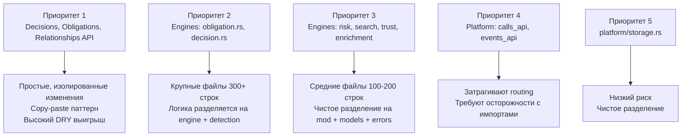

# Задача для DeepSeek: обновить русскую Obsidian wiki

## Safety instructions / Инструкции безопасности

- Do not print, infer, summarize, or request secrets. / Не печатай, не выводи, не пересказывай и не запрашивай секреты.
- Treat `.env`, credential, token, key, certificate, and private paths as redacted even if referenced. / Считай `.env`, учетные данные, токены, ключи, сертификаты и приватные пути редактированными.
- Keep code identifiers, file paths, commands, package names, API names, and ADR titles exactly as written. / Сохраняй идентификаторы кода, пути, команды, имена пакетов, API и названия ADR без изменений.
- Write wiki prose in Russian and keep Markdown Obsidian-compatible. / Пиши текст wiki на русском и сохраняй совместимость с Obsidian Markdown.
- Do not invent source facts. If the context is insufficient, state that explicitly. / Не выдумывай факты об исходниках. Если контекста недостаточно, напиши это явно.
- Every behavioral statement in proposed wiki pages must be directly supported by the embedded source text. / Каждое утверждение о поведении в предлагаемых wiki-страницах должно напрямую подтверждаться встроенным текстом исходников.
- Do not infer semantics for profiles, flags, annotations, environment variables, or framework conventions unless this context pack explicitly defines them. / Не выводи семантику профилей, флагов, аннотаций, переменных окружения или framework-конвенций, если этот context pack явно её не определяет.
- Do not add external background knowledge about tools, frameworks, or CLIs. / Не добавляй внешние справочные знания об инструментах, framework или CLI.
- When only a command or config value is visible, document only the literal command or value. For deeper meaning, write only that it is not confirmed by this context. / Когда видна только команда или значение конфигурации, документируй только буквальную команду или значение. Для более глубокого смысла пиши только, что он не подтвержден этим контекстом.
- Do not name likely related files unless they are embedded in this context pack. / Не называй вероятные связанные файлы, если они не встроены в этот context pack.
- Use only the embedded Source Files section below. Do not call tools, read files, inspect the filesystem, or access MCP/web resources. / Используй только встроенный ниже раздел Source Files. Не вызывай tools, не читай файлы, не инспектируй файловую систему и не обращайся к MCP/web ресурсам.
- If a referenced path or wiki page is not embedded in this context pack, report insufficient context instead of trying to open it. / Если упомянутый путь или wiki-страница не встроены в этот context pack, укажи недостаток контекста вместо попытки открыть файл.

## Chunk details / Детали чанка

- Chunk ID / ID чанка: `158-doc-plans`
- Group / Группа: `plans`
- Role / Роль: `doc`
- Status / Статус: `pending`
- Repository / Репозиторий: `/Users/avm/projects/Personal/hermes-hub`
- Wiki path / Путь wiki: `/Users/avm/projects/Personal/hermes-hub/docs/wiki`
- Metadata path / Путь metadata: `/Users/avm/projects/Personal/hermes-hub/docs/wiki/_meta`
- Plan generated at / План создан: `2026-06-28T19:48:55Z`
- Per-file source limit / Лимит источника на файл: `12000` characters

## Target pages / Целевые страницы

- `operations/documentation-map.md`

## Required Output / Требуемый результат

Return one Markdown response with these sections and no extra wrapper text. / Верни один Markdown-ответ с этими разделами и без дополнительной обертки.

### Summary / Резюме

Briefly describe what should change in the Russian wiki and why. / Кратко опиши, что нужно изменить в русской wiki и почему.

### Proposed pages / Предлагаемые страницы

For each target page, provide the wiki-relative path and full proposed Obsidian-compatible Markdown content. / Для каждой целевой страницы укажи путь относительно wiki и полный предложенный Markdown, совместимый с Obsidian.

### Source coverage / Покрытие источников

List each source file and the facts from it that the proposed pages cover. / Перечисли каждый исходный файл и факты из него, покрытые предложенными страницами.

### Drift candidates / Кандидаты на drift

List possible code/docs/ADR drift found in this chunk, or state that none is visible from the provided context. / Перечисли возможные расхождения кода, документации и ADR в этом чанке либо укажи, что из данного контекста они не видны.

## Source Files / Исходные файлы

### `plans/backend-srp-refactoring-plan.md`

- Resolved path / Полный путь: `/Users/avm/projects/Personal/hermes-hub/plans/backend-srp-refactoring-plan.md`
- Size bytes / Размер в байтах: `10735`
- Included characters / Включено символов: `8864`
- Truncated / Обрезано: `no`

````markdown
# План рефакторинга: Разделение ответственности в backend

Дата: 2026-06-14

## Текущее состояние

Бэкенд содержит ~250+ файлов реализации. Большинство модулей **уже следуют** Single Responsibility Principle (SRP) и разделены на поддиректории: `handlers/`, `core/`, `models/`, `store/`, `errors/`, `validation/`.

## Эталонная архитектура (как должно быть)

Каждый домен/модуль следует структуре:

```
domain/
  mod.rs          # re-exports
  api.rs          # Axum handler functions (thin)
  handlers/       # route registration (if separated from api.rs)
    mod.rs
    ...
  models.rs       # DTO, request/response types
  store.rs        # data access layer
  errors.rs       # domain-specific errors
  validation.rs   # input validation
  ids.rs          # ID generation
  constants.rs    # magic constants
  row_mapping.rs  # DB row <-> domain model mapping
  graph_projection.rs  # graph projection logic
```

## Файлы, нарушающие SRP (требуют рефакторинга)

### Категория A: Monolithic API files (handlers + DTO + helpers)

| Файл | Строк | Проблема | Целевая структура |
|------|-------|----------|-------------------|
| `domains/decisions/api.rs` | 138 | Axum handlers + DTO (Query, Request, Response) + validation helpers в одном файле | Разделить на `api/handlers.rs` + `api/models.rs` + выделить общие helpers |
| `domains/obligations/api.rs` | 138 | То же самое | Аналогично decisions |
| `domains/relationships/api.rs` | 138 | То же самое | Аналогично decisions |

Эти три файла — **копия друг друга** с разными типами. DRY нарушен.

### Категория B: Monolithic Engine files (business logic + models + errors)

| Файл | Строк | Проблема | Целевая структура |
|------|-------|----------|-------------------|
| `engines/risk.rs` | 153 | RiskEngine + RiskAttentionStatus + модели в одном файле | Разделить на `engines/risk/mod.rs` + `models.rs` + `errors.rs` + `validation.rs` |
| `engines/search.rs` | 217 | SearchIndex + SearchDocument + SearchResult + SearchError в одном файле | Разделить на `engines/search/mod.rs` + `index.rs` + `models.rs` + `errors.rs` |
| `engines/trust.rs` | 120 | TrustEngine + TrustSignalKind + модели сигналов | Разделить на `engines/trust/mod.rs` + `models.rs` + `errors.rs` |
| `engines/enrichment.rs` | 115 | EnrichmentEngine + модели + validation | Разделить на `engines/enrichment/mod.rs` + `models.rs` + `errors.rs` + `validation.rs` |
| `engines/obligation.rs` | 345 | ObligationEngine + детекторы + модели + helpers | Разделить на `engines/obligation/mod.rs` + `engine.rs` + `detection.rs` + `models.rs` + `errors.rs` |
| `engines/decision.rs` | 304 | DecisionEngine + детекторы + модели + helpers | Разделить на `engines/decision/mod.rs` + `engine.rs` + `detection.rs` + `models.rs` + `errors.rs` |

### Категория C: Platform mega-files (routing + handlers + imports из всех доменов)

| Файл | Строк | Проблема | Целевая структура |
|------|-------|----------|-------------------|
| `platform/calls_api.rs` | 208 | Router + handlers + импорты из ВСЕХ доменов | Разделить на `platform/calls/api/mod.rs` + `handlers.rs` + `models.rs` с вынесением импортов |
| `platform/events_api.rs` | 204 | Router + handlers + импорты из ВСЕХ доменов | Разделить на `platform/events/api/mod.rs` + `handlers.rs` + `models.rs` |

Оба файла импортируют практически один и тот же набор доменов — дублирование.

### Категория D: Monolithic platform stores

| Файл | Строк | Проблема | Целевая структура |
|------|-------|----------|-------------------|
| `platform/storage.rs` | 218 | Database struct + StorageError + миграции + настройки | Разделить на `platform/storage/mod.rs` + `database.rs` + `errors.rs` + `migrations.rs` |

## Приоритеты рефакторинга



## Подробный план по приоритетам

### Приоритет 1: Decisions / Obligations / Relationships API

**Цель:** Разделить монолитные `api.rs` на `handlers/` + `models/` + выделить общие helpers в shared модуль.

Для каждого из трёх доменов:
1. Создать `api/mod.rs` — re-exports
2. Создать `api/handlers.rs` — только Axum handler функции
3. Создать `api/models.rs` — DTO (запросы/ответы)
4. Выделить общие helpers (`validate_limit`, `validate_required_query_value`, `parse_review_state`, `api_audit_log`, `*_store`) в общий утилитарный модуль (например, `domains/api_helpers.rs`)
5. Обновить `mod.rs` — `pub mod api;`

**Файлы для изменений:**
- `domains/decisions/api.rs` → `domains/decisions/api/mod.rs` + `handlers.rs` + `models.rs`
- `domains/obligations/api.rs` → `domains/obligations/api/mod.rs` + `handlers.rs` + `models.rs`
- `domains/relationships/api.rs` → `domains/relationships/api/mod.rs` + `handlers.rs` + `models.rs`
- `domains/api_helpers.rs` — новый файл с общими helpers
- `app/router/routes/review.rs` — проверить импорты

### Приоритет 2: Engine monolithic files (obligation.rs, decision.rs)

**Цель:** Разделить на модульную структуру, как уже сделано в `engines/timeline/` и `engines/memory/`.

**`engines/obligation.rs` (345 строк):**
- `engines/obligation/mod.rs` — re-exports + ObligationEngine facade
- `engines/obligation/engine.rs` — ObligationEngine impl
- `engines/obligation/detection.rs` — detect_commitment, sentences и др.
- `engines/obligation/models.rs` — ObligationExtractionInput, ObligationTaskCandidate и др.
- `engines/obligation/errors.rs` — ObligationEngineError
- `engines/obligation/validation.rs` — validation functions

**`engines/decision.rs` (304 строк):**
- `engines/decision/mod.rs` — re-exports + DecisionEngine facade
- `engines/decision/engine.rs` — DecisionEngine impl
- `engines/decision/detection.rs` — detect_decision, sentences и др.
- `engines/decision/models.rs` — DecisionExtractionInput и др.
- `engines/decision/errors.rs` — DecisionEngineError
- `engines/decision/validation.rs` — validation functions

### Приоритет 3: Engine files (risk, search, trust, enrichment)

**`engines/risk.rs` (153 строк):**
- `engines/risk/mod.rs` — re-exports + RiskEngine facade
- `engines/risk/models.rs` — RiskAttentionStatus, RiskSignal, RiskSeverity, RiskObservationDraft
- `engines/risk/errors.rs` — RiskEngineError
- `engines/risk/validation.rs` — validate_* functions

**`engines/search.rs` (217 строк):**
- `engines/search/mod.rs` — re-exports
- `engines/search/index.rs` — SearchIndex
- `engines/search/models.rs` — SearchDocument, SearchResult, SearchFields
- `engines/search/errors.rs` — SearchError

**`engines/trust.rs` (120 строк):**
- `engines/trust/mod.rs` — re-exports + TrustEngine facade
- `engines/trust/models.rs` — TrustSignalKind, TrustRelationshipSignal, TrustSourceReliabilitySignal
- `engines/trust/errors.rs` — TrustEngineError
- `engines/trust/validation.rs` — validate_* functions

**`engines/enrichment.rs` (115 строк):**
- `engines/enrichment/mod.rs` — re-exports + EnrichmentEngine facade
- `engines/enrichment/models.rs` — PreferenceDraft, EnrichmentCandidateDraft
- `engines/enrichment/errors.rs` — EnrichmentEngineError
- `engines/enrichment/validation.rs` — validate_* functions

### Приоритет 4: Platform mega-files (calls_api.rs, events_api.rs)

**`platform/calls_api.rs` (208 строк):**
- `platform/calls/api/mod.rs` — re-exports + router registration
- `platform/calls/api/handlers.rs` — handler functions
- `platform/calls/api/models.rs` — request/response types

**`platform/events_api.rs` (204 строк):**
- `platform/events/api/mod.rs` — re-exports + router registration
- `platform/events/api/handlers.rs` — handler functions
- `platform/events/api/models.rs` — request/response types

### Приоритет 5: platform/storage.rs (218 строк)

**`platform/storage.rs`:**
- `platform/storage/mod.rs` — re-exports
- `platform/storage/database.rs` — Database struct
- `platform/storage/errors.rs` — StorageError

## Риски и зависимости

1. **Тесты:** Каждый рефакторинг требует запуска `make validate` или `make backend-validate` после изменений
2. **Импорты:** После разделения файлов нужно обновить все `use` импорты в зависимых модулях
3. **app/router/routes/:** Некоторые route modules импортируют из `calls_api` и `events_api` — нужно проверить
4. **app/error/conversions/:** Содержат `From` impl для errors — нужно убедиться, что error типы не сломаются
5. **Миграции:** Не затрагиваются — чистое разделение кода
````
